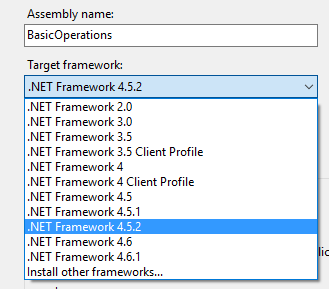

# Start a managed code project in Visual Studio

[!INCLUDE]

This topic shows you how to create a new project in [!INCLUDE[pn_Visual_Studio](../../includes/pn-visual-studio.md)] that’s properly configured to build a console application that uses the Organization Service with .NET SDK assemblies. Learn what required references must be added to your project when building an application that links to the .NET SDK assemblies.  
  
## Prerequisites  
  
- [!INCLUDE[pn_Visual_Studio](../../includes/pn-visual-studio.md)] installed on your development computer.  
  
     Any edition, including [!INCLUDE[pn_VS_Express](../../includes/pn-vs-express.md)], should work. For more information about what versions of [!INCLUDE[pn_Visual_Studio](../../includes/pn-visual-studio.md)] are supported, see [Visual Studio and the .NET Framework](../visual-studio-dot-net-framework.md).
  
- Access to a [!INCLUDE [pn-dynamics-365](../../includes/pn-dynamics-365.md)] on-line or on-premises organzation.
  
## Create a project  
 The following procedure demonstrates how to create a console application project in the C# or VB language that uses [!INCLUDE [pn-net-framework-462-long](../../includes/pn-net-framework-462-long.md)]. For more information on supported versions of the [!INCLUDE[pn_NET_Framework](../../includes/pn-net-framework.md)], see [Supported extensions](../supported-extensions.md).  

  
#### New project  
  
1.  In [!INCLUDE[pn_Visual_Studio](../../includes/pn-visual-studio.md)], select **New Project**.  
  
1.  In the left navigation pane under **Templates**, select **Visual C#** or **Visual Basic**.  
  
1.  Above the list of available templates, select [!INCLUDE [pn-net-framework-462-short](../../includes/pn-net-framework-462-short.md)].  
  
1.  In the list of templates, select **Console Application**.  
  
    
  
1.  In the fields near the bottom of the form give the project a name and location, and then select **OK**.  
  
1.  Under the **Project** menu, open the project’s properties form and verify the target framework is set to [!INCLUDE [pn-net-framework-462-short](../../includes/pn-net-framework-462-short.md)].
  
    
  
## Add NuGet package(s) 
 The minimum set of assemblies you need are in the [Microsoft.CrmSdk.CoreAssemblies](http://www.nuget.org/packages/Microsoft.CrmSdk.CoreAssemblies/) NuGet package. Installing this package will add the required references to your project. [!INCLUDE[proc_more_information](../../includes/proc-more-information.md)] [Subscribe to SDK assembly updates using NuGet](subscribe-sdk-assembly-updates-using-nuget.md)
  
### See also  
 [Getting started with managed code application development](get-started-managed-code-application-development.md)
