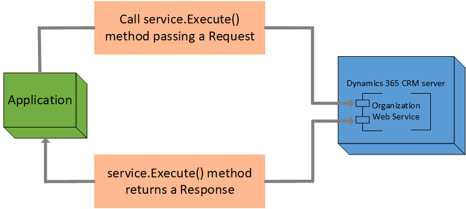

# Use messages (request and response classes) with the Execute method
You can use the methods in the<xref:Microsoft.Xrm.Sdk.IOrganizationService> to perform common operations. In addition to the common methods, you can use the <xref:Microsoft.Xrm.Sdk.IOrganizationService>.<xref:Microsoft.Xrm.Sdk.IOrganizationService.Execute*> method to execute messages that are not exposed as methods. The `Execute` method takes a message request class as a parameter and returns a message response class. Request message class names end with "Request" and response message class names end with "Response". For more information about all messages supported by the `Execute` method, see [xRM Messages in the Organization Service](xrm-messages-organization-service.md), [Dynamics 365 Messages in the Organization Service](organization-service-messages.md). The <xref:Microsoft.Xrm.Sdk.Discovery.IDiscoveryService>and the <xref:Microsoft.Xrm.Sdk.Deployment.IDeploymentService> web services use a similar execute request and response pattern.  
  
   
  
 <xref:Microsoft.Xrm.Sdk.OrganizationRequest> is the base class for all messages requests. You can use this base class to execute any messages, specifying the message name and the parameter collection for the request. However, when you use a derived class, such as <xref:Microsoft.Xrm.Sdk.Messages.AssociateRequest>, the parameter collection is populated when you use the properties on the request class.  
  
The `Execute` method returns the corresponding response class for the request, a derived class of the <xref:Microsoft.Xrm.Sdk.OrganizationResponse> class. As with the request class, the derived class contains a property for each value in the results parameter collection. All messages have a response, but many do not have any properties on the response. 
  
 Messages are pre-defined in metadata and stored as records in the SDK message entities. For each message you can determine whether it works while connected to the server or from [!INCLUDE[pn_crm_outlook_offline_access](../../includes/pn-crm-outlook-offline-access.md)]. This information can be found in the `SdkMessage.Availability` attribute. For more information, see [Plug-in registration entities](../plug-in-registration-entities.md).  
  
<a name="bkmk_optional_params"></a>   
## Pass optional parameters in messages  
 You can pass optional parameters to any message request by adding a value to the <xref:Microsoft.Xrm.Sdk.OrganizationRequest.Parameters> property. Some parameters are not exposed properties on request classes. In order to set these parameters, they must be set in the `Parameters` collection on the `Request` class.  
  
 The following table lists these parameters.  
  
|`Parameter`|Description|Messages|  
|-----------------|-----------------|--------------|  
|`SolutionUniqueName`|A `String` that specifies the unique name of the solution to which the operation applies. For more information, see [Dependency tracking for solution components](../dependency-tracking-solution-components.md).|<xref:Microsoft.Crm.Sdk.Messages.AddPrivilegesRoleRequest> <br /> <xref:Microsoft.Xrm.Sdk.Messages.CreateRequest> <br /> <xref:Microsoft.Xrm.Sdk.Messages.DeleteRequest> <br /> <xref:Microsoft.Crm.Sdk.Messages.MakeAvailableToOrganizationTemplateRequest> <br /> <xref:Microsoft.Xrm.Sdk.Messages.UpdateRequest>|  
|`CalculateMatchCodeSynchronously`|Specifying this parameter is no longer required. The match codes used to detect duplicates are calculated synchronously regardless of the value passed in this parameter. For more information, see [Run duplicate detection](../run-duplicate-detection.md).|<xref:Microsoft.Xrm.Sdk.Messages.CreateRequest> <br /> <xref:Microsoft.Xrm.Sdk.Messages.UpdateRequest>|  
|`SuppressDuplicateDetection`|A `Boolean` used to disable duplicate detection on a create or update operation. For more information, see [Run Duplicate Detection](../run-duplicate-detection.md).|<xref:Microsoft.Xrm.Sdk.Messages.CreateRequest> <br /> <xref:Microsoft.Xrm.Sdk.Messages.UpdateRequest>|  
  
 The following sample shows how to pass an optional parameter:  
  
```csharp  
Account target = new Account();  
target.Name = "Fabrikam";  
CreateRequest req = new CreateRequest();  
req.Target = target;  
req["SuppressDuplicateDetection"] = true;  
req["CalculateMatchCodeSynchronously"] = true;  
req["SolutionUniqueName"] = "MySolutionName";  
CreateResponse response = (CreateResponse)_service.Execute(req);  
```  
  
<a name="bkmk_transaction"></a>   
## Execute messages in a single database transaction  
 It is a common requirement in business applications to coordinate changes of multiple records in the system so that either all the data changes succeed, or none of them do. In database terms, this is known as executing multiple operations in a single transaction with the ability to roll back all data changes should any one operation fail.  
  
 You can execute two or more organization service requests in a single database transaction using the <xref:Microsoft.Xrm.Sdk.Messages.ExecuteTransactionRequest> message request. To use this message, populate the <xref:Microsoft.Xrm.Sdk.Messages.ExecuteTransactionRequest.Requests> collection with two or more organization requests that are to be executed in the transaction. Set <xref:Microsoft.Xrm.Sdk.Messages.ExecuteTransactionRequest.ReturnResponses> to `true` if you want to get back a collection of responses, one for each message request executed, in the <xref:Microsoft.Xrm.Sdk.Messages.ExecuteTransactionResponse.Responses> collection. Message requests in the <xref:Microsoft.Xrm.Sdk.Messages.ExecuteTransactionRequest.Requests> collection are executed in order as they appear in the collection, where the element at index 0 is executed first. This same order is preserved in the <xref:Microsoft.Xrm.Sdk.Messages.ExecuteMultipleResponse.Responses> collection.  
  
 Should any one of the requests fail and the transaction is rolled back, any data changes completed during the transaction are undone. In addition, a <xref:Microsoft.Xrm.Sdk.ExecuteTransactionFault> is returned identifying the index into the request collection of the request message that caused the fault.  
  
 An <xref:Microsoft.Xrm.Sdk.Messages.ExecuteMultipleRequest> may contain one or more <xref:Microsoft.Xrm.Sdk.Messages.ExecuteTransactionRequest> instances.  An <xref:Microsoft.Xrm.Sdk.Messages.ExecuteTransactionRequest> instance may not contain a <xref:Microsoft.Xrm.Sdk.Messages.ExecuteMultipleRequest> or <xref:Microsoft.Xrm.Sdk.Messages.ExecuteTransactionRequest>. For more information on <xref:Microsoft.Xrm.Sdk.Messages.ExecuteMultipleRequest>, see [Use ExecuteMultiple to Improve Performance for Bulk Data Load](use-executemultiple-improve-performance-bulk-data-load.md).  
  
 For sample code that demonstrates <xref:Microsoft.Xrm.Sdk.Messages.ExecuteTransactionRequest> see [Sample: Execute multiple requests in transaction](sample-execute-multiple-requests-transaction.md).  
  
<a name="bkmk_executeasync"></a>   
## Execute messages in the background (asynchronously)  
 In addition to executing message requests immediately, as is the case with calling <xref:Microsoft.Xrm.Sdk.IOrganizationService>.<xref:Microsoft.Xrm.Sdk.IOrganizationService.Execute*> and passing a message request, you can also execute a message request in the background (asynchronously). This improves system performance by postponing message execution until some later time when the server load may be less. Interactive users do not have to wait for the target message to execute before they can continue. This is especially useful when processing messages that take a few minutes or more to execute.  
  
> [!NOTE]
>  Currently, only the <xref:Microsoft.Crm.Sdk.Messages.ImportSolutionRequest> message can be used with the `ExecuteAsync` message.  
  
 Use the <xref:Microsoft.Xrm.Sdk.Messages.ExecuteAsyncRequest> message to execute a message asynchronously. You configure the request and pass the request instance as an argument to <xref:Microsoft.Xrm.Sdk.IOrganizationService>.<xref:Microsoft.Xrm.Sdk.IOrganizationService.Execute*>. <xref:Microsoft.Xrm.Sdk.Messages.ExecuteAsyncResponse> returns with the ID of the asynchronous job. You can (optionally) query the job using the ID to find out its current state.  
  
 You can also execute multiple messages at a time using the <xref:Microsoft.Xrm.Sdk.Messages.ExecuteMultipleRequest> message. To do this, add one or more `ExecuteAsync` message requests to an `ExecuteMultiple` message request. Due to throttling restrictions that improve overall system performance, only one message running asynchronously is allowed to execute at a time for each organization. You cannot execute an `ExecuteMultiple` message request from an `ExecuteAsync` message request. For more information about the `ExecuteMultiple` message request, see [Use ExecuteMultiple to Improve Performance for Bulk Data Load](use-executemultiple-improve-performance-bulk-data-load.md).  
  
### See also  
 [Read and Write Data and Metadata using the IOrganizationService Web Service](use-organization-service-read-write-data-metadata.md)   
 [Use ExecuteMultiple to Improve Performance for Bulk Data Load](use-executemultiple-improve-performance-bulk-data-load.md)   
 [Use messages with the ExecuteCrmOrganizationRequest method](../xrm-tooling/use-messages-executecrmorganizationrequest-method.md)   
 <xref:Microsoft.Xrm.Sdk.IOrganizationService>.<xref:Microsoft.Xrm.Sdk.IOrganizationService.Execute*>   
 <xref:Microsoft.Xrm.Sdk.OrganizationRequest>   
 <xref:Microsoft.Xrm.Sdk.OrganizationResponse>   
 [Microsoft.Xrm.Sdk.Discovery Messages](messages-discovery-service.md)   
 [Microsoft.Xrm.Sdk Messages](xrm-messages-organization-service.md)   
 [Microsoft.Crm.Sdk Messages](organization-service-messages.md)   
 <xref:Microsoft.Xrm.Sdk.Deployment.ThrottleSettings.ExecuteAsyncMaxConnectionsPerServer>   
 <xref:Microsoft.Xrm.Sdk.Deployment.ThrottleSettings.ExecuteAsyncPerOrgMaxConnectionsPerServer>
