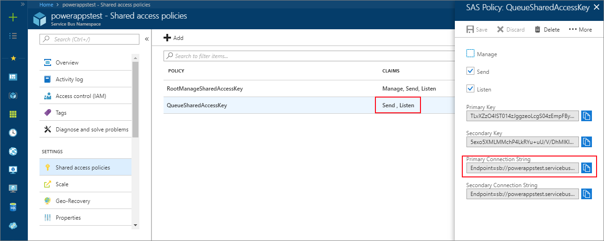

# Walkthrough: Configure Azure (SAS) for integration with Customer Engagement

[!INCLUDE]

This walkthrough guides you through configuring the [!INCLUDE[windows_azure_service_bus](../includes/windows-azure-service-bus.md)] issuer, scope, and rules to allow a listener application to read the [!INCLUDE[pn_dynamics_crm](../includes/pn-dynamics-crm.md)] Customer Engagement messages posted to the [!INCLUDE[windows_azure_service_bus](../includes/windows-azure-service-bus.md)].  
  
> [!NOTE]
>  This walkthrough applies to any [!INCLUDE[pn_dynamics_crm](../includes/pn-dynamics-crm.md)] deployment when using SAS authorization for [!INCLUDE[pn_crm_shortest](../includes/pn-crm-shortest.md)]-[!INCLUDE[pn_azure_shortest](../includes/pn-azure-shortest.md)] messaging. [!INCLUDE[sdk_for_more_info_about](../includes/sdk-for-more-info-about.md)][!INCLUDE[windows_azure_service_bus](../includes/windows-azure-service-bus.md)] authorization see [Service Bus authentication and authorization](https://azure.microsoft.com/en-us/documentation/articles/service-bus-authentication-and-authorization/).  
>   
> You must use the Plug-in Registration Tool. To download the plug-in registration tool, see [Download tools from NuGet](download-tools-NuGet.md).
  
## Prerequisites  
  
-   An [!INCLUDE[pn_Windows_Azure](../includes/pn-windows-azure.md)] account with a license to create Service Bus entities.  
  
-   A SAS configured service bus namespace.  
  
-   A SAS configured service bus messaging entity: queue, topic, relay, or event hub.  
  
-   The messaging entity must have the `Send` policy permission at a minimum. For a two-way relay, the policy must also have the `Listen` permission.  
-  The authorization connection string of your messaging entity. 
  
   
  
 Refer to the [Create a Service Bus namespace using the Azure portal](/azure/service-bus-messaging/service-bus-create-namespace-portal) for instructions on how to create a Service Bus namespace and messaging entity.  
  
## Create a service endpoint  
 A [ServiceEndpoint Entity ](entities/serviceendpoint.md) contains configuration data that is required for external messaging with a [!INCLUDE[windows_azure_service_bus](../includes/windows-azure-service-bus.md)] solution endpoint. By using the Plug-in Registration Tool, you can easily create a service endpoint entity in a [!INCLUDE[pn_crm_shortest](../includes/pn-crm-shortest.md)] organization and configure  the service bus endpoint issuer, scope, and rules.  
  
### Register a Service Endpoint  
  
1.  Run the Plug-in Registration Tool and log into your target [!INCLUDE[pn_crm_shortest](../includes/pn-crm-shortest.md)] organization.  
  
2.  Select **Register > Register New Service Endpoint**.  
  
3.  Check **Let's Start with the connection string from the Azure Service Bus Portal** and paste the connection string of your service bus messaging entity.  
  
   
  
4.  Select **Next**.  
  
5.  Fill out the **Service Endpoint Registration** form by entering the **Designation Type**, **Message Format**, and optionally the **User Information Sent** and **Description** fields  
  
   
  
   For more information about the message format, see [Write a listener application for a Azure solution](write-listener-application-azure-solution.md).  
  
6.  Select **Save**.  
  
7.  After a few seconds or so, you will see the new service endpoint in the **Registered Plug-ins & Custom Workflow Activities** list.  
  
   
  
### See also  
 [Azure extensions for Dynamics 365](azure-extensions.md)   
 [Azure Service Bus](/azure/service-bus-messaging/service-bus-fundamentals-hybrid-solutions)