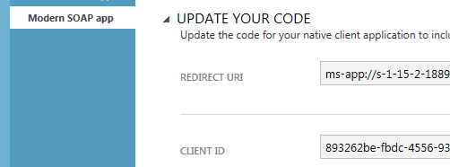

# Walkthrough: Register a Dynamics 365 app with Azure Active Directory

[!INCLUDE[](../includes/cc_applies_to_update_9_0_0.md)]

This walkthrough describes how to register an application with [!INCLUDE[pn_microsoft_azure_active_directory](../includes/pn-microsoft-azure-active-directory.md)] so that it can connect to the [!INCLUDE[pn_dynamics_crm](../includes/pn-dynamics-crm.md)] Customer Engagement server, authenticate using OAuth, and access the web services. Once registered, an application can access the web services using HTTP requests with the Web API or the web client proxy classes of the Organization Service. This walkthrough applies to both [!INCLUDE[pn_crm_2016_and_online_full](../includes/pn-crm-2016-and-online-full.md)] when using OAuth authentication in your application.  
  
[!INCLUDE[cc_sdk_onpremises_note](../includes/cc-sdk-onpremises-note.md)]
## Prerequisites  
 For an on-premises or Internet-facing deployment (IFD):  
  
-   The server must be configured to use claims authentication and have OAuth authentication enabled.  
  
-   A [!INCLUDE[pn_Windows_Azure](../includes/pn-windows-azure.md)] subscription for application registration. A trial account will also work.  
  
 For a [!INCLUDE[pn_CRM_Online](../includes/pn-crm-online.md)] deployment:  
  
-   The user must have a [!INCLUDE[pn_CRM_Online](../includes/pn-crm-online.md)] system user account with administrator role for the [!INCLUDE[pn_MS_Office_365](../includes/pn-ms-office-365.md)] subscription.  
  
-   A [!INCLUDE[pn_Windows_Azure](../includes/pn-windows-azure.md)] subscription for application registration. A trial account will also work.  
  
 For either deployment type, you must know the redirect URL for your application. Instructions for finding that URL are provided in the section named [Obtain the redirect URL](walkthrough-register-app-active-directory.md#bkmk_redirect).  
  
<a name="bkmk_redirect"></a>   
## Obtain the redirect URI  
 One method to obtain the redirect URI for a native client [!INCLUDE[pn_ms_Windows_short](../includes/pn-ms-windows-short.md)] application is to execute the following line of code in a debug session of your application and examine the returned URI value. In a WinJS debug session, select the `RawUri` property.  
  
```csharp  
string redirectUri = WebAuthenticationBroker.GetCurrentApplicationCallbackUri().ToString();  
```  
  
```vb  
Dim redirectUri As String = WebAuthenticationBroker.GetCurrentApplicationCallbackUri().ToString()  
```  
  
```javascript  
Windows.Security.Authentication.Web.WebAuthenticationBroker.getCurrentApplicationCallbackUri()  
```  
  
 The `WebAuthenticationBroker` class can be found in the `Windows.Security.Authentication.Web` namespace. Use the string value returned from the method call when you register the app. 
 
 <!--The C# line of code is shown in the topic [Sample: Windows 8 desktop modern OData app](sample-windows-8-desktop-modern-odata-app.md).  -->
  
 For a non-[!INCLUDE[pn_ms_Windows_short](../includes/pn-ms-windows-short.md)] native client application such as a console application, use any valid URI value. In this case, the URI doesn’t need to actually exist but it must be unique in the tenant.  
  
<a name="bkmk_online"></a>   
## App registration for OAuth authentication  
 **Scenario**: A person with a Dynamics 365 system user account accesses organization data through a desktop client or mobile application.  
  
#### The end user or application developer performs the following tasks:  
  
1.  Registers the external application in [!INCLUDE[pn_Windows_Azure](../includes/pn-windows-azure.md)] and provides a redirect URI during the registration process. The URI can be any valid and appropriate URI. The [!INCLUDE[pn_Windows_Azure](../includes/pn-windows-azure.md)] app registration process results in the generation of a client ID string.  
  
2.  Configures the application by entering the client ID and redirect URI in the app’s authentication code or configuration file when instructed on the [!INCLUDE[pn_Windows_Azure](../includes/pn-windows-azure.md)] app registration page.  
  
 **Scenario**: An ISV creates and registers an app that is later published in the app store. The ISV’s customers download the app from the store and use it to connect to their [!INCLUDE[pn_CRM_Online](../includes/pn-crm-online.md)] or Internet-facing deployment (IFD) organization.  
  
#### The ISV performs the following tasks:  
  
1.  Registers the app in the ISV’s tenant using the steps provided in the previous scenario (above).  
  
#### Each customer that downloads the app performs the following tasks:  
  
1.  When accessing a [!INCLUDE[pn_crm_shortest](../includes/pn-crm-shortest.md)] organization in the customer’s tenant, the customer will be presented with a consent form.  
  
2.  The customer reads the information on the form and clicks **OK** to consent.  
  
3.  (Optional) The customer register’s the app in the customer’s tenant.  
  
 For native apps, the customer has to consent each time he or she is prompted to authenticate again. For web apps, the customer is only asked to consent one time. The workaround to bypass the   consent form is for the customer to register the app in the customer’s tenant.  
  
#### Register an application with Microsoft Azure  
  
1.  [Sign in](http://manage.windowsazure.com) to the [!INCLUDE[pn_Windows_Azure](../includes/pn-windows-azure.md)] management portal by using an account with administrator permission. You must use an account in the same [!INCLUDE[pn_Office_365](../includes/pn-office-365.md)] subscription (tenant) as you intend to register the app with.<br><br> You can also access the [!INCLUDE[pn_Windows_Azure](../includes/pn-windows-azure.md)] management portal through the [!INCLUDE[pn_Office_365](../includes/pn-office-365.md)] [Admin center](https://portal.office.com/adminportal) by expanding the **Admin centers** item in the left navigation pane, and selecting **Azure AD**.  
  
    > [!NOTE]
    > If you don’t have an [!INCLUDE[pn_azure_shortest](../includes/pn-azure-shortest.md)] tenant (account) or you do have one but your [!INCLUDE[pn_Office_365](../includes/pn-office-365.md)] subscription with [!INCLUDE[pn_CRM_Online](../includes/pn-crm-online.md)] is not available in your [!INCLUDE[pn_azure_shortest](../includes/pn-azure-shortest.md)] subscription, following the instructions in the topic [Set up Azure Active Directory access for your Developer Site](https://msdn.microsoft.com/office/office365/HowTo/setup-development-environment) to associate the two accounts.<br><br> If you don’t have an account, you can sign up for one by using a credit card. However, the account is free for application registration and your credit card won’t be charged if you only follow the procedures called out in this topic to register one or more apps. [!INCLUDE[proc_more_information](../includes/proc-more-information.md)] [Active Directory Pricing Details](http://azure.microsoft.com/pricing/details/active-directory/)  
  
2.  In the Azure management portal, select **Azure Active Directory** in the left column of the page. You may need to scroll the left column to see the **Azure Active Directory** icon and label.  
  
3.  If you have multiple tenant directories, select Switch directory to select the desired tenant directory.  
  
         
  
4.  For a tenant directory, select **App registrations** > **New application registration**. 

    
  
5.  On the **Create** page, enter a **Name** for your application, select an **Application type** enter a **Redirect URI** value, and then select **Create** in the lower part of the page to continue.

    > [!TIP]
    > Click exclamation mark **!** for more information on the appropriate values for each input field.
  
7.  Continue providing the requested information and complete the app registration process by choosing the check mark icon.  
  
8.  With the tab of the newly registered app selected, click **Update Your Code**. Copy the provided redirect URI and client ID. You’ll need to insert these values into your application’s authentication code or app.config file where appropriate. <!--For some example code, see the topic [Sample: Windows 8 desktop modern OData app](sample-windows-8-desktop-modern-odata-app.md).  -->
  
   
  
9. With the tab of the newly registered app selected, click **Configure** or **Configure access to web APIs in other applications**.  
  
10. Click **Add application** and then set the app permissions as shown in the following figure. Select the **+** icon on the [!INCLUDE[pn_dynamics_crm_online](../includes/pn-dynamics-crm-online.md)] line item and then select the check mark to exit the dialog.  
  
  application")  
  
11. In the [!INCLUDE[pn_dynamics_crm_online](../includes/pn-dynamics-crm-online.md)]**Delegated Permissions** drop down list, check **Access Dynamics 365 (online) as organization users**.  
  
   
  
     For more information about registering an app with [!INCLUDE[pn_azure_active_directory](../includes/pn-azure-active-directory.md)] see [Adding an Application](https://msdn.microsoft.com/library/dn132599.aspx).  
  
12. Select **SAVE**.  
  
#### Register an application with AD FS  
  
-   If you’re federating users between an [!INCLUDE[pn_ifd_short](../includes/pn-ifd-short.md)] server and [!INCLUDE[pn_CRM_Online](../includes/pn-crm-online.md)], and you want to use the app with either server, you must register the application with both [!INCLUDE[pn_CRM_Online](../includes/pn-crm-online.md)] and [!INCLUDE[pn_Active_Dir_Fed_Svcs_AD_FS](../includes/pn-active-dir-fed-svcs-ad-fs.md)] on the [!INCLUDE[pn_ifd_short](../includes/pn-ifd-short.md)] server. Follow the steps provided in this topic. Your [!INCLUDE[pn_ifd_short](../includes/pn-ifd-short.md)] server must be running [!INCLUDE[pn_windows_server_2012_r2](../includes/pn-windows-server-2012-r2.md)].  
  
### See also  
 [Adding, Updating, and Removing an Application](https://msdn.microsoft.com/library/dn132599.aspx)    
 [Authenticate Users with Dynamics 365 Web Services](authenticate-users.md)
