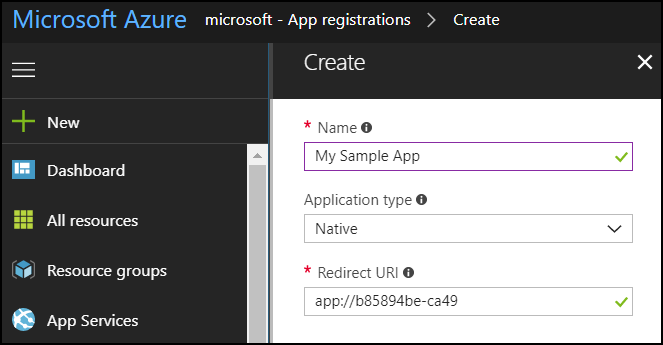

# Walkthrough: Register a Dynamics 365 app with Azure Active Directory

[!INCLUDE]

This walkthrough describes how to register an application with [!INCLUDE[pn_microsoft_azure_active_directory](../includes/pn-microsoft-azure-active-directory.md)] so that it can connect to the [!INCLUDE[pn_dynamics_crm](../includes/pn-dynamics-crm.md)] Online Customer Engagement instance, authenticate using OAuth, and access the web services. 

Once registered, an application can access the web services using HTTP requests with the Web API or the web client proxy classes of the Organization Service. 

<!--This walkthrough applies to both [!INCLUDE[pn_crm_2016_and_online_full](../includes/pn-crm-2016-and-online-full.md)] when using OAuth authentication in your application.-->  
  
[!INCLUDE[cc_sdk_onpremises_note](../includes/cc-sdk-onpremises-note.md)]
## Prerequisites  
<!--- **For an on-premises or Internet-facing deployment (IFD)**:  
  
    -   The server must be configured to use claims authentication and have OAuth authentication enabled.  
  
    -   A Microsoft [!INCLUDE[pn_Windows_Azure](../includes/pn-windows-azure.md)] subscription for application registration. A trial account will also work.  
  
- **For a [!INCLUDE[pn_CRM_Online](../includes/pn-crm-online.md)] deployment**:-->  
  
-   The user must have a [!INCLUDE[pn_CRM_Online](../includes/pn-crm-online.md)] user account with System Administrator security role and the global administrator role for the [!INCLUDE[pn_MS_Office_365](../includes/pn-ms-office-365.md)] subscription.  
  
-   An [!INCLUDE[pn_Windows_Azure](../includes/pn-windows-azure.md)] subscription for application registration. A trial account will also work.  
  
 <!--For either deployment type, you must know the redirect URL for your application. Instructions for finding that URL are provided in the section named [Obtain the redirect URI](walkthrough-register-app-active-directory.md#bkmk_redirect).-->  
    
   
## App registration for OAuth authentication

Here are two scenarios where you register an app with Azure Active Directory to use the credentials of a user who is accessing the client application to connect to Dynamics 365 Customer Engagement online instance using OAuth authentication.

To know about using Server-to-Server (S2S) authentication to connect to Dynamics 365 Customer Engagement online instance using an application user, see [Build web applications using Server-to-Server (S2S) authentication](build-web-applications-server-server-s2s-authentication.md). 

- **Scenario A**: A person with a Dynamics 365 system user account accesses organization data through a desktop client or mobile application.

    > [!IMPORTANT]
    > For information about using Server-to-Server (S2S) authentication to connect to your Dynamics 365 customer engagement instance, see . 
  
    ### Tasks performed by user or application developer  
  
    1.  Registers an app in the same tenant in Azure Active Directory as the Dynamics 365 Customer Engagement Online instance. While registering the app, provides a **redirect URI**. The URI can be any valid and appropriate URI. The Azure Active Directory app registration process results in the generation of an **application ID** (previously called **client ID**) string.

    1.  Uses the **redirect URI** and **application ID** obtained from the previous step in the desktop or mobile app’s authentication code or configuration file.

    1. On running the desktop or mobile app for this first time, a consent form is displayed where the user needs to provide the authentication details to connect to their Dynamics 365 Customer Engagement Online instance.
  
- **Scenario B**: An ISV creates and registers an app that is later published in the app store. The ISV’s customers download the app from the store and use it to connect to their [!INCLUDE[pn_CRM_Online](../includes/pn-crm-online.md)] instance by using their individual [!INCLUDE[pn_CRM_Online](../includes/pn-crm-online.md)] credentials.
  
    ### Tasks performed by ISV  
  
    1. Registers an app in the ISV tenant in Azure Active Directory. While registering the app, provides a **redirect URI**. The URI can be any valid and appropriate URI. The Azure Active Directory app registration process results in the generation of an **application ID** (previously called **client ID**) string.

    1. Creates an app that uses the **redirect URI** and **application ID** values from the previous step to authenticate to Dynamics 365 Customer Engagement Online instance. The ISV later publishes the app to the AppStore.  
  
    ### Tasks performed by each customer who downloads the app  
  
    1.  Customer downloads and runs the app to connect to his/her Dynamics 365 Customer Engagement Online instance.
     
    3. On running the app for the first time, the customer will be presented with a consent form. The customer has to approve the consent form, and then provide his/her Dynamics 365 Customer Engagement credentials to connect to their instance.
  
  
### How to: Register an application with Microsoft Azure  
  
1.  [Sign in](http://manage.windowsazure.com) to the [!INCLUDE[pn_Windows_Azure](../includes/pn-windows-azure.md)] management portal by using an account with administrator permission. You must use an account in the same [!INCLUDE[pn_Office_365](../includes/pn-office-365.md)] subscription (tenant) as you intend to register the app with.   You can also access the [!INCLUDE[pn_Windows_Azure](../includes/pn-windows-azure.md)] management portal through the [!INCLUDE[pn_Office_365](../includes/pn-office-365.md)] [Admin center](https://portal.office.com/adminportal) by expanding the **Admin centers** item in the left navigation pane, and selecting **Azure AD**.  
  
    > [!NOTE]
    > If you don’t have an [!INCLUDE[pn_azure_shortest](../includes/pn-azure-shortest.md)] tenant (account) or you do have one but your [!INCLUDE[pn_Office_365](../includes/pn-office-365.md)] subscription with [!INCLUDE[pn_CRM_Online](../includes/pn-crm-online.md)] is not available in your [!INCLUDE[pn_azure_shortest](../includes/pn-azure-shortest.md)] subscription, following the instructions in the topic [Set up Azure Active Directory access for your Developer Site](https://msdn.microsoft.com/office/office365/HowTo/setup-development-environment) to associate the two accounts.   If you don’t have an account, you can sign up for one by using a credit card. However, the account is free for application registration and your credit card won’t be charged if you only follow the procedures called out in this topic to register one or more apps. [!INCLUDE[proc_more_information](../includes/proc-more-information.md)] [Active Directory Pricing Details](http://azure.microsoft.com/pricing/details/active-directory/)  
  
2. In the Azure management portal, follow the steps as described in the [Adding an application](https://docs.microsoft.com/en-us/azure/active-directory/develop/active-directory-integrating-applications#adding-an-application) section in the Azure Active Directory developers guide to create an app.  

<!--In the Azure management portal, select **Azure Active Directory** in the left column of the page. You may need to scroll the left column to see the **Azure Active Directory** icon and label.
  
3.  If you have multiple tenant directories, select **Switch directory** to select the desired tenant directory.  
  
         
  
4.  For the selected tenant directory, select **App registrations** > **New application registration**. 

    
  
5.  On the **Create** page, type an appropriate **Name** for your application and select an **Application type**.
    - If you select **Native** as the application type, you have to specify a **Redirect URI** value.
    

    - If you select **Web app / API** as the application type, you have to specify a **Sign-On URL** value.
    

    Both the **Redirect URI** and **Sign-On URL** values act as the redirect or reply URI that is used by Azure AD to return token responses. Copy the value as you’ll need to specify this in your application’s authentication code or app.config file where appropriate. You can also copy it later from the application settings page, and even change or add additional URIs to the app. See step 8.

    > [!TIP]
    > Click exclamation mark **!** for more information on the appropriate values for each input field. You can also find detailed information about these fields here: [Adding an application](https://docs.microsoft.com/en-us/azure/active-directory/develop/active-directory-integrating-applications#adding-an-application)--> 
  
3. On creating an app in Azure Active Directory, a unique Application ID (previously called Client ID) is generated for your application, and the newly registered app appears on the registered apps page. Click the app to open the app information page.

1. On the app information page, hover over **Application ID** (previously called **Client ID**) value, and select the **Click to copy** icon to copy the value as you’ll need to specify this in your application’s authentication code or app.config file where appropriate.

    
  
9. Select **Settings** in the app info page, and use the **Redirect URIs** option on the **Settings** page to copy the redirect URI value for your app. You can also change and add additional URIs if required. For an app of **Web app / API** application type, you will see **Reply URLs** option instead of the **Redirect URIs** option.

1. On the **Settings** page, select **Required permissions** > **Add** to add permissions for the registered app.

    
  
10. On the **Add API access** page:
    - Select **Select an API** > **Dynamics CRM Online**, and then click **Select**.

        
   
    - Select **Select permissions** > **Access CRM Online as organization users**, and then click **Select**.
  
        

    - Select **Done** to add the delegated permission to the registered app.

This completes the registration of your application in Azure Active Directory.
     
> [!NOTE]
> For detailed information about registering an app in [!INCLUDE[pn_azure_active_directory](../includes/pn-azure-active-directory.md)], see [Application registration](https://docs.microsoft.com/azure/active-directory/develop/active-directory-integrating-applications).  
  
<!--### Register an application with AD FS  
  
-   If you’re federating users between an [!INCLUDE[pn_ifd_short](../includes/pn-ifd-short.md)] server and [!INCLUDE[pn_CRM_Online](../includes/pn-crm-online.md)], and you want to use the app with either server, you must register the application with both [!INCLUDE[pn_CRM_Online](../includes/pn-crm-online.md)] and [!INCLUDE[pn_Active_Dir_Fed_Svcs_AD_FS](../includes/pn-active-dir-fed-svcs-ad-fs.md)] on the [!INCLUDE[pn_ifd_short](../includes/pn-ifd-short.md)] server. Follow the steps provided in this topic. Your [!INCLUDE[pn_ifd_short](../includes/pn-ifd-short.md)] server must be running [!INCLUDE[pn_windows_server_2012_r2](../includes/pn-windows-server-2012-r2.md)].-->  
  
### See also  
 [Application registration in Azure Active Directory](https://docs.microsoft.com/azure/active-directory/develop/active-directory-integrating-applications)    
 [Authenticate Users with Dynamics 365 Web Services](authenticate-users.md)
