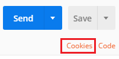

# Setup a Postman environment

You can use Postman to connect to your [!INCLUDE[](../../includes/pn-dyn-365.md)] instance, compose Web API requests, send them, and view responses. Managing authentication is part that challenges many people. Use this information configure a Postman environment to work for both Online and On-premise environments.

You can use a Postman environment to save a set of variables that you will use to connect. These values can be accessed within postman using this syntax: `{{name}}`. [!INCLUDE[](../../includes/sdk-for-more-info-about.md)] Postman variables, see [Postman Documentation > Variables](https://www.getpostman.com/docs/v6/postman/environments_and_globals/variables).

## Prerequisites

* An Online or On-premise environment you can connect to. 
* Download and install the [Postman desktop application](https://www.getpostman.com/apps).

Select the connection option that works for your environment: 

* [Connect with an Online environment](#bkmk_connectonline)
* [Connect with an On-premise environment](#bkmk_connectonpremise)

<a name="bkmk_connectonline"></a> 

## Connect with an Online environment

> [!NOTE]
> This environment uses a Client ID for an application that is registered for all Dynamics 365 online environments. For your own applications you must register you’re an application using the steps described in [Walkthrough: Register a Dynamics 365 app with Azure Active Directory](../walkthrough-register-dynamics-365-app-azure-active-directory.md).


Use these steps to create a Postman environment that you can use to connect with your Dynamics 365(online) instance.

1. Launch the Postman desktop application.
1. Click on the **Environment Options** gear icon in top-right corner. 
1. In the **Manage Environments** dialog box that opens up, click on **Add** button to add a new environment.
<br>
<br>
1. Click on **Bulk edit** in the new environment dialog box.<br>
<br>
1. Add a name for the environment and copy the following key-value pairs into the editing space.
```
url:https://<add your environment name, like ‘myorg.crm’>.dynamics.com
clientid:51f81489-12ee-4a9e-aaae-a2591f45987d
version:9.0
webapiurl:{{url}}/api/data/v{{version}}/
callback:https://callbackurl
authurl:https://login.microsoftonline.com/common/oauth2/authorize?resource={{url}}
```


1. Replace the instance URL placeholder value with the URL of your Dynamics 365 instance and click **Add** to save the environment.

1. Close the **Manage environments** dialog.  

### Generate an Access Token to use with your environment

To connect using **OAuth 2.0**, you must have an access token. Use the following steps to get a new access token.

1. Make sure the new environment you created is selected in the environments.
1. Select the **Authorization** tab.
1. Set the **Type** to **OAuth 2.0**.
1. Verify that you have selected the environment that you created.
1. Click on **Get New Access Token**.<br>
    <br>
1. Set the following values in the dialog. Select `Implicit` from the **Grant Type** dropdown menu. You can set the **Token Name** to whatever you like and leave other keys to the default values.<br>

    <br>

> [!NOTE]
> If you are configuring environments in Postman for multiple Dynamics 365 instances using different user credentials, you may need to delete the cookies cached by Postman. Click on **Cookies** link, that can be found under the **Send** button and remove the saved cookies from the **Manage Cookies** dialog box.<br><br>
> Some of these cookies are very persistent. You can delete some of them in groups, but others may have to be deleted individually. You may need to do this twice to ensure that no cookies remain.

1. Click **Request Token**. When you do this an Azure Active Directory login page will appear. Enter your username and password.
1. After the token is generated, scroll to the bottom and click **Use Token**. This will close the **Manage Access Tokens** dialog. 
1. After you have added a token, you can select which token to apply to requests. Click on the **Available Tokens** drop-down and select the token you have just created. The Authorization header gets added to the Web API request.


See [Test your connection](#test-your-connection) for steps to verify your connection.

<a name="bkmk_connectonpremise"></a>

## Connect with an On-premise environment

1. Launch the Postman desktop application.
1. Click on the **Environment Options** gear icon in top-right corner. 
1. In the **Manage Environments** dialog box that opens up, click on **Add** button to add a new environment.
1. Click on **Bulk edit** in the new environment dialog box.
1. Add a name for the environment and copy the following key-value pairs into the editing space.
    ```
    url:http://yourservername/yourorgname
    version:8.2
    webapiurl:{{url}}/api/data/v{{version}}/
    ```
1. Replace the instance URL placeholder value with your Dynamics 365 instance URL and click **Add** to save the environment.
1. Close the **Manage environments** dialog.

### Set Credentials

1. On the Authorization tab select **NTLM Authentication [Beta]**.
1. Set the following values in the form:<br>
•	**Username**:  Just the alias, do not include the domain.<br>
•	**Password**: You have the option to show the password.<br>
•	**Domain**: This must be set if you are accessing the account from a different domain, although you can set it to ~ so that the default domain of the server will be used.<br>

Your authentication may look like this if you are logging in as administrator.<br>


See the steps below to test your connection.

## Test your connection

Follow the given steps to create a new Web API request to test connection with your Dynamics 365 instance with a simple request using <xref href="Microsoft.Dynamics.CRM.WhoAmI?text=WhoAmI function" />.
1. Select `GET` as the HTTP method and add `{{webapiurl}}WhoAmI` in the editing space.

2. Click on **Send** to send this request.
3. If your request is successful, you should see the data from the <xref href="Microsoft.Dynamics.CRM.WhoAmIResponse?text=WhoAmIResponse ComplexType" /> that is returned by the <xref href="Microsoft.Dynamics.CRM.WhoAmI?text=WhoAmI Function" />.

## See Also

[Use Postman to perform operations](use-postman-perform-operations.md)<br>
[Use the Dynamics 365 Customer Engagement Web API](../use-microsoft-dynamics-365-web-api.md)<br>
[Walkthrough: Register a Dynamics 365 app with Azure Active Directory](../walkthrough-register-dynamics-365-app-azure-active-directory.md)