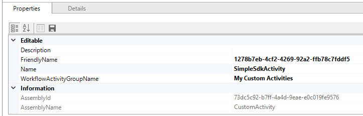

# Create a custom workflow activity

[!INCLUDE[](../../includes/cc_applies_to_update_9_0_0.md)]

This topic describes how to create a custom workflow activity and register it for use in [!INCLUDE[pn_dynamics_crm_online](../../includes/pn-dynamics-crm-online.md)] Customer Engagement. For [!INCLUDE[pn_CRM_Online](../../includes/pn-crm-online.md)], custom workflow activities can only be registered to execute in the sandbox (partial trust).  
  
<a name="Requirements"></a>

## Required software and assemblies

 To develop [!INCLUDE[pn_Windows_Workflow_Foundation](../../includes/pn-windows-workflow-foundation.md)] 4 custom activities for Dynamics 365 for Customer Engagement, you must develop them on Microsoft .NET Framework 4.6.2. The assembilies are available as Nuget packages and you can download from the NuGet profile [crmsdk](https://www.nuget.org/profiles/crmsdk).
  
<a name="UseCodeActivity"></a>

## Use the CodeActivity workflow base class

 To create a custom workflow activity, create a class that inherits from the <xref:System.Activities.CodeActivity> workflow base class. This class is available in the <xref:System.Activities> namespace. Activities that inherit from the `CodeActivity` class can override the `Execute` method to produce custom functionality.  
  
1. Start [!INCLUDE[pn_Visual_Studio](../../includes/pn-visual-studio.md)].  
  
2. On the **File** menu, click **New**, and then click **Project**.  
  
3. In the **New Project** dialog box, select **Workflow** under **Visual C#** in the **Installed Templates** pane, and then select **Activity Library**.  
  
4. Specify a name and location for the solution, and then click **OK**.  
  
5. Navigate to the **Project** menu and select **Properties**. On the **Application** tab, specify **.NET Framework 4.6.2** as the target framework.  
  
6. Add references to the `Microsoft.Xrm.Sdk.dll` and `Microsoft.Xrm.Workflow.dll` assemblies.  
  
7. Delete the Activity1.xaml file in the project.  
  
8. Add a class file (.cs) to the project. In Solution Explorer, right-click the project, select **Add**, and then click **Class**. In the **Add New Item** dialog box, type a name for the class, and then click **Add**.  
  
9. Open the class file, and add the following using directives:  
  
    ```csharp  
    using System.Activities;
    using Microsoft.Xrm.Sdk;
    using Microsoft.Xrm.Sdk.Workflow;  
    ```  
  
10. Make the class inherit from the `CodeActivity` class and give it a public access modifier as shown here:  
  
    ```csharp  
    public class SampleCustomActivity : CodeActivity  
    ```  
  
11. Add functionality to the class by adding an [Execute](https://msdn.microsoft.com/library/system.activities.codeactivity.execute.aspx) method:  
  
    ```csharp  
    protected override void Execute(CodeActivityContext context)
    {
      //Activity code
    }  
    ```  
  
     For more information, see [Adding Metadata to the Custom Workflow Activity](add-metadata-custom-workflow-activity.md).  
  
12. Specify input and output parameters. For more information, see [Adding Metadata to the Custom Workflow Activity](add-metadata-custom-workflow-activity.md).  
  
13. In the project properties, under the **Signing** tab, select **Sign the assembly** and provide a key file name. Custom workflow activity (and plug-in) assemblies must be signed.  
  
14. Compile the project to create an assembly (.dll).  
  
    To view a code sample that demonstrates how to create a custom workflow activity, see [Sample: Create a Custom Workflow Activity](sample-create-custom-workflow-activity.md).  
  
> [!IMPORTANT]
>  For improved performance, [!INCLUDE[pn_dynamics_crm](../../includes/pn-dynamics-crm.md)] caches custom workflow activity instances. The custom workflow activity’s [Execute](https://msdn.microsoft.com/library/system.activities.codeactivity.execute.aspx) method should be written to be stateless because the constructor is not called for every invocation of the custom workflow activity. Also, multiple system threads could execute the custom workflow activity at the same time. All per invocation state information is stored in the context, so it is not recommended to use global variables or member variables to pass data from one invocation to the next.  
  
<a name="NameandGroupName"></a>

## Specify the name and group name for a custom workflow activity

 When you register a custom workflow activity assembly, specify the name and group name. The name property specifies the name of the workflow activity. The group name property specifies the name of the submenu added to the main menu in the [!INCLUDE[pn_dynamics_crm](../../includes/pn-dynamics-crm.md)] process designer. These properties link the custom workflow activity with the [!INCLUDE[pn_dynamics_crm](../../includes/pn-dynamics-crm.md)] process designer, so that the custom activity name will appear in the user interface.  
  
 To specify the name and group name for a custom workflow activity, use the `PluginType.Name` and `PluginType.WorkflowActivityGroupName` attributes when you register the custom workflow activity assembly. For more information about registering custom workflow activities, see [Registering the Workflow Assembly](register-use-custom-workflow-activity-assembly.md). If the `PluginType.Name` and `PluginType.WorkflowActivityGroupName` attributes are set to **null**, the custom activity is hidden from the [!INCLUDE[pn_dynamics_crm](../../includes/pn-dynamics-crm.md)] workflow designer and is only accessible from XAML workflows.  
  
 When using the Plug-in Registration tool to register the custom workflow activity assembly, you must specify appropriate values in the **Name** and **WorkflowActivityGroupName** property fields after selecting the registered assembly in the listing. Those fields are located in the **Properties** tab under the **Editable** region. For more information about using the Plug-in Registration tool, see [Register a plug-in](/powerapps/developer/common-data-service/register-plug-in).  
  
   
  
 After this custom workflow activity is registered, you can use it from the [!INCLUDE[pn_dynamics_crm](../../includes/pn-dynamics-crm.md)] process designer for workflows or dialogs. For more information, see [Register and Use a Custom Workflow Activity Assembly](register-use-custom-workflow-activity-assembly.md).  
  
### See also

 [Workflow extensions](/powerapps/developer/common-data-service/workflow/workflow-extensions)  
 [Custom workflow activities (workflow assemblies)](../custom-workflow-activities-workflow-assemblies.md)   
 [Adding Metadata to the Custom Workflow Activity](add-metadata-custom-workflow-activity.md)   
 [Using the IOrganization Web Service within a Custom Workflow Activity](use-iorganization-web-service-custom-workflow-activity.md)   
 [Sample: Create a Custom Workflow Activity](sample-create-custom-workflow-activity.md)   
 [Sample: Azure aware custom workflow activity](../sample-azure-aware-custom-workflow-activity.md)   
 [Windows Workflow Foundation 4 Base Activity Classes](https://msdn.microsoft.com/library/ee264170.aspx)
