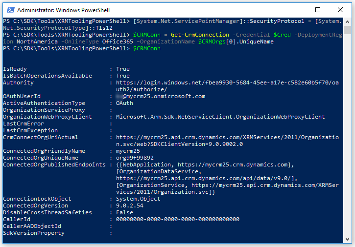

# Use PowerShell cmdlets for XRM tooling to connect to Dynamics 365

[!INCLUDE[](../../includes/cc_applies_to_update_9_0_0.md)]

XRM tooling provides you with the following [!INCLUDE[pn_PowerShell](../../includes/pn-powershell.md)] cmdlets that you can use to connect to [!INCLUDE[pn_dynamics_crm](../../includes/pn-dynamics-crm.md)] Customer Engagement and retrieve organizations that the current user has access to: `Get-CrmConnection` and `Get-CrmOrganizations`.  
  
<a name="Prereq"></a>   

## Prerequisites  
  
-   To use the XRM tooling cmdlets, you need [!INCLUDE[pn_PowerShell_short](../../includes/pn-powershell-short.md)] version 3.0 or later. To check the version, open a [!INCLUDE[pn_PowerShell_short](../../includes/pn-powershell-short.md)] window and run the following command: `$Host`  
  
-   Set the execution policy to run the signed [!INCLUDE[pn_PowerShell_short](../../includes/pn-powershell-short.md)] scripts. To do so, open a [!INCLUDE[pn_PowerShell_short](../../includes/pn-powershell-short.md)] window as an administrator and run the following command: `Set-ExecutionPolicy -ExecutionPolicy RemoteSigned`  
  
<a name="register"></a>   

## Register the cmdlets  

 Before you can use the [!INCLUDE[pn_PowerShell_short](../../includes/pn-powershell-short.md)] cmdlets, you have to register them. The XRM Tooling PowerShell cmdlets are available as a NuGet package here: [https://www.nuget.org/packages/Microsoft.CrmSdk.XrmTooling.CrmConnector.PowerShell](https://www.nuget.org/packages/Microsoft.CrmSdk.XrmTooling.CrmConnector.PowerShell/). To download and register the cmdlets: 
  
1. Open notepad, and copy the following script:

    ```powershell
    @PowerShell.exe -ExecutionPolicy RemoteSigned -Command "Invoke-Expression -Command ((Get-Content -Path '%~f0' | Select-Object -Skip 2) -join [environment]::NewLine)"
    @exit /b %Errorlevel%
    $currentFolder = Get-Location
    cd $currentFolder
    $sourceNugetExe = "https://dist.nuget.org/win-x86-commandline/latest/nuget.exe"
    $targetNugetExe = ".\nuget.exe"
    Remove-Item .\Tools -Force -Recurse -ErrorAction Ignore
    Invoke-WebRequest $sourceNugetExe -OutFile $targetNugetExe
    Set-Alias nuget $targetNugetExe -Scope Global -Verbose

    ##
    ##Specify the NuGet package source
    ##
    $nugetPackageSource = "https://api.nuget.org/v3/index.json"

    ##
    ##Download XRM Tooling PowerShell cmdlets
    ##
    ./nuget install -source $nugetPackageSource Microsoft.CrmSdk.XrmTooling.CrmConnector.PowerShell -O .\Tools
    md .\Tools\XRMToolingPowerShell
    $cmdletFolder = Get-ChildItem ./Tools | Where-Object {$_.Name -match 'Microsoft.CrmSdk.XrmTooling.CrmConnector.PowerShell.'}
    move .\Tools\$cmdletFolder\tools\*.* .\Tools\XRMToolingPowerShell
    Remove-Item .\Tools\$cmdletFolder -Force -Recurse

    ##
    ##Remove NuGet.exe
    ##
    Remove-Item nuget.exe
  
2. Save the notepad file as batch file on your computer: **GetTools.bat**.
3. Double-click the **GetTools.bat** file to run the script. This will create a Tools\XRMToolingPowerShell folder in the same location as your **GetTools.bat** file. The Tools\XRMToolingPowerShell folder contains the `RegisterXRMTooling.ps1` script to register the cmdlets, and other associated files.
1. Start [!INCLUDE[pn_PowerShell](../../includes/pn-powershell.md)] on your computer with elevated privileges (run as administrator).  
  
3.  At the prompt, change your directory to the folder that contains the [!INCLUDE[pn_PowerShell_short](../../includes/pn-powershell-short.md)]dll file and the script for registering the cmdlets. For example:  
  
    ```powershell  
    cd c:\SDK\Tools\XRMToolingPowerShell  
    ```  
  
4.  Run the `RegisterXRMTooling.ps1` script to register the XRM tooling [!INCLUDE[pn_PowerShell_short](../../includes/pn-powershell-short.md)] cmdlets. Type the following command, and press ENTER:  
  
    ```powershell
    .\RegisterXRMTooling.ps1  
    ```
  
 You’re now ready to use these [!INCLUDE[pn_PowerShell](../../includes/pn-powershell.md)] cmdlets. To list the cmdlets that you registered, run the following command in the [!INCLUDE[pn_PowerShell](../../includes/pn-powershell.md)] window:  
  
```powershell
Get-Help “Crm”  
```  
  
<a name="RetrieveOrgs"></a>   

## Use the cmdlet to retrieve organizations from [!INCLUDE[pn_dynamics_crm](../../includes/pn-dynamics-crm.md)]  

 Use the `Get-CrmOrganizations` cmdlet to retrieve the organizations that you have access to.  
  
1.  Provide your credentials to connect to your [!INCLUDE[pn_crm_op_edition](../../includes/pn-crm-onprem.md)] or [!INCLUDE[pn_CRM_Online](../../includes/pn-crm-online.md)] instance. Running the following command will prompt you to type your user name and password to connect to the [!INCLUDE[pn_crm_shortest](../../includes/pn-crm-shortest.md)] instance, and it will be stored in the `$Cred` variable.  
  
    ```powershell  
    $Cred = Get-Credential  
    ```  
1. Use the following command to enforce usage of TLS 1.2 to connect to Customer Engagement instance:

    ```powershell  
    [System.Net.ServicePointManager]::SecurityProtocol = [System.Net.SecurityProtocolType]::Tls12 
    ```

    More information about TLS 1.2 requirement for Customer Engagement connection: [Blog Post: Updates coming to Dynamics 365 Customer Engagement connection security](https://blogs.msdn.microsoft.com/crm/2017/09/28/updates-coming-to-dynamics-365-customer-engagement-connection-security/)

2.  Use the following command to retrieve your organizations, and store the information in the `$CRMOrgs` variable: 

    - If you’re connecting to the [!INCLUDE[pn_CRM_Online](../../includes/pn-crm-online.md)] instance:  
  
        ```powershell  
        $CRMOrgs = Get-CrmOrganizations -Credential $Cred -DeploymentRegion NorthAmerica –OnlineType Office365  
        ```  
  
        > [!NOTE]
        >  For the `DeploymentRegion` parameter, valid values are `NorthAmerica`, `EMEA`, `APAC`, `SouthAmerica`, `Oceania`, `JPN`, `CAN`, `IND`, and `NorthAmerica2`. For the `OnlineType` parameter, specify `Office365`.
  
    -   If you’re connecting to the [!INCLUDE[pn_crm_op_edition](../../includes/pn-crm-onprem.md)] server:  
  
        ```powershell  
        $CRMOrgs = Get-CrmOrganizations –ServerUrl http://<CRM_Server_Host> –Credential $Cred  
        ```      
  
    -   If you’re connecting to the [!INCLUDE[pn_crm_shortest](../../includes/pn-crm-shortest.md)] server using the claims-based authentication against the specified Home realm:  
  
        ```powershell  
        $CRMOrgs = Get-CrmOrganizations –ServerUrl http://<CRM_Server_Host> –Credential $Cred –HomRealmURL http://<Identity_Provider_Address>  
        ```  
  
3.  Your supplied credentials are validated when you run the command in step 2. On successful execution of the command, type the following command, and press ENTER to display the organizations that you have access to:  
  
    ```powershell  
    $CRMOrgs  
    ```  
  
      
  
    > [!TIP]
    >  You can use the variable that was used to store the retrieved [!INCLUDE[pn_crm_shortest](../../includes/pn-crm-shortest.md)] organizations (in this case `$CRMOrgs`) with the `Get-CrmConnection` cmdlet to connect to [!INCLUDE[pn_crm_shortest](../../includes/pn-crm-shortest.md)]. To specify the org name, use the following command: `$CRMOrgs.UniqueName`.  
    >   
    >  If there is more than one organization value stored in the `$CRMOrgs` variable, you can refer to the `nth` organization using the following command: `$CRMOrgs[n-1]`. For example, to refer to the unique name of the second organization in the `$CRMOrgs` variable, use the following command: `$CRMOrgs[1].UniqueName`. [!INCLUDE[proc_more_information](../../includes/proc-more-information.md)] [Accessing Values in an Array](https://technet.microsoft.com/library/ee692791.aspx)  
  
<a name="ConnecttoCRM"></a>
   
## Use the cmdlet to connect to [!INCLUDE[pn_dynamics_crm](../../includes/pn-dynamics-crm.md)]  

 Use the `Get-CrmConnection` cmdlet to connect to a [!INCLUDE[pn_crm_shortest](../../includes/pn-crm-shortest.md)] instance. The cmdlet lets you either use the XRM tooling common login control to specify your credentials and connect to [!INCLUDE[pn_crm_shortest](../../includes/pn-crm-shortest.md)] or lets you specify your credentials as inline parameters. [!INCLUDE[proc_more_information](../../includes/proc-more-information.md)] [Use the XRM Tooling common login control](use-xrm-tooling-common-login-control-client-applications.md)

> [!IMPORTANT]
> Before using the `Get-CrmConnection` cmdlet, ensure that you use the following command to enforce usage of TLS 1.2 by PowerShell to connect to your Customer Engagement instance:<br/>
> `[System.Net.ServicePointManager]::SecurityProtocol = [System.Net.SecurityProtocolType]::Tls12`   
  
### Connect to [!INCLUDE[pn_dynamics_crm](../../includes/pn-dynamics-crm.md)] by using the common login control  
  
1.  If you want to use the common login control to provide your credentials to connect to [!INCLUDE[pn_crm_shortest](../../includes/pn-crm-shortest.md)], use the following command. The connection information is stored in the `$CRMConn` variable so that you can use it later.  
  
    ```powershell  
    $CRMConn = Get-CrmConnection -InteractiveMode  
    ```  
  
2.  The **LoginControl** dialog box appears. Provide your credentials to connect to your [!INCLUDE[pn_crm_shortest](../../includes/pn-crm-shortest.md)] instance, and click **Login**.  
  
### Connect to [!INCLUDE[pn_dynamics_crm](../../includes/pn-dynamics-crm.md)] by specifying credentials inline  
  
1.  To connect to Dynamics 365, use the following commands. Note that these commands use the `$Cred` variable created earlier to store the credential while retrieving the organizations. The connection information is stored in the `$CRMConn` variable:  
  
    -   If you’re connecting to the [!INCLUDE[pn_crm_op_edition](../../includes/pn-crm-onprem.md)] server:  
  
        ```powershell  
        $CRMConn = Get-CrmConnection –ServerUrl http://<CRM_Server_Host> -Credential $Cred -OrganizationName <OrgName>  
        ```  
  
    -   If you’re connecting to the [!INCLUDE[pn_CRM_Online](../../includes/pn-crm-online.md)] instance:  
  
        ```powershell  
        $CRMConn = Get-CrmConnection -Credential $Cred -DeploymentRegion <Deployment region name> –OnlineType Office365 –OrganizationName <OrgName>  
        ```  
  
        > [!NOTE]
        >  For the `DeploymentRegion` parameter, valid values are `NorthAmerica`, `EMEA`, `APAC`, `SouthAmerica`, `Oceania`, `JPN`, `CAN`, `IND` and `NorthAmerica2`. For the `OnlineType` parameter, specify **Office365**.  
  
    -   If you’re connecting to the [!INCLUDE[pn_crm_shortest](../../includes/pn-crm-shortest.md)] server using the claims-based authentication against the specified Home realm:  
  
        ```powershell  
        $CRMConn = Get-CrmConnection –ServerUrl http://<CRM_Server_Host> -Credential $Cred -OrganizationName <OrgName> –HomRealmURL http://<Identity_Provider_Address>  
        ```  
  
    > [!NOTE]
    >  For the `OrganizationName` parameter in all the preceding commands, you can either specify the organization unique name or friendly name. You can also use the organization unique name or friendly name that you retrieved using the Get-`CrmOrganizations` cmdlet and stored in the `$CRMOrgs` variable. For example, you can use `$CRMOrgs[x].UniqueName` or `$CRMOrgs[x].FriendlyName`.  
  
2.  Your supplied credentials are validated when you run the command in step 1. On successful execution of the cmdlet, type the following command, and press ENTER to display the connection information and status:  
  
    ```powershell  
    $CRMConn  
    ```  
  
      
  
### See also
  
 [Use XRM Tooling API to connect to Dynamics 365](use-crmserviceclient-constructors-connect.md)   
 [Build Windows client applications using the XRM tools](../build-windows-client-applications-xrm-tools.md)   
 [Blog: PowerShell module for performing data operations and manipulating user and system settings in CRM](http://blogs.msdn.com/b/crm/archive/2015/09/25/powershell-module-for-performing-data-operations-and-manipulating-user-and-system-settings-in-crm.aspx)