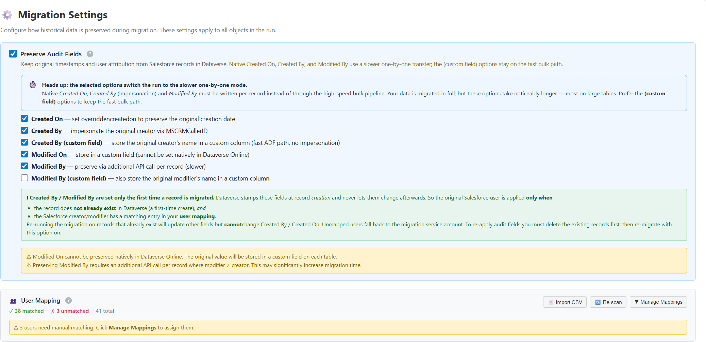

# Step 5: Map Salesforce users to Dynamics 365 users (preview)

[!INCLUDE [preview-banner](~/../shared-content/shared/preview-includes/preview-banner.md)]

Dynamics 365 Activate uses user mapping to connect Salesforce users to existing users in Microsoft Dataverse. Configure user mapping before you migrate records that contain user references.

[!INCLUDE [preview-note](~/../shared-content/shared/preview-includes/preview-note-d365.md)] 

## Why user mapping is required

Dynamics 365 Activate doesn't create or migrate Salesforce users as Dataverse users. The corresponding users must already exist in the target Dynamics 365 environment.

User mapping is required to resolve:

- Record ownership, such as Salesforce `OwnerId` to the Dataverse **Owner** column.
- Audit attribution when you preserve the native **Created By** and **Modified By** columns.
- Other lookup columns that reference the Dataverse `systemuser` table.

Without a mapping, Dynamics 365 Activate can't preserve the original Salesforce user reference. For native audit attribution, an unmapped user falls back to the migration application user. 

User mapping is a prerequisite when you select **Preserve Audit Fields** and preserve the native **Created By** or **Modified By** values.



> **Note**
>
> The **Created By (custom field)** and **Modified By (custom field)** options store the Salesforce user's name in a custom text column. These options don't set a Dataverse user lookup and therefore don't require user mapping.

## Prerequisites

Before you begin, ensure you:

- Configure and successfully test the Salesforce and Dynamics 365 connections.
- Create every user who should own records or appear in a user lookup in the target Dynamics 365 environment.
- Enable the target users and assign the required Dynamics 365 licenses, security roles, and business units.
- Grant the migration application user permission to read the Dataverse `systemuser` table.
- Complete and review the user mapping before starting the data migration.

User mapping doesn't assign licenses, security roles, or business units to the target users.

## Automatically map users

Automatic mapping compares Salesforce users with existing Dataverse system users. Use automatic mapping first, and then review any users that remain unmatched.

1. Open your migration project.
2. Select **User Mapping**.
3. Select **Discover Users**. If a mapping was created previously, select **Re-scan** to retrieve the latest users.
4. Review the **Matched**, **Unmatched**, and **Coverage** values.
5. Select **All Users** to review the individual results.

Dynamics 365 Activate attempts the following matches in order:

| Match method | Salesforce value | Dataverse value | Behavior |
| --- | --- | --- | --- |
| Email | **Email** | **Internal Email Address** | Matches the complete email address without regard to capitalization. |
| Username | The local part of **Username**, before `@` | The local part of **Domain Name**, before `@` | Used when an email match isn't available. |

A user is automatically mapped only when the comparison identifies one unambiguous Dataverse user. Duplicate or missing values remain unmatched for manual review.

> **Important**
>
> Review automatic mappings before migration. Similar usernames across domains can refer to different people, especially after mergers, tenant changes, or email-address changes.

## Manually map users

Use manual mapping when a user isn't matched automatically or when you need to replace an automatic match.

You can manage mappings from the **User Mapping** page or from the **User Mapping** section under **Migration Settings**.

1. Open the user mapping list.
2. Filter the list to **Unmatched**, or search for the Salesforce user's name or email address.
3. For the Salesforce user, select **Assign user**. To replace an existing mapping, select **Change mapping**.
4. Search for and select the corresponding Dynamics 365 user.
5. Save the mapping.
6. Repeat these steps until you map all users needed for the migration.

To remove a mapping, select **Remove mapping** for the user. The Salesforce user returns to the unmatched state.

When you re-scan users, manual mappings are retained, so reviewed assignments aren't replaced by automatic matching.

## Export and import user mappings

Use CSV export and import to review mappings in bulk, work with a migration team, or prepare mappings outside Dynamics 365 Activate.

### Export mappings

1. Open the migration project.
2. Select **User Mapping** > **All Users**.
3. Select **Export CSV**.
4. Save the downloaded `user-mapping-<project-id>.csv` file.

The export includes the Salesforce and Dataverse user identifiers, email addresses, display names, mapping status, and match method. Use the exported file as the template for an import.

### Prepare the CSV file

For the most reliable import, keep the exported columns and update the Dataverse user columns for unmatched or incorrect rows.

Each imported row must contain:

- A Salesforce identifier: `SalesforceUserId` or `SalesforceEmail`.
- A Dataverse identifier: `DataverseSystemUserId` (or `DataverseUserId`) or `DataverseEmail`.

Use the recommended minimum format that uses immutable identifiers:

```csv
SalesforceUserId,DataverseSystemUserId
005000000000001AAA,00000000-0000-0000-0000-000000000001
005000000000002AAA,00000000-0000-0000-0000-000000000002
```
Don't change the Salesforce user ID. Enter the Dataverse `systemuserid` GUID for the target user.

> **Tip**
>
> IDs are safer than email addresses for repeatable imports because email addresses can change. If you use email addresses, ensure they match the values in the connected environments.

### Import mappings

1. Open **User Mapping**.
2. Select **Import CSV**.
3. Select the prepared CSV file.
4. Review the import result, including imported, skipped, or failed rows.
5. Review the mapping summary and resolve any remaining unmatched users.

An imported mapping replaces the current mapping for the identified Salesforce user. The system reports rows with missing identifiers or users that it can't resolve as errors.

## Validate the mapping before migration

Before you start the migration:

1. Confirm that you mapped every Salesforce user referenced by records in the migration scope.
2. Pay particular attention to inactive Salesforce users who created, modified, or owned historical records.
3. Review mappings for integration users, automated-process users, and renamed accounts.
4. Confirm that each mapped Dynamics 365 user is in the correct business unit and can own or access the migrated records.
5. Re-scan if you added or changed users in either environment after creating the mapping.

## Audit-field behavior

Dataverse applies native **Created By** and **Modified By** values only when you create a record for the first time and the Salesforce user has a valid mapping.

If you migrate the record again:

- You can update other mapped data.
- You can't change **Created By** and **Created On** on the existing Dataverse record.
- Reapplying the original audit attribution requires deleting the target record and migrating it again with audit-field preservation enabled.

Preserving native audit fields requires per-record processing, which can take longer than bulk migration. Custom-field audit options use the faster bulk migration process.

## Related content

- [How to migrate from Salesforce to Dynamics 365 (preview)](migrate-salesforce-to-dynamics-365-quick-start.md)
- [Deploy the Dynamics 365 schema for migration (preview)](migrate-salesforce-to-dynamics-365-solution-deployment.md)
