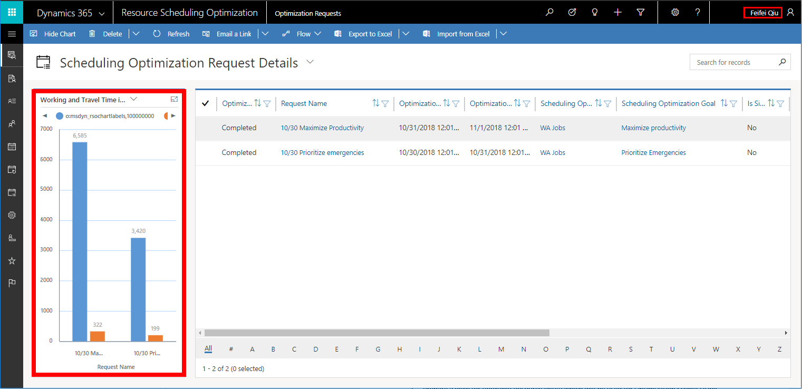
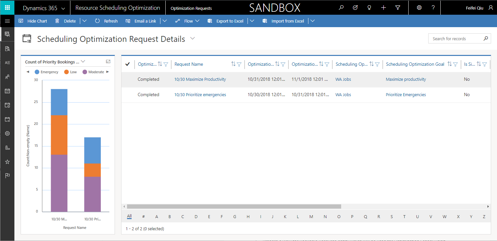

# The five stages of scheduling adoption 

Given existing customer implementations, we've discovered that there are typically five stages of scheduling adoption with Dynamics 365 Field Service. In this article, we'll explore these five typical stages. They apply mostly to early Field Service adoption (for instance, with limited-scope projects), but the stages also apply as implementations are rolled out to cover additional scope or locations. 

We recommend using Field Service tracking analytics throughout these stages to measure how scheduling is meeting your defined business objectives. For example, Field Service provides data on travel time, time on the job, and jobs per day for use as needed.

## Choosing the right resources

First, it's important to note that having schedulers and schedule analysts **with the right skills** is a key prerequisite for this process. Identify, train, and empower these resources early in the pilot or roll-out process. Keep in mind these are your resources who will be involved daily in scheduling. For more information on these types of resources, visit [our article on scheduling personas](scheduling-roles-personas.md). 

## Stage 1: Manual scheduling

For defined scope and locations, the scheduler and schedule assistant begin by manually scheduling all actual work. This helps all actively involved resources understand the scheduling tools and processes. The scheduled work should be actual work orders assigned and completed by actual technicians. This also helps technicians adjust to process changes.

Recommended time for this stage: 1-2 weeks

## Stage 2: Schedule assistant

The next stage sees the introduction of the schedule assistant for scheduling work. This work should be done by the scheduler and schedule analyst. Like with manual scheduling, schedulers will learn how to work with the schedule assistant, along with the deeper capabilities of the schedule board. Work scheduled with the schedule assistant should be actual work orders assigned to and completed by actual technicians.

Recommended time for this stage: 1-2 weeks

## Stage 3: Automated overnight scheduling + manual exception handling (resource scheduling optimization)

As businesses grow, so do scheduling needs; it’s difficult to have human dispatchers manually scheduling all demand requirements. During this stage, schedulers and schedule analysts can experiment and iterate on automated schedules, allowing for adjustments to scope, goals, and timing of runs.

Resource scheduling optimization is an add-in solution that automatically matches resources and demands by considering skills, locations, duration, promised time windows, priorities, and many other factors. For location-specific work, optimization results minimize overall travel distances and give accurate turn-by-turn travel time estimates. All of this is to improve technician productivity and customer satisfaction.

RSO also responds to rescheduling and cancellations, and dispatchers can still manually override schedules as needed.

Many businesses schedule resource assignments one week in advance. The secret recipe is **optimization scopes**. By leveraging the power of extensible scopes to break down optimization schedules into smaller sets of resources and requirements allows resource scheduling optimization to optimize in parallel. 

### Measuring successful optimizations

What organizations choose to measure and track depends on their business goals. With out-of-the-box optimization statistics, schedule analysts can measure: 

1.  Travel time versus working time, per schedule

2.  How many high priority jobs were scheduled

3.  Travel time and work time per technician, per day

4.  How many jobs weren't scheduled

> [!div class="mx-imgBorder"]

> [!div class="mx-imgBorder"]

After optimization, analysts can then review:

1.  How many jobs were rescheduled manually after optimization and why

2.  How many jobs completed per plan

3.  How many jobs canceled

Resource scheduling optimization analytics allow schedule analysts to compare the simulation results and decide on the best resource scheduling optimization schedule for overnight processing. Like with the other adoption stages, all scheduled work should be actual work orders assigned to and completed by actual technicians.

### Best practice: manually handling exceptions after optimization 

Exceptions are handled by the scheduler using manual and assisted scheduling. This means creating or changing bookings for new requirements, and adjusting the remaining schedule.

Exception handling is useful in the following scenarios:

- A work order is canceled and the technician has availability in the middle of day

- The technician is delayed from previous work and can’t make next job on time

- The technician must perform emergency work assigned by the dispatcher that conflicts with other jobs

To manually handle exceptions in cases like these: 

1. Drag and drop emergency work to the best resource (matched either by skill or by proximity to job)

2. Use the schedule assistant to query the best resource for emergency work

For more information on overnight scheduling, visit our article on [types of scheduling](scheduling-capabilities.md).

Recommended time for this stage: 1-2 weeks

## Stage 4: Single resource optimization

The next stage is to use the power of resource scheduling optimization for schedule changes and exceptions. This is accomplished using single resource optimization from the schedule board. Rather than reoptimize the entire workforce schedule, single resource optimization allows you to target the specific field technician's schedule as exceptions occur. SRO should be done by the scheduler, with assistance from the schedule analyst if needed.

In contrast to an overnight optimization scenario, the scope is different for a single resource optimization and typically ends when the current day ends. Additionally, the **schedule within working hours** constraint should be removed from the associated optimization goal, as it's okay to push bookings a bit further outside of working hours. Lastly, set the "High Priority Requirements" as the first objective in order to optimize emergency work first if applicable.

During this adoption stage, analysts can see whether manual scheduling or single resource optimization is working better (and then adjust accordingly) for a single resource’s schedule by:

-   Comparing resource utilization between manual scheduling versus automatic single resource optimization scheduling

-   Comparing travel time between manual scheduling versus automatic single resource optimization scheduling

-   Comparing the number of high priority work scheduled by manual scheduling versus automatic single resource optimization scheduling

Refer to our [article on SRO](single-resource-optimization.md) for details about its use.

Recommended time for this stage: 1-2 weeks

## Stage 5: Fully automated (resource scheduling optimization)

In this late stage of adoption, resource scheduling optimization schedules run throughout the day to reoptimize subsets of the overall schedule. Based on what you've learned, the system should be configured to select the correct scope for reoptimization (for instance, optimizations based on requirements, resources, or bookings).

Alternatively, schedulers may manually trigger reoptimization runs as needed.

The schedule analyst typically leads this effort, with assistance from the scheduler. The scheduler will continue to use manual and assisted scheduling on a limited basis as needed.

### Best practice: fully automatic scheduling for both overnight and exceptions 

Emergencies and exceptions might happen anytime; how can we ensure these emergencies are addressed in time while also ensuring SLAs are met and technician efficiency remains high? Practice defining smart optimization scopes to handle your unique scheduling problems:

1.  Define a small schedule with a few resources who normally handle emergencies.
2. Pre-define a resource view with a fixed number of resources, or pre-define a resource view that can be dynamically changed based on business logic (for example, an emergency flag on the resource entity that is toggled to on/off with a workflow).
3. Set "Emergency" schedule to run every hour to pick up new emergency requirements and reshuffle existing booking. You can also use a workflow to call the resource scheduling optimization **run now** action trigger optimization when emergencies occur. This will only work if emergencies aren't frequent a given scope.
4. Verify that your new emergency requirements get scheduled as expected
5. Verify that resources have reasonable routes based on travel time and schedule board map

Recommended time for this stage: 1-2 weeks

## See also

- [Resource scheduling optimization Overview](rso-overview.md)

[!INCLUDE[footer-include](../includes/footer-banner.md)]