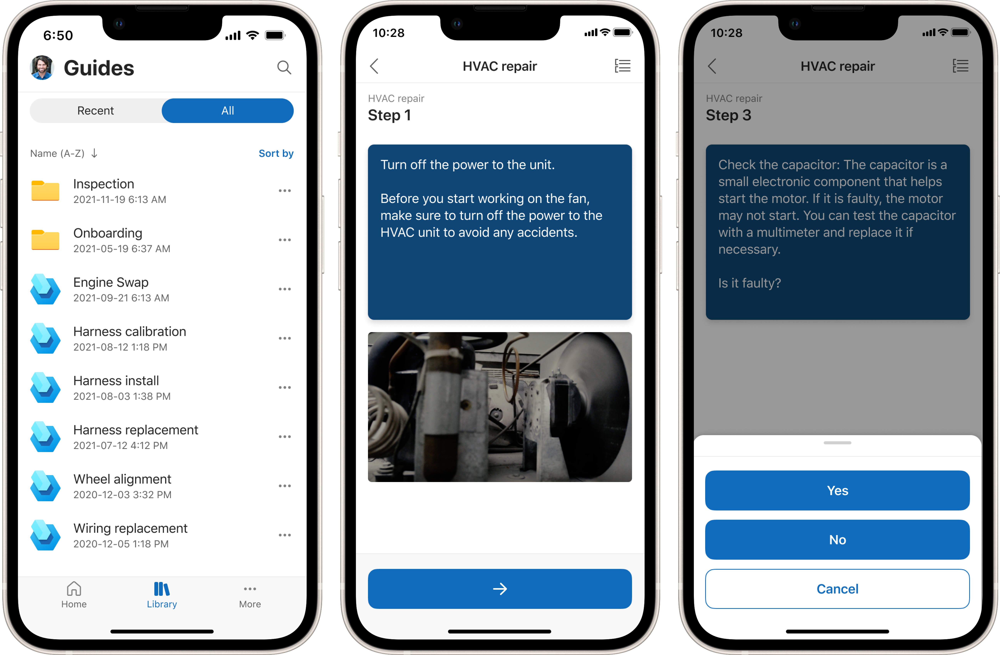

# Access related apps from the mobile app

The Dynamics 365 Field Service mobile app provides quick access to related applications if your organization chooses to use them.

## IoT data

Organizations using Field Service to track their IoT devices find a subset of that information readily available in the mobile app. For more information, see [Connected Field Service for the Field Service mobile app](cfs-mobile-powerapp.md).

Technicians can view and interact with IoT data and IoT actions like pulling live device data or registering new devices in the mobile app.

> [!div class="mx-imgBorder"]
> 

Live charts for IoT data from an IoT device, customer asset, or IoT alert record are available at your fingertips.

## Launch Dynamics 365 Remote Assist for remote collaboration

Organizations using Dynamics 365 Remote Assist have a deep link from the work order to open the Remote Assist mobile app. For more information, see [Using Field Service with Dynamics 365 Remote Assist](remote-assist-hololens.md).

> [!div class="mx-imgBorder"]
> 

## Use embedded Guides in the mobile app (preview)

[!INCLUDE [public-preview-banner](../includes/public-preview-banner.md)]

[!INCLUDE [public-preview-note](../includes/public-preview-note.md)]

If your organization uses Dynamics 365 Guides, you can use the Field Service mobile app to access guides from mobile devices. If Guides uses the same environment as Field Service, users find a **Library** option at the bottom of the app. Select it to access your organization's guides library, search for specific guides, and follow them step by step. For more information, see [Embedded Guides in Field Service mobile app (preview)](/dynamics365/mixed-reality/guides/admin-connect-field-service-mobile)

> [!div class="mx-imgBorder"]
> 

[!INCLUDE[footer-include](../includes/footer-banner.md)]
