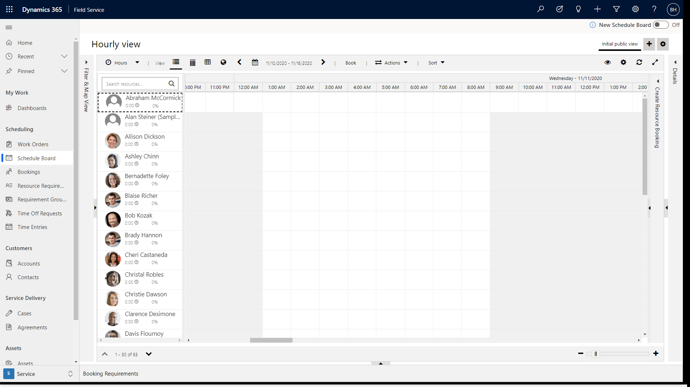
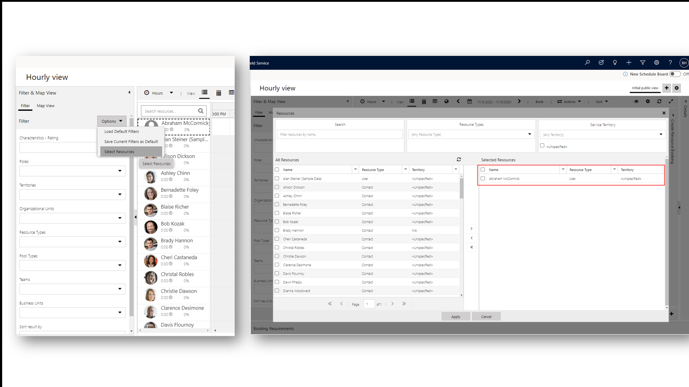

# Display a frontline worker or resource on the schedule board

Go to **Field Service** > **Schedule Board**.

> [!div class="mx-imgBorder"]
> 

In the **Filter and Map View** panel, select **Options** > **Select Resources**.

Find the frontline worker or bookable resource and then move the user to selected resources. 

Choose **Apply**.

> [!div class="mx-imgBorder"]
> 