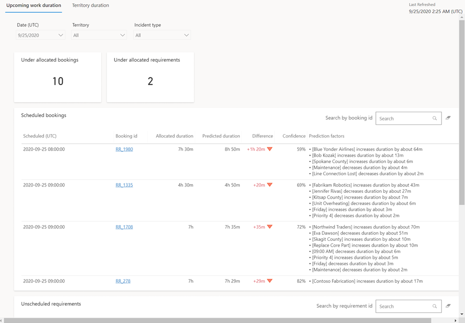
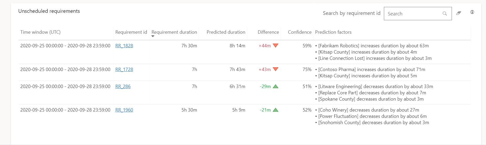
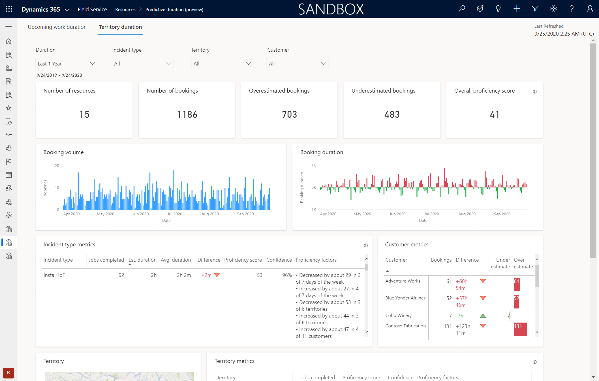
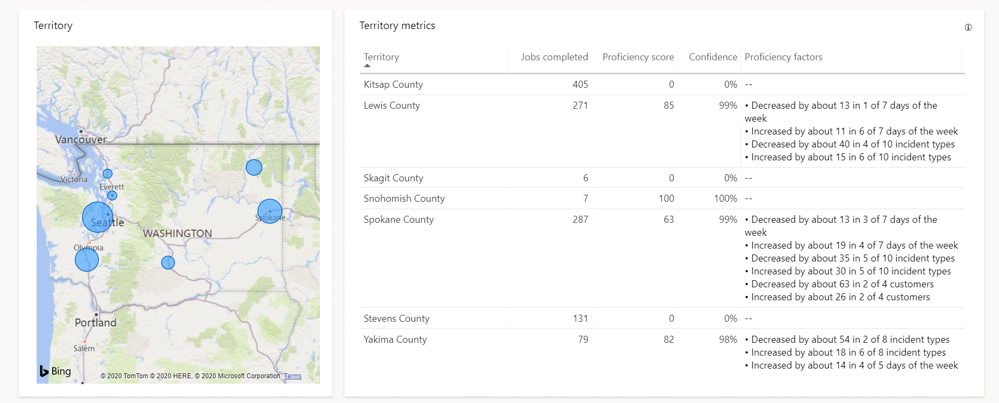
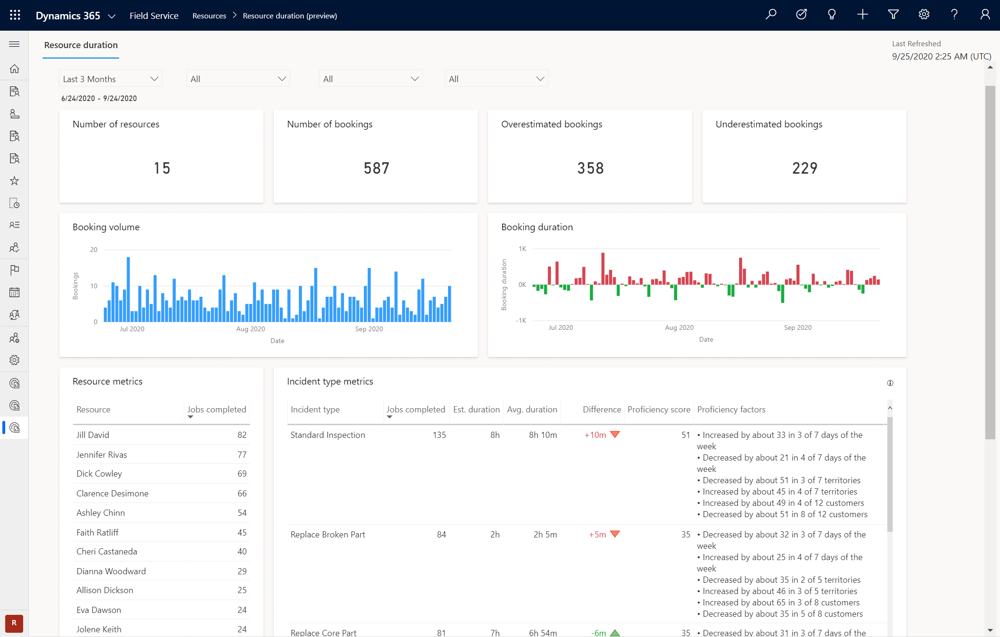
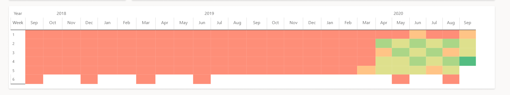

# Predictive work duration reports (Preview)

Dispatchers often assign a fixed duration for a job type, despite various factors that may have an effect on the time required to complete the work. Using a fixed duration can potentially cause cascading delays or lower utilization, reducing the overall effectiveness of scheduling.

With predictive work duration, dispatchers can predict the duration of a booking or requirement, based on various factors.

Powered by artificial intelligence models, predictive work durations learn from historical booking completion times in order to compute a more realistic duration.

> [!IMPORTANT]
> This feature is intended to help dispatchers or admins enhance their team’s performance and improve customer satisfaction. This feature is not intended for use in making, and should not be used to make, decisions that affect the employment of an employee or group of employees, including compensation, rewards, seniority, or other rights or entitlements. Customers are solely responsible for using Dynamics 365, this feature, and any associated feature or service in compliance with all applicable laws, including laws relating to accessing individual employee analytics and monitoring, recording, and storing communications with end users. This also includes adequately notifying end users that their communications with agents may be monitored, recorded, or stored and, as required by applicable laws, obtaining consent from end users before using the feature with them. Customers are also encouraged to have a mechanism in place to inform their agents that their communications with end users may be monitored, recorded, or stored.

## Before you start

An administrator must enable this public preview feature. In the Field Service app, change to the **Settings** area. Go to **Analytics and Insights** > **Settings** > **Predictive work duration (Preview)** and select **Manage**. Specify the **Minimum number of resources per territory** field. Territories that have fewer resources will be excluded from territory analyses and reports. This limitation can help protect technician privacy.

## Upcoming work duration report

You'll find the upcoming work duration report under **Resources** > **Analytics and Insights** > **Predictive duration (preview)**.

> [!div class="mx-imgBorder"]
> 

> [!div class="mx-imgBorder"]
> 

**Estimated duration** is expected time job to take. The value comes from the duration (msdyn_duration) of the resource requirement. The duration of the resource requirement is derived from the total duration of all work order incident types.

**Actual duration** is the time that was spent working on a requirement. This value is calculated by *end time* of a booking minus the *actual arrival time* minus the *On break* duration of the booking journal related to the booking.

### Filters and slicers

- **Date**: Choose a relative date in the future.
- **Territory**: Choose from the list of [resource territories](set-up-territories.md).
- **Incident type**: Choose from the list of [incident types](configure-incident-types.md).

### Key performance indicators (KPIs)

| Label  |  Description  |  
|---------|--------------|
| **Under allocated bookings** |	Number of bookings allocated under predicted duration. |
| **Under allocated requirements**	| Number of requirements allocated under predicted duration. |

### Charts

| Label | Description |
| ------ | -------------|
| **Scheduled bookings** | Shows a list of scheduled bookings, with information and prediction factors for each. |
| **Unscheduled requirements** | Shows a list of requirements that haven't been scheduled, with information and prediction factors for each. | 

### Metrics

| Metric | Description |
|--------|----------------------|
| **Confidence** | How likely the actual duration will be close to the predicted duration. A higher score (closer to 100%) signifies a better chance of the prediction being correct, while lower score (close to 0%) means the prediction may be incorrect. |
|**Prediction Factors** |  Insights into factors that were considered when predicting the duration and how they affect the prediction. |

## Territory duration

From the upcoming work duration report, you'll see another tab, where you can find the **Territory duration** report.

> [!div class="mx-imgBorder"]
> 

> [!div class="mx-imgBorder"]
> 

### Filters and slicers

- **Duration**: Lists pre-defined values to filter by duration.
- **Incident type**: Filter by incident types.
- **Territory**: Filter by service territories.
- **Customer**: Filters the territory report by customer.

### Key performance indicators (KPIs)

| Label | Description |
|----------|----------|
| **Number of resources** |	Shows number of resources involved in bookings. |
| **Number of bookings** | Shows number of completed bookings. | 
| **Overestimated bookings** | Shows number of bookings that are overestimated compared with actual duration. | 
| **Underestimated bookings** | Shows number of bookings that are underestimated compared with actual duration. | 
| **Overall proficiency score**	| Overall proficiency across all territories |

### Charts

| Label | Description |
|----------|----------|
| **Booking volume** | 	Shows number of bookings over the chosen filters (duration, territory, etc.).| 
| **Booking duration**	| Compares over and under estimated bookings over the chosen filters (duration, territory, etc.).
| **Customer metrics**	|  Shows bookings, difference, and over and under estimates by customer. | 
| **Incident type metrics** | Shows jobs completed, estimated duration, average duration, difference, proficiency score, confidence, and proficiency factors by incident type. | 
| **Territory** | Map that visualizes metrics by defined territories. | 
| **Territory metrics** | Shows jobs completed, proficiency scores, confidence, and proficiency factors for each territory. | 

## Resource duration

The final report can be found under **Resource duration**.

> [!div class="mx-imgBorder"]
> 

> [!div class="mx-imgBorder"]
> 

### Key performance indicators (KPIs)

| Label | Description |
| -------|---------|
| **Number of resources**	| Shows number of resources involved in bookings. |
| **Number of bookings**	| Shows number of completed bookings. | 
| **Overestimated bookings**	| Shows number of bookings that are overestimated compared with actual duration. | 
| **Underestimated bookings**	| Shows number of bookings that are underestimated compared with actual duration.

### Charts

| Label | Description |
|---------------|----------------|
| **Booking volume**	| Shows number of bookings over the chosen period. | 
| **Booking duration**| Compares over- and underestimated bookings over the period. |
| **Resource metrics** | Shows the number of jobs completed by resource.| 
| **Incident type metrics**| Shows jobs completed, estimated duration, average duration, difference, proficiency score, and proficiency factors by incident type.| 

### Metrics

| Metric | Description |
|---------|-------------|
| **Proficiency score** | A score indicating the likelihood of completing a booking within the estimated duration. A higher score indicates a high likelihood of completing a booking within the estimated duration and a lower score indicates vice-versa. |
| **Confidence**  | How likely the proficiency score calculated from the samples is close to the true proficiency score. A higher score indicates the proficiency score being closer to the truth and a lower score indicates the proficiency score being farther away from the truth.   |
| **Proficiency factors** | Summary of factors such as incident types, service accounts, day of week, and skills and rating match that contribute to the efficiency score. |

[!## Next steps

- [Reports overview](reports.md)
- [Optimization summary report](rso-optimization-summary-report.md)

[!INCLUDE[footer-include](../includes/footer-banner.md)]
