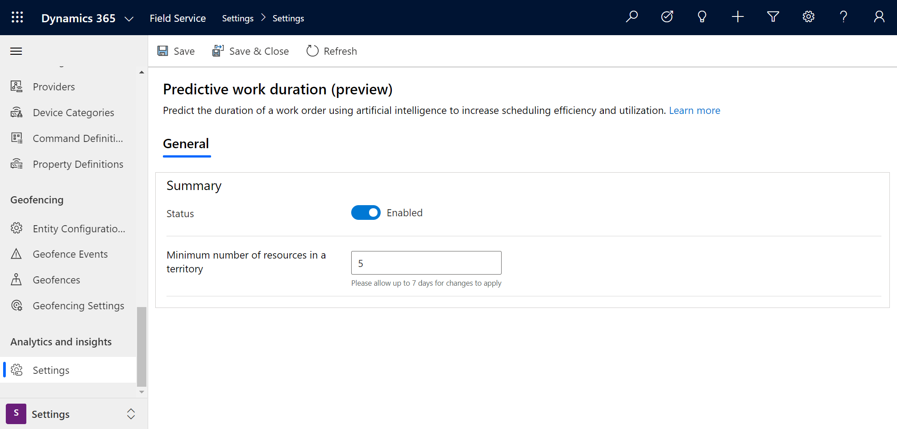

# Predictive work duration in Dynamics 365 Field Service

Field service dispatchers often assign a fixed duration for a job type, despite various factors that may impact the time required to complete the work. Using a fixed duration can potentially cause cascading delays or lower utilization, reducing the overall effectiveness of scheduling.

With predictive work duration, dispatchers can predict the duration of any given booking or requirement, based on factors like:

- Resource performance
- Incident type
- Customer location
- Territorial differences
- Seasonal changes

Powered by artificial intelligence models, predictive work durations learn from historical booking completion times in order to compute a more realistic duration.

In this article, we'll take a look at how to setup and use predictive work durations in Field Service.

## Prerequisites

- Dynamics 365 Field Service v8.x.x.
- As of October 2020, this feature is in public preview. Turn turn on the preview, go to **Settings**. Under the **Analytics and insights** section, select **Settings** > 
**Enable Predictive Work Duration preview**. 
- Enter a number in the **Minimum number of resources per territory** field to define how large a territory must be in order to be used in the report.

> [!div class="mx-imgBorder"]
> 

Enabling predictive work duration will give you access to three reports:

- Upcoming work duration
- Territory duration
- Resource duration

Let's take a look at each report.

## Upcoming work duration

You'll find the upcoming work duration report under **Resources** > **Analytics and Insights** > **Predictive duration (preview)**.

> [!div class="mx-imgBorder"]
> 

> [!div class="mx-imgBorder"]
> 

Learn more about the metrics in the following sections.

### Filters (slicers)

At the top of the report, you'll find a few ways to filter or slice the data.

- **Date**: This filter sets the duration, which includes the following options:
  - Last 3 months
  - Last 6 months
  - Last 1 year
  - Last 2 years
- **Territory**: This filter lists resource territories and filters resources.
- **Incident type**: This filter lets you sort by a list of incident types.

### Key performance indicators (KPIs)

Below the filters are key performance indicators.

| Label  |  Description  |  
|---------|--------------|
| Under allocated bookings |	Number of bookings allocated under predicted duration. |
| Under allocated requirements	| Number of requirements allocated under predicted duration. |

### Charts

Beneath the key performance indicators, you'll find the following charts.

| Label | Description |
| ------ | -------------|
| Scheduled bookings | Shows a list of scheduled bookings, with information and prediction factors for each. |
| Unscheduled requirements | Shows a list of requirements that have not been scheduled, with information and prediction factors for each. | 

### Metrics

Within the charts previously listed, you'll find the following information.

| Metric | Description |
|--------|----------------------|
| Confidence | How likely the actual duration will be close to the predicted duration. A higher score (closer to 100%) signifies a better chance of the prediction being correct, while lower score (close to 0%) means the prediction may be incorrect. |
|Prediction Factors |  Insights into factors that were considered when predicting and how they affect the prediction. |

## Territory duration

From the upcoming work duration report, you'll see another tab, where you can find the **Territory duration** report.

> [!div class="mx-imgBorder"]
> 

> [!div class="mx-imgBorder"]
> 

### Filters (slicers)

Like with the upcoming work duration report, the territory duration report has a few ways to filter information:

- **Duration**: Lists pre-defined values to filter by duration. Options are: 
  - Last 3 months
  - Last 6 months
  - Last 1 year
  - Last 2 years
- **Incident type**: Filter by incident types.
- **Territory**: Filter by service territories.
- **Customer**: Filters the territory report by customer.

### Key performance indicators (KPIs)

Beneath the filters, you'll see some key performance indicators. 

| Label | Description |
|----------|----------|
| **Number of resources** |	Shows number of resources involved in bookings. |
| **Number of bookings** | Shows number of completed bookings. | 
| **Overestimated bookings** | Shows number of bookings that are overestimated compared with actual duration. | 
| **Underestimated bookings** | Shows number of bookings that are underestimated compared with actual duration. | 
| **Overall proficiency score**	| Overall Al proficiency across all territories |

### Charts

The following charts can be found in the territory duration report.

| Label | Description |
|----------|----------|
| **Booking volume** | 	Shows number of bookings over the chosen period.| 
| **Booking duration**	| Compares over and under estimated bookings over the chosen period.
| **Customer metrics**	|  Shows bookings, difference, and over and under estimates by customer. | 
| **Incident type metrics** | Shows jobs completed, estimated duration, average duration, difference, proficiency score, confidence, and proficiency factors by incident type. | 
| **Territory** | Map that visualizes metrics by defined territories. | 
| **Territory metrics** | Shows jobs completed, proficiency scores, confidence, and proficiency factors for each territory. | 

## Resource duration

The final report can be found under **Resources** > **Analytics and Insights** > **Resource duration (preview)**.

> [!div class="mx-imgBorder"]
> 

> [!div class="mx-imgBorder"]
> 

### Key performance indicators (KPIs)

At the top of the report, you'll see the following key performance indicators.

| Label | Description | 
| -------|---------|
| Number of resources	| Shows number of resources involved in bookings. |
| Number of bookings	| Shows number of completed bookings. | 
| Overestimated bookings	| Shows number of bookings that are overestimated compared with actual duration. | 
| Underestimated bookings	| Shows number of bookings that are underestimated compared with actual duration.

### Charts

You'll find the following charts on the resource duration reports.

| Label | Description |
|---------------|----------------|
| **Booking volume**	| Shows number of bookings over the chosen period. | 
| **Booking duration**| Compares over- and underestimated bookings over the period. |
| **Resource metrics** | Shows the number of jobs completed by resource.| 
| **Incident type metrics**| Shows jobs completed, estimated duration, average duration, difference, proficiency score, and proficiency factors by incident type.| 

### Metrics

| Metric | Description |
|---------|-------------|
| **Proficiency score** | A score indicating the likelihood of completing a booking within the estimated duration. A higher score indicates a high likelihood of completing a booking within the estimated duration and a lower score indicates vice-versa. |
| **Confidence**  | How likely the proficiency score calculated from the samples is close to the true proficiency score. A higher score indicates the proficiency score being closer to the truth and a lower score indicates the proficiency score being farther away from the original.   |
| **Proficiency factors** | Summary of factors such as incident types, service accounts, day of week, and skills and rating match that contribute to the efficiency score. |

## Configuration considerations

- The setting **Minimum number of resources in a territory** lets you set restrictions on analyses and reports. If the value is set to 10, territories that have 10 or fewer resources will be excluded from territory analyses and reports; the limitation can help protect technician privacy.

## Additional Notes

### Understanding estimated duration, actual duration, and predicted duration

- **Estimated duration**: How much time your organization expects a job to take. In the system, the value comes from the duration (msdyn_duration) of the resource requirement. The duration of the resource requirement is derived from the total duration of all work order incident types.

- **Actual duration**: How much time was actually spent working on a requirement. This value is calculated by _End time_ of booking minus the _actual arrival time_ of booking minus the *On break* duration of the booking journal related to the booking (formally called the **Bookable** Resource Booking).

- **Predicted duration** How much time the AI model "thinks" the job will take based on historical information.
