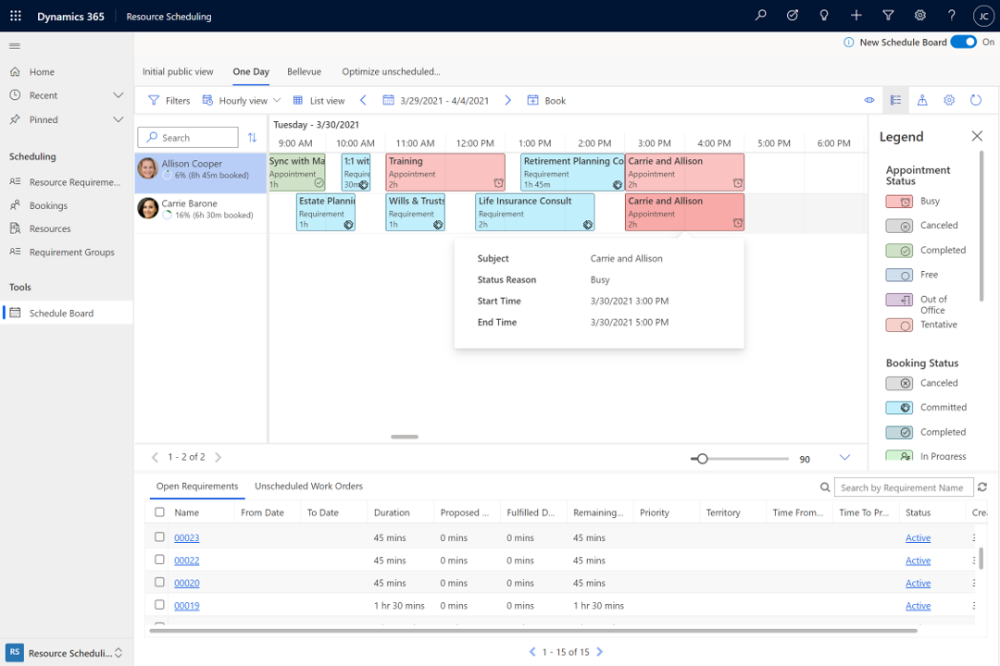
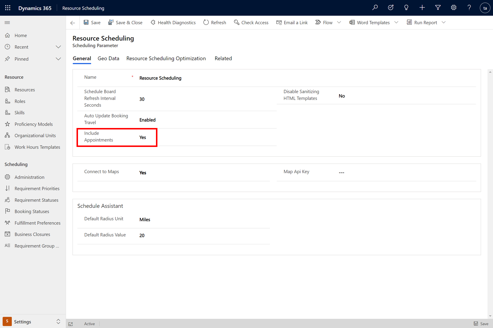
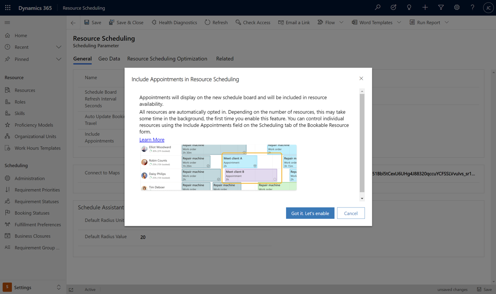
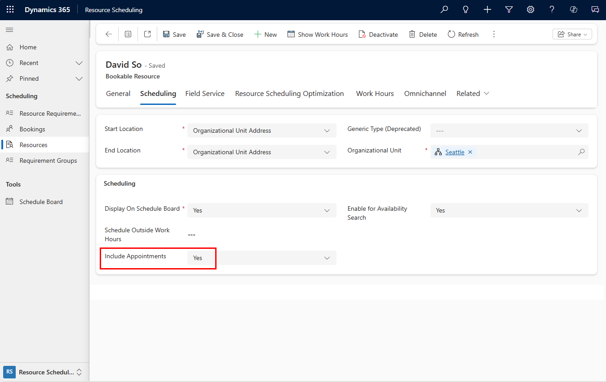
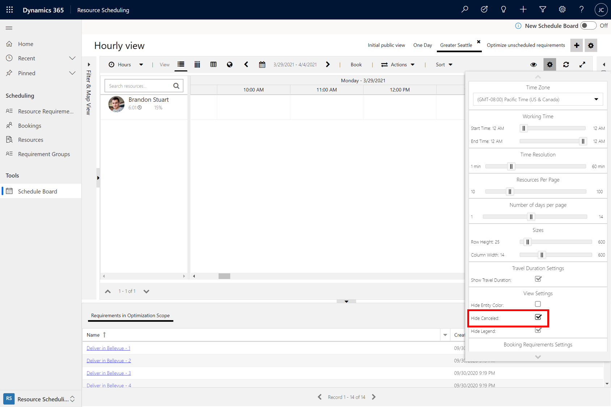
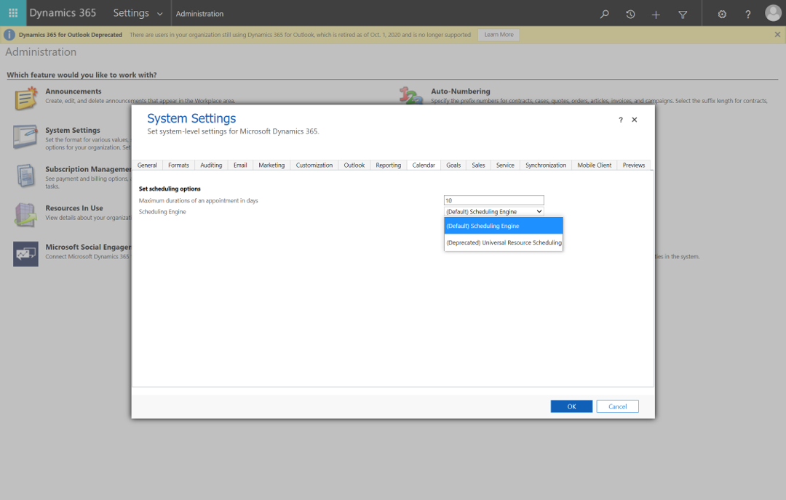

# Appointments included in resource scheduling

Organizations often use appointments in Dynamics 365. Typical examples are a salesperson using appointments to meet with potential customers or a customer service rep creating a service appointment to help a customer with an issue. Other examples are organizations creating appointments because of integrations with other systems.

Dynamics 365 Appointments ([Microsoft Dataverse appointments](https://docs.microsoft.com/en-us/dynamics365/customer-engagement/web-api/appointment)) can be displayed on the Field Service Schedule Board alongside Bookings and can be considered during scheduling to understand if a fronltine worker or bookable resource is available. 

By including appointments on the schedule board and during the scheduling process, dispatchers can have am accurate view of availability in one place and do not have to switch between multiple tools such as Outlook, Service Calendar, and Field Service's new schedule board. This increases schedulers’ productivity and reduces avoidable scheduling errors. Furthermore, admins no longer need to create Bookings based on appointments. 

> [!div class="mx-imgBorder"]
> 

## Prerequisites

- Field Service 8.8.40.x+ (April Wave 1 2021)
- Resource scheduling optimization (RSO) 3.3.0.108+, only if there is a requirement for appointments to be supported in RSO-related scheduling operations

## Step 1: Enable setting to Include Appointments in Resource Scheduling 

#### At the organization level 

1. Go to **Resource Scheduling** > **Settings** > **Administration** > **Scheduling Parameters** and set **Include Appointments** to Yes.

> [!div class="mx-imgBorder"]
> 

2. An informational dialog will subsequently appear. Click the **Got it. Let’s enable button.** Save and close. 

> [!div class="mx-imgBorder"]
> 

All resources are automatically opted in the first time you enable the feature. You may opt out resources using the resource level setting, which is visible only if the organization level setting is set to Yes.  

#### At the resource level 

The resource level setting will only show if the organization level setting is enabled,that is, if **Include Appointments** in **Resource Scheduling** > **Settings** > **Administration** > **Scheduling Parameters** is set to Yes. 
To control individual resources, go to the **Scheduling** tab on the resource form and change the **Include Appointments** field. 

> [!div class="mx-imgBorder"]
> 

## Step 2: Create an appointment

You can create "Dataverse" appointments in Dynamics Apps like [in Customer Service Hub using Activities](https://docs.microsoft.com/dynamics365/customer-service/customer-service-hub-user-guide-basics#understand-activities) or in [Dynamics 365 Sales Professional to manage tasks, appointments, email, or phone calls](https://docs.microsoft.com/dynamics365/sales-professional/manage-activities)

Dataverse appointments can also originate in Outlook, and be synced to Dynamics 365 if [server-side synchronization](https://docs.microsoft.com/en-us/power-platform/admin/server-side-synchronization) has been set up. An Outlook appointment must be manually assigned the special [Tracked to Dynamics 365](https://docs.microsoft.com/en-us/power-platform/admin/use-outlook-category-track-appointments-emails) category so it appears as a Dataverse appointment record.

## Step 3: View appointments on the schedule board

Appointments will be visible on the new schedule board for the Required Attendees and the Owner as long as they are set up as bookable resources. 

> [!div class="mx-imgBorder"]
> 

Here are some key points:
- Appointments will show as read-only mode on the new schedule board and cannot be moved.- Appointments are supported in all views of the new schedule board, namely the hourly, daily, weekly, and monthly views. 
- Hovering on an appointment shows more details in a card. 
- The legend shows the colors for various appointment statuses.

### Customize appointment colors in the schedule board

The new schedule board uses the colors defined in [Dataverse Appointment](https://docs.microsoft.com/en-us/dynamics365/customer-engagement/web-api/appointment) entity  metadata. Customizing the **Color** metadata of each of the **StatusCode** option set values will change the Appointment colors that show on the new schedule board.  

### Hide canceled appointments in the schedule board

If you do not wish to see canceled appointments on the new schedule board, note that the **Hide Canceled** tab-level setting accessible from the old schedule board will hide both canceled bookings and canceled appointments on the new schedule board. 
Go to the old schedule board using the toggle in the top right. Open the tab and select the gear icon in the top right of the schedule board. Check the **Hide Canceled** checkbox, and toggle back to the new schedule board. 

> [!div class="mx-imgBorder"]
> 

## Step 4: Respect appointments when scheduling 

For customers with resource scheduling optimization, appointments will be respected in both non-interactive and interactive optimizations. 

- Non-interactive optimizations are triggered when an optimization schedule is run. 
- Interactive optimizations are triggered from the new schedule board, from **Optimize Schedule** (by right-clicking on a resource), and the **Suggest resources (Preview)**, and **Book resources (Preview)** buttons that appear when a requirement is selected in the bottom grid. 

Appointments with statuses Busy and Completed will be considered as unavailable by scheduling operations. 

For customers without resource scheduling optimization, the Schedule Assistant is planned to consider appointments in a future release. Meanwhile, developers can use the Schedule Assistant APIs for both requirements and requirement groups for a custom web app or a Dynamics 365 portal or a Power Apps canvas app to support appointment scheduling scenarios. 

## Architecture diagram

> [!div class="mx-imgBorder"]
> 

, and be considered in scheduling operations from the new schedule board and resource scheduling optimization.
- Scheduling operations will consider appointments as location-agnostic.</li>
- If an appointment had related bookings those bookings will not be shown and will not be considered in scheduling operations. </li>
- This feature has an organization level setting, which turns on the feature for all resources. You can control individual resources using a resource level setting.</li>

## Deprecation note

Including appointments turns off the deprecated configuration to automatically create bookings when an appointment is created

If your organization was [configured to automatically create bookings when an appointment is created](../shared/urs/schedule-new-entity.md#appointment-scheduling-with-universal-resource-scheduling), the informational dialog will let you know that the system will be turning off this setting, as appointments will be included directly in resource scheduling, without needing related bookings. You should only enable the feature if you do not have custom actions and/or workflows on the related bookings. 

You may further verify that the deprecated configuration has been turned off, by going to **Settings** > **Administration** > **System Settings** > **Calendar** and checking that **Scheduling Engine** is set to **(Default) Scheduling Engine**

> [!div class="mx-imgBorder"]
> 

 Previously the schedule board and scheduling operations used only [bookings](https://docs.microsoft.com/en-us/dynamics365/customer-engagement/web-api/bookableresourcebooking) as a data source. Thus, if you wanted to show appointments on the schedule board or respect them in resource availability, you would first need to create corresponding bookings. This created issues when changes in bookings did not reflect in appointments and vice versa. This April Wave 1 2021 feature adds [Microsoft Dataverse appointments](https://docs.microsoft.com/en-us/dynamics365/customer-engagement/web-api/appointment) as an additional data source for resource scheduling.

Now Microsoft Dataverse appointments are included directly in resource scheduling, so there is no longer any need to have bookings automatically created for appointments and to face the issue of changes in one not reflecting in the other. 

[!INCLUDE[footer-include](../includes/footer-banner.md)]