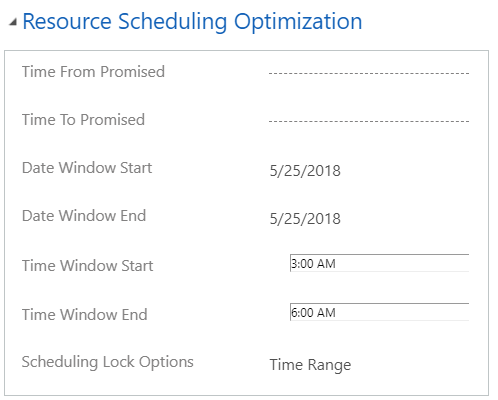

---
title: Booking lock options in resource scheduling optimization for Dynamics 365 Field Service | MicrosoftDocs"
description: Learn about the booking lock options in resource scheduling optimization for Dynamics 365 Field Service.
ms.custom: dyn365-fieldservice
ms.service: dynamics-365-customerservice
ms.date: 01/29/2019
ms.reviewer: krbjoran
ms.topic: article
ms.author: daclar
author: FieldServiceDave
search.app: 
  - D365CE
  - D365FS
--- 

# Understanding the booking lock option in resource scheduling optimization

You can schedule lock options. There are four types:

1. **Time Range**: Resource scheduling optimization is able to move bookings with this lock option within
    certain time ranges (ensure Estimated Arrival Time falls into this time
    range). Resource scheduling optimization is also able to reassign bookings to other resources by
    respecting this time range and the following time-related fields.

   - If **Date Window Start** and **Date Window End** are set as 5/25/2018,
       this indicates you want resource scheduling optimization to reoptimize this booking on 5/25/2018 and
       time of day doesn’t matter.

     > [!div class="mx-imgBorder"]
     > 

   - If **Time Window Start** and **Time Window End** are set as shown in the following
     screenshot, it indicates you want resource scheduling optimization to schedule the booking from 3 AM to 6
     AM and date doesn’t matter.

     > [!div class="mx-imgBorder"]
     > 

   - If **Time From Promised** and **Time To Promised** are set as shown in the following
     screenshot, it indicates you want resource scheduling optimization to schedule a booking between 4 AM and
     10 AM on 5/24/2018 and it has to be within that specific date and specific
     time range.

     > [!div class="mx-imgBorder"]
     > 

   - If **Date Window Start/End** and **Time From/To Promised** are set as shown
     in the following screenshot, it indicates you want RSO to schedule a booking between
     3 AM and 6 AM on 5/25/2018.

     > [!div class="mx-imgBorder"]
     > 

     > [!NOTE]
     > - If these fields conflict, resource scheduling optimization uses **Time From Promised** and **Time To
     Promised** first. Then it either uses one or a combination of the other
     fields.
     > - Resource scheduling optimization will ensure that the estimated arrival time falls into the window
     specified previously. It does not guarantee that the booking’s end time will
     fall within the time window.

2. **Resource**: Resource scheduling optimization is able to move bookings to other times, but has to keep
    the same resource.

3. **Time**: Resource scheduling optimization is able to move bookings to other resources but has to keep
    the same estimated arrival time.

4. **Resource and Time**: Resource scheduling optimization can’t move bookings to any other resource or any
    other time, but it can make some changes. Resource scheduling optimization will preserve the estimated
    arrival time and assigned resource. The booking’s start time and estimated
    travel duration may be changed if resource scheduling optimization schedules a booking in a new location
    before this is a locked booking.

[!INCLUDE[footer-include](../includes/footer-banner.md)]