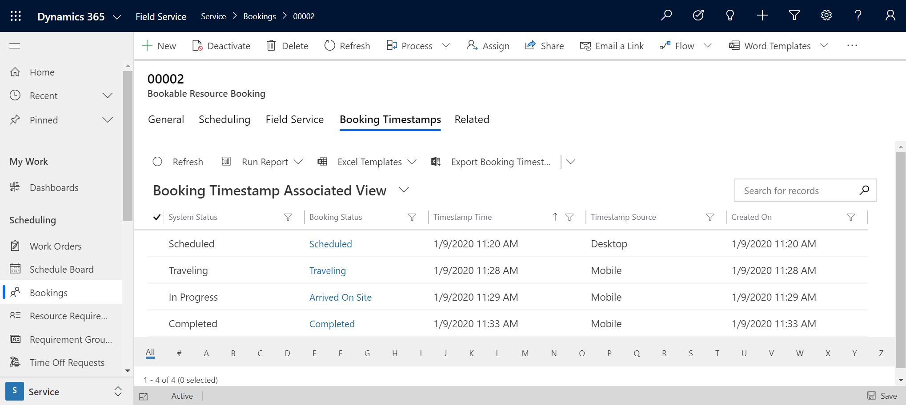
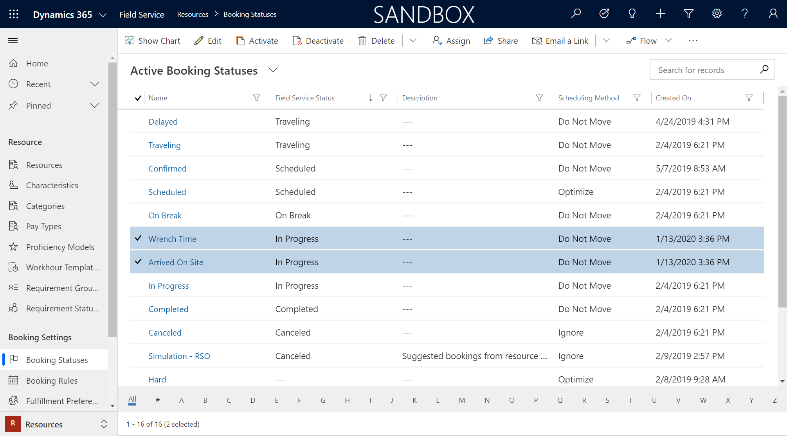
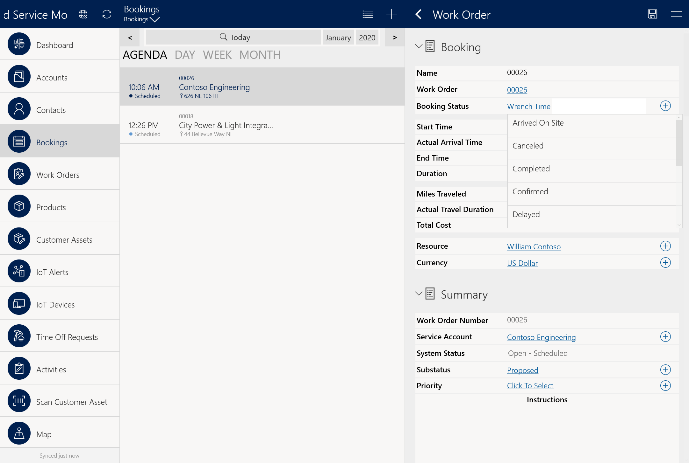
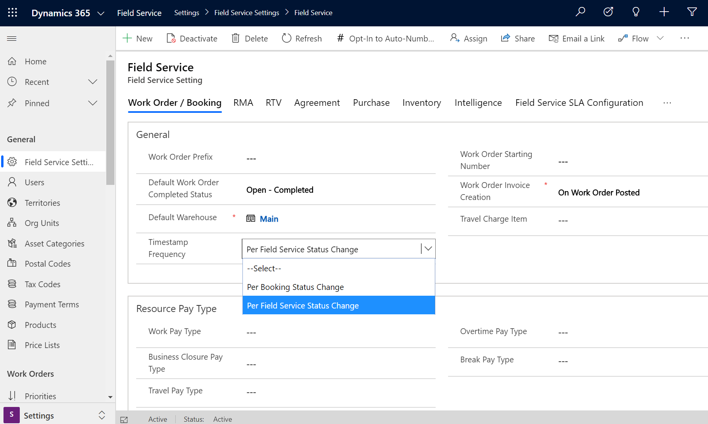
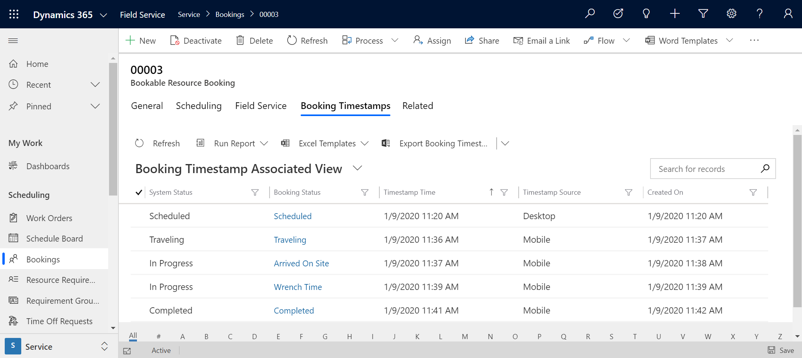

# Booking timestamps in Dynamics 365 Field Service

In Dynamics 365 Field Service, booking timestamps record the date and time that the **Booking Status** changes on a work order. Booking timestamps are useful for: 

- Reporting, in order to see how technicians are spending their time
- Time-keeping, in order to provide a level of detail for invoicing
- Booking journals, in order to see a holistic view of time spent on any given work order

> [!div class="mx-imgBorder"]
> 


In this article, we'll look at how to create, view, and configure booking timestamps. 


## Prerequisites

Make sure you have booking statuses that match your business and reporting needs. Many booking statuses exist by default and correspond with the work order process. These booking statuses have an associated Field Service Status. For example, the out-of-the-box "In progress" booking status has a Field Service Status of "In progress" and this changes the related work order system status to "Open-In Progress" automatically. To understand how booking statuses and work orders effect each other, see the article on [work order lifecycle and statuses](./work-order-status-booking-status.md). 

You can create custom booking statuses that work the same way. For example, the "Arrived On Site" booking status in the following screenshot is a custom creation that is also related to the "In progress" Field Service status.

> [!div class="mx-imgBorder"]
> 


> [!Note]
> Not all booking statuses need to be associated with Field Service Status, nor do they all need to relate to work order bookings.


## Create timestamps

Let's look at an example.

Assume a work order was created and scheduled to a technician.  When the dispatcher scheduled the booking, it was given a booking status of "Scheduled" by default.

Next, the technician sees the booking and work order on their mobile device and updates the booking status to reflect progress by changing it to traveling, in progress, completed, or some other custom booking status.

> [!div class="mx-imgBorder"]
> 


**Timestamps are created to document when the booking status is updated**. 

> [!Note]
> Booking timestamps work when Field Service Mobile is in offline mode too. This means that every time a technician changes their booking status, the timestamp documenting the status change is saved locally to the device, and synced to the server when internet access is resumed. Booking statuses can also be updated in the back office by dispatchers on the booking form or schedule board and timestamps will alos be created in this scenario.


## View timestamps

You can see timestamps by going to the booking (entity name bookableresourcebooking), then **Related** > **Booking Timestamps**.

> [!div class="mx-imgBorder"]
> 


Each booking timestamp details: 

- **Booking Status**: What the status changed to.

- **System Status**: The related Field Service status for work order process, if applicable.

- **Timestamp Time**: The date and time of status change.

- **Timestamp Source**: The device from which the status was changed. If the status was changed from Field Service Mobile, this will read **Mobile**. If the status was changed from the schedule board, it will read **Desktop**. 

> [!Note]
> By default Booking Timestamps are only generated when there is a change in the related Field Service Status which is noted on each booking status, but this is configurable based on the **Timestamp Frequency setting** described below.

To help illustrate, consider that you have three booking statuses: 

1. **Arrived On Site**, associated with the Field Service status **In Progress**
2. **Wrench Time**, associated with the Field Service status **In Progress**
3. **Complete**, associated with the Field Service status **Complete**

When a technician updates their booking Status on Field Service Mobile to **Arrived On Site**, a timestamp will be created. When they arrive onsite and begin work, they mark the booking status as **Wrench Time**. By default in Field Service, a new timestamp will *not* be created, as the associated Field Service status is still **In Progress**. When the booking status is updated to **Complete**, another timestamp will be created, as the associated Field Service status is different. 


## Timestamp frequency setting

The **Timestamp Frequency** setting allows you to choose when booking timestamps are created.

Go to **Field Service** > **Settings** > **Field Service Settings**

> [!div class="mx-imgBorder"]
> 

In the **Timestamp Frequency** field, choose one of the following options:

 - **Per Field Service Status Change** to create timestamps only when a booking status change results in a field service status change. This is the default setting as seen in the previous scenario.
- **Per Booking Status Change** to create timestamps with every booking status change.

The main difference is how detailed an organization wants to be for time entry, reporting, and integration purposes.


### Per Field Service Status Change

Using our example with three booking statuses each with a related Field Service status, if **Timestamp Frequency** is set to *Per Field Service Status Change* the related booking timestamps will be created as seen the following screenshot.

> [!div class="mx-imgBorder"]
> 

Only the timestamp for "Arrived on site" is generated because timestamps are created when there's a change in the Field Service status of a booking status, and in this example both are considered "In Progress."

### Per Booking Status Change

If Timestamp Frequency setting is set to *Per Booking Status Change* the related booking timestamps will be created as seen the image below.

> [!div class="mx-imgBorder"]
> 


With the **Per Booking Status** setting, a timestamp is created for all booking status changes regardless if it results in a field service status change.

In our example, this means both "Arrived on site" and "Wrench time" are recorded. The main difference is how detailed an organization wants to be for reporting and integration purposes.

## Booking journals

When a work order’s bookable resource booking status is *Completed*, the booking journals are created as per the booking timestamps. Booking timestamps record the date and time of all booking status changes on work order. Booking timestamps are used to calculate booking journals, which calculate total travel time and working time for a specific booking. They can also be used to automatically generate time entries, if the Field Service setting’s **Time Entry Generation Strategy** is set to *Auto Generate from Booking Timestamps*. 

Bookings that have been canceled will not have any booking journal records. 

There are a few types of booking journals:  

- **Travel**: Created for the duration when the resource is traveling to the site. 
- **Working Hours**: Created for the duration when the booking is in progress and the duration lies within the work hours as per the resource’s work hours calendar. 
- **Break**: Created for the duration when the resource is on break. 
- **Overtime**: Created for the duration when the booking is in progress and the duration lies outside the work hours as per the resource’s calendar. 
- **Business Closure**: Created for the duration when the company is closed. 

To generate accurate booking journals, depending on the assigned resource’s work hours calendar, Field Service determines if the working duration of the resource is within working hours or not. If the duration of the work does not fall within the normal working hours for the resource, there is an additional step to determining if this is overtime or during a business closure, for which different rates can be provided for calculation. 

For example, for a resource working on a booking from 8 A.M. to 3 P.M., the following are the different time stamps created when resource changes the booking status:  

|         Booking status  |            Time stamp        |
|-------------------------|------------------------------|
|         Scheduled       |            8:00 A.M.         |
|         Traveling      |            9:00 A.M.         |
|         In Progress     |            10.30 A.M.        |
|         On Break        |            12:00 P.M         |
|         In Progress     |            1:00 P.M.         |
|         Completed       |            4:00 P.M.         |

Based on these proposed time stamps, the corresponding booking journals would be created: 

|         Start time                                                    |            Duration     |            Journal type         |
|-----------------------------------------------------------------------|-------------------------|---------------------------------|
|         Travel (9 A.M. - 10:30 A.M.)                                  |            90 minutes   |            Travel               |
|         In Progress (10:30 A.M. - 12 P.M.)                            |            90 minutes   |            Working Hours        |
|         On Break (12 P.M. - 1:00 P.M.)                                |            60 minutes   |            Break                |
|         In Progress (1:00 P.M. - 3:00 P.M.)                           |            120 minutes  |            Working Hours        |
|         Exceeded working hours of resource (3:00 P.M. - 4:00 P.M.)    |            60 minutes   |            Overtime             |

Depending on the above journals, the total billable duration in bookable resource booking is the sum of total duration in progress and total break duration.  

### View booking journals 

You can see the journals created by using advanced find or by going to the booking (record type name ```bookableresourcebooking```), then **Related** > **Booking Journals**. 

>[!Note]
> Resources must always update the booking statuses as per the status of the assigned work. Any delay in marking the booking as “completed” will cause difference in the billing duration and hence to the billing amount. 

## Additional notes 

- Booking timestamps are used to calculate **Booking Journals** that calculate total travel time and working time for a specific booking. From the booking, go to **Related** > **Booking Journals** to see them. The **Timestamp Frequency** setting _does not_ affect how booking journals are created or calculated.


[!INCLUDE[footer-include](../includes/footer-banner.md)]