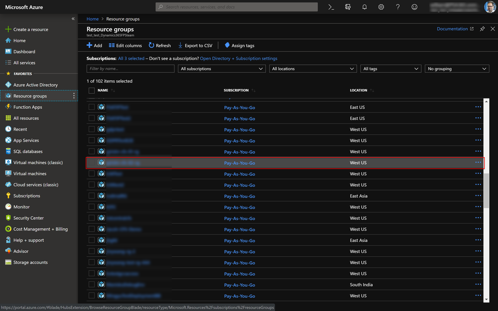
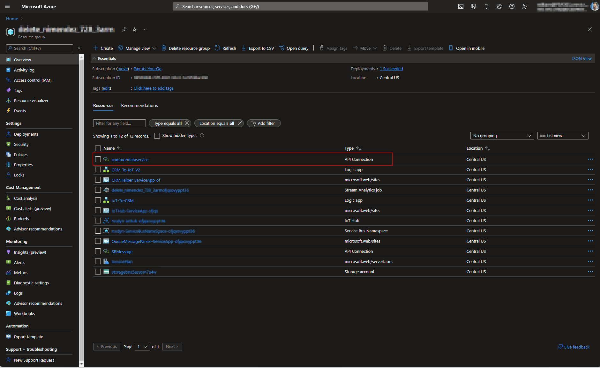
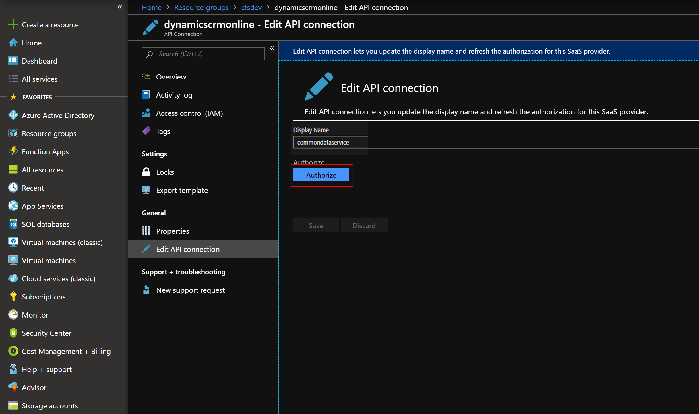

# Authorize API connection between Dynamics 365 and AzureIoT

In order to begin using Connected Field Service (CFS) with IoTHub, you need to authorize **CRM API Managament Access**, which is the final step when deploying from [https://cfsdeployment.crm.dynamics.com](https://cfsdeployment.crm.dynamics.com/). This allows data and actions to be passed between Azure IoTHub and Dynamics 365. More specifically, it allows LogicApps to read and write Dynamics 365 data bi-directionally. 

Without completing this step, you will not be able to: 

1. Send IotAlerts from IoTHub to Dynamics 365
2. Add a device in Dynamics 365 and register it in IoTHub

## Prerequisites
- Azure account and subscription
- Dynamics 365 Field Service 
- CFS with IoTHub deployed though [https://cfsdeployment.crm.dynamics.com](https://cfsdeployment.crm.dynamics.com/)

## Instructions

Sign into your Azure account, and then go to the [Azure portal](https://portal.azure.com). 

From there, go to **Resource Groups** and find the resource group you recently deployed IoTHub to. See the following screenshot for reference.

> [!div class="mx-imgBorder"]
> 

One such resource will be an API Connection type to Dynamics CRM. Select and edit this resource.

> [!div class="mx-imgBorder"]
> 

Finally, select **Authorize**, **Save**, and use your Dynamics 365 credentials that you use to sign into your Connected Field Service environment, which may be different than your Azure credentials to the Azure portal.

> [!div class="mx-imgBorder"]
> 

Congratulations! You are now ready to pass data between Azure IoTHub and Dynamics 365 to use Connected Field Service.

### See also

[Azure subscription prerequisites for CFS with IoTHub](cfs-azure-subscription.md)
