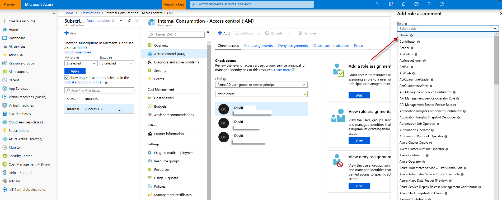
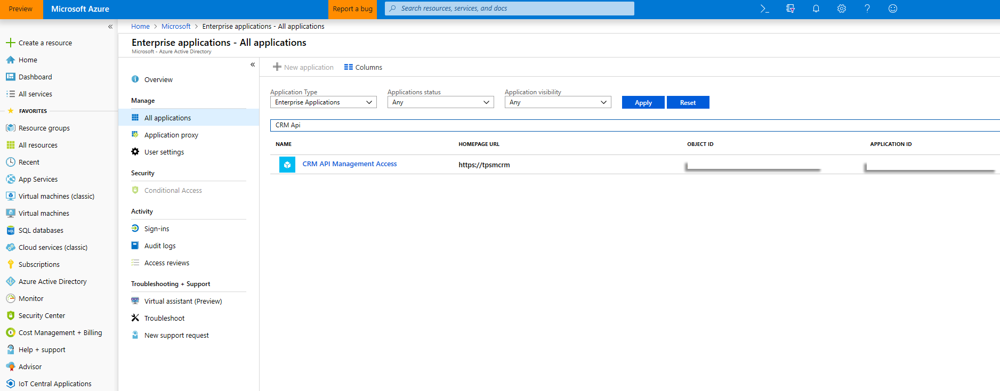

# Azure subscription prerequisites for Connected Field Service with IoT Hub

When deploying and administering Connected Field Service with IoT Hub, there are a few considerations and prerequisites for your Azure subscription. 

## Prerequisites 

1.  Connected Field Service with IoT Hub can only be deployed and administered to one Azure tenant, which should be the home (first) Azure tenant tied to your credentials.

2. In order to deploy and administer IoT Hub, you must have one of the following Azure security roles:

- Owner in role assignments (see the following screenshot)
- One of the following administrator roles:
  - Co-administrator
  - Service administrator
  - Account administrator

> [!div class="mx-imgBorder"]
> 

3. You will only see subscriptions that are tied to your login's **primary active directory**. For example, david@contoso.com will only see subscriptions from the contoso.com directory. If jason@fabrikam.com invites David into their fabrikam.onmicrosoft.com subscription, David will not be able to use the fabrikam subscription on the deployment app.

4. Only organizational Azure accounts can be used to deploy Connected Field Service with IoTHub; personal accounts such as Outlook or Gmail cannot be used.

5. Your user must have permission to use the Dynamics API within the Azure active directory tenant.

> [!div class="mx-imgBorder"]
> 

[!INCLUDE[footer-include](../includes/footer-banner.md)]