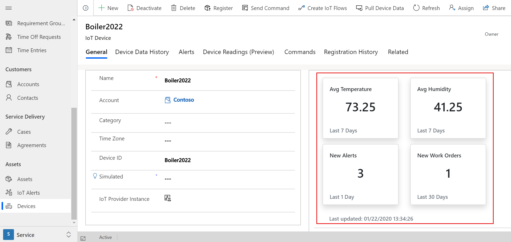
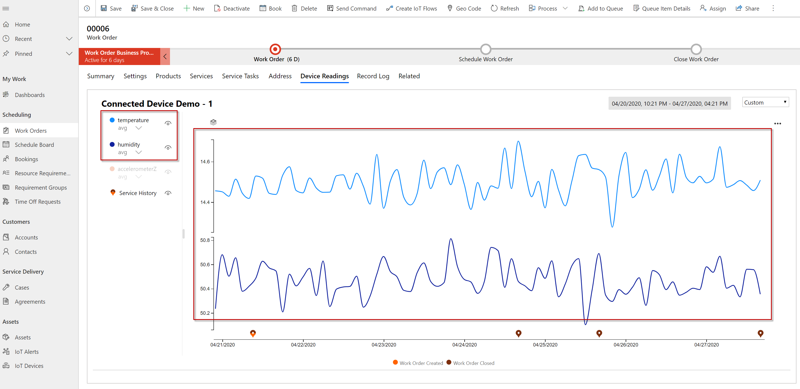

# Configure IoT provider actions

After setting up an IoT provider, you specify a set of actions associated with that provider. [Custom actions](/power-apps/developer/data-platform/custom-actions) are messages that are used to trigger specific actions or processes within a solution, allowing organizations to automate various aspects of their Connected Field Service operations. By default, Connected Field Services provides five actions surrounding the data that is captured from your organization's IoT devices.  

## Pull Device Data action

The [**Pull Device Data** action fetches the latest device data from the IoT provider](cfs-pull-device-data.md) and appears in the **Device Data History** tab with updated properties of an IoT device. This action pulls data for a single device or a collection of devices.

The *Pull Devices Data* action requires an input of an *EntityCollection*. The following table displays the parameters for the *EntityCollection* for this action.

| Input parameters  | Type   | Details                                                                                                                                                                             |
|---------------------|--------|-----------------------|
| EntityCollection          | EntityCollection |                                                          |

| Entity collection properties  | Type   | Details |
|-------------------|--------|-------------------------------------------------------------|
| msdyn_iotdeviceid | string | Identifier of the device (msdyn_iotdevice) within Connected Field Service. A GUID that needs to be converted to string. For example: “6a5457d1-9373-ea11-a811-000d3af70aa4” |
| msdyn_name        | string | Name of the device.                                                                                                                                        |
| @odata.type    | string | OData type of the entity. For example: "Microsoft.Dynamics.CRM." + entityLogicalName"       |

Sample input:

```json

{
	"EntityCollection":[
	    {
		"msdyn_iotdeviceid":"B25B5E21-326E-4C36-9296-C195286DGEC9",
		"msdyn_name":" HVAC 32443",
		"@odata.type":"Microsoft.Dynamics.CRM.msdyn_iotdevice"
	    },
	    {
		"msdyn_iotdeviceid":"B25B5E21-326E-4C36-9296-C195286DGEE9",
		"msdyn_name":" HVAC 92232",
		"@odata.type":"Microsoft.Dynamics.CRM.msdyn_iotdevice"
	    }
	]
}

```

| Output parameters  | Type   | Details                                                                                                                                                                             |
|---------------------|--------|-------------------------------------------------------------------------------------------------------------------------------------------------------------------------------------|
|PullDeviceDataResultsJSON         | String | 

Here are the output parameters for this action. The following parameters are returned in serialized JSON format as part of the action results.

| JSON properties        | Type     | Details                                                                                                                                                        |
|----------------------------|----------|----------------------------------------------------------------------------------------------------------------------------------------------------------------|
| ID                         | string   | Identifier of the device (msdyn_iotdevice) within Connected Field Service. A GUID that needs to be converted to string. For example: “6a5457d1-9373-ea11-a811-000d3af70aa4”                                                                                                                              |
| ConnectionState            | bool   | Indicates whether the device is Disconnected (false) or Connected (true).                                                                                               |
| ConnectionStateUpdatedTime | datetime | Updated time of the connection state from the IoT provider.                                                                                                     |
| DeviceReportedProperties   | string   | Various reported properties of the devices formatted in a JSON string. For example: </br> {"temperature":35.6366305680316, </br> "humidity":18.3333366666} |
| LastActivityTime           | datetime | Last time of reported activity of the device.                                                                                                                  |

Sample output:

```json
{
	"PullDeviceDataResultsJSON":[
	   {
		"Id":"B25B5E21-326E-4C36-9296-C195286DGEC9",
		"ConnectionState":true,
		"ConnectionStateUpdatedTime":"2019-08-2911:00:00",
		"DeviceReportedProperties":{
			"temperature":65.6366305680316,
			"humidity":21.3333366666
		  },
		"LastActivityTime": "2019-08-2011:00:00"
	  },
	  {
		"Id":"B25B5E21-326E-4C36-9296-C195286DGEE9",
		"ConnectionState":true,
		"ConnectionStateUpdatedTime":"2019-08-2911:00:00",
		"DeviceReportedProperties":{
			"temperature":62.8366305680316,
			"humidity":19.5333366666
		},
		"LastActivityTime": "2019-08-2011:00:00"
	   }
	]
}
```

The result of pulling device data appears in the **Device Data History** tab and updates the property information of the device.

## Register Device action

The *Register Device* action registers a device that is present in Connected Field Service with the IoT provider. This action is commonly used when a technician swaps out an asset or one of its device components and needs the new device to be registered with the IoT provider. The action could be used for registering a single device or a collection of devices.

Here are the input parameters for this action. Since this action supports multiple devices, the parameters need to be sent as *EntityCollection*.

| Input parameters  | Type   | Details                                                                                                                                                                             |
|---------------------|--------|-----------------------|
| EntityCollection          | EntityCollection |        

Here are the input parameters for this action. Since this action supports multiple devices, the parameters need to be sent as EntityCollection.

| Entity collection properties | 	Type  | Details | 
|--|--| -- |--| 
| msdyn_iotdeviceid	| string	| Identifier of the device (msdyn_iotdevice) within Connected Field Service. A GUID that needs to be converted to string. For example: “6a5457d1-9373-ea11-a811-000d3af70aa4”
| msdyn_name	| string	| Name of the device.| 
| @odata.type	| 	string	| OData type of the entity </br>For example: "Microsoft.Dynamics.CRM." + entityLogicalName | 

Sample input:

```json
{
  "EntityCollection": [
    {
      "msdyn_iotdeviceid": "5754578D-1F9A-4720-BC21-3C3042C05B2F",
      "msdyn_name": "Coffee maker 1",
      "@odata.type": "Microsoft.Dynamics.CRM.msdyn_iotdevice"
    },
    {
      "msdyn_iotdeviceid": "5754578D-1F9A-4720-BC21-3C3042C06C5F",
      "msdyn_name": "Coffee maker 2",
      "@odata.type": "Microsoft.Dynamics.CRM.msdyn_iotdevice"
    }
  ]
}
```

Here are the output parameters for this action. The below parameters are returned in serialized JSON format as part of the action results.

| Output parameters  | Type   | Details                                                                                                                                                                             |
|---------------------|--------|-------------------------------------------------------------------------------------------------------------------------------------------------------------------------------------|
|RegistrationResultsJSON         | String | 

| JSON properties  | Type      | Details                                                                                                                                                                                                                                                                                                                                                                                                    |
|----------------------|-----------|------------------------------------------------------------------------------------------------------------------------------------------------------------------------------------------------------------------------------------------------------------------------------------------------------------------------------------------------------------------------------------------------------------|
| ID           | string    | Identifier of the device in Connected Field Service.                                                                                                                                                                                                                                                                                                                                                                           |
| RegistrationStatus   | OptionSetValue | This parameter identifies the status of the registration from the IoT provider back to Connected Field Service. The values and their labels for this option set are: </br> - 192350000: Unknown </br> - 192350001: Unregistered </br> - 192350002: In progress </br> - 192350003: Registered </br> - 192350004: Error </br> Note: OptionSet is a list of defined options with label-value mapping like a drop-down box control.  |
| DeviceId    | string    | Identifier of the device within the IoT provider system.                                                                                                                                                                                                                                                                                             |
| Message  | string    | Any detailed message regarding the registration to the Connected Field Service user. |

Sample output:

```json
{
   "RegistrationResultsJSON":[
      {
         "Id":"5754578D-1F9A-4720-BC21-3C3042C05B2F",
         "RegistrationStatus":{"Value":192350003},
         "DeviceId":"DeviceIdFromThirdPartyOrUserDefined",
         "Message":"Registration info/warning/error message"   
      },
      {
         "Id":"5754578D-1F9A-4720-BC21-3C3042C06C5F",
         "RegistrationStatus":{"Value":192350003},
         "DeviceId":"DeviceIdFromThirdPartyOrUserDefined",
         "Message":"Registration info/warning/error message"   
      }   
  ]
}
```

Once you've successfully registered a device, you can see it in the **Registration History** tab of the *IoT Device* record.

## Aggregated device readings action

This action retrieves the aggregated readings (such as average, min, and max) for devices from the IoT provider, so users can get a quick snapshot of the condition of the device within Connected Field Service through summary tiles. Aggregate device readings are strings.

> [!div class="mx-imgBorder"]
> 

Here are the input parameters for this action.

| Input parameters  | Type   | Details                                                                                                                                                                                                                                                                                                                                                                                                                                                                                                |
|---------------------|--------|--------------------------------------------------------------------------------------------------------------------------------------------------------------------------------------------------------------------------------------------------------------------------------------------------------------------------------------------------------------------------------------------------------------------------------------------------------------------------------------------------------|
| deviceId            | string | Identifier of the device (msdyn_iotdevice) within Connected Field Service. A GUID that needs to be converted to string. For example:   “6a5457d1-9373-ea11-a811-000d3af70aa4”                                                                                                                                                                                                                                                                                                                         |
| measures            | string | JSON formatted measures config list. See the following code block for an example. |

Sample input:

```json
[
    {
        "Measure":"Humidity",
        "Aggregate":"Min",
        "TimeRangeType":"Days",
        "TimeRangeValue":7
    },
    {
        "Measure":"Temperature",
        "Aggregate":"Avg",
        "TimeRangeType":"Days",
        "TimeRangeValue":14
    }
]
```

Here are the output parameters for this action. The following parameters are returned in serialized JSON format as part of the action results.

| Output   parameters  | Type   | Details                                                                                                                                                                                                                                                                                                                          |
|----------------------|--------|----------------------------------------------------------------------------------------------------------------------------------------------------------------------------------------------------------------------------------------------------------------------------------------------------------------------------------|
| measuresOutput       | string | JSON formatted measures output collection, where every item additionally contains the property of *value*. See the following code block for an example. |

Sample output:

```json

[
    {
        "Name":"Humidity",
        "Aggregate":"Min",
        "Unit":"F",
        "TimeRangeValue":7,
        "TimeRangeType":"Days",
        "Position":1,
        "Value":"39.13334"
    },
    {
        "Name":"Temperature",
        "Aggregate":"Avg",
        "Unit":"F",
        "TimeRangeValue":14,
        "TimeRangeType":"Days",
        "Position":2,
        "Value":"65.13334"
    }
]
```

> [!NOTE]
> The aggregated device readings feature works based on the device data history entity if you have not implemented the aggregated device readings action.

## Query Device Readings action

The Query Device Readings retrieves the historical device data from the IoT provider to display in a time series format. Query device readings require DateTime and string data types.

> [!div class="mx-imgBorder"]
> 

Here are the input parameters for this action.

| Input parameters  | Type   | Details                                                                                                                                                                                                                                                                             |
|---------------------|--------|-------------------------------------------------------------------------------------------------------------------------------------------------------------------------------------------------------------------------------------------------------------------------------------|
| From         | DateTime | Starting time of the reading (measurement) point within the chart in ISO format. For example: “2020-04-10T13:51:55.781Z”                                                                                                                                                          |
| To         | DateTime | Ending time of the reading (measurement) point within the chart in ISO format. For example: “2020-04-10T14:51:55.781Z”                                                                                                                                                            |
| IoTDeviceId         | string | Identifier of the device (msdyn_iotdevice) within Connected Field Service. A GUID that needs to be converted to string. For example:   “6a5457d1-9373-ea11-a811-000d3af70aa4”                                                                                                  |
| Interval            | string | Interval size of the plotting   point specified in ISO-8601 duration format. For example: 1 minute is "PT1M", 1 millisecond is "PT0.001S".  </br>**Note**: All intervals are the same size. One month is always converted to 30 days, and one year is always 365 days. |

Sample input:

```json
{
    "From":"2023-04-01T18:05:37.661Z", 

    "To":"2023-05-31T18:05:37.661Z", 

    "IotDeviceId":"50fce36f-9e3e-ed11-bba3-000d3a8b1de9", 

    "Interval":"P1D"
} 
```

Here are the output parameters for this action. The below parameters are returned in serialized JSON format as part of the action results.

| Output parameters  | Type   | Details                                                                                                                                                                             |
|---------------------|--------|-------------------------------------------------------------------------------------------------------------------------------------------------------------------------------------|
|AggregatedDeviceReadings         | String |

Sample output:

```json
   
{
  "HVAC Unit 123": {
    "Temperature": {
      "2017-04-01T06:00:00Z": {
        "min": -29,
        "max": 62.59,
        "avg": 16.89,
        "sum": 4054.14,
        "count": 240
      },
      "2017-04-01T08:00:00Z": {
        "min": -29,
        "max": 62.59,
        "avg": 16.89,
        "sum": 4054.14,
        "count": 480
      }
    },
    "Humidity": {
      "2017-04-01T06:00:00Z": {
        "min": 10,
        "max": 48.3,
        "avg": 29.25,
        "sum": 7020.62,
        "count": 240
      },
      "2017-04-01T08:00:00Z": {
        "min": 10,
        "max": 48.3,
        "avg": 29.25,
        "sum": 7020.62,
        "count": 480
      }
    }
  }
}    
```

## Device readings – events

The device readings control in Connected Field Service also allows IoT providers to plot discrete events from service history, such as the creation and closure of work orders, scheduled start and end of bookings, and much more. For example, the following screenshot shows the out-of-the-box work order events as "pins" at the bottom of the chart. You can include any custom entities such as the last time you performed an asset upgrade.

> [!div class="mx-imgBorder"]
> 

> [!NOTE]
> You don't need to create a new action. Register a custom plug-in on the *msdyn_IoTGetDeviceEvents* action, like plug-ins for create events.

Here are the input parameters for the msdyn_IoTGetDeviceEvents action.

| Input parameters  | Type   | Details                                                                                                                                                                             |
|---------------------|--------|-------------------------------------------------------------------------------------------------------------------------------------------------------------------------------------|
| From                | DateTime | Starting time of the reading (measurement) point within the chart in ISO format. For example: “2020-04-10T13:51:55.781Z”                                                          |
| To                  | DateTime | Ending time of the reading (measurement) point within the chart in ISO format. For example: “2020-04-10T14:51:55.781Z”                                                       |
| IoTDeviceId         | string | Identifier of the device (msdyn_iotdevice) within Connected Field Service. A GUID that needs to be converted to string. For example: “6a5457d1-9373-ea11-a811-000d3af70aa4” |

Sample input:

```json
{ 
    "IotDeviceId": "50fce36f-9e3e-ed11-bba3-000d3a8b1de9", 
    "From": "2023-06-12T18:57:54.864Z", 
    "To": "2023-06-12T19:57:54.864Z" 
} 
```

Here are the output parameters for this action. The below parameters are returned in serialized JSON format as part of the action results.

| Output parameters  | Type   | Details                                                                                                                                                                             |
|---------------------|--------|-------------------------------------------------------------------------------------------------------------------------------------------------------------------------------------|
|EventsData         | String |

Here are the output parameters for this event.


| JSON properties  | Type   | Details                                                                                                                                                                                |
|----------------------|--------|----------------------------------------------------------------------------------------------------------------------------------------------------------------------------------------|
| EventsName        | string | Short description for the category of events. This description is displayed in the device readings control allowing users to enable and disable events under that event name. For example, you can categorize events into Asset events and Service events. Users see two rows of pins on the device readings chart and can enable and disable either row.             |
| Timestamp            | string | Discrete timestamp of the event formatted as a string in ISO format. It's the x-axis timestamp for the event pin. For example: "2019-08-07T19:14:53Z"                      |
| Color                | string | The color code of the event as a hex-code string for the pin for this event within the chart. For example: "#FF6300"                                        |
| Description          | string | Short description for the event. This description is displayed when the user hovers over the pin or when the user selects the pin to see the details dialog.                |
| ID                   | string | The ID value of the event can be a name or user-friendly value. For example, the work order number, booking confirmation code, and so on. |
| Entity               | string | Dataverse entity name related to the event. For example: "msdyn_workorder"                                                                                                            |
| URL                  | string | URL for navigating to details of the event. For example, a link to the work order form for more details on the work order. If you don't pass in a URL, but do pass in an entity and GUID, a hyperlink is automatically generated that lets users open the record.                            |
| GUID                 | string | GUID (converted as a string) that indicates the identifier of the entity record within Dataverse.                                                                                          |

Sample output:

```json
{
  "Service History": {
    "2019-08-07T19:14:53Z": {
      "color": "#FF6300",
      "description": "Work Order Created",
      "id": "00001",
      "entity": "msdyn_workorder",
      "url": "",
      "guid": "952a7592-8818-ea11-a811-000d3a5466d7"
    },
    "2019-08-08T19:14:53Z": {
      "color": "#ECC5AC",
      "description": "Work Order Created",
      "id": "00002",
      "entity": "msdyn_workorder",
      "url": "",
      "guid": "952a7592-8818-ea11-a811-000d3a5466d9"
    },
    "2019-09-21T09:34:53Z": {
      "color": "#ECC5AC",
      "description": "Case Created",
      "id": "000121",
      "entity": "msdyn_incident",
      "url": "",
      "guid": "952a7592-8818-ea11-a811-000d3a5466d0"
    }
  },
  "Asset History": {
    "2019-08-07T19:14:53Z": {
      "color": "#FF6400",
      "description": "Asset Model Upgraded",
      "id": "001223",
      "entity": "new_assetupgraded",
      "url": "",
      "guid": "952a7592-8818-ea11-a811-000d3a5466d7"
    }
  }
}
```

## Next steps

- [Send commands in Connected Field Service](cfs-commands.md)
- [IoT provider for custom IoT solutions](cfs-custom-iot-provider.md)
- [IoT integration with Connected Field Service](cfs-connect-data-overview.md)

[!INCLUDE[footer-include](../includes/footer-banner.md)]
