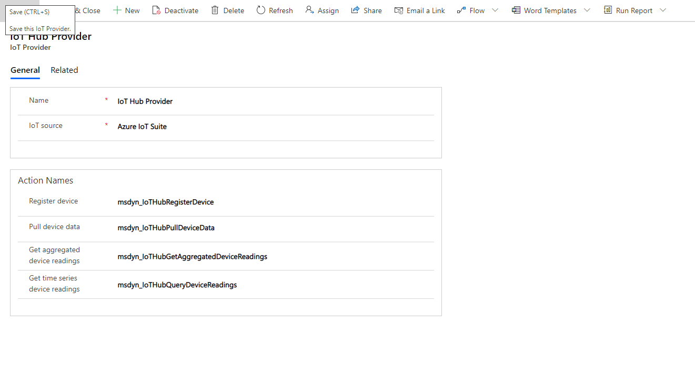
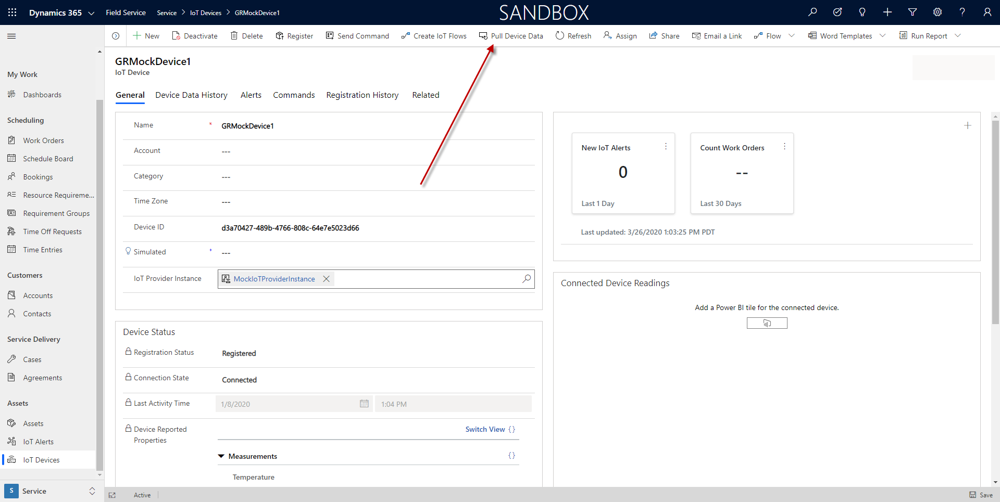
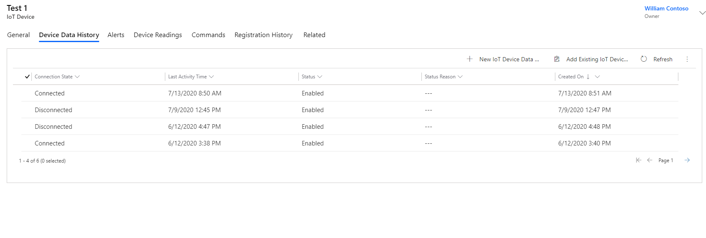
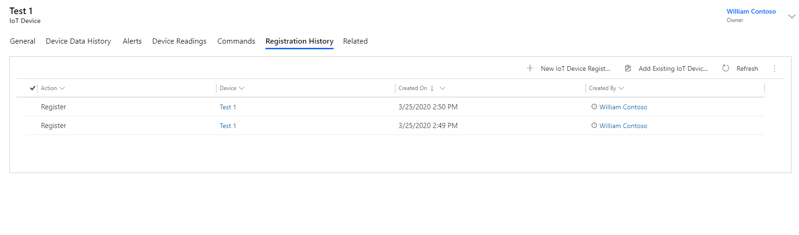

# IoT provider for custom IoT solutions

Dynamics 365 Field Service allows seamless integration with IoT-enabled devices from any IoT vendor through the *IoT provider* feature. The IoT provider allows the integration of IoT alerts from various vendors into a unified list, regardless of their origin. When interacting with an IoT device, Field Service identifies the device's provider and routes the command to the corresponding IoT system.

In Field Service, the [out-of-box deployment experience integrates with Azure IoT Hub](installation-setup-iothub.md). However, custom IoT providers let developers, partners, and independent software vendors build on this framework to include their custom IoT solutions. These custom IoT providers can then be published as solutions in the [Microsoft commercial marketplace](https://appsource.microsoft.com/) for easier distribution and usage by customers.

## Prerequisites

- Development experience in model-driven apps that connect to Dynamics 365 and Microsoft Dataverse. For more information, see the [overview on model-driven apps](/powerapps/developer/model-driven-apps/overview).
- Programming experience with C#, .NET, and Visual Studio.
- Knowledge of REST/OData API.

## Architecture and entity model

In this article, we focus on the integration of IoT solutions.

There are several methods to integrate external IoT services with Field Service. However, they all must fit the Field Service IoT provider entity model. The following sections discuss the entities in detail.

// Diagram showing the architecture and entity model.

### IoT provider entity

This entity identifies the IoT provider and its supported actions.

// Screenshot?

Required information:

- **Entity name**
- **IoT source**
  - Other
  - IoT Suite
  - IoT Central
- **Action names**. For more information about actions, see [Configure IoT provider actions](cfs-configure-actions.md).

### IoT provider instance entity

As shown in the diagram, the IoT provider instance is the organization's instance of the provider. For example, if your Connected Field Service organization is connected to two different Azure IoT Hubs, you have two IoT provider instance records, one for each of your IoT Hub instances. You can see the list of IoT provider instances within your Field Service app by going to **Settings** > **IoT** > **Providers**.


// Screenshot?

Required information:

- **Provider Instance ID**. Indicates the identifier within your source IoT system.
- **URL**: A URL that could be used in your provider code or the user experience. For example, an API endpoint or a link to the Azure resource group of the deployment.

### IoT device

The IoT device entity maps each device to an IoT provider instance.

// Screenshot

Required information:

- **Name**.
- **Account**. Customer account in Field Service that the IoT device maps to.
- **Category**. The device category that the IoT device belongs to.
- **Time Zone**. The IoT device time zone.
- **Device ID**. The IoT device ID used to register with the IoT provider.
- **Simulated**. Used for development and testing purposes.
- **IoT Provider Instance**. The IoT provider instance that the IoT device is assigned to.

## Connection methods and development tools

Connection methods for custom solutions come with pros and cons. The following table lists common connection methods.

|       Method    |     Advantages    |     Risks    |
|---|---|---|
|     [Dataverse APIs](/power-apps/developer/data-platform/overview)          |   Allows direct communication between Connected Field Service and external services. It's a robust protocol for building software applications.   |   External services need to have capability to integrate with APIs. This method requires strong understanding of Connected Field Service API capabilities.   |
|     Webhooks     |   Sends real-time updates to an external service when specific actions are taken in Connected Field Service.    |   External service needs to be able to receive and process webhook messages.   |
|     Connectors     |   Provides seamless integration experience, acts as a bridge between Connected Field Service and the external service.   |   Requires more robust technical knowledge and development resources.   |
|     Custom code     |   Highly tailored and effective integration.     |   Requires high level of technical expertise, may involve more risk than other methods.   |

Commonly used development tools to build custom solutions for Connected Field Service:

- **Power Apps**, a low-code development platform provided by Microsoft that allows developers to create custom business applications quickly and easily. With Power Apps, developers can build custom solutions for Connected Field Service without the need for extensive coding skills.

- **Azure Functions**, a serverless computing service provided by Microsoft that allows developers to run code on-demand without the need for dedicated servers. Azure Functions can be used to create custom integrations and automate tasks in Connected Field Service.

- **.NET Framework**, a software development framework provided by Microsoft that supports building and running applications on Windows. It can be used to build custom applications and integrations for Connected Field Service.

- **JavaScript**, a widely used programming language that can be used to create custom applications and integrations for Connected Field Service. It's often used with other tools and frameworks, such as Node.js and React.

- **REST APIs** provide a standardized way for applications to communicate with each other over the web. Connected Field Service provides many REST APIs that can be used to integrate with external services and build custom solutions.

- **Visual Studio**, a popular integrated development environment (IDE) provided by Microsoft that can be used to build custom applications and integrations for Connected Field Service. It supports a wide range of programming languages and frameworks, including .NET, JavaScript, and Python.


## Supported actions

When you create a custom IoT provider, you specify a set of actions associated with that provider. Actions in Dynamics 365 are custom code that runs when you invoke them. For more information, see [this article on custom actions in Dynamics 365](/powerapps/developer/common-data-service/custom-actions).

For example, if you specify ```msdyn_MockProviderPullDeviceDataAction``` as the action for "Pull device data" in your provider, Connected Field Service will look for an action with the name ```msdyn_MockProviderPullDeviceDataAction``` and run that action's code when a user selects the **Pull device data** button on the asset or device form or views in Connected Field Service.

> [!div class="mx-imgBorder"]
> 

When a user invokes any of these actions, Connected Field Service will check which IoT provider is associated to the device, and call the custom action on the provider record. It's important that these custom actions use the precise input and output parameters expressed below.

In your code for the action, be sure to connect to your underlying IoT system API or data source to retrieve the resulting output from the IoT devices.

> [!Note]
> Only synchronous actions are supported with custom IoT providers.

### Pull device data action

This action is to get the latest device data from the IoT provider. The action could be used for getting data for a single device or a collection of devices.

> [!div class="mx-imgBorder"]
> 

This action supports multiple devices, so the input needs to be sent as an **EntityCollection**. The following table shows the parameters for the entity collection for this action.

| Input parameters  | Type   | Details                                                                                                                                                                             |
|---------------------|--------|-----------------------|
| EntityCollection          | EntityCollection |                                                          |

| Entity collection properties  | Type   | Details |
|-------------------|--------|-------------------------------------------------------------|
| msdyn_iotdeviceid | string | Identifier of the device (msdyn_iotdevice) within Connected Field Service. This will be a Guid that needs to be converted to string. For example: “6a5457d1-9373-ea11-a811-000d3af70aa4” |
| msdyn_name        | string | Name of the device.                                                                                                                                        |
| @odata.type    | string | OData type of the entity. For example: "Microsoft.Dynamics.CRM." + entityLogicalName"       |

Here is a sample input.

```

{
	"EntityCollection":[
	    {
		"msdyn_iotdeviceid":"B25B5E21-326E-4C36-9296-C195286DGEC9",
		"msdyn_name":" HVAC 32443",
		"@odata.type":"Microsoft.Dynamics.CRM.msdyn_iotdevice"
	    },
	    {
		"msdyn_iotdeviceid":"B25B5E21-326E-4C36-9296-C195286DGEE9",
		"msdyn_name":" HVAC 92232",
		"@odata.type":"Microsoft.Dynamics.CRM.msdyn_iotdevice"
	    }
	]
}

```
| Output parameters  | Type   | Details                                                                                                                                                                             |
|---------------------|--------|-------------------------------------------------------------------------------------------------------------------------------------------------------------------------------------|
|PullDeviceDataResultsJSON         | String | 

Here are the output parameters for this action. The following parameters are returned in serialized JSON format as part of the action results.

| JSON properties        | Type     | Details                                                                                                                                                        |
|----------------------------|----------|----------------------------------------------------------------------------------------------------------------------------------------------------------------|
| ID                         | string   | Identifier of the device (msdyn_iotdevice) within Connected Field Service. This will be a GUID that needs to be converted to string. For example: “6a5457d1-9373-ea11-a811-000d3af70aa4”                                                                                                                              |
| ConnectionState            | bool   | Indicates whether the device is Disconnected (false) or Connected (true).                                                                                               |
| ConnectionStateUpdatedTime | datetime | Updated time of the connection state from the IoT provider.                                                                                                     |
| DeviceReportedProperties   | string   | Various reported properties of the devices formatted in a JSON string. For example: </br> {"temperature":35.6366305680316, </br> "humidity":18.3333366666} |
| LastActivityTime           | datetime | Last time of reported activity of the device.                                                                                                                  |

Here is a sample output.

```
{
	"PullDeviceDataResultsJSON":[
	   {
		"Id":"B25B5E21-326E-4C36-9296-C195286DGEC9",
		"ConnectionState":true,
		"ConnectionStateUpdatedTime":"2019-08-2911:00:00",
		"DeviceReportedProperties":{
			"temperature":65.6366305680316,
			"humidity":21.3333366666
		},
		"LastActivityTime": "2019-08-2011:00:00"
	   },
	   {
		"Id":"B25B5E21-326E-4C36-9296-C195286DGEE9,
		"ConnectionState":true,
		"ConnectionStateUpdatedTime":"2019-08-2911:00:00",
		"DeviceReportedProperties":{
			"temperature":62.8366305680316,
			"humidity":19.5333366666
		},
		"LastActivityTime": "2019-08-2011:00:00"
	   }
	]
}
```

The result of pulling device data will appear in the Device Data History tab and will update the properties on the device.

> [!div class="mx-imgBorder"]
> 

### Register device action

The register device action registers a device that is present in Connected Field Service with the IoT provider. This action is commonly used when a technician swaps out an asset or one of its device components and needs the new device to be registered with the IoT provider. The action could be used for registering a single device or a collection of devices.

Here are the input parameters for this action. Since this action supports multiple devices, the parameters need to be sent as **EntityCollection**.

| Input parameters  | Type   | Details                                                                                                                                                                             |
|---------------------|--------|-----------------------|
| EntityCollection          | EntityCollection |        

Here are the input parameters for this action. Since this action supports multiple devices, the parameters need to be sent as EntityCollection.

| Entity collection properties | 	Type  | Details | 
| -- | -- | -- | 
| msdyn_iotdeviceid	| string	| Identifier of the device (msdyn_iotdevice) within Connected Field Service. This will be a GUID that needs to be converted to string. For example: “6a5457d1-9373-ea11-a811-000d3af70aa4”
| msdyn_name	| string	| Name of the device.| 
| @odata.type	| 	string	| OData type of the entity </br>For example: "Microsoft.Dynamics.CRM." + entityLogicalName | 

Input sample:

```
{
  "EntityCollection": [
    {
      "msdyn_iotdeviceid": "5754578D-1F9A-4720-BC21-3C3042C05B2F",
      "msdyn_name": "Coffee maker 1",
      "@odata.type": "Microsoft.Dynamics.CRM.msdyn_iotdevice"
    },
    {
      "msdyn_iotdeviceid": "5754578D-1F9A-4720-BC21-3C3042C06C5F",
      "msdyn_name": "Coffee maker 2",
      "@odata.type": "Microsoft.Dynamics.CRM.msdyn_iotdevice"
    }
  ]
}
```

Here are the output parameters for this action. The below parameters are returned in serialized JSON format as part of the action results.

| Output parameters  | Type   | Details                                                                                                                                                                             |
|---------------------|--------|-------------------------------------------------------------------------------------------------------------------------------------------------------------------------------------|
|RegistrationResultsJSON         | String | 

| JSON properties  | Type      | Details                                                                                                                                                                                                                                                                                                                                                                                                    |
|----------------------|-----------|------------------------------------------------------------------------------------------------------------------------------------------------------------------------------------------------------------------------------------------------------------------------------------------------------------------------------------------------------------------------------------------------------------|
| ID           | string    | Identifier of the device in Connected Field Service.                                                                                                                                                                                                                                                                                                                                                                           |
| RegistrationStatus   | OptionSetValue | This identifies the status of the registration from the IoT provider back to Connected Field Service. The values and their labels for this option set are: </br> - 192350000: Unknown </br> - 192350001: Unregistered </br> - 192350002: In progress </br> - 192350003: Registered </br> - 192350004: Error </br> Note: OptionSet is a list of defined options with label-value mapping like a drop-down box control.  |
| DeviceId    | string    | Identifier of the device within the IoT provider system. This may be different from the ID output parameter.                                                                                                                                                                                                                                                                                             |
| Message  | string    | Any detailed message regarding the registration to the Connected Field Service user. |

Here is some sample output.

```
{
   "RegistrationResultsJSON":[
      {
         "Id":"5754578D-1F9A-4720-BC21-3C3042C05B2F",
         "RegistrationStatus":{"Value":192350003},
         "DeviceId":"DeviceIdFromThirdPartyOrUserDefined",
         "Message":"Registration info/warning/error message"   
      },
      {
         "Id":"5754578D-1F9A-4720-BC21-3C3042C06C5F",
         "RegistrationStatus":{"Value":192350003},
         "DeviceId":"DeviceIdFromThirdPartyOrUserDefined",
         "Message":"Registration info/warning/error message"   
      }   
  ]
}
```

Once you've successfully registered a device, you can see it in the registration history, as seen in the following screenshot as well as on the device record itself.

> [!div class="mx-imgBorder"]
> 

### Aggregated device readings action

This action retrieves the aggregated readings (such as average, min, and max) for devices from the IoT provider, so users can get a quick snapshot of the condition of the device within Connected Field Service through summary tiles. See the following screenshot for an example.

> [!div class="mx-imgBorder"]
> 

Here are the input parameters for this action.

| Input parameters  | Type   | Details                                                                                                                                                                                                                                                                                                                                                                                                                                                                                                |
|---------------------|--------|--------------------------------------------------------------------------------------------------------------------------------------------------------------------------------------------------------------------------------------------------------------------------------------------------------------------------------------------------------------------------------------------------------------------------------------------------------------------------------------------------------|
| deviceId            | string | Identifier of the device (msdyn_iotdevice) within Connected Field Service. This will be a GUID that needs to be converted to string. For example:   “6a5457d1-9373-ea11-a811-000d3af70aa4”                                                                                                                                                                                                                                                                                                                         |
| measures            | string | JSON formatted measures config list. See the following code block for an example. |

```
[
    {
        "Measure":"Humidity",
        "Aggregate":"Min",
        "TimeRangeType":"Days",
        "TimeRangeValue":7
    },
    {
        "Measure":"Temperature",
        "Aggregate":"Avg",
        "TimeRangeType":"Days",
        "TimeRangeValue":14
    }
]
```

Here are the output parameters for this action. The following parameters are returned in serialized JSON format as part of the action results.

| Output   parameters  | Type   | Details                                                                                                                                                                                                                                                                                                                          |
|----------------------|--------|----------------------------------------------------------------------------------------------------------------------------------------------------------------------------------------------------------------------------------------------------------------------------------------------------------------------------------|
| measuresOutput       | string | JSON formatted measures output collection, where every item additionally contains the property of *value*. See the following code block for an example. |

```

[
    {
        "Name":"Humidity",
        "Aggregate":"Min",
        "Unit":"F",
        "TimeRangeValue":7,
        "TimeRangeType":"Days",
        "Position":1,
        "Value":"39.13334"
    },
    {
        "Name":"Temperature",
        "Aggregate":"Avg",
        "Unit":"F",
        "TimeRangeValue":14,
        "TimeRangeType":"Days",
        "Position":2,
        "Value":"65.13334"
    }
]
```

> [!Note]
> The aggregated device readings feature will still work based on the device data history entity if you have not implemented the aggregated device readings action.

### Query device readings action

This action retrieves the historical device data from the IoT provider to display in a time series format, seen in the following screenshot.

> [!div class="mx-imgBorder"]
> 

Here are the input parameters for this action.

| Input parameters  | Type   | Details                                                                                                                                                                                                                                                                             |
|---------------------|--------|-------------------------------------------------------------------------------------------------------------------------------------------------------------------------------------------------------------------------------------------------------------------------------------|
| From         | DateTime | Starting time of the reading (measurement) point within the chart in ISO format. For example: “2020-04-10T13:51:55.781Z”                                                                                                                                                          |
| To         | DateTime | Ending time of the reading (measurement) point within the chart in ISO format. For example: “2020-04-10T14:51:55.781Z”                                                                                                                                                            |
| IoTDeviceId         | string | Identifier of the device (msdyn_iotdevice) within Connected Field Service. This will be a GUID that needs to be converted to string. For example:   “6a5457d1-9373-ea11-a811-000d3af70aa4”                                                                                                  |
| Interval            | string | Interval size of the plotting   point specified in ISO-8601 duration format. For example: 1 minute is "PT1M", 1 millisecond is "PT0.001S".  </br>**Note**: All intervals are the same size. One month is always converted to 30 days, and one year is always 365 days. |

Here are the output parameters for this action. The below parameters are returned in serialized JSON format as part of the action results.

| Output parameters  | Type   | Details                                                                                                                                                                             |
|---------------------|--------|-------------------------------------------------------------------------------------------------------------------------------------------------------------------------------------|
|AggregatedDeviceReadings         | String | 


Here is some sample output.

```
   
{
  "HVAC Unit 123": {
    "Temperature": {
      "2017-04-01T06:00:00Z": {
        "min": -29,
        "max": 62.59,
        "avg": 16.89,
        "sum": 4054.14,
        "count": 240
      },
      "2017-04-01T08:00:00Z": {
        "min": -29,
        "max": 62.59,
        "avg": 16.89,
        "sum": 4054.14,
        "count": 480
      }
    },
    "Humidity": {
      "2017-04-01T06:00:00Z": {
        "min": 10,
        "max": 48.3,
        "avg": 29.25,
        "sum": 7020.62,
        "count": 240
      },
      "2017-04-01T08:00:00Z": {
        "min": 10,
        "max": 48.3,
        "avg": 29.25,
        "sum": 7020.62,
        "count": 480
      }
    }
  }
}    
```
> [!Note]
> Individual aggregates are of type double.

### Device readings – events

The device readings control in Connected Field Service also allows IoT providers to plot discrete events from service history, such as the creation and closure of work orders, scheduled start and end of bookings, and much more. For example, the following screenshot shows the out-of-the-box work order events as "pins" at the bottom of the chart. You can include any custom entities such as the last time you performed an asset upgrade. You don't need to create a **new** action. Rather, you can register a custom plug-in on the ```msdyn_IoTGetDeviceEvents``` action, similar to how you can create plug-ins for create events. 

For more information, see the [article on events in Common Data Service](/powerapps/developer/common-data-service/event-framework).

> [!div class="mx-imgBorder"]
> 

Here are the input parameters for the msdyn_IoTGetDeviceEvents action.

| Input parameters  | Type   | Details                                                                                                                                                                             |
|---------------------|--------|-------------------------------------------------------------------------------------------------------------------------------------------------------------------------------------|
| From                | DateTime | Starting time of the reading (measurement) point within the chart in ISO format. For example: “2020-04-10T13:51:55.781Z”                                                          |
| To                  | DateTime | Ending time of the reading (measurement) point within the chart in ISO format. For example: “2020-04-10T14:51:55.781Z”                                                       |
| IoTDeviceId         | string | Identifier of the device (msdyn_iotdevice) within Connected Field Service. This will be a GUID that needs to be converted to string. For example: “6a5457d1-9373-ea11-a811-000d3af70aa4” |

Here are the output parameters for this action. The below parameters are returned in serialized JSON format as part of the action results.

| Output parameters  | Type   | Details                                                                                                                                                                             |
|---------------------|--------|-------------------------------------------------------------------------------------------------------------------------------------------------------------------------------------|
|EventsData         | String | 

Here are the output parameters for this event.


| JSON properties  | Type   | Details                                                                                                                                                                                |
|----------------------|--------|----------------------------------------------------------------------------------------------------------------------------------------------------------------------------------------|
| EventsName        | string | Short description for the category of events. This description will be displayed in the device readings control allowing users to enable and disable events under that event name. For example, you can categorize events into Asset events and Service events. Users will see two rows of pins on the device readings chart and can enable and disable either row.             |
| Timestamp            | string | Discrete timestamp of the event formatted as a string in ISO format. This will be the x-axis timestamp for the event pin. For example: "2019-08-07T19:14:53Z"                      |
| Color                | string | The color code of the event as a hex-code string. This will be the color of the pin for this event within the chart. For example: "#FF6300"                                        |
| Description          | string | Short description for the event. This description will be displayed when the user hovers over the pin or when the user selects the pin to see the details dialog.                |
| ID                   | string | The ID value of the event can be a name or user-friendly value that can be identified by the user. For example, this could be the work order number, booking confirmation code, and so on. |
| Entity               | string | Common Data Service entity name related to the event. For example: "msdyn_workorder"                                                                                                            |
| URL                  | string | URL for navigating to additional details of the event. For example, this could be a link to the work order form for additional details on the work order. If you do not pass in a URL, but do pass in an entity and GUID, a hyperlink will be automatically generated that lets users open the record.                            |
| GUID                 | string | GUID (converted as a string) that indicates the identifier of the entity record within Common Data Service.                                                                                          |

Here is some sample code.

```
{
  "Service History": {
    "2019-08-07T19:14:53Z": {
      "color": "#FF6300",
      "description": "Work Order Created",
      "id": "00001",
      "entity": "msdyn_workorder",
      "url": "",
      "guid": "952a7592-8818-ea11-a811-000d3a5466d7"
    },
    "2019-08-08T19:14:53Z": {
      "color": "#ECC5AC",
      "description": "Work Order Created",
      "id": "00002",
      "entity": "msdyn_workorder",
      "url": "",
      "guid": "952a7592-8818-ea11-a811-000d3a5466d9"
    },
    "2019-09-21T09:34:53Z": {
      "color": "#ECC5AC",
      "description": "Case Created",
      "id": "000121",
      "entity": "msdyn_incident",
      "url": "",
      "guid": "952a7592-8818-ea11-a811-000d3a5466d0"
    }
  },
  "Asset History": {
    "2019-08-07T19:14:53Z": {
      "color": "#FF6400",
      "description": "Asset Model Upgraded",
      "id": "001223",
      "entity": "new_assetupgraded",
      "url": "",
      "guid": "952a7592-8818-ea11-a811-000d3a5466d7"
    }
  }
}
```


[!INCLUDE[footer-include](../includes/footer-banner.md)]
