# Create IoT Alerts and convert IoT Alerts into work orders

IoT alerts are a subset of IoT messages that may require attention. 

// https://msit.microsoftstream.com/video/7a11a1ff-0400-b564-2c53-f1eb658dc97a

In this doc we will review how IoT alerts are triggered, how to view IoT Alerts in Field Service, and then how to create work orders based on the IoT Alerts. 

## Trigger IoT Alerts in Azure IoT Hub 

As IoT messages flow into Azure IoT Hub, you can create rules that dicatate when IoT alerts should be created based on the IoT messages.

> [!div class="mx-imgBorder"]
> 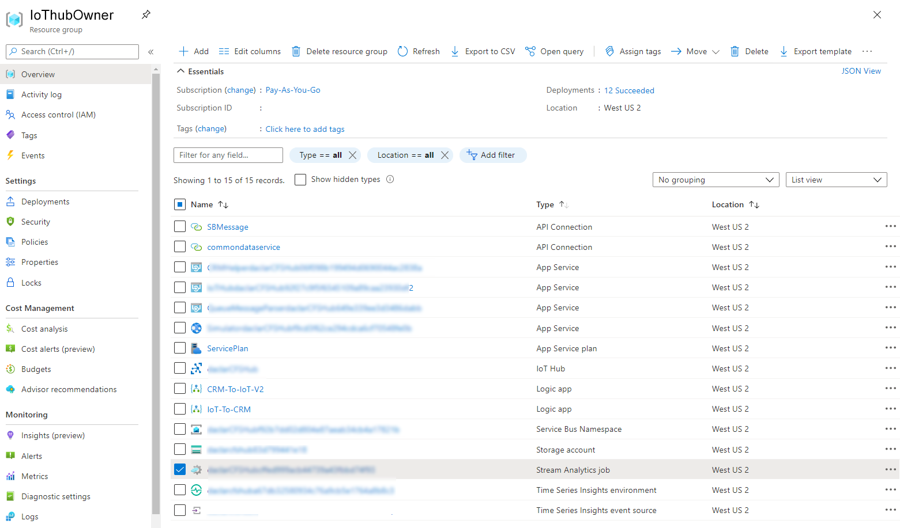

View and edit the criteria in Stream Analytics in your Resource Group.

> [!div class="mx-imgBorder"]
> 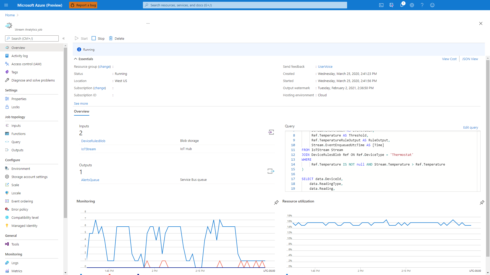

Go to Query in the left pane then select **IoTStream**. 

> [!div class="mx-imgBorder"]
> 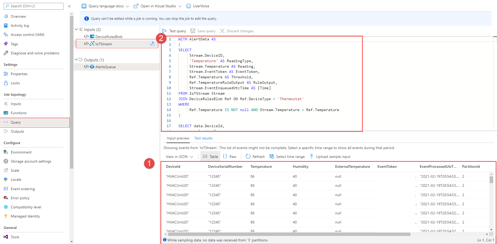

**(1)** the bottom pane shows all incoming IoT messages from the connected device 

**(2)** the top pane shows the JSON that creates IoT Alerts from IoT messages.

### Trigger IoT Alerts with the simulator

Set up the simulator to simulate IoT devices and data and begin to see device data pulled into Field Service.

To find the simulator URL, sign in to your Azure subscription, and then select the App Service resource type under the newly created resource group. 

> [!div class="mx-imgBorder"]
> 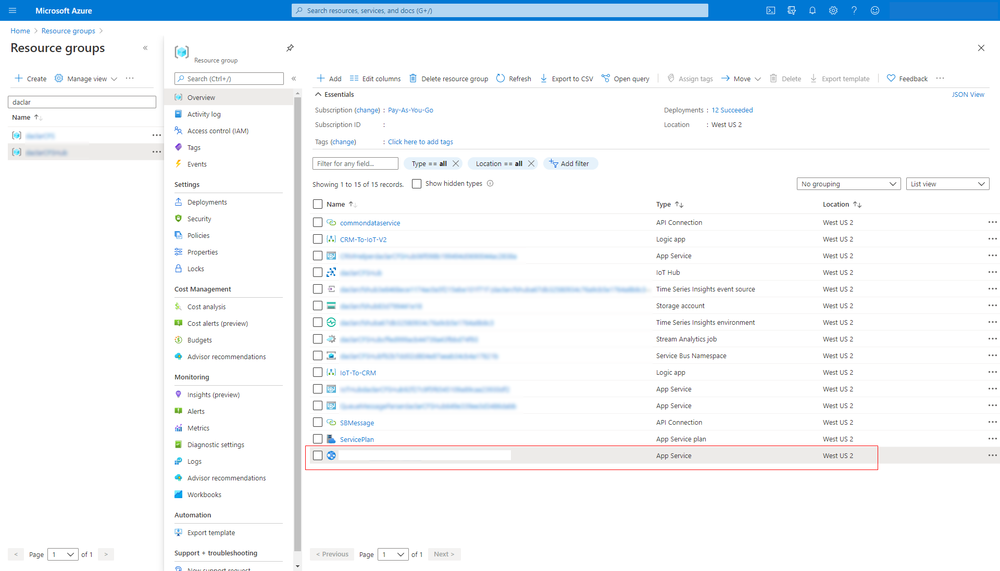

You’ll see the URL is in the top-right corner. Copy the URL. 

> [!div class="mx-imgBorder"]
> 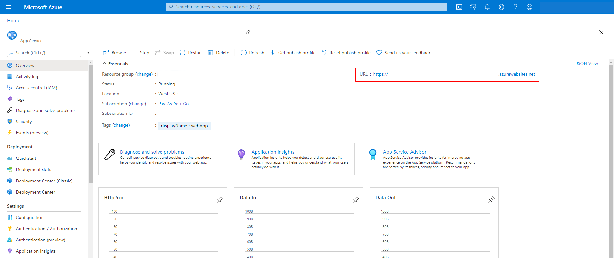

Complete the following steps:
  
1. Paste the URL into your browser’s address bar to load the page.  
  
2. When the simulator page opens, select **Connection** at the top.  
  
3. Enter the IoT hub host name and key. The host is simply the name of the IoT Hub resource in Azure portal. 

> [!div class="mx-imgBorder"]
> 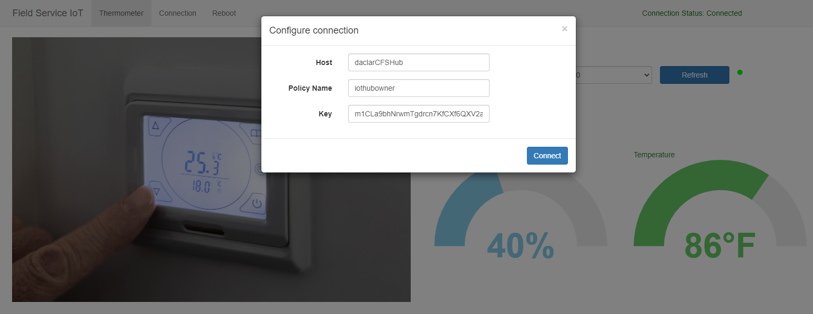

 The key can be accessed by selecting the IoT Hub resource and going to the shared access policies, then copying the primary key for **iothubowner** as seen in the following screenshot.

> [!div class="mx-imgBorder"]
> 
  
1. Select the IoT hub in the **Resource Group**.  
  
2. On the left under **General**, select **Shared access policies** to get the host name and primary key.  
  
3. Make sure **Connection status**  is marked as **Connected** and then close the dialog box.  

Now you can send a test command by using the sample simulator. For example, select the temperature and increase it to above 70 degrees. The simulator is preprogrammed to create an IoT alert if temperature is above 70 degrees.

> [!div class="mx-imgBorder"]
> 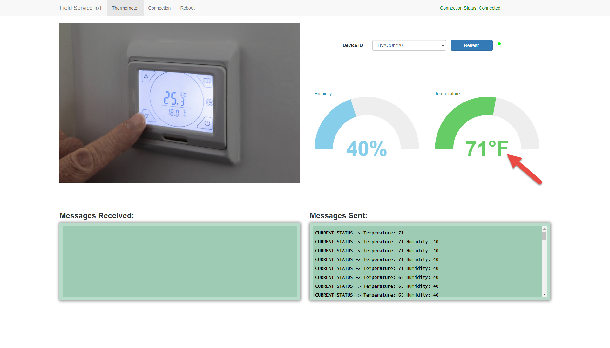

> [!Note]
> **Not using Azure IoT Hub?** Creating IoT Alerts in Field Service based on IoT messages in your custom IoT provider is supported. See the topic on [Extensible IoT data sources for Connected Field Service](cfs-custom-iot-provider.md) for more details. 

After the rule is created in Stream Analytics, the Logic App will create IoT Alerts based on the rule criteria. 

> [!div class="mx-imgBorder"]
> 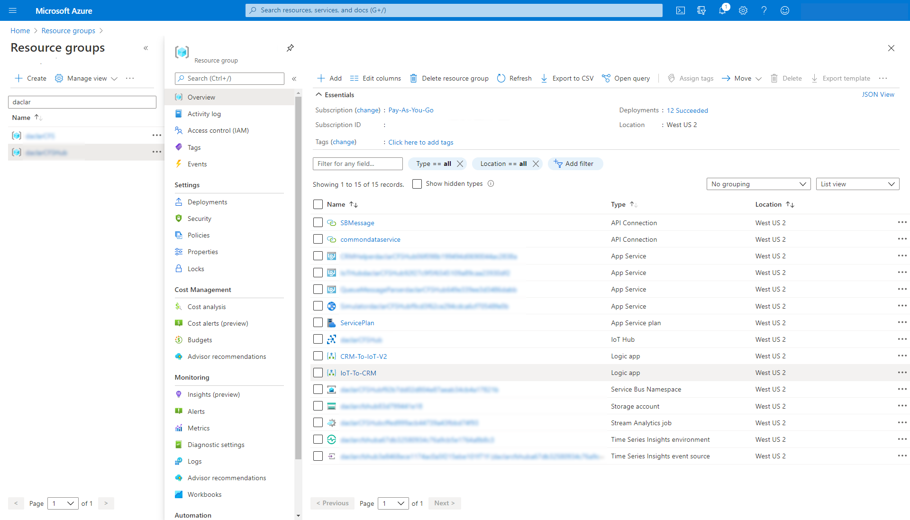

## View IoT Alerts in Field Service

In this example with the simulator, an IoT Alert was created in Field Service because the tmperature reading in an IoT message exceeded 70 degrees. 

> [!div class="mx-imgBorder"]
> 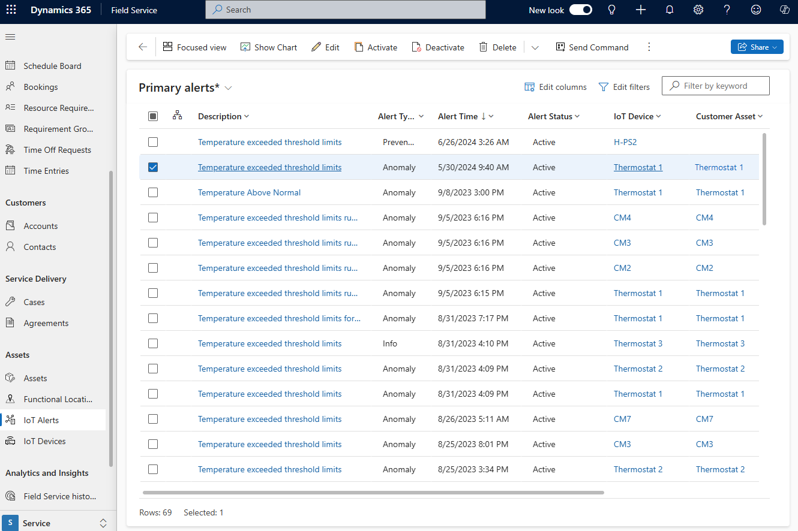

The IoT Alert form shows more details and the Alert Data section shows the details in the JSON message. 

> [!div class="mx-imgBorder"]
> 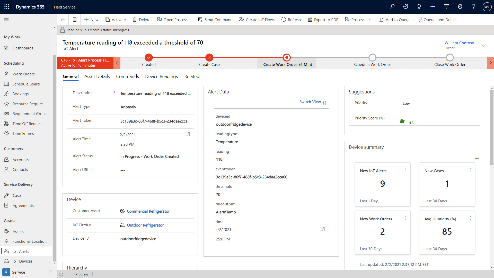

## Convert an IoT Alert to a work order

Use the business process flow to take action against the IoT Alert.

> [!div class="mx-imgBorder"]
> 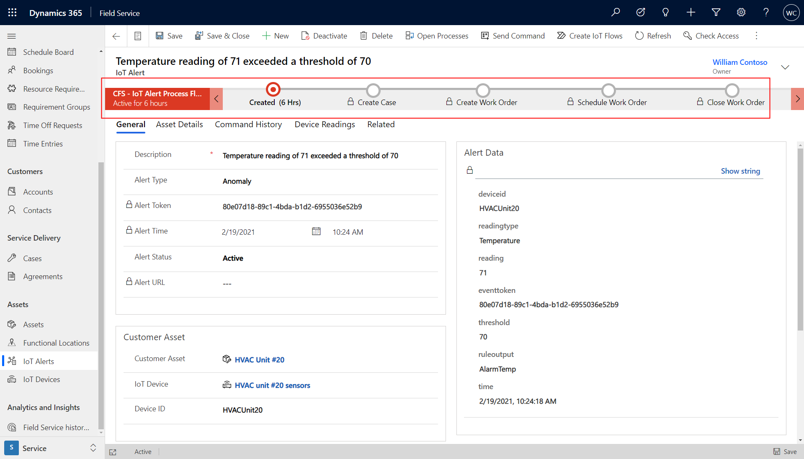

Create a case related the IoT Alert to investigate remotely.

> [!div class="mx-imgBorder"]
> 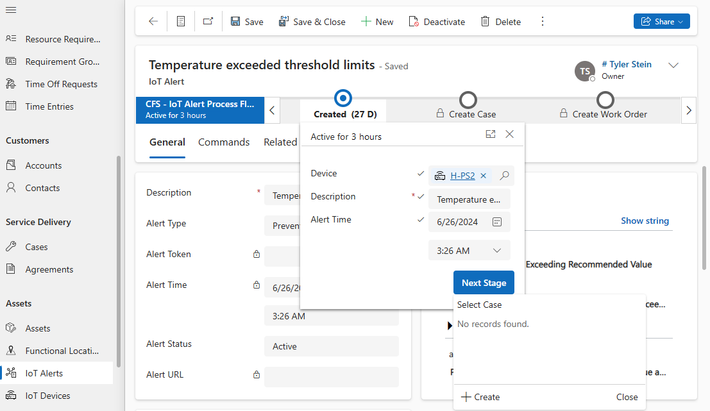

If the potential issue cannot be identified or resolved, advance to the next step in the business process flow to create a work order. 

> [!div class="mx-imgBorder"]
> 

The IoT Alert is referenced on the work order form and can be accessed by the technician on his or her mobile device. 

> [!div class="mx-imgBorder"]
> 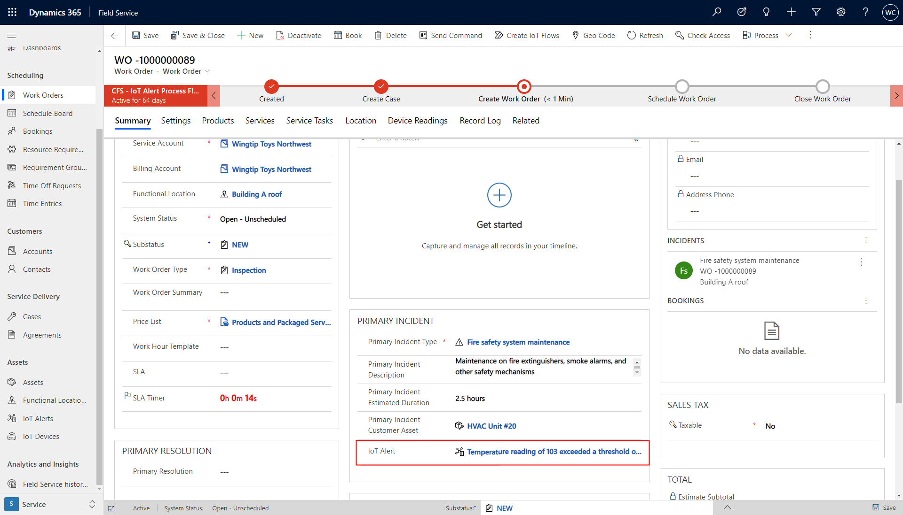

## Organize IoT Alerts

It is possible for multiple IoT Alerts to be created for the same IoT device for the same issue.

The system recognizes similar IoT alerts and groups them together. 

> [!div class="mx-imgBorder"]
> 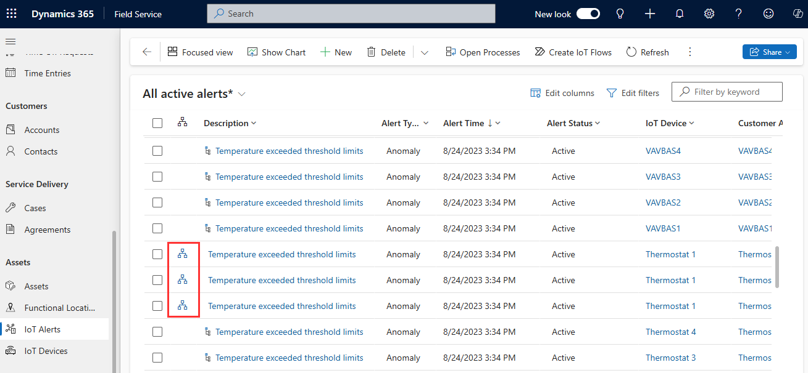

Select the group icon next to an IoT Alert to see similar IoT Alerts for the same device around the same time. 

> [!div class="mx-imgBorder"]
> 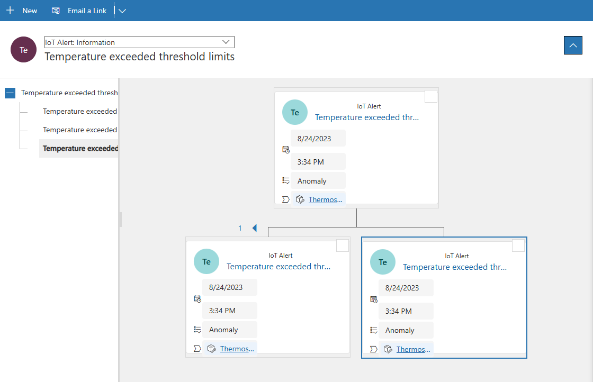

Use AI to suggest which IoT Alerts are higher priorty based on historical data like which IoT Alerts were converted to work orders. See the topic on [IoT alert AI suggestions](iot-alerts-ai-based-suggestions) for more details. 

> [!div class="mx-imgBorder"]
> 

