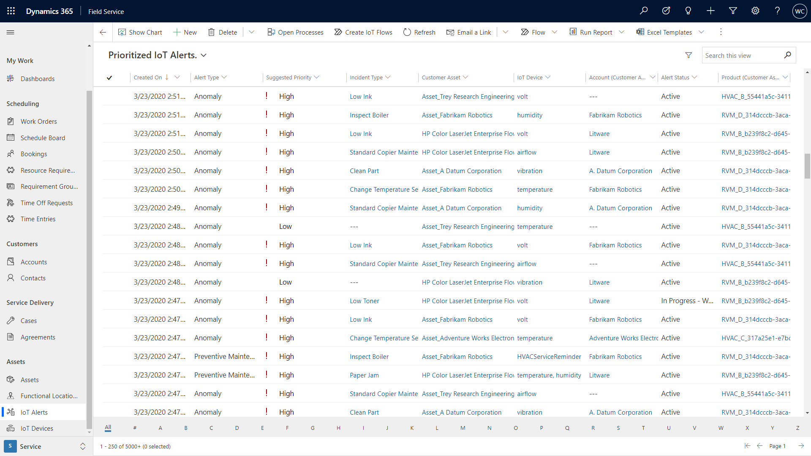
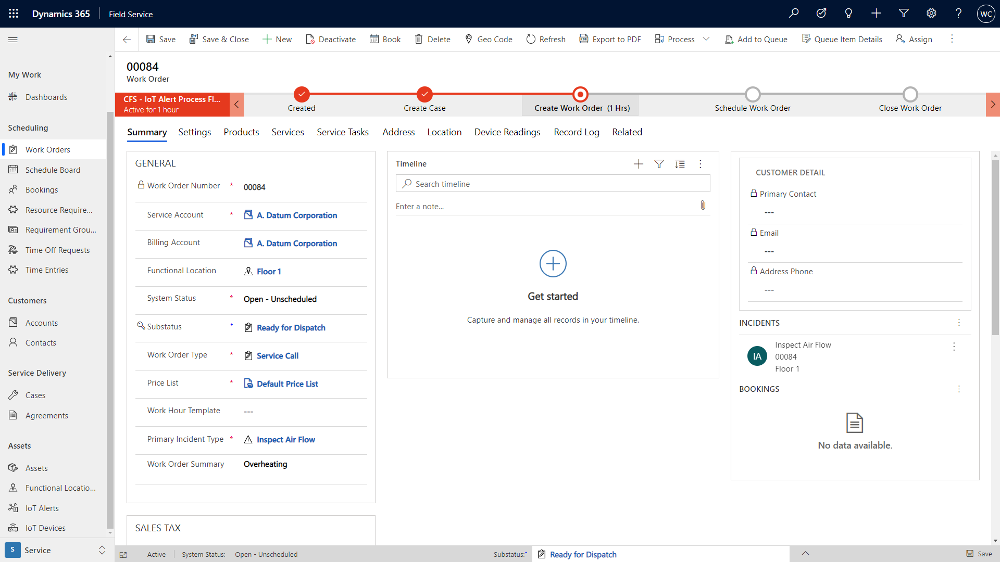

# Create IoT Alerts and convert IoT Alerts into work orders
## Prerequisites
> [!Note]
>

For a guided walkthrough, check out the following video.

> [!div class="mx-imgBorder"]
> 

> [!div class="mx-imgBorder"]
> 

> [!div class="mx-imgBorder"]
> 

> [!div class="mx-imgBorder"]
> 

> [!div class="mx-imgBorder"]
> 

> [!div class="mx-imgBorder"]
> 

## Configuration considerations
## Additional Notes
