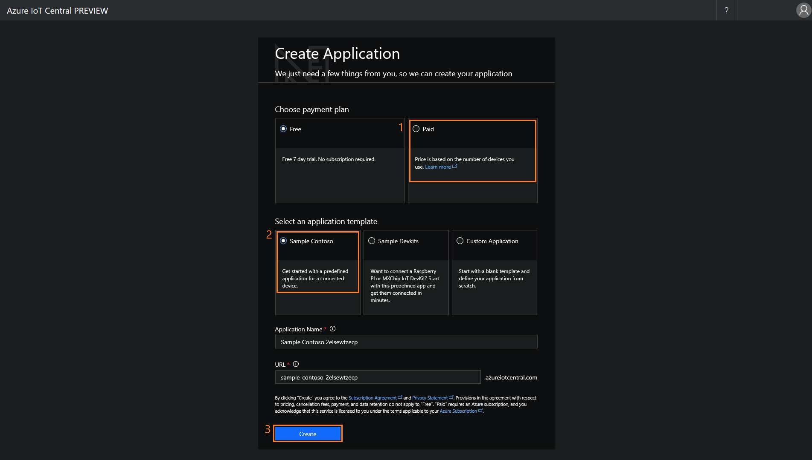
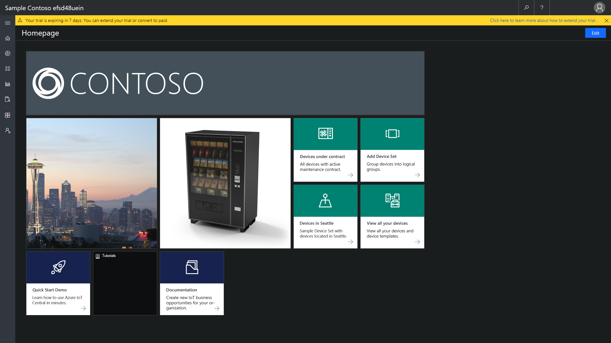
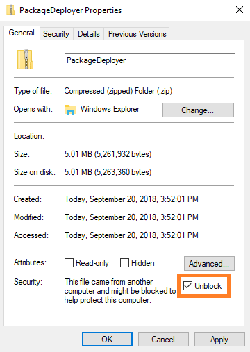

---
title: "Prerequisites for Connected Field Service for IoT Central | MicrosoftDocs"
description: Learn about what you need in order to set up Connected Field Service for Azure IoT Central.
ms.custom: dyn365-fieldservice
ms.service: dynamics-365-customerservice
ms.date: 01/08/2020
ms.author: daclar
author: FieldServiceDave
ms.reviewer: krbjoran
ms.topic: article
search.app: 
  - D365CE
  - D365FS
--- 

# Prerequisites for setting up Connected Field Service for Azure IoT Central

Ready to connect Azure IoT Central to Connected Field Service using Microsoft Power Automate to see how you can harness the power of the Internet of Things (IoT) and improve customer service (without writing any code)?

Before you take these tutorials, you need to complete four tasks:

- Provision the Azure IoT Central solution using the sample Contoso template.
- Get a Dynamics 365 Field Service tenant with system administrator credentials. 
- Install the Dynamics 365 Connected Field Service add-on from the Dynamics 365  admin center.
- Install Connected Field Service sample data.

This topic provides you with links to everything you need, and walks you through the steps to get started.

## Provision the Azure IoT Central solution using the sample Contoso template

The various industry templates for retail, energy, government, and healthcare contain device templates that you can use for testing purposes.

First, [navigate to Azure IoT Central](https://azure.microsoft.com/services/iot-central/). Then select **Get started**. To start creating your new Azure IoT Central application, select **New Application**. 
 
On the **Create Application** dialog: 
 1. Select the **Paid** payment plan (you won't be asked for a credit card). 
 2. Select the industry template of your choosing (recommended) or create a custom app to start from scratch. 
 3. Then select **Create**.

> [!div class="mx-imgBorder"]
>   

After a few seconds, you'll see the Contoso home page. 

> [!div class="mx-imgBorder"]
> 

## Get a Dynamics 365 Field Service tenant with system administrator credentials 

You'll need a Dynamics 365 Field Service tenant that you can connect your IoT solution to.
     
New to Field Service and need a tenant? No worries. [Sign up for a free trial for development purposes](https://appsource.microsoft.com/product/dynamics-365/mscrm.40fd37ef-dca4-4b0d-9f41-d16703b7d070).

## Install the Dynamics 365 Connected Field Service add-on from the Dynamics 365 admin center  

As of Field Service v8.2, Connected Field Service is included with the Field Service app. Follow the instructions below if you are using an earlier version without the Connected Field Service solution.

To install Connected Field Service:
1. Navigate to the Dynamics 365 admin center. 
2. On the **Instances** page, select the Dynamics 365 Field Service tenant, and then edit **Solutions**. 
3. On the **Manage your solutions** page, select **Connected Field Service version 1.0.18266.4**, and then select **Install**. Follow the on-screen instructions to complete the installation.
    
## Install Connected Field Service sample data    
Next, you'll need to download and install the Connected Field Service sample data package, which is designed for use with the Contoso template in Azure IoT Central. The sample data also includes an **IoT Sample - Process alert** workflow that showcases automated alert triaging.

To install the Connected Field Service sample data:
1. [Download the PackageDeployer zip file](https://aka.ms/cfsdemodata).
2. In Windows File Manager, go to the folder where you downloaded the zip file. 
3. Right-click the zip file, and then select **Properties**. 
4. On the Properties dialog, select **Unblock**. Select **OK**.
> [!div class="mx-imgBorder"]
> 

5. Right-click the zip file, select **Extract All**, and then select **Extract**.
6. Double-click **packagedeployer.exe** to run it and install the sample data. 
7. When prompted, enter your system administrator credentials to sign in to your Dynamics 365 tenant. When you see the Azure IoT Central and Connected Field Service sample data deployment page, follow the on-screen instructions to complete the installation.

That's it! You're ready to take the tutorials.
   
> [!div class="nextstepaction"]
> [Step 1: Receive IoT alerts from IoT Central](cfs-iot-central-alerts.md) 

[!INCLUDE[footer-include](../includes/footer-banner.md)]