---
title: "Connected Field Service for Azure IoT Central - Overview | MicrosoftDocs"
description: Learn about Connected Field Service for Azure IoT Central.
ms.custom: dyn365-fieldservice
ms.date: 11/08/2018
ms.author: daclar
ms.reviewer: krbjoran
ms.service: dynamics-365-customerservice
ms.topic: overview
author: FieldServiceDave
ms.manager: shellyha
search.app: 
  - D365CE
  - D365FS
--- 

# Connected Field Service for Azure IoT Central - Overview

Connected Field Service for Azure IoT Central provides a direct integration of Dynamics 365 Field Service with Azure IoT Central, a fully managed IoT software-as-a-service (SaaS) solution.

Azure IoT Central enables builders to configure rules and actions. Based on those actions, IoT alerts will be created in Connected Field Service. Also, based on service activities in Connected Field Service, information can be sent back to Azure IoT Central. This is accomplished by using Power Automate, a SaaS offering for automating workflows across applications and services.

> [!div class="mx-imgBorder"]
> 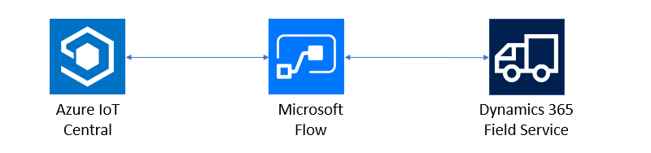
 
The below end-to-end integration processes can be easily implemented based on a pure configuration experience:

- Azure IoT Central can send information about device anomalies to Connected Field Service (as an IoT Alert) for diagnosis.
- Connected Field Service can create cases or work orders triggered from device anomalies.
- Connected Field Service can schedule technicians for inspection to prevent the downtime incidents. 
- Azure IoT Central device dashboard can be updated with relevant service and scheduling information.

Azure IoT Central requires no extensive cloud development or coding skills to get an IoT solution up and running.  

With Power Automate templates, users can connect their accounts, take advantage of our pre-built templates, and customize their own flows in an easy visual designer without the need for coding experience.

For a guided walkthrough, see the following video.

>[!VIDEO https://www.microsoft.com/videoplayer/embed/RE4ynS4]

## Tutorial - Get integration scenarios ready in minutes

Connect Azure IoT Central to Connected Field Service using Power Automate in just a matter of minutes with these tutorials. Be sure to [check out the prerequisites](cfs-iot-central-setup.md) before getting started.

1. [Receive Azure IoT alerts from Azure IoT Central](cfs-iot-central-alerts.md)
2. [Associate devices with customer accounts](cfs-iot-central-associate-devices.md)
3. [Send work order updates to Azure IoT Central](cfs-iot-central-work-orders.md)
4. [Send booking updates to Azure IoT Central](cfs-iot-central-bookings.md)

## 1 - Receive IoT alerts in Connected Field Service from Azure IoT Central

At the end of this step in the tutorial, you'll be able to receive and see alerts from Azure IoT Central in your instance of Connected Field Service. IoT alerts will display on your dashboard and relate to relevant work orders that have been created automatically.  

### Goal

Connect Azure IoT Central to Connected Field Service by configuring the "Create CFS alerts from IoT Central" template in Power Automate.

### Steps

1. Log into your Azure IoT Central application and navigate to **View all your Devices.**

> [!div class="mx-imgBorder"]
> 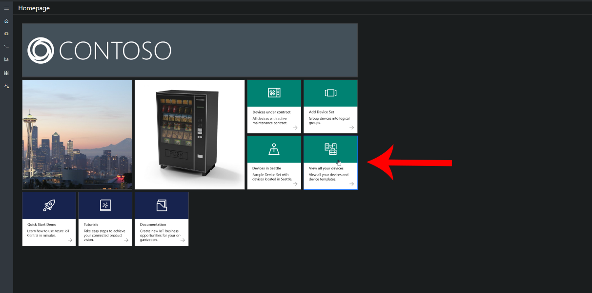

2. When you can see a list of devices, make sure you're on the Template tab "Refrigerated Vending Machines (1.0.0)." From this list of devices, select "Refrigerated Vending Machine."

> [!div class="mx-imgBorder"]
> 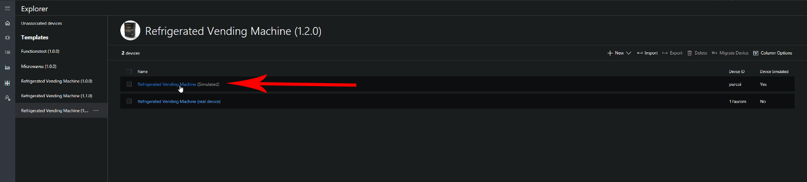

3. Once on the Refrigerated Vending Machine detail page, navigate to the **Dashboard** tab, seen below in the screenshot.

    a. You should see service and scheduling fields in the Contoso Template. Their values should be empty. If you can't see these fields, refer to [this documentation](https://docs.microsoft.com/azure/iot-central/howto-manage-devices#change-a-property) to add the properties.
    
> [!div class="mx-imgBorder"]
> 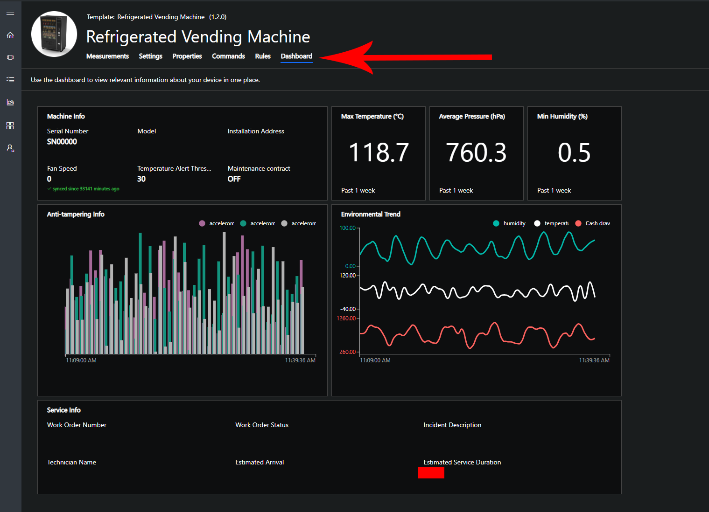

1. Next, while still on this detail page, head over to the **Rules** tab, and create the rule "Cash drawer level is high." For more information on creating a rule, learn more in [this IoT Central tutorial](https://docs.microsoft.com/azure/iot-central/tutorial-configure-rules).

> [!div class="mx-imgBorder"]
> 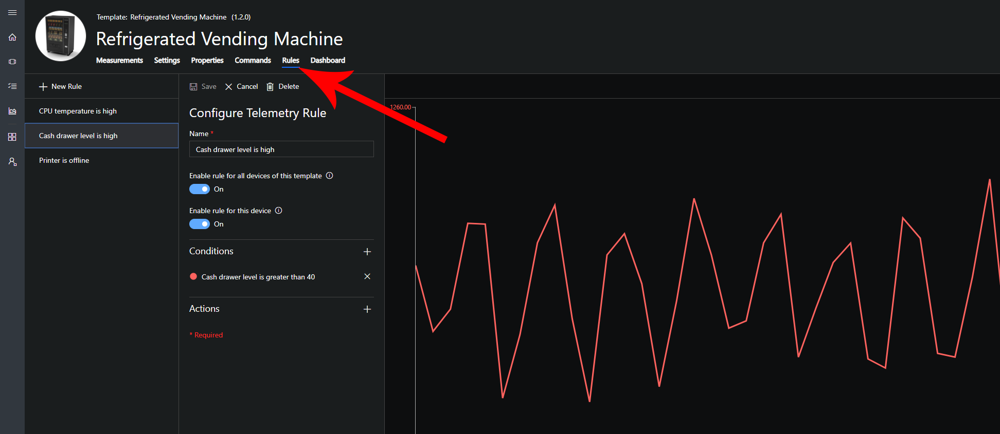

5. Then, under **Actions,** select **Power Automate** from the Select Action options. This will take you to another working environment in the Power Automate application. This is where you will set up your integrations.

    a. **Note for Azure IoT Central trial users**: In order to use Power Automate from Azure IoT Central, you must be using the pay-as-you-go form of IoT Central. Trial users can work around this by heading directly to [Power Automate](https://flow.microsoft.com/templates/) to configure steps 7 and 8 in this tutorial. Then in Azure IoT Central, the flow will be all ready to go. 
    
> [!div class="mx-imgBorder"]
> 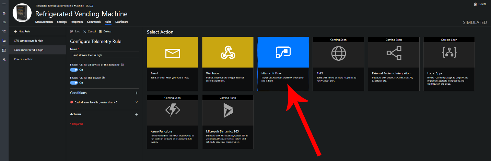

6. You'll be taken to the Power Automate template page for "Create CFS alerts from IoT Central." Select "Use this template." (if you have trouble finding these templates, head to the [Power Automate Templates page](https://flow.microsoft.com/templates/) and search "CFS")

> [!div class="mx-imgBorder"]
> 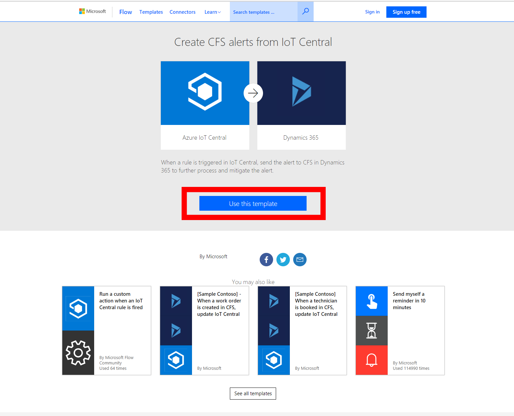

7. You'll be prompted now to sign in to both IoT Central and Dynamics accounts. Select your accounts from each and then **Continue** to progress.

> [!div class="mx-imgBorder"]
> 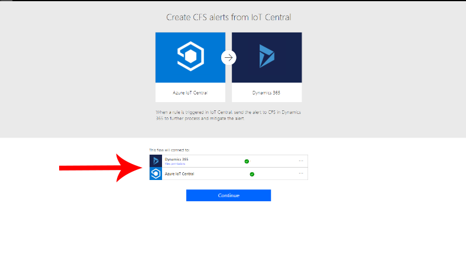

8. Now you'll see the actual Flow. Because this is a template, the only actions you must take are:

    a. Select your Azure IoT Central application name.

    b. Set IoT rule as the one you created earlier. In our suggested example, it would be: "Cash drawer level is high."

    c. Select your Dynamics 365 organization name.

    d. Set Entity Name to "IoT Alerts."

    e. Select "Show advanced options" to reveal several hidden fields.

    f. Set "Alert Type Label" to "Cash box almost full."

    g. Save the Flow.

> [!div class="mx-imgBorder"]
> 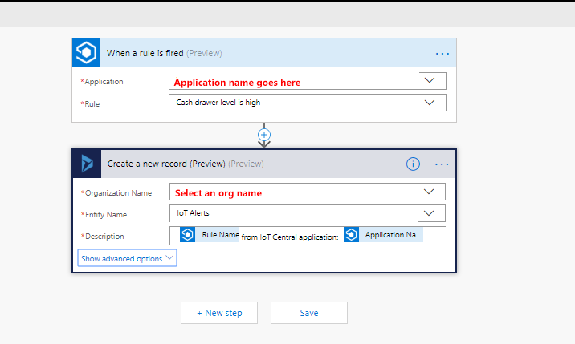

> [!div class="mx-imgBorder"]
> 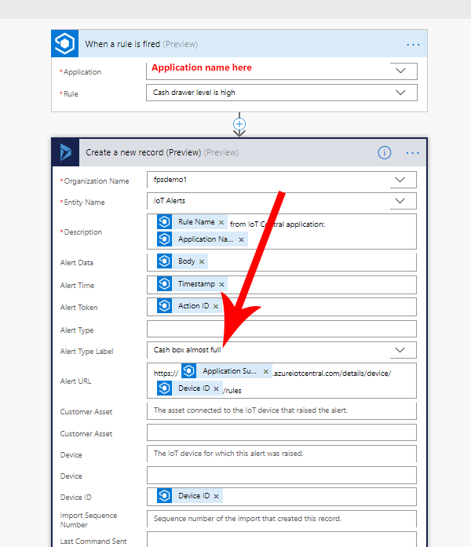

From here, the workflow will trigger based on the alert type. While you may have more options shown, the demo data package we recommend using for this tutorial includes the following workflows, based on alert types:

- If alert type is set to PC CPU usage high or PC memory usage high, the workflow will send a restart command to the device

- If alert type is set to Printer offline or Paper jam, the workflow will create a case

- If alert type is Cash box almost full, the workflow will create a new work order in Field Service to issue IoT-predictive maintenance, and a new booking in the bookable resource bookings.

### See the results

Once you've saved your flow, sign in to Dynamics 365 Field Service, and select Connected Field Service. You may see a window that offers a few links to learn more about Connected Field Service and Azure IoT offerings. You can choose to learn more, or just dismiss this window. 

> [!div class="mx-imgBorder"]
> 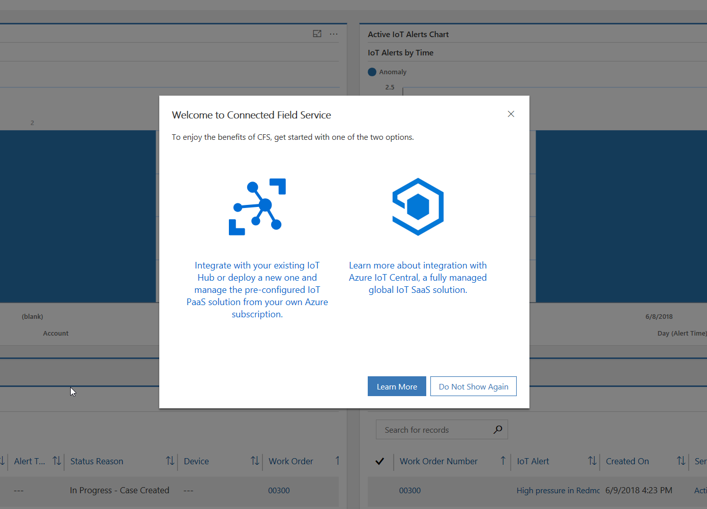

In Connected Field Service, you should now see incoming alerts from Azure IoT Central on the dashboard. You can select one of these alerts to see more details, including device information, threshold, and the violated rules. You can also select the IoT Central alert URL that will take you back to IoT Central.

> [!div class="mx-imgBorder"]
> 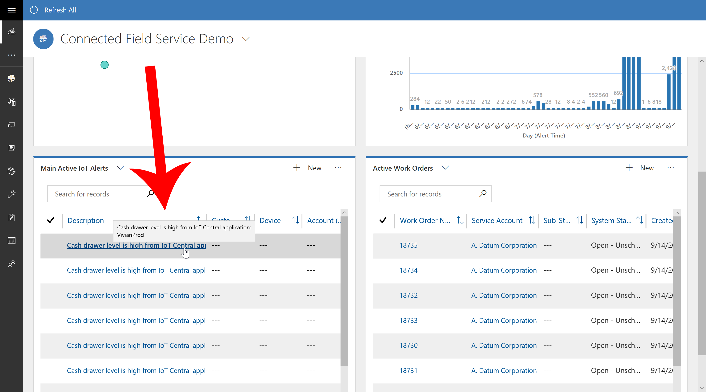

> [!div class="mx-imgBorder"]
> 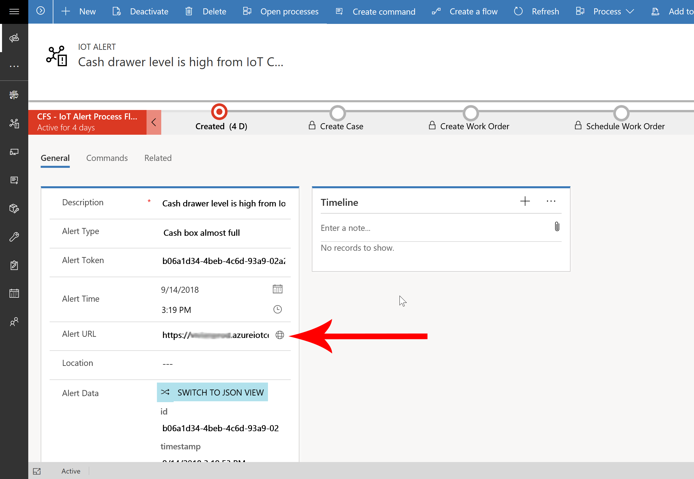

> [!div class="nextstepaction"]
> [Step 2: Associate devices with customer accounts](cfs-iot-central-associate-devices.md)

## 2 - Associate devices with customer accounts 

If an IoT device isn't associated with a customer account in Connected Field Service, the system will not be able to generate work orders or cases against incoming alerts. In this tutorial, you'll learn how to associate a device with a customer account. While customer accounts are an optional association in Azure IoT Central, they are required in Connected Field Service.

### Goals

Associate a device in Connected Field Service with a customer account so that work orders or cases can be generated against incoming IoT alerts.

### Steps

1. In your Connected Field Service application, navigate to the device page you wish to associate with a customer account. You can find this under "Devices" in the left-side menu.

> [!div class="mx-imgBorder"]
> 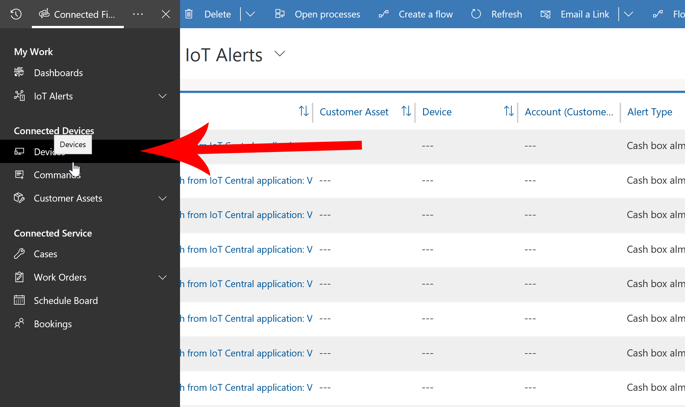

2. On the Active Device page, select the dropdown just to the right of "Active IoT Devices" and select the view, "IoT devices without customer account." Select one of these devices.

> [!div class="mx-imgBorder"]
> 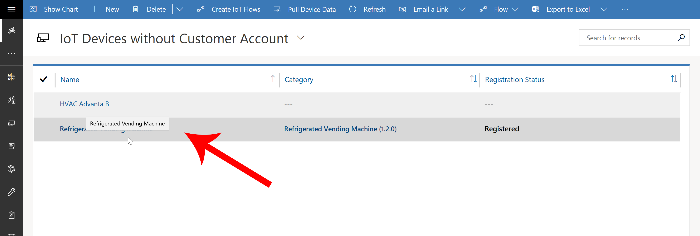

3. On the device detail page, start typing the name of the customer account in the "Account" field.

    a. For the purposes of this tutorial, you can select "Active Transport Inc." 
    
> [!div class="mx-imgBorder"]
> 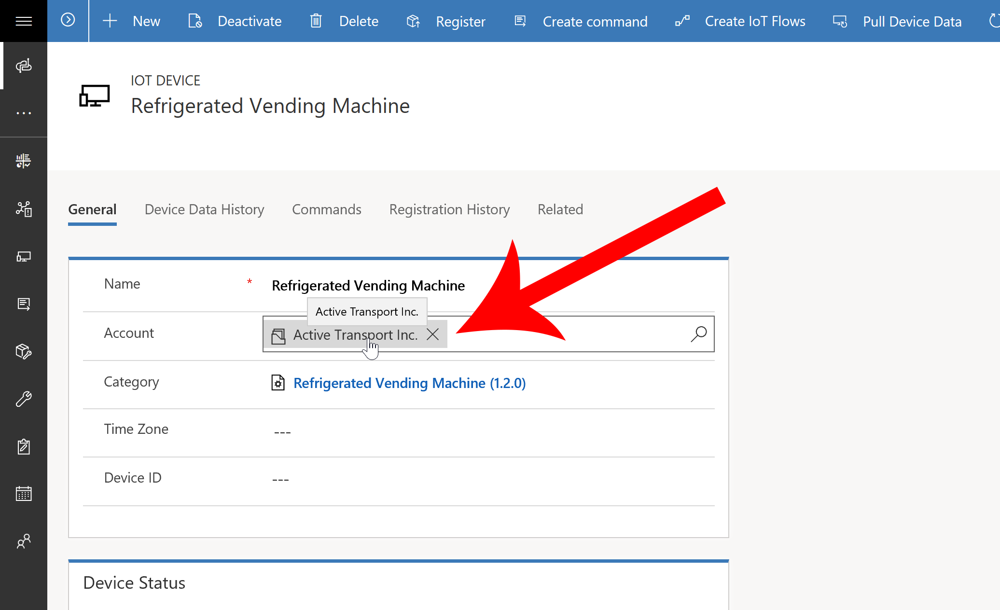

4. Save the changes you've made (the Save button is in the bottom corner of your window).

### See the results

This device will now be associated with a customer account, and can receive IoT alerts from Azure IoT Central.

> [!div class="nextstepaction"]
> [Step 3: Send work order updates to IoT Central](cfs-iot-central-work-orders.md)

## 3 - Send work order updates to Azure IoT Central

When working with the sample data package, you'll see that work orders are automatically created in Connected Field Service when an IoT device triggers an alert in Azure IoT Central. In Connected Field Service, you'll see that work order associated with the IoT alert. But how do you get this information back into IoT Central?

### Goal

Make Connected Field Service send service information to Azure IoT Central when work orders are automatically generated.

### Steps

1. In Connected Field Service, navigate to the IoT Alerts list page. You can find this in the main navigation menu.

2. Select an IoT alert, and then navigate to the "Related" dropdown and select "Work orders." You should see that a work order has been automatically generated for this alert.

3. Select "Create a flow" in the top menu bar.

> [!div class="mx-imgBorder"]
> 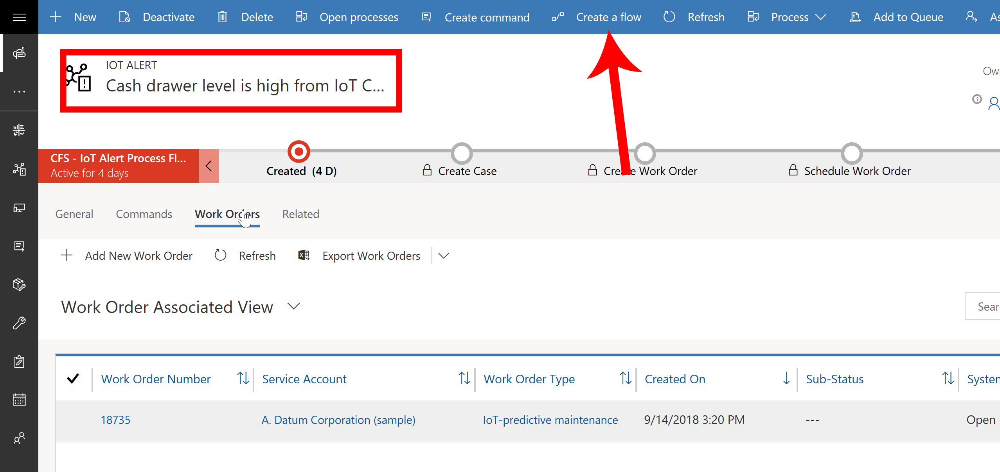

4. From the list of available templates, select "**Sample Contoso- When a work order is created in Connected Field Service, update IoT Central"**

Note: Alternatively, you can navigate directly to [the Power Automate templates page](https://preview.flow.microsoft.com/templates/) and search "CFS" to find this template, as seen below.
  
> [!div class="mx-imgBorder"]
> 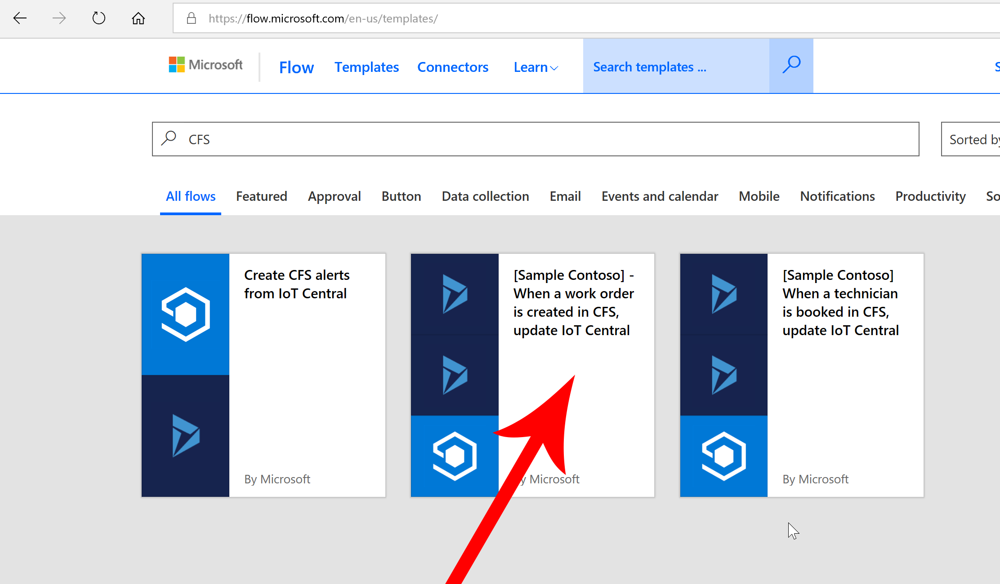

5. Sign into Power Automate with your Dynamics 365 organization, along with your associated IoT Central account.

> [!div class="mx-imgBorder"]
> 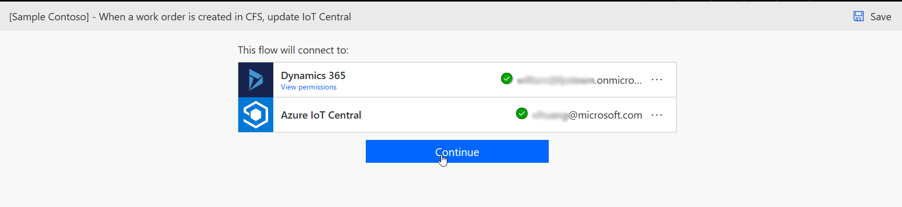

6. The template will be mostly ready to run; you only need to make the following changes (see the screenshots below for reference):

    a. In the field for "When a work order is created or updated," select your Dynamics 365 organization name.
   
    b. In the field for "Get the alert," and then select your Dynamics 365 organization name.
    
    c. Expand "Clean up the work order fields in the device," and then select your IoT Central application name and also the device template, "Refrigerated Vending Machine (1.0.0)."
    
    d. Expand "Get the incident type from work order," and then select  your Dynamics 365 organization name.
    
    e. Expand "Update the work order details for the device that raised the alert," and then select your IoT Central application name and also the device template, "Refrigerated Vending Machine (1.0.0)."
    
    f. **Note**: Running this flow will not add work order information retroactively---only devices going forward will be updated on the device page in Azure IoT Central.
    
> [!div class="mx-imgBorder"]
> 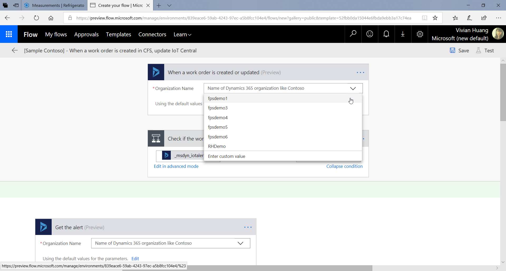

> [!div class="mx-imgBorder"]
> 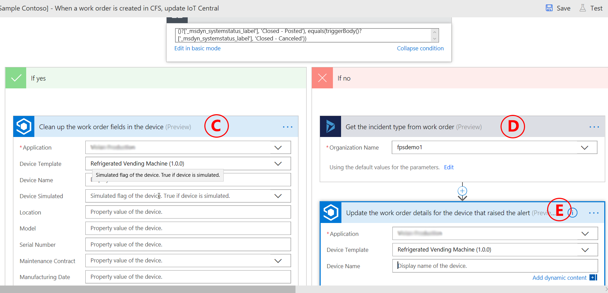

1. Save the flow to make it run.

### See the results

After you've saved the flow, head on back to your Azure IoT Central environment. Select the device that has triggered an alert and a work order in Connected Field Service. You should now see the work order information populated in the fields on the IoT Central device properties page.

> [!div class="mx-imgBorder"]
> 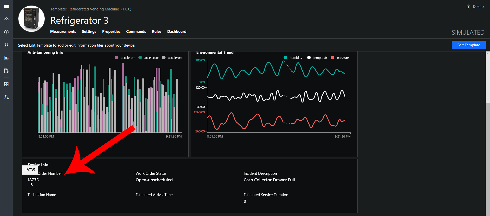

> [!div class="nextstepaction"]
> [Step 4: Send booking updates to Azure IoT Central](cfs-iot-central-bookings.md)

## 4 - Send booking updates to Azure IoT Central

Now that you've configured Connected Field Service to send service updates back to IoT Central, let's make it so booking details are sent back too.

### Goal
Make Connected Field Service send booking updates to Azure IoT Central when a resource is booked in Connected Field Service.

### Steps
1. Head over to the [Power Automate templates page](https://preview.flow.microsoft.com/templates/) and search for the following template: "**[Sample Contoso] When a technician is booked in Connected Field Service, update Azure IoT Central with the details.**"

2. Once you've selected the template, you'll be asked to sign in with both your Dynamics 365 account and Azure IoT Central account.

> [!div class="mx-imgBorder"]
> 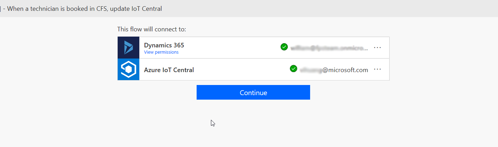

3. Like with work order updates in step 3 of this tutorial, this Flow template will be mostly ready-to-go. To get it working, you need to update the following (see screenshots below for reference):

    a. Add your D365 organization name in the corresponding fields in **Get the work order**, **Get the alert**, and **Get the resource details**.

    b. Add your IoT Central application name in the field for **Application**.
    
> [!div class="mx-imgBorder"]
> 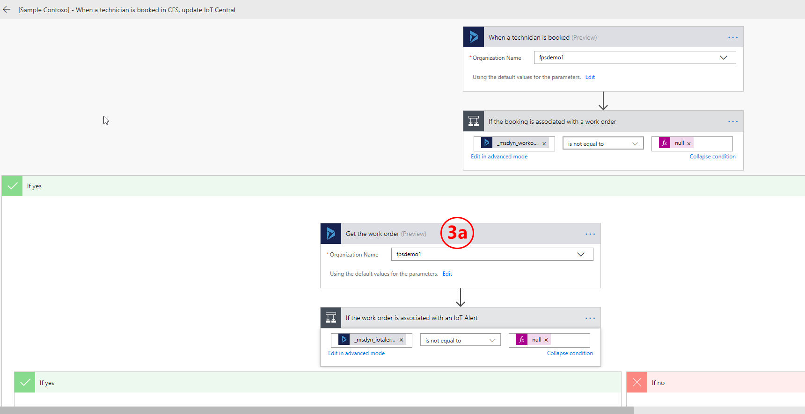

> [!div class="mx-imgBorder"]
> 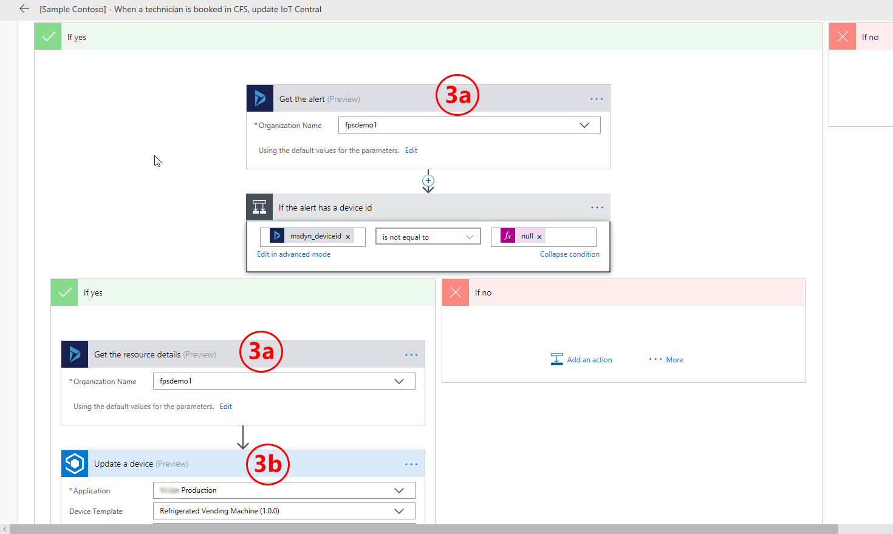

4. Save the flow.

5. Head on back to your Field Service environment and open the schedule board. Find a resource that matches your IoT requirements, based on criteria such as location and alert type. Confirm the booking for the work order that was generated in response to the IoT alert.

> [!div class="mx-imgBorder"]
> 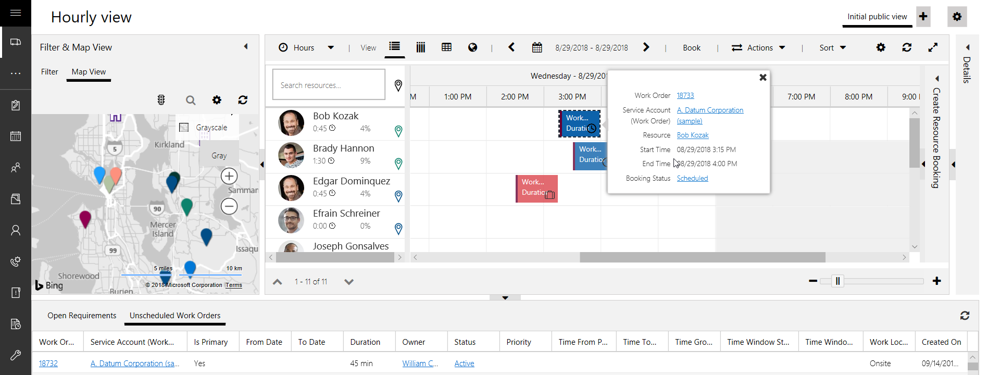

### See the results

Back in Azure IoT Central, you'll now see booking information associated with this device, such as technician name, estimated arrival time, and estimated service duration.

> [!div class="mx-imgBorder"]
> 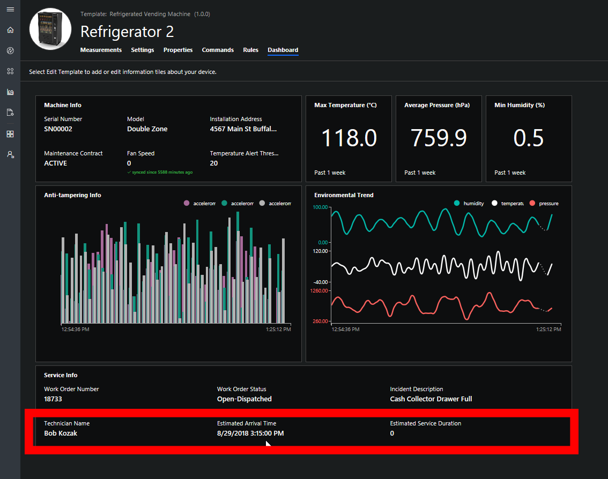

You've now completed the tutorials. Nice work.

## Learn more about Azure IoT Central
- [What is Azure IoT Central?](https://docs.microsoft.com/azure/iot-central/overview-iot-central)
- [Tour of Azure IoT Central user interface](https://docs.microsoft.com/azure/iot-central/overview-iot-central-tour)
- [Create a new application in Azure IoT Central - tutorial](https://docs.microsoft.com/azure/iot-central/quick-deploy-iot-central)

[!INCLUDE[footer-include](../includes/footer-banner.md)]