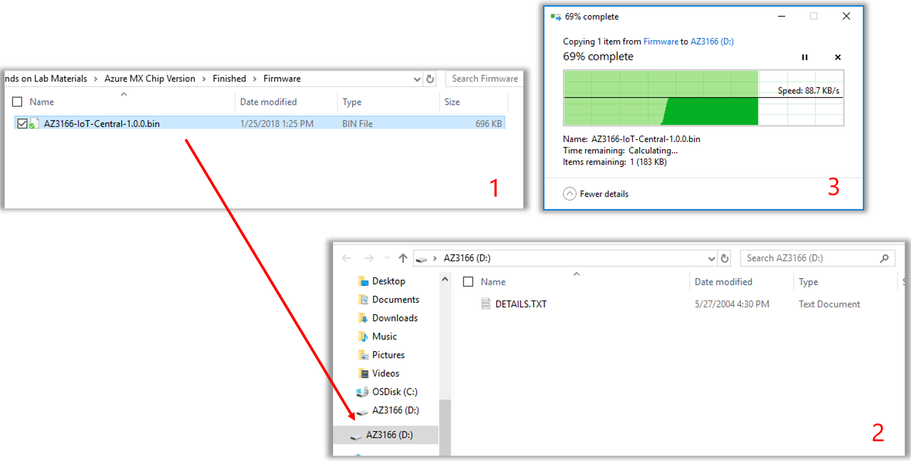

# Set up and test IoT alerts from a real device (MXChip) 

Using an actual physical device is a great way to test and develop your Connected Field Service solution. An [MXChip](https://en.mxchip.com/az3166) is a Microsoft-approved development kit you can connect to the internet and is equipped with multiple sensors for temperature, humidity, motion and more.

By connecting the MXChip to the internet you can send telemetry to AzureIoT and Dynamics 365 to monitor and respond and then create workflows to create IoT alerts, cases, and work orders in Dynamics 365 Field Service. 

and send real IoT telemetry from an MXChip in to Dynamics 365 Field Service as IoT alerts,

1. Perform initial MXChip device setup
2. Create Device Alert Rules in IoTCentral
3. Set up Power Automate flows to create IoT Alerts
4. Add MXChip as connected device in IoTCentral
5. Plugin and connect MXChip
6. See Telemetry Data in IoT Central
7. See IoT Alerts in Dynamics 365 Field Service
8. Create Customer Asset and Connect Device

## Prerequisites

Before completing this tutorial you need the following enviornments, accounts, and credentials:

1. A Dynamics 365 Field Service environment v8.2+. "Connected Field Service" capabilities are included with Field Service. See the topics on [installing](./install-field-service.md) or [installing](./upgrade-field-service.md) Field Service for more details.
2. An Azure account. Use your existing account or create a new free account at [https://azure.microsoft.com/en-us/free/](https://azure.microsoft.com/en-us/free/). Your Azure account can be different from your Dynamics 365 Field Service account.
3. Using your Azure account and credentials, create an [Azure IoTCentral custom application](https://apps.azureiotcentral.com/build/new/custom). Hint: For **Application template** select **Custom application (legacy)**.

Referencing the following video that walks through setting up a simulated device may be helpful:  [Set up Connected Field Service with Azure IoTCentral](https://youtu.be/Sp7_JoXjHDk)

## Perform initial MXChip device setup

### Connect Physical Device to PC

Connect the DevKit device to your development machine using provided USB cable
In Windows, a file explorer window opens on a drive mapped to the storage on the DevKit device. For example, the drive might be called AZ3166 (D:)

> [!div class="mx-imgBorder"]
> 

### Flash Firmware on Device
Download Latest Firmware (Bundled with HOL Downloads)
	http://aka.ms/CFSFirmware 
	 The download filename on the releases page looks like AZ3166-IoT-Central-X.X.X.bin

Drag the AZ3166-IoT-Central-X.X.X.bin file onto the drive window. When the copying is complete, the device reboots with the new firmware.
	After rebooting the Firmware file will disappear

> [!div class="mx-imgBorder"]
> 
	

### Copy Firmware to Device

Drag and Drop .bin to your AZ3166 (D:)

> [!div class="mx-imgBorder"]
> 

## Create Device Alert Rules in IoTCentral

In the next steps, we will create 2 device rules that will allow the passing of telemetry data from the MXChip  > IoT Central > CFS 

The first will be a B Button press that fires an alert into IoT Central > CFS
The Second will be a Temp Alert that fires when a threshold is met IoT Central > CFS

The Value:
- Anomaly detection from connected devices
- Uptime/Downtime Predictability  
- Dashboarding and Reporting on device specific information
- Integration to Work order creation, scheduling, and dispatching with Conencted Field Service

Navigate to IoT Central and login.

Example: https://YOURORG.azureiotcentral.com 

Once logged in Select Create Device Templates

> [!div class="mx-imgBorder"]
> 

Select MXChip

> [!div class="mx-imgBorder"]
> 

Select Create

> [!div class="mx-imgBorder"]
> 

Select Device Templates and then select MXChip

> [!div class="mx-imgBorder"]
> 

Select Rules

> [!div class="mx-imgBorder"]
> 

### Button B press rule

Select +New Rule

> [!div class="mx-imgBorder"]
> 

Select Event

> [!div class="mx-imgBorder"]
> 

Name: Button B Press
Measurement: Button B Press 
Aggregation: None
Then Save

> [!div class="mx-imgBorder"]
> 

### High temperature alert rule

Select +New Rule

> [!div class="mx-imgBorder"]
> 

Select Telemetry  

> [!div class="mx-imgBorder"]
> 

Name: Temperature Alert
Measurement: Temperature
Aggregation: None
Operator: Is Greater Than
Threshold: 15
Then Save

> [!div class="mx-imgBorder"]
> 

## Set up Power Automate flows to create IoT Alerts

Navigate to CFS IoT Alerts under My Work and select Create IoT Flows 

> [!div class="mx-imgBorder"]
> 

Select Create CFS alerts from IoT Central 
Make sure you select the CDS Version 

> [!div class="mx-imgBorder"]
> 

**You might need to login to Power Automate with credentials if haven’t already**
In flow, you will want to make sure you are connected to your CFS org and your IoT Central 
Select continue 

> [!div class="mx-imgBorder"]
> 

Application: Select IoT central application name 
Rule: Select Button B Press
Organization Name: Select Dynamics CFS Org 
Entity Name: Select IoT Alerts
Select Save

> [!div class="mx-imgBorder"]
> 

Add Temp Alert to Power Automate Name
Application: Select IoT central application name 
Rule: Select Temperature Alert
Organization Name: Select Dynamics CFS Org 
Entity Name: Select IoT Alerts
Select Save

> [!div class="mx-imgBorder"]
> 

Navigate to My Flows and see newly created Alert Flows

> [!div class="mx-imgBorder"]
> 

## Add MXChip as connected device in IoTCentral 

Navigate to IoT Central Solution and loginhttps://YOURORG.azureiotcentral.com 

> [!div class="mx-imgBorder"]
> 

Select Device and MXChip(1.0.0) TemplateSelect Real to Create and New Device 

> [!div class="mx-imgBorder"]
> 

Create Device ID and Device Name
Create something unique but not too crazy  

> [!div class="mx-imgBorder"]
> 

Select Connect 
You will need to copy and paste to Notepad the Scope and Device ID and Primary Key below for MXChip Setup In the next step

> [!div class="mx-imgBorder"]
> 

## Plugin and connect MXChip

Connect AZ3166 to Power and press Reset button
Wait until the searching for Wi-Fi screen goes away – Normally 45-60 seconds
Hold down A+B Button AZ3166 will hard reset (Usually takes 15-20 seconds)
Press Reset when directed to by the LCD Screen
When device Reboots, it should be in AP Mode with the SSID Starting with AZ3166
Repeat Steps As Necessary –Should look like this

> [!div class="mx-imgBorder"]
> 

After device reboots, you need to configure the Wi-Fi on the Device and should look like the below image 
You should see a device name starting with AZ3166_ in your Wi-Fi trayconnect to that. Once connected, go to below IP address. 
**THIS STEP WILL KICK YOU OFF INTERNET AND HOOK TO MXCHIP**
Go to this http://192.168.0.1/start 

> [!div class="mx-imgBorder"]
> 

You will need to ask for the Wi-Fi and password to the network you are hooking your device to from proctor. 
Get device pin from your device
Add in Device, Scope, and Primary Key you copied from IoT Central.
Select Configure Device 

> [!div class="mx-imgBorder"]
> 

After the Confirmation Page is shown on your PC, press the Reset Button on the Device

> [!div class="mx-imgBorder"]
> 

## See Telemetry Data in IoT Central

Navigate to IoT Central 
Select Devices
Select your device

> [!div class="mx-imgBorder"]
> 

You can control what telemetry you see on the chart by selecting the eyes

> [!div class="mx-imgBorder"]
> 

## See IoT Alerts in Dynamics 365 Field Service 

Press the B Button on the MXChip
Navigate to CFS
Select IoT Alerts 
You should see the two alerts flowing in
Select a Temperature Alert

> [!div class="mx-imgBorder"]
> 

Look at Alert Data
Gives all information about the anomaly detected
You can switch to a JSON view if needed
This Temperature alert starts the Work Order Scheduling Process at the top

> [!div class="mx-imgBorder"]
> 

## Create Customer Asset and Connect Device

Navigate to Customer Assets
Select New

> [!div class="mx-imgBorder"]
> 

Name Asset: Master MXChip
Select Save
Select Connect Device

> [!div class="mx-imgBorder"]
> 

Look up Device and press ok

> [!div class="mx-imgBorder"]
> 

You should see the device added 

> [!div class="mx-imgBorder"]
> 

## Configuration considerations
## Additional Notes

## See also

 [Set up Connected Field Service with Azure IoTCentral](https://youtu.be/Sp7_JoXjHDk)

[MXChip developer site](https://aka.ms/iot-devkit)

[Connect an MXChip IoT DevKit device to IoTC](https://docs.microsoft.com/en-us/azure/iot-central/howto-connect-devkit)

[MXChip 2.1 Firmware on GitHub](https://github.com/Azure/iot-central-firmware/releases/tag/mxchip-v2.1.0)

[Overview of COnnecgted Field Service with IoTCentral](https://docs.microsoft.com/en-us/dynamics365/customer-engagement/field-service/cfs-iot-overview)

