# Set up and test IoT alerts from a real device (MXChip) 

Using a physical IoT device that generates real device readings is a great way to test and develop your Connected Field Service solution. It helps IT architects understand how sensor readings are stored in AzureIoT and generate work orders in Dynamics 365 Field Service. It also helps service managers understand the business processes, workflows, and personnel needed to resolve the cases and work orders surfaced by IoT devices. 

One such physical device is a Microsoft-approved IoT development kit called an [MXChip device](https://en.mxchip.com/az3166). The MXChip is equipped with multiple sensors for temperature, humidity, motion, and more. By connecting the MXChip to the internet and then sending the real device readings to AzureIoT and Field Service, we can develop a Connected Field Service solution with no code. After successful development and testing, your organization can plan to substitute the MXChip with an industrial sensor or connected machine.

In order to connect the MXChip device to Connected Field Service, we'll walk through the following steps in this article:

1. Perform initial MXChip device setup
2. Create device alert rules in IoT Central
3. Set up Power Automate flows to create IoT alerts
4. Add MXChip as a connected device in IoT Central
5. Plug in and connect MXChip
6. See device readings in IoT Central
7. See IoT alerts in Dynamics 365 Field Service
8. Create the customer asset and connect the device

## Prerequisites

Before completing this tutorial, make sure you have:

1. An MXChip. You can buy one at [https://microsoft.github.io/azure-iot-developer-kit/](https://microsoft.github.io/azure-iot-developer-kit/), then choose **Get a Kit**.
2. A Dynamics 365 Field Service environment v8.2+. Connected Field Service capabilities are included with Field Service. See the articles on [installing](./install-field-service.md) or [upgrading](./upgrade-field-service.md) Field Service for more details.
3. An Azure account. Use your existing account or [create a new free account](https://azure.microsoft.com/free/). Your Azure account can be different from your Dynamics 365 Field Service account.
4. Using your Azure account and credentials, create an [Azure IoT Central custom application](https://apps.azureiotcentral.com/build/new/custom). For **Application template**, select **Custom application (legacy)**.

In this article, we'll use the terms "devices" and "sensors" to refer to internet-connected things that generate IoT data, such as the MXChip.

> [!Note]
> For more information, check out this video on [setting up Connected Field Service with Azure IoT Central](https://youtu.be/Sp7_JoXjHDk).

## Perform initial MXChip device setup

First, we need to perform an initial setup of the MXChip device.

### Connect physical device to PC

Connect the DevKit device to your development machine using the provided USB cable.

In Windows, a file explorer window opens to a drive mapped to the storage on the DevKit device. For example, the drive might be called AZ3166 (D:).

> [!div class="mx-imgBorder"]
> 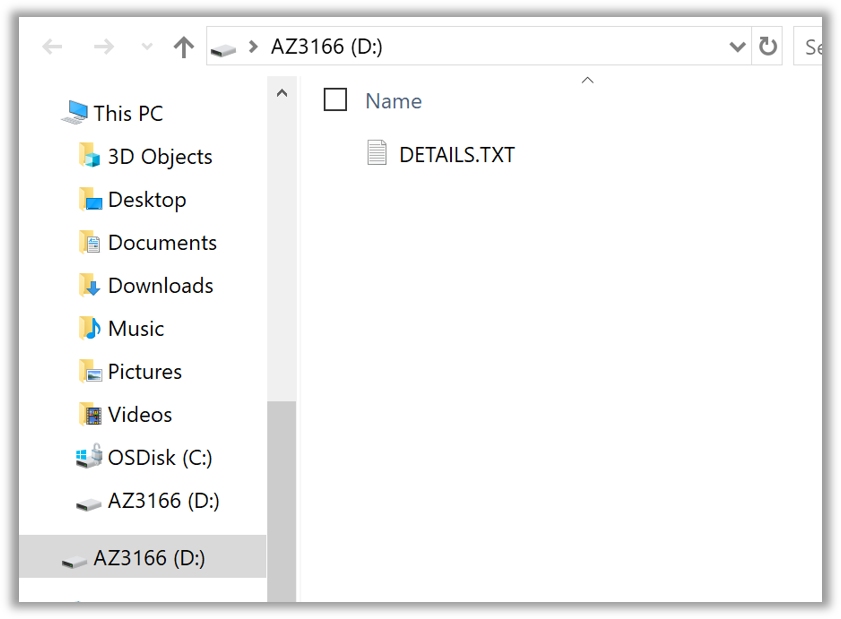

### Flash firmware on device

[Download the latest firmware](https://aka.ms/CFSFirmware ) (Bundled with HOL Downloads)
	
>[!Note]
> The download filename on the releases page looks like *AZ3166-IoT-Central-X.X.X.bin*.

Drag the AZ3166-IoT-Central-X.X.X.bin file into the file explorer drive window. When the copying is complete, the device reboots with the new firmware.

After rebooting, the firmware file will disappear.

> [!div class="mx-imgBorder"]
> 
	

## Create device alert rules in IoT Central

Now we need to set up rules in Azure IoT Central that will identify when a device reading needs attention - like when a button is pushed on the MXChip or when the temperature exceeds a defined threshold.

In the following steps, we'll create two device rules that will allow the passing of device data from the MXChip  to IoT Central and then to Connected Field Service. 

The first device rule will be a button B press that fires an alert into IoT Central and onto Connected Field Service. 

The second device rule will be a temperature alert that fires when a threshold is met, from IoT Central to Connected Field Service.

By setting up these rules, we allow for: 
- Anomaly detection from connected devices
- Uptime and downtime predictability  
- Dashboarding and reporting on device-specific information
- Integration with work order creation, scheduling, and dispatching with Connected Field Service

Go to IoT Central (for example, YOURORG.azureiotcentral.com) and sign in.

Once signed in, select **Create Device Templates**.

> [!div class="mx-imgBorder"]
> 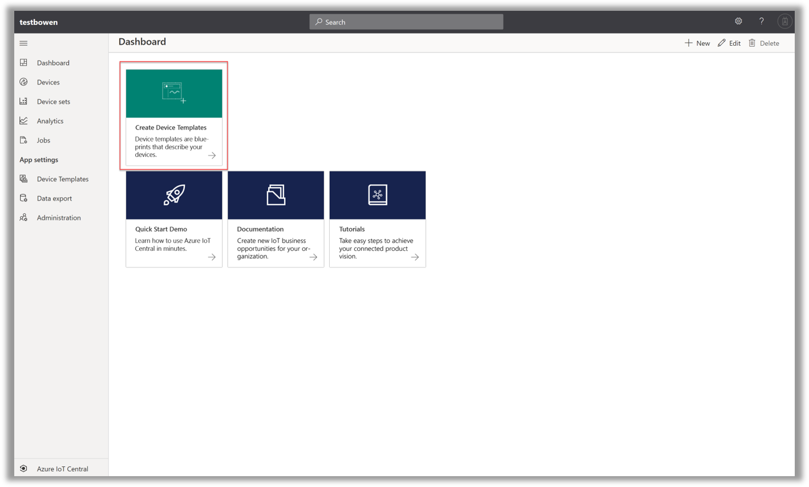

Select **MXChip**.

> [!div class="mx-imgBorder"]
> 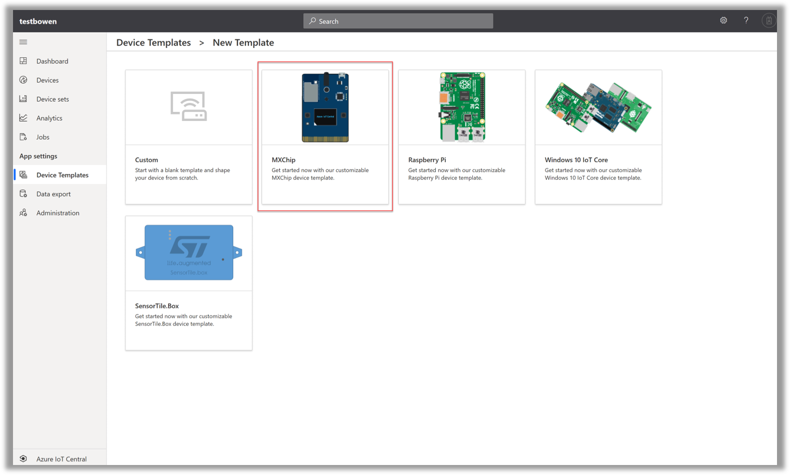

Select **Create**.

> [!div class="mx-imgBorder"]
> 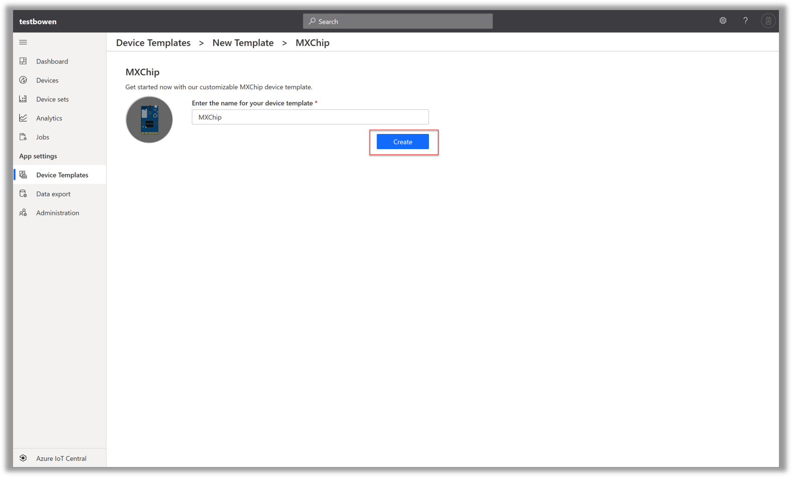

Select **Device Templates** and then select **MXChip**.

> [!div class="mx-imgBorder"]
> 

Select **Rules** tab.

> [!div class="mx-imgBorder"]
> 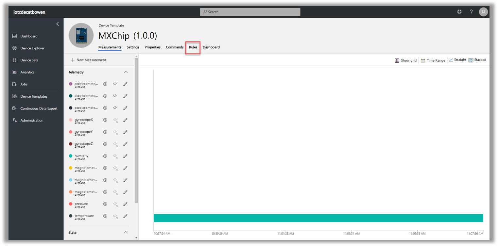

### Button B press rule

Select **+New Rule**.

> [!div class="mx-imgBorder"]
> 

Select **Event** when presented the option.

> [!div class="mx-imgBorder"]
> 

Enter the following information: 

- Name: Button B Press
- Measurement: Button B Press 
- Aggregation: None

Then **Save**.

> [!div class="mx-imgBorder"]
> 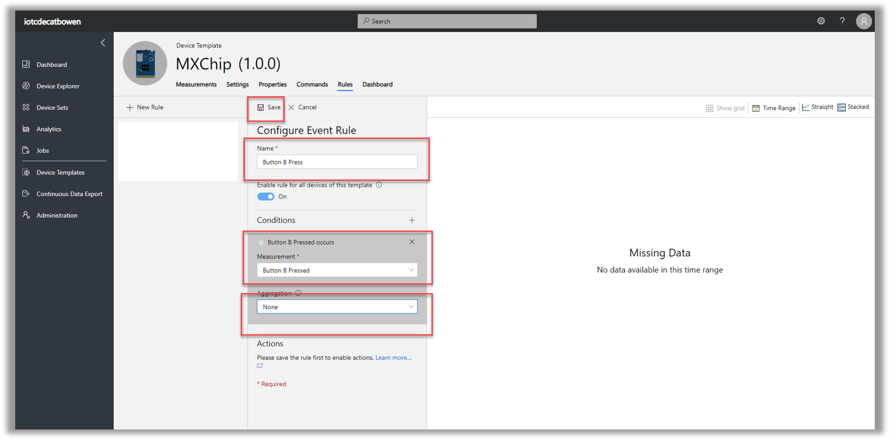

### High temperature alert rule

Select **+New Rule** again.

> [!div class="mx-imgBorder"]
> 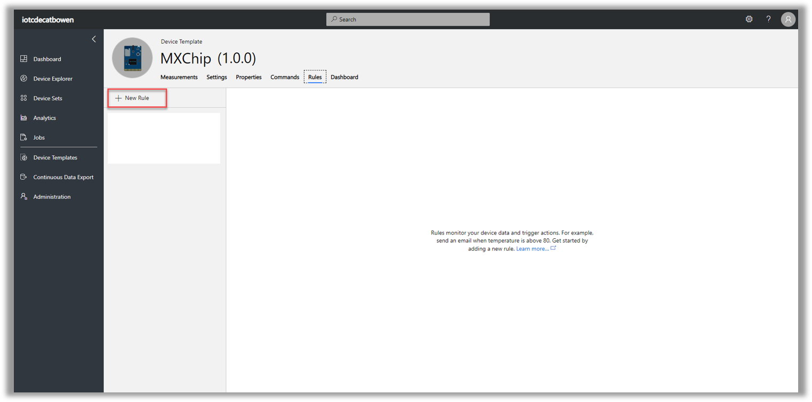

Select **Telemetry**.

> [!div class="mx-imgBorder"]
> 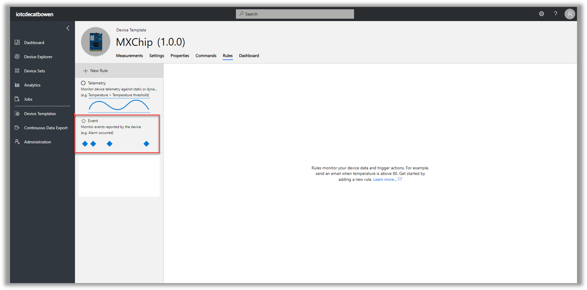

Enter the following information: 

- Name: Temperature Alert
- Measurement: Temperature
- Aggregation: None
- Operator: Is Greater Than
- Threshold: 15

Then **Save**.

> [!div class="mx-imgBorder"]
> 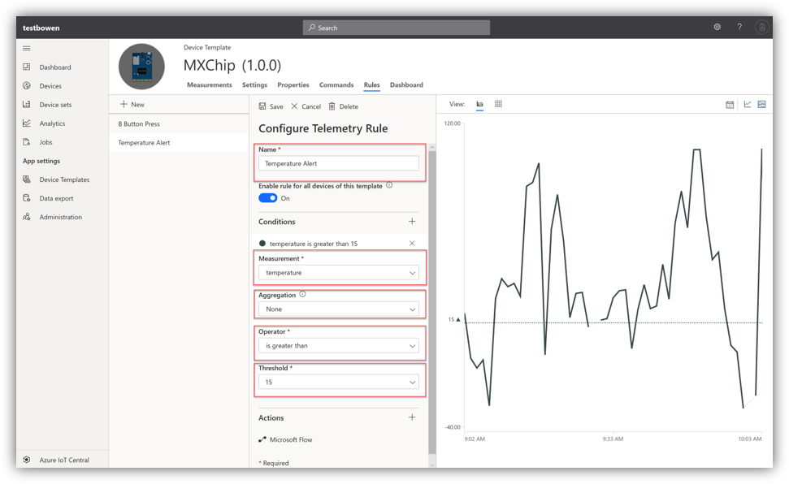

## Set up Power Automate flows to create IoT Alerts

Next we need to set up workflows to create IoT alerts in Field Service based on the device readings and rules in Azure IoT Central.

Go to Connected Field Service and then to **IoT Alerts** (under **My Work**) and select **Create IoT Flows**. 

> [!div class="mx-imgBorder"]
> 

Select **Create CFS alerts from IoT Central**. Make sure you select the CDS version. 

> [!div class="mx-imgBorder"]
> 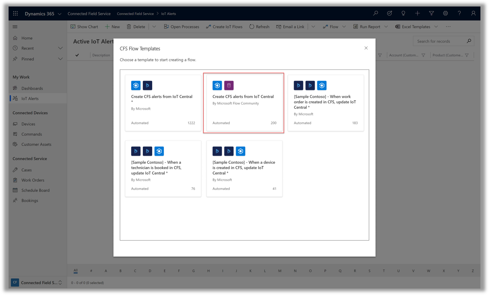

>[!Note]
> You may need to sign into Power Automate with credentials if you haven’t already

In Power Automate, make sure you're connected to your Connected Field Service org and your IoT Central.

Select **Continue**. 

> [!div class="mx-imgBorder"]
> 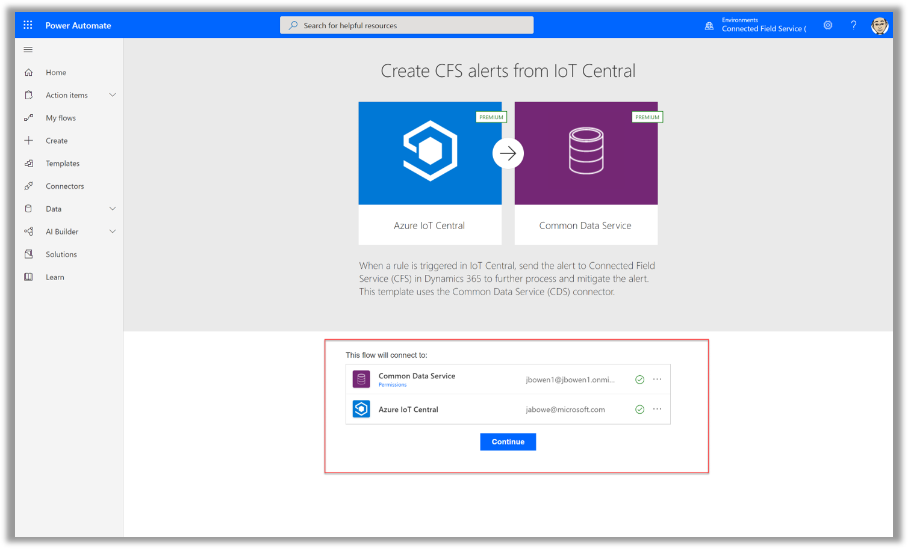

Enter the following information: 

- Application: Select IoT central application name 
- Rule: Select Button B Press
- Organization Name: Select Dynamics 365 Connected Field Service Org 
- Entity Name: Select IoT Alerts

Select **Save**.

> [!div class="mx-imgBorder"]
> 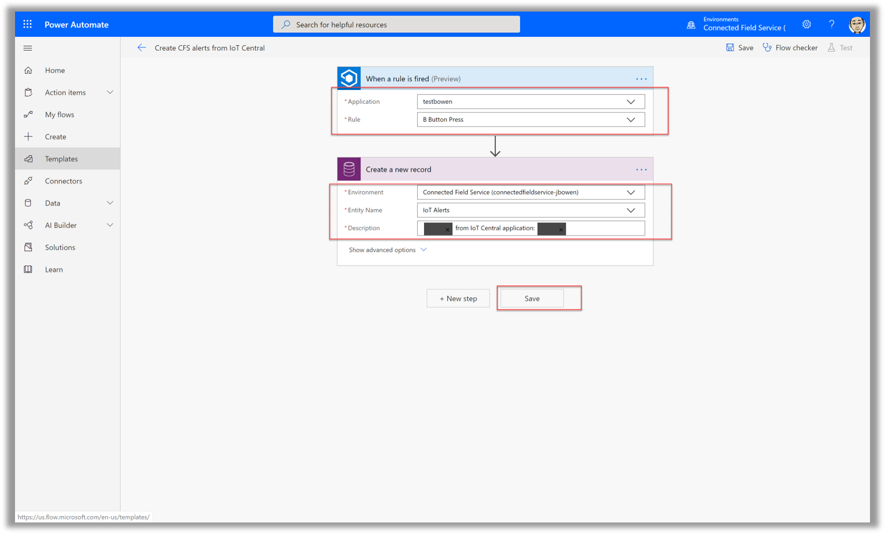

Add **Temp Alert** to **Power Automate Name**.

Enter the following information: 

- Application: Select IoT central application name 
- Rule: Select Temperature Alert
- Organization Name: Select Dynamics 365 Connected Field Service Org 
- Entity Name: Select IoT Alerts

Select **Save**.

> [!div class="mx-imgBorder"]
> 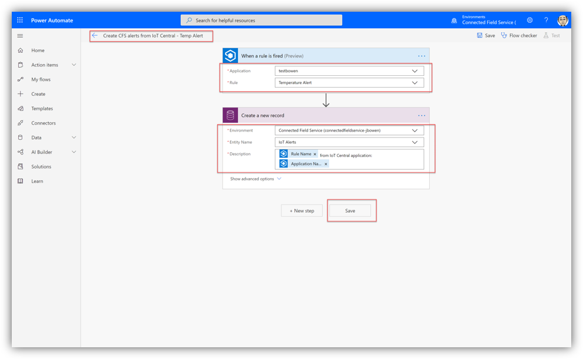

Go to **My Flows** and see newly created alert flows.

> [!div class="mx-imgBorder"]
> 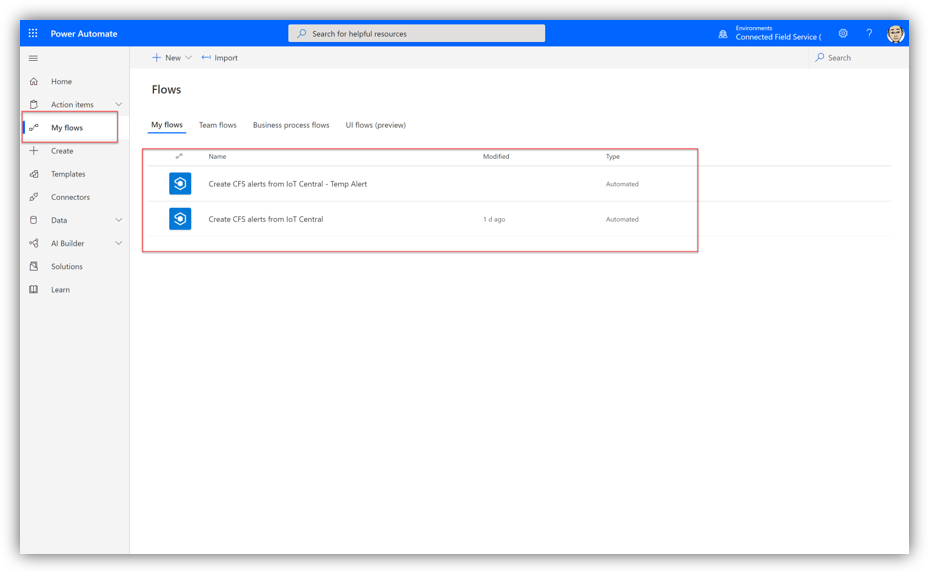

## Add MXChip as connected device in IoT Central 

Next we need to set up the MXChip as an IoT device. This can be one of many IoT devices that you will monitor.

Go to IoT Central and sign in if you haven't already. 

> [!div class="mx-imgBorder"]
> 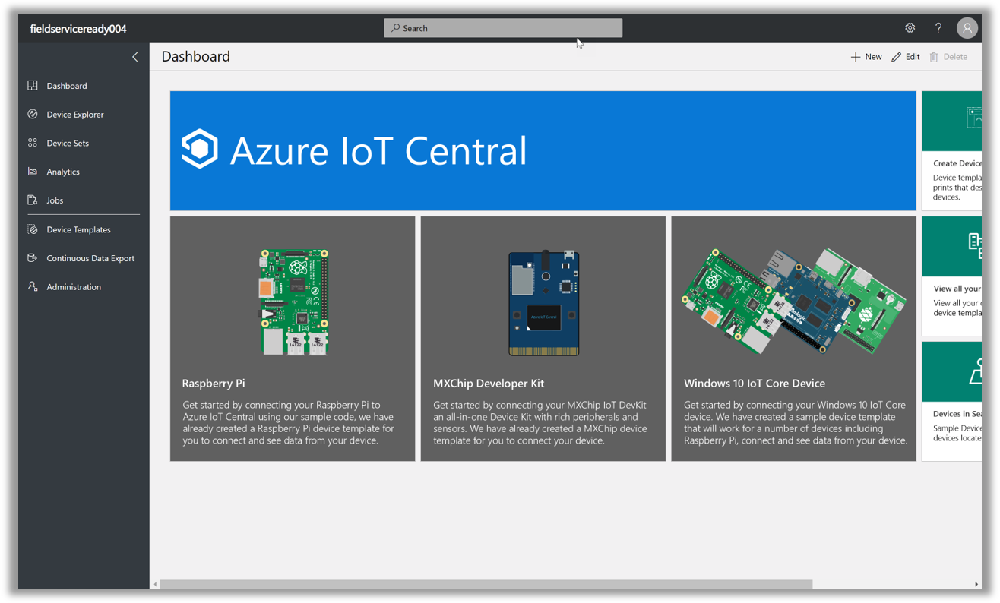

Select **Device Templates** and **MXChip(1.0.0) Template**.

Under the plus sign icon dropdown menu, elect **Real** and then **New Device**. 

> [!div class="mx-imgBorder"]
> 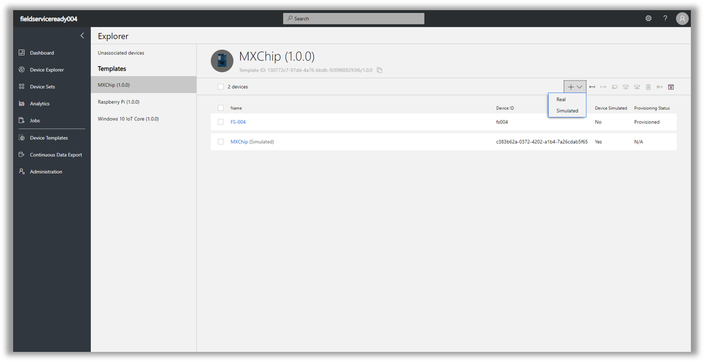

Create a unique **Device ID** and a **Device Name**.

> [!div class="mx-imgBorder"]
> 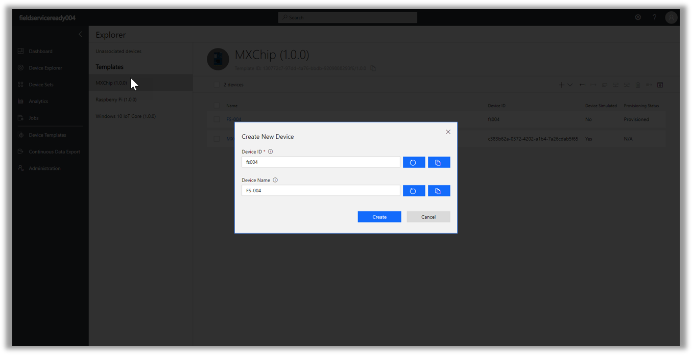

Select **Create**, and then select **Connect**.

Copy and paste to Notepad the **Scope**, **Device ID**, and **Primary Key** for MXChip Setup in the next step

> [!div class="mx-imgBorder"]
> 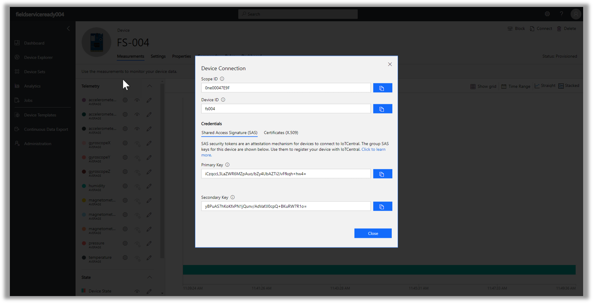

## Plugin and connect MXChip

Now it's time to connect the MXChip to your computer and network.

Connect AZ3166 to Power and press the **Reset** button.

Wait until the searching for Wi-Fi screen goes away; this usually takes about 45-60 seconds.

Hold down the A and B buttons; AZ3166 will hard reset; this usually takes about 15-20 seconds.

Press **Reset** when directed to by the LCD screen.

When the device reboots, it should be in AP Mode with the SSID Starting with AZ3166.

Repeat steps as necessary; in the end, it should look like the following image: 

> [!div class="mx-imgBorder"]
> 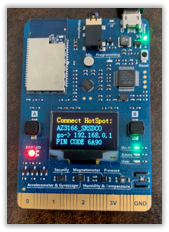

After the device reboots, you need to configure the Wi-Fi on the device. You should see a device name starting with AZ3166_ in your Wi-Fi tray; connect to that. 

>[!Important]
> This step will kick you off the internet and hook up to the MXChip.

Once connected, go to this address: http://192.168.0.1/start.

> [!div class="mx-imgBorder"]
> 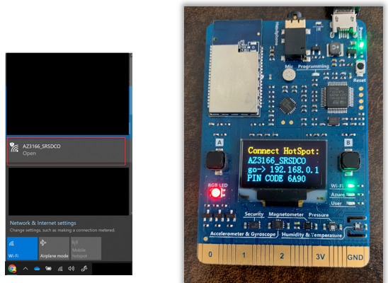

Get the device pin from your device's display.

Add in the Device ID, Scope ID, and Primary Key you copied from IoT Central.

Select **Configure Device**.

> [!div class="mx-imgBorder"]
> 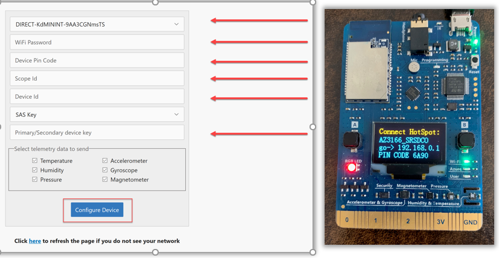

After you see a confirmation on your PC, press the **Reset Button** on the device.

> [!div class="mx-imgBorder"]
> 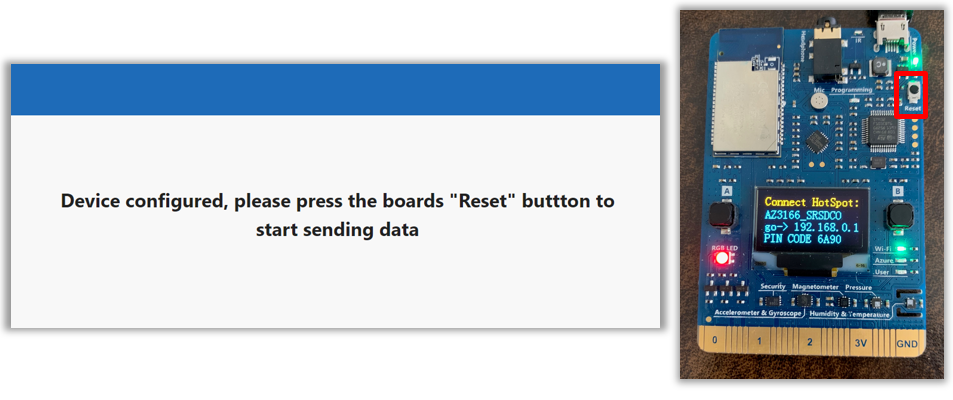

## See device data in IoT Central

Next we want to identify where in IoT Central the MXChip's device readings will display.

Go to IoT Central.

Select **Devices**.

Select the MXChip.

> [!div class="mx-imgBorder"]
> 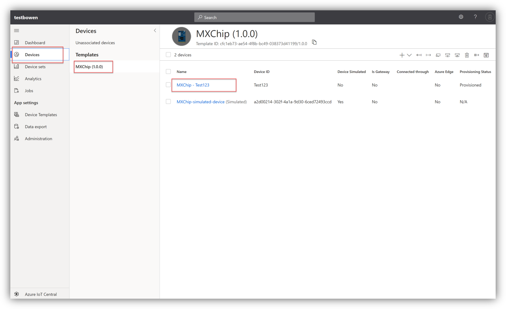

You can control what data you see on the chart by selecting the eyes in the list titled **Telemetry**.

> [!div class="mx-imgBorder"]
> 

## See IoT alerts in Field Service 

Next, create real IoT device data with the MXChip. To trigger the rules we identified earlier, you can:

1. Press the **B button** on the front of the device, or 
2. Increase the temperature of the surrounding area.

To see these alerts, go to Connected Field Service. 

Select **IoT Alerts**.

You should see the two alerts in the list of Active IoT Alerts.

> [!div class="mx-imgBorder"]
> 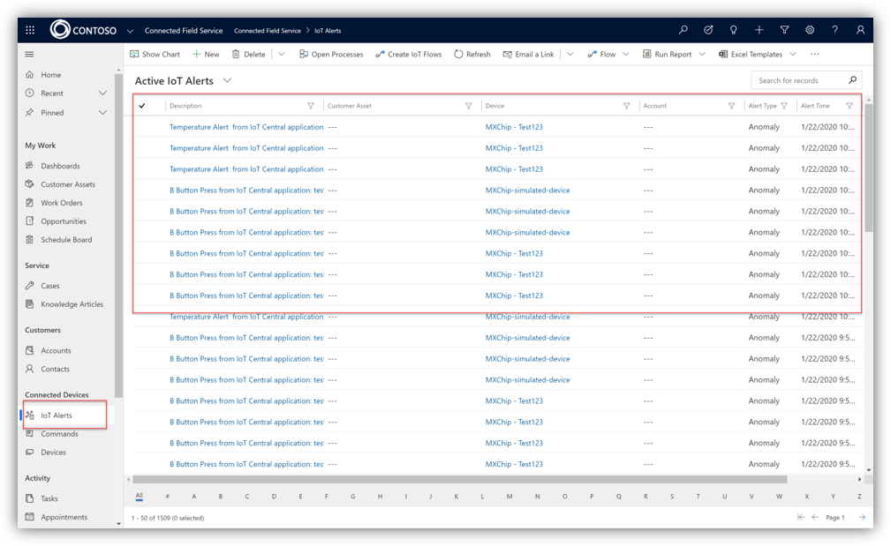

When you select a single alert (in this case, a temperature alert), you'll see all the information about the detected anomaly. You can switch to a JSON view if needed. This particular temperature alert starts the work order scheduling process, as highlighted in the following screenshot. 

> [!div class="mx-imgBorder"]
> 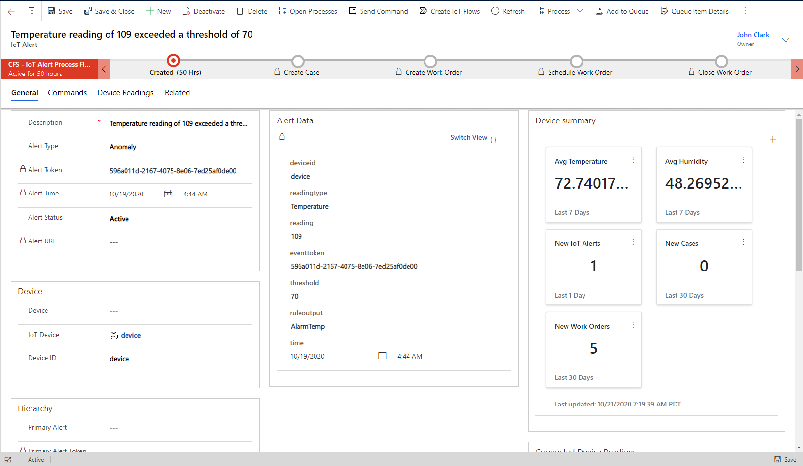

## Create customer asset and connect device

Next, we'll relate the MXChip device to a customer asset in order to relate work orders and enable asset management.

Go to **Customer Assets** and select **+New**.

> [!div class="mx-imgBorder"]
> 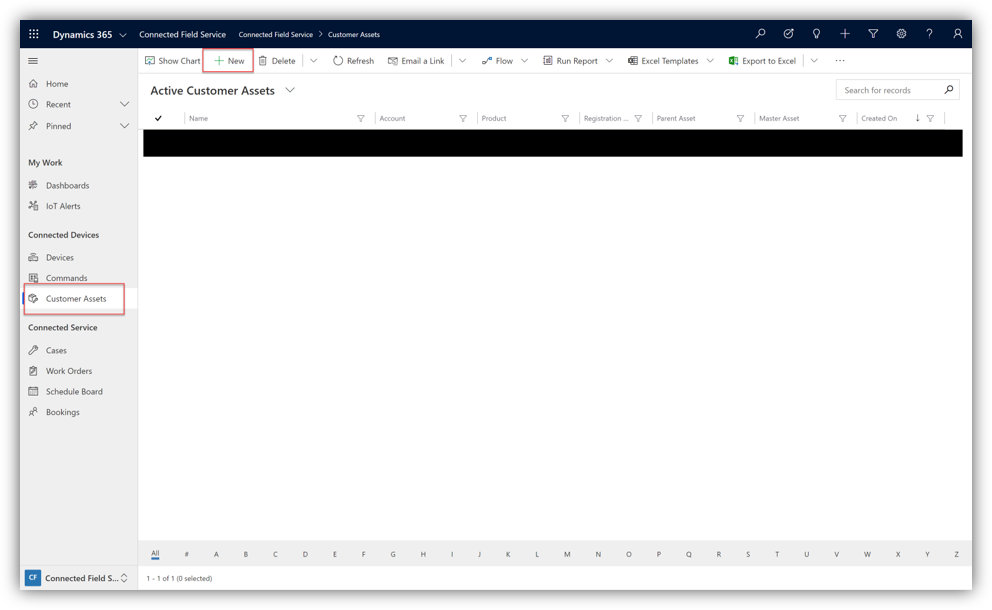

Give this asset the name "Master MXChip," and then **Save**.

Then, select **Connect Device**.

> [!div class="mx-imgBorder"]
> 

Find the device when prompted, and select **OK**.

> [!div class="mx-imgBorder"]
> 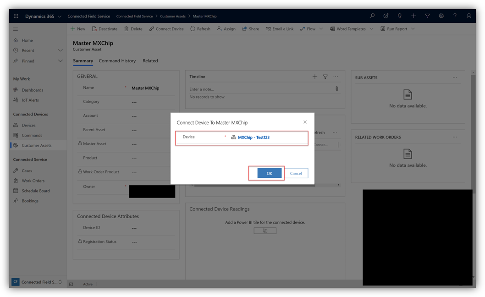

You should now see the device on the customer asset, under **Connected Devices**.

> [!div class="mx-imgBorder"]
> 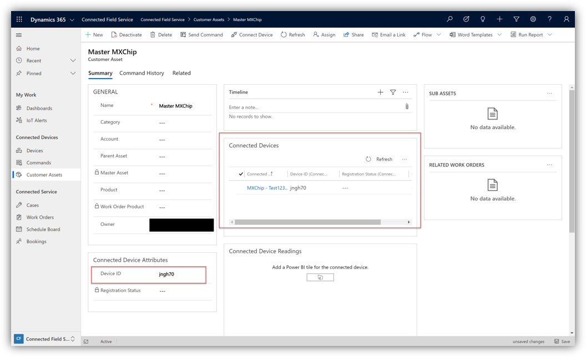

## See also

-  [Set up Connected Field Service with Azure IoT Central](https://youtu.be/Sp7_JoXjHDk)

- [MXChip developer site](https://aka.ms/iot-devkit)

- [Connect an MXChip IoT DevKit device to IoT Central](/azure/iot-central/howto-connect-devkit)

- [MXChip 2.1 Firmware on GitHub](https://github.com/Azure/iot-central-firmware/releases/tag/mxchip-v2.1.0)

- [Overview of Connected Field Service with IoT Central](/dynamics365/customer-engagement/field-service/cfs-iot-overview)

[!INCLUDE[footer-include](../includes/footer-banner.md)]