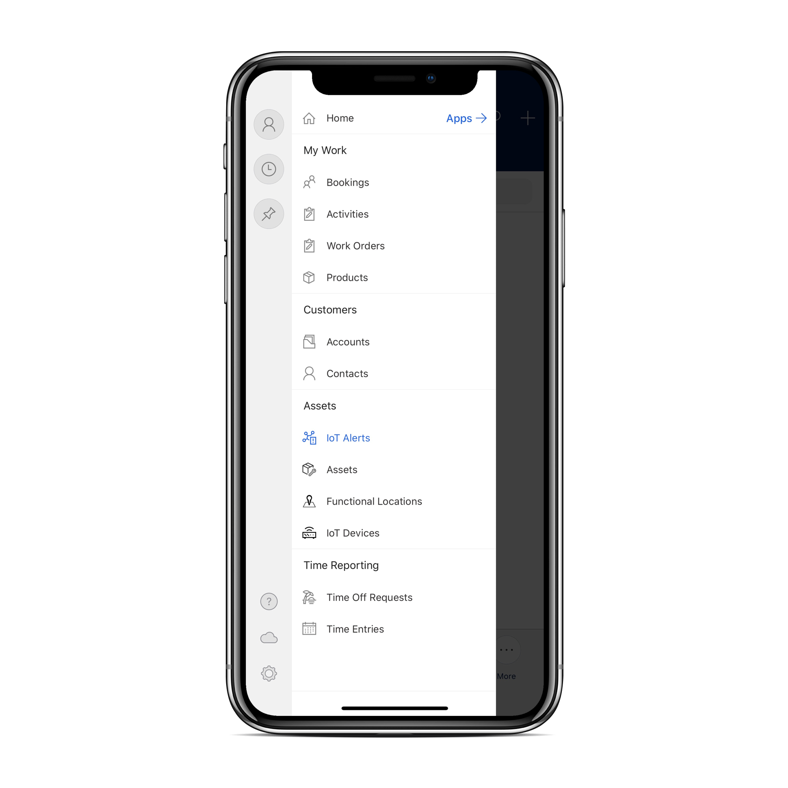
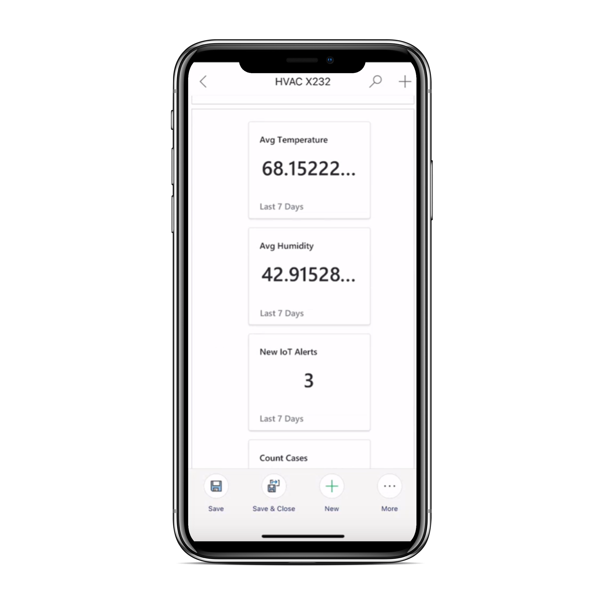
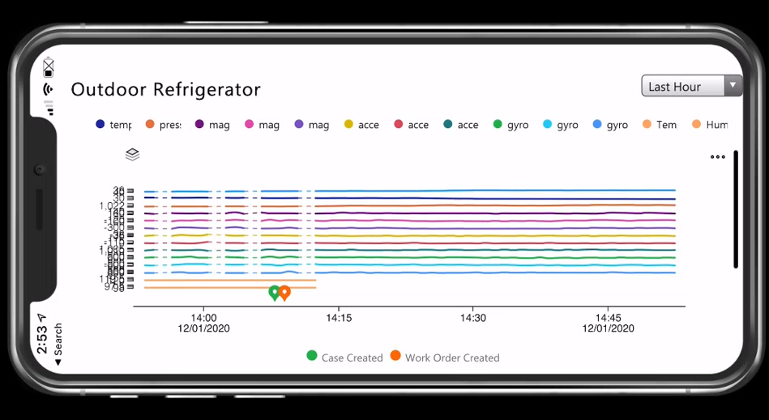
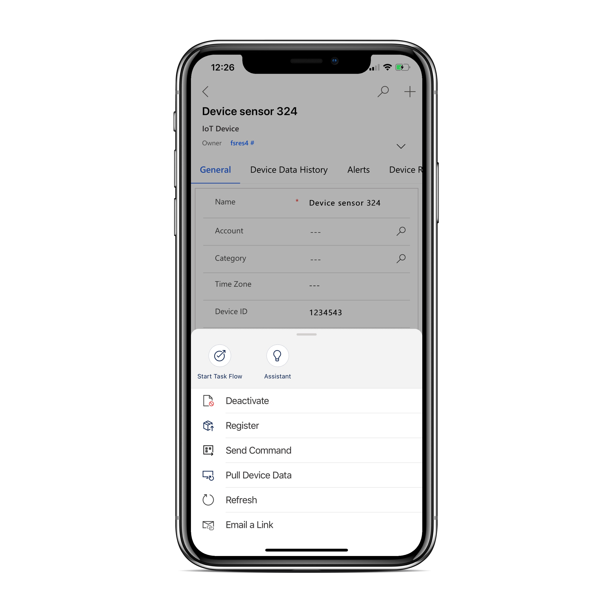

# Connected Field Service on Field Service (Dynamics 365) mobile app

Organizations using Connected Field Service to create work orders from IoT data can provide technicians with IoT data and Connected Field Service actions to improve onsite service delivery.

Most often, technicians will use Connected Field Service to:

1. **View IoT data** related to assets to better understand the context of a repair.
2. **Register new IoT devices** when installing an asset to connect it to Azure IoT or a custom IoT provider.
3. **Send commands** to troubleshoot issues.

With the latest version of Field Service and the Field Service (Dynamics 365) mobile app, technicians will find Connected Field Service entities in the sitemap.

> [!div class="mx-imgBorder"]
> 

## Prerequisites

- Connected Field Service is included with Field Service.
- Make sure that Connected Field Service is set up.
- The Field Service (Dynamics 365) mobile app. Make sure you have the latest mobile app and latest Field Service version.
- You must have an internet connection.

## View summary tiles and device readings

While performing a work order for an asset, technicians may want to view recent IoT data for devices related to that asset.

Go to the customer asset record and on the summary tab, you will find summary tiles.

Summary tiles show an overview of recent IoT activity related to the asset.

> [!div class="mx-imgBorder"]
> 

Next, go to the **Device Readings** section to see the most recent IoT measurements plotted on a graph.

> [!div class="mx-imgBorder"]
> 

Summary tiles and device readings are only visible after an asset is related to a connected device. Otherwise, this information is displayed on the IoT device or IoT alert.

## Register new IoT Devices

During asset installations, technicians may want to connect new IoT devices to Azure IoT. From your internet-connected mobile app, go to the IoT device record (or create a new one), and select **More ...** > **Register**.

> [!div class="mx-imgBorder"]
> 

This will create the IoT device in Azure IoT.

1.  On your mobile device, open the mobile app.

2.  Tap **Customer Assets**, and then tap the **Add** button.

3.  Fill in the asset information and, then tap **Register Device**.

## Troubleshoot by sending commands

After an administrator has configured commands in Azure IoT, technicians can run the commands from the Field Service (Dynamics 365) mobile app.

Common commands include restart and shutdown, among other custom commands that are device-specific.

From the IoT device record, go to **More ...** > **Send command** then choose a specific command.
