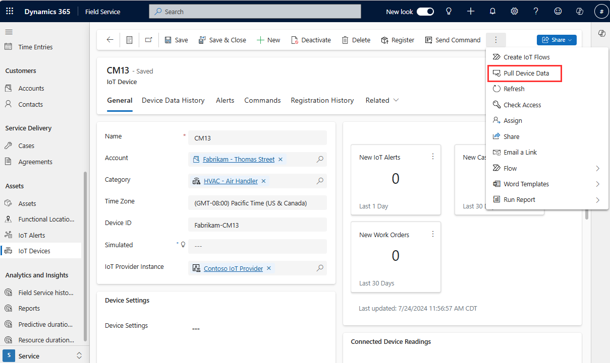
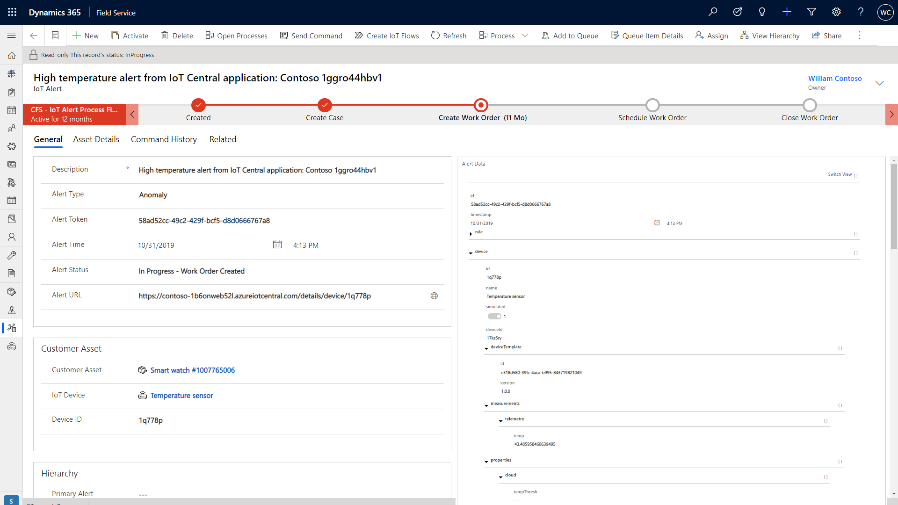
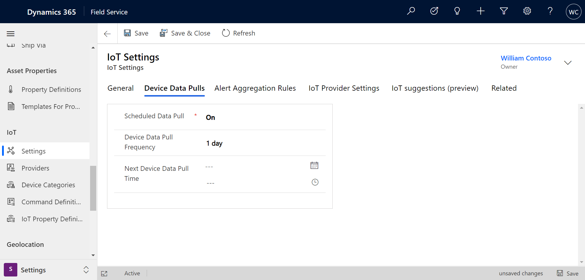

# Pull device data in Connected Field Service

In this article, we'll walk through a few ways you can pull device data from your IoT connected devices into Connected Field Service.

For an additional walkthrough, check out the following video.

> [!VIDEO https://www.microsoft.com/videoplayer/embed/RE4HKuF]

## Prerequisites

- [Register your IoT Devices](cfs-register-devices.md) before you can pull the latest data into Field Service.

## Pull device data

Go to an **IoT Device**, and select **Pull Device Data** to pull in the most recent device data. See the following screenshot for reference.

> [!div class="mx-imgBorder"]
> 

From the **Device Data History** tab on the device, you'll find a list of all data pulls for this device.

> [!Note]
> You can pull device data from a customer asset if the customer asset is [connected to IoT devices](https://docs.microsoft.com/dynamics365/field-service/cfs-register-devices#connect-to-asset). Select **Pull Device Data** in the ribbon of the customer asset record.

## Device data on IoT alerts

When IoT alerts are triggered, device data is automatically pulled for the associated device.

> [!div class="mx-imgBorder"]
> 

## Schedule device data pulls

If you're using Azure IoT Hub as your IoT provider, you can also schedule device data pulls to happen when you need them.

Go to **IoT Settings** > **Device Data Pulls** tab. Set **Scheduled Data Pull** to **On**. Then configure the frequency as needed.

> [!div class="mx-imgBorder"]
> 

[!INCLUDE[footer-include](../includes/footer-banner.md)]