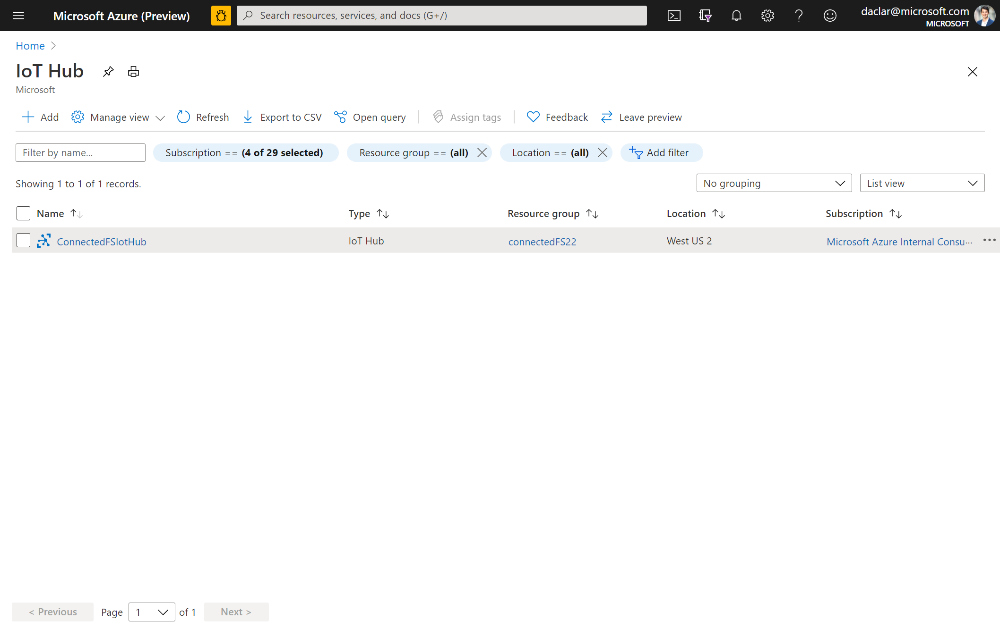
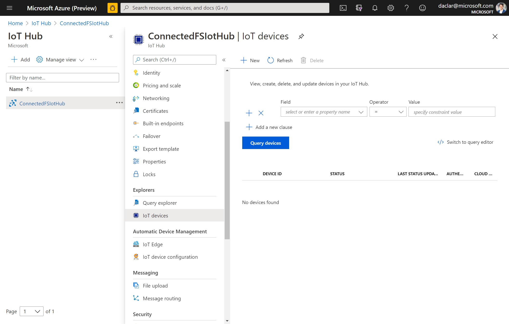
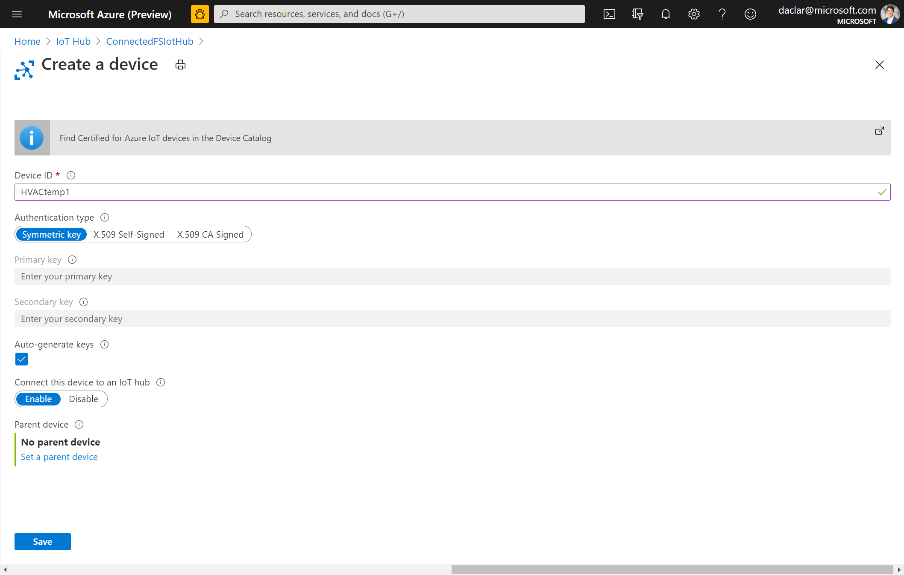
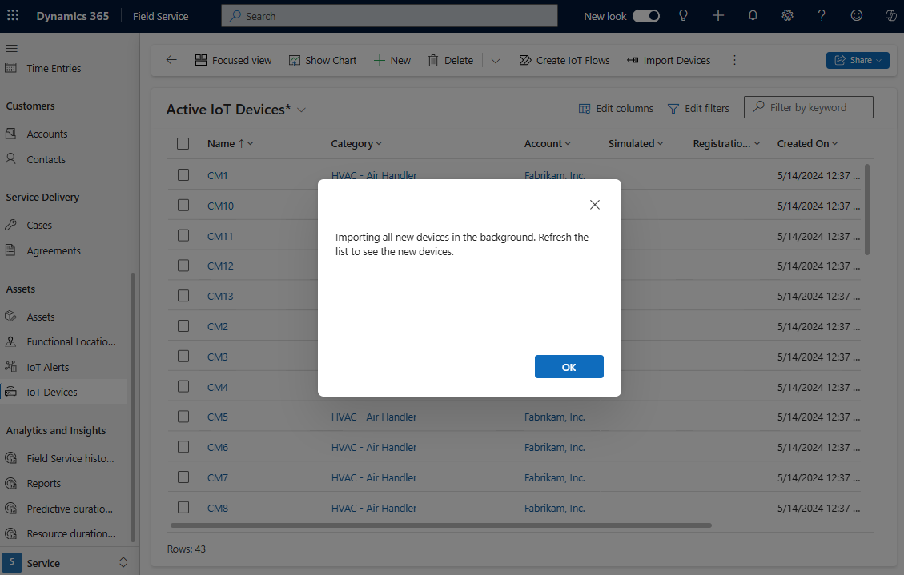
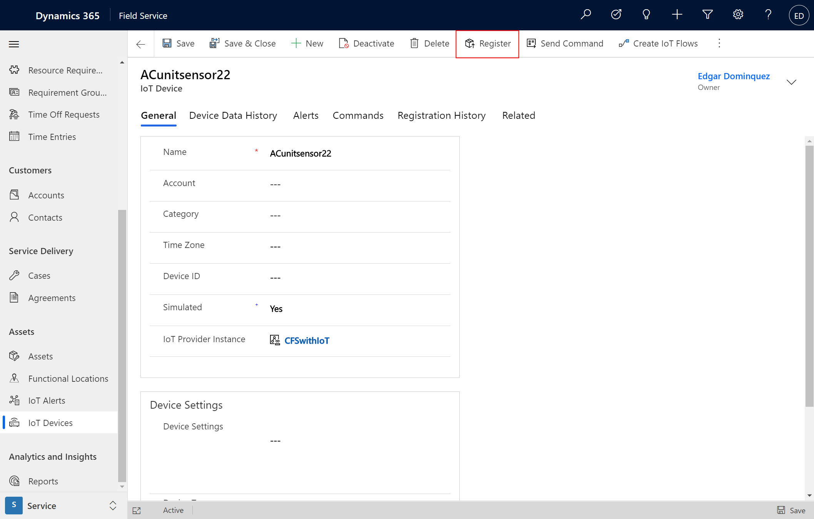
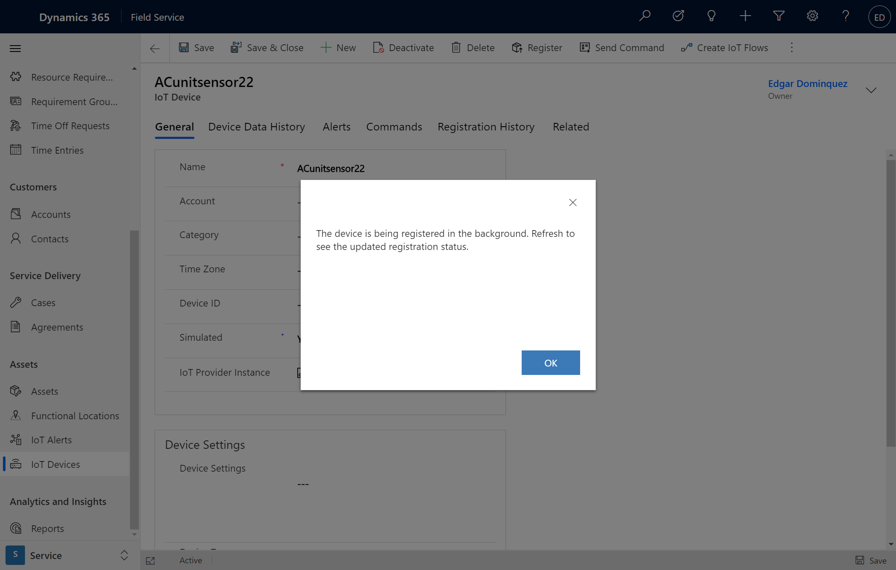
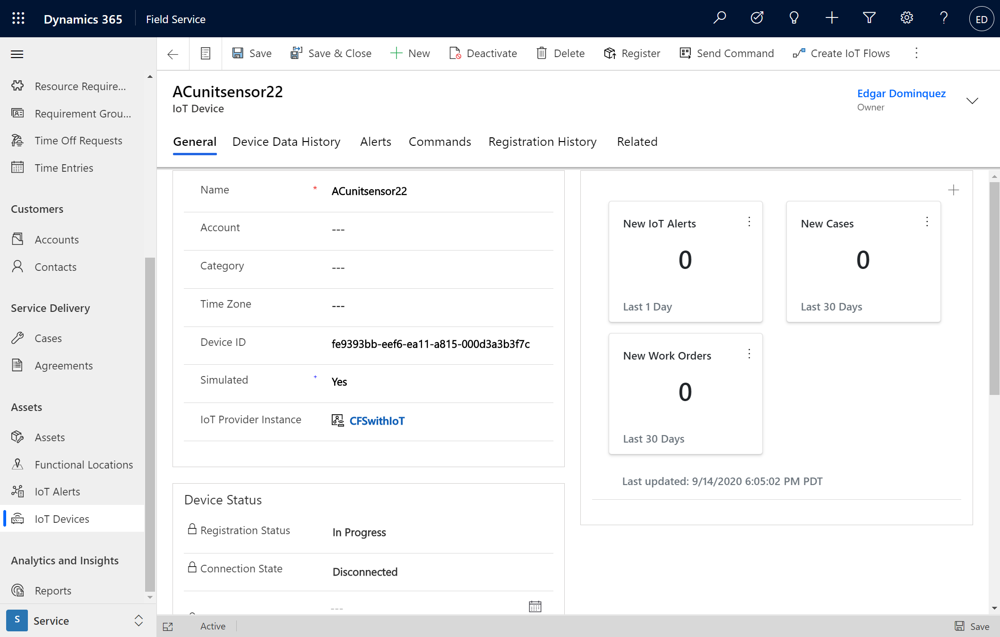
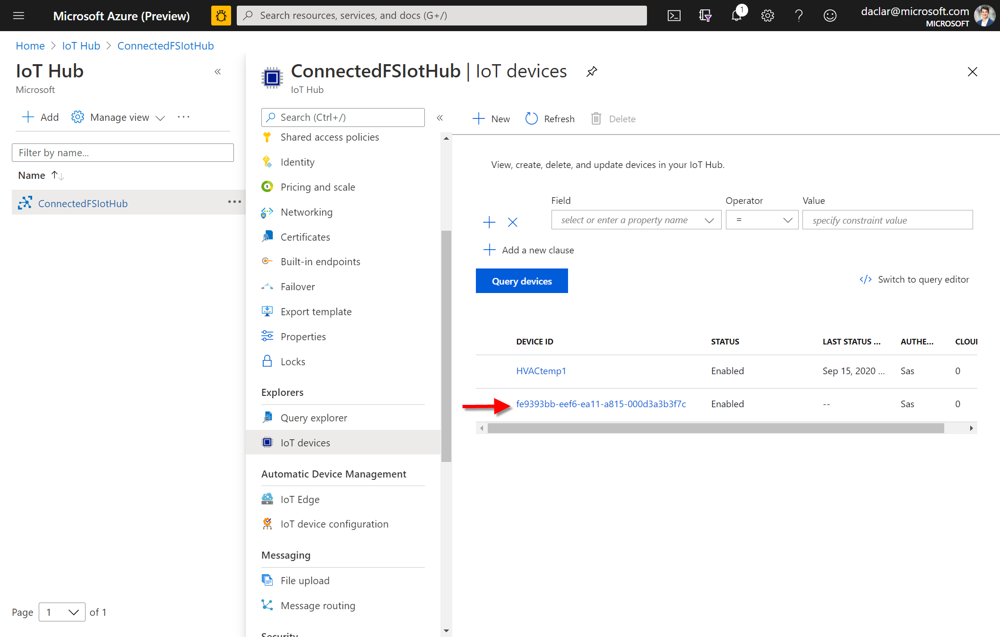
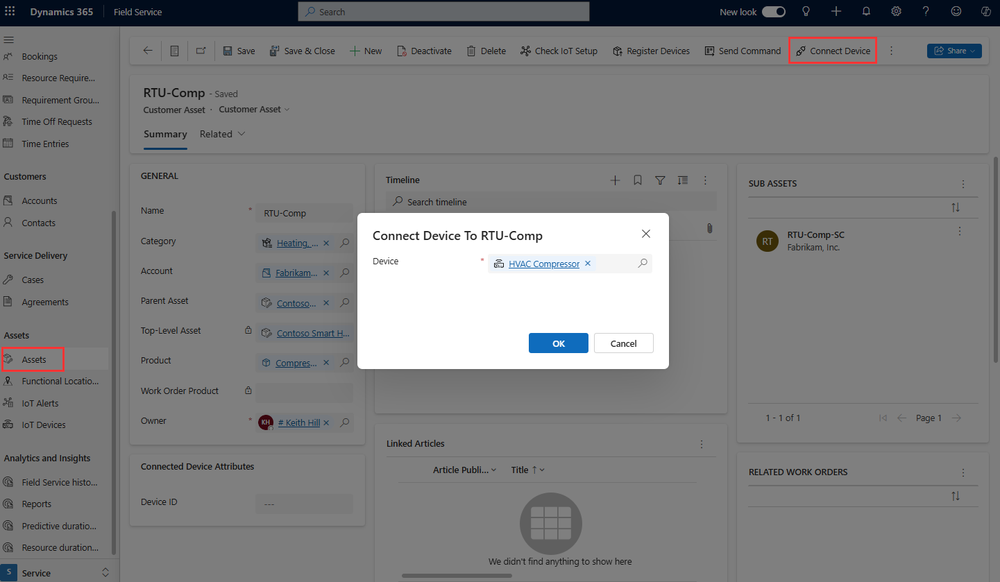
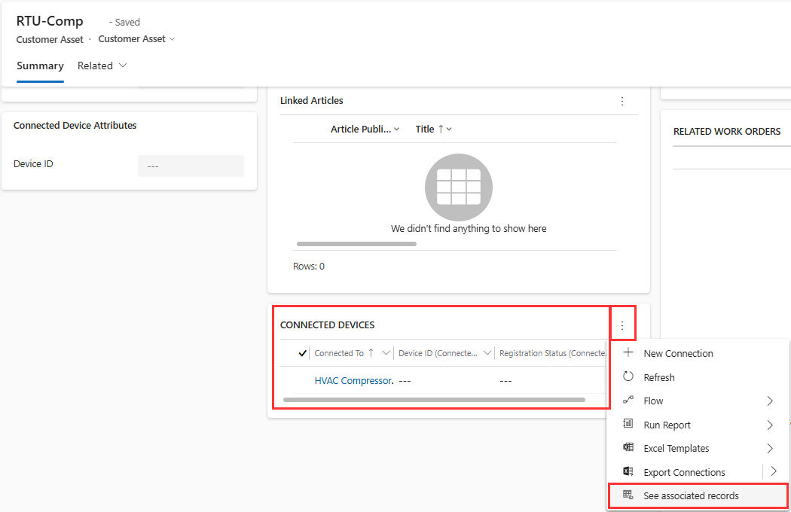

# Register IoT devices in Dynamics 365 Field Service

In order for an appliance or other asset to become "smart" and connect to an IoT backend, it must have sensors that can take device readings and send that information to the cloud. We call these sensors IoT devices.

Field technicians might need to interact with IoT devices in several ways:

1. If a field technician is installing an entirely new asset like an air conditioner, and that air conditioner has an embedded IoT device or devices, they must register that device with the appropriate IoT backend in order for it to start working. 

2. Field technicians might need to service an existing asset, and then install a new IoT device that will start sending signals to an IoT backend.

3. While onsite, a field technician might need to interact with and receive data from existing IoT devices in order to better troubleshoot their maintenance or repairs.

In this article, we’re going to look at a few ways to register a new IoT device in Connected Field Service, and make sure that IoT device is associated with the correct customer asset in Field Service. While you can use [custom IoT providers with Connected Field Service](cfs-custom-iot-provider.md), we're going to use Azure IoT Hub in the following examples.

For a guided walkthrough, check out the following video.

> [!VIDEO https://www.microsoft.com/videoplayer/embed/RE4GEjn]

## Prerequisites

- Connected Field Service must be connected to Azure IoT Hub or another custom IoT provider. For more information, see the [article on getting set up with Azure IoT Hub](installation-setup-iothub.md), or the article on [setting up custom IoT providers](cfs-custom-iot-provider.md).

## Create and register an IoT device from IoT Hub

First, let's look at how to register a new device from Azure IoT Hub.

Go to Azure IoT Hub and select an environment.

> [!div class="mx-imgBorder"]
> 

From the environment, go to **IoT devices** > **+New**.

> [!div class="mx-imgBorder"]
> 

Give the device a descriptive ID (in our example, we name it "HVACtemp1") and **Save**.

> [!div class="mx-imgBorder"]
> 

Head over to Dynamics 365 Field Service, then to **Assets** > **IoT Devices**, and select **Import Devices**.

> [!div class="mx-imgBorder"]
> 

Any new devices registered back in Azure IoT Hub will now appear in the list of active IoT devices in Field Service.

We’ll still need to connect this new device to the relevant customer asset, which will we do later in this article.

## Create and register an IoT device from Field Service

You can also create an IoT device directly in Field Service.

From **Field Service** > **Assets** > **IoT Devices** > **+New**. Give the IoT device a descriptive name, then **Save**. Finally, select **Register** in the top ribbon. 

> [!div class="mx-imgBorder"]
> 

Selecting **Register** sends the new device information back to Azure IoT Hub, which the system tells you with a message seen in the following screenshot.

> [!div class="mx-imgBorder"]
> 

Once the device is synced back to Azure IoT Hub, a device ID will be generated and synced back to the IoT device in Field Service.

> [!div class="mx-imgBorder"]
> 

Back in Azure IoT Hub, we now see the IoT device we created in Field Service, with its new device ID. 

> [!div class="mx-imgBorder"]
> 

## Connect to asset

After we've created the IoT device record, we'll need to associate it with a new or existing customer asset. For instance: in our example, we have a new IoT device sensor that has been installed in an air conditioning unit.

In Field Service, go to **Assets** and find the customer asset you need to associate with the new IoT device. 

From the customer asset, select **Connect Device** in the top ribbon, and look up the newly created IoT device.

> [!div class="mx-imgBorder"]
> 

Once the IoT device has been associated with the asset, a new section will appear called **Connected Devices**, where you can see information about the new IoT device.

> [!div class="mx-imgBorder"]
> 

> [!Note]
> Multiple IoT devices can be associated with a single customer asset. On the asset, go to **Related** > **Connections** to associate additional IoT devices.

## Registration error

When a device does not register, you'll see an error in the **Registration Status** field of the asset record. For assets with multiple devices, device status will show the error message for each device.  
  
This error may occur if Dynamics 365 is not connected to Azure or if Azure is offline.