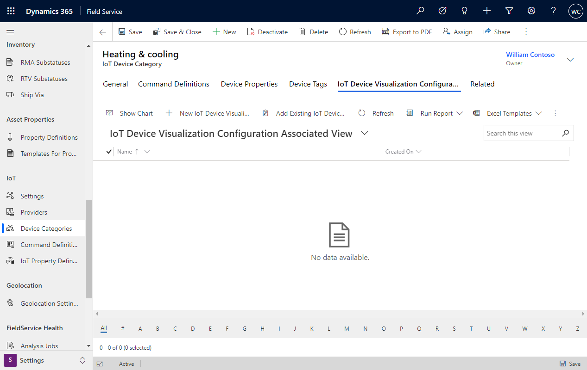

# Summary tiles in Connected Field Service

Summary tiles give a numeric overview of important metrics related to IoT devices. For example, users can see an average of recent device readings or the number of work orders generated from an IoT alert. Summary tiles are visible on IoT devices, Iot alerts, and customer asset records.

> [!div class="mx-imgBorder"]
> 

## Prerequisites

- Field Service version 8.8.2+

## Default summary tiles

After a new IoT device is created, there are three default summary tiles: 

- New IoT alerts related to the IoT device in the last day.
- New cases related to the IoT device in the last 30 days.
- New work orders related to the IoT device in the last 30 days.

> [!div class="mx-imgBorder"]
> 

If an IoT device is registered with Azure IoT (or a custom IoT provider) and has successfully pulled device data into Field Service, summary tiles for the first two device properties are automatically created. In the following example screenshot, there are summary tiles for average temperature and average humidity for the last seven days. Temperature and humidity are the first two device properties in the first device data pull.

> [!div class="mx-imgBorder"]
> 

> [!Note]
> The device summaries use the device data history information on the device record, which updates with a slight delay (30-60min); however, you can use the **Pull Device Data** option to get the latest data from Azure IoT.

## Edit summary tiles

You can also edit existing summary tiles or create new ones.

> [!div class="mx-imgBorder"]
> 

When creating new summary tiles, choose if it should relate to a **Device Measurement** (like temperature or humidity as examples) or a **Device Event** (like the creation of a work order).

> [!div class="mx-imgBorder"]
> 

Edits to summary tiles are saved to the related IoT device. When that IoT device is related to IoT alerts or customer assets, the changes to the summary tiles will follow.

You can display up to six summary tiles.

## Add summary tiles via device categories

Organizations often want to apply summary tiles to a group of IoT devices, rather than edit the summary tiles on each IoT device. To apply summary tiles to a group of IoT devices, associate the tiles with device categories.

Go to **Settings** > **Device Categories**.

Select or create a new device category.

> [!div class="mx-imgBorder"]
> 

From the device category record, create a new IoT Device visualization configuration. Each configuration corresponds to a summary tile.

Make sure your IoT devices are related to the device category. You can add all IoT devices that belong to the category from the device category. Alternatively, there is a field on each IoT device to associate a category.

> [!Note]
> Manually editing summary tiles for an IoT device will override the summary tiles applied through device categories.

## View summary tiles on the mobile app

Summary tiles and device readings are viewable on the mobile app when connected to the internet. For more information, see the article on [Connected Field Service on Field Service (Dynamics 365) mobile app](https://docs.microsoft.com/dynamics365/field-service/cfs-mobile-powerapp#view-summary-tiles-and-device-readings). 

## Configuration considerations

- The device summary is only displayed on customer assets if there is one related device, even though multiple devices can be related to one customer asset.

## Additional notes

- Summary tile calculations respect security roles and will change based on the number of alerts, work orders, and so on, that the signed-in user has access to.