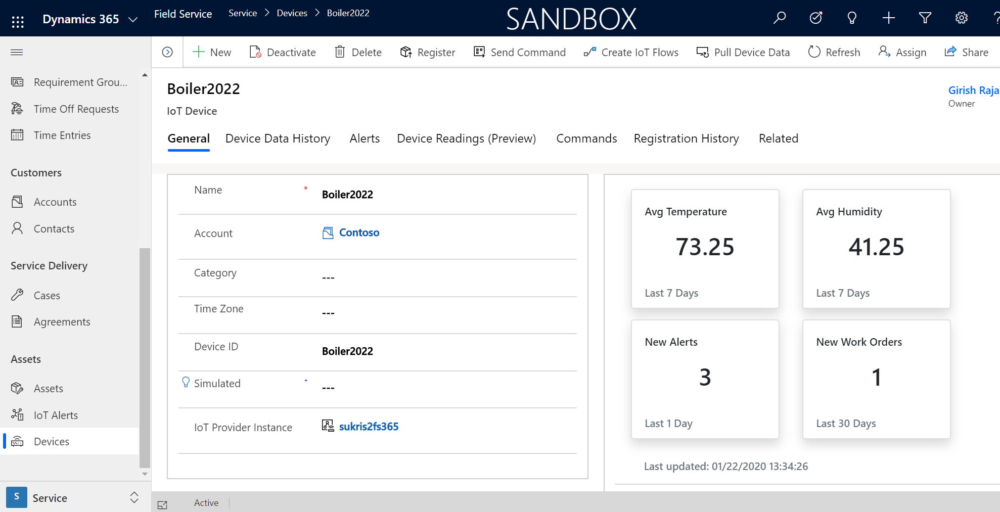
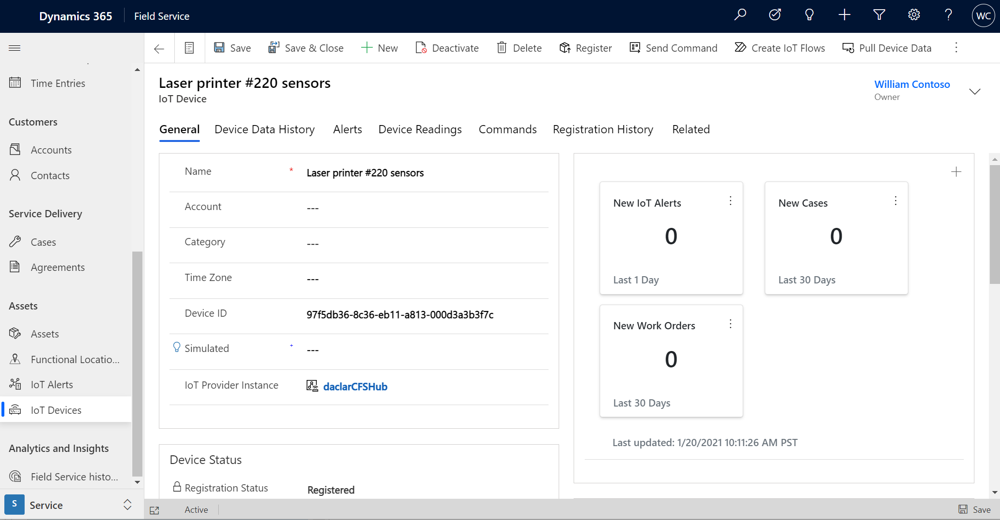
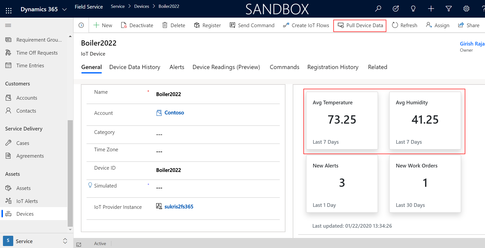
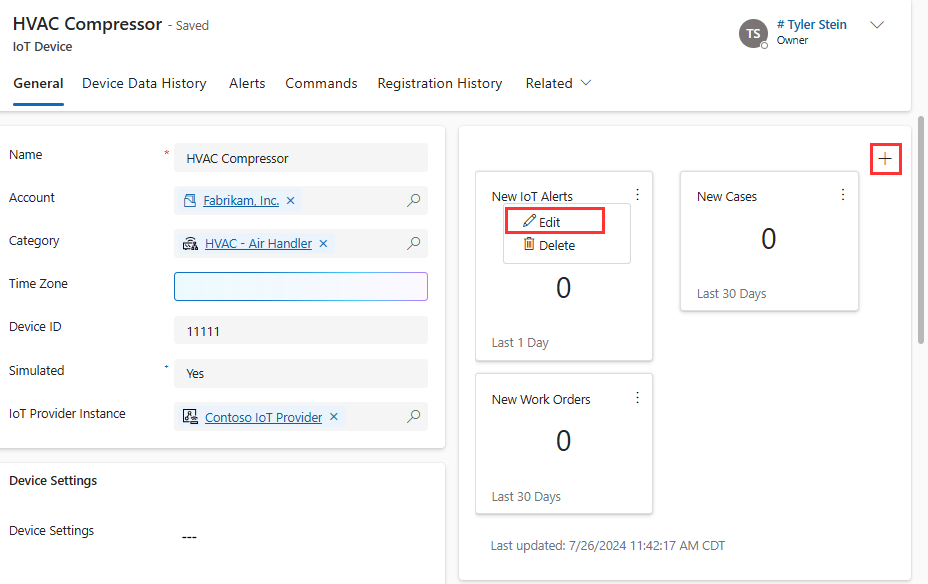
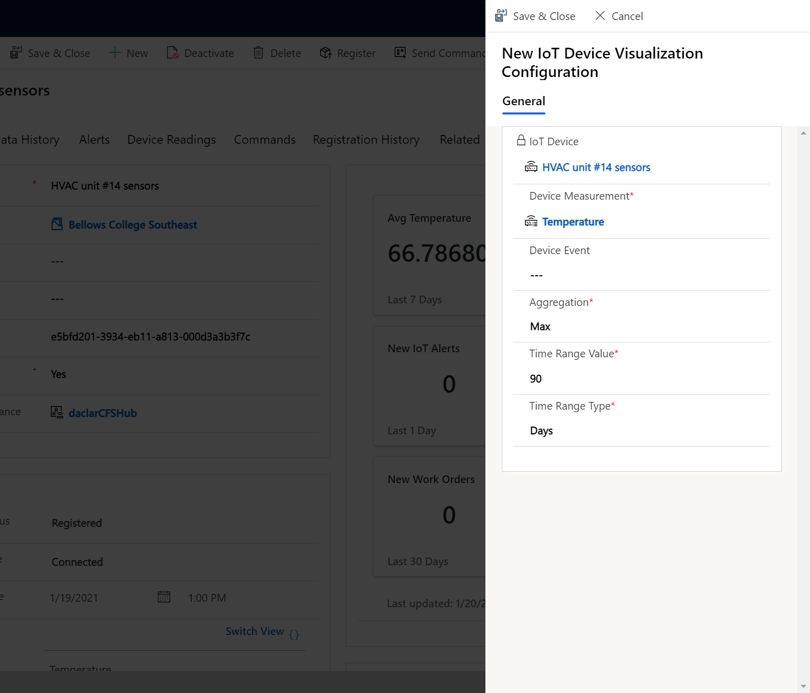

# Summary tiles in Connected Field Service

Summary tiles give a numeric overview of important metrics related to IoT devices. Users can see an average of recent device readings or the number of work orders generated from an IoT alert as just two examples. Summary tiles are visible on IoT device, Iot alert, and customer asset records. 

> [!div class="mx-imgBorder"]
> 

## Prerequisites

- Field Service version 8.8.2+

## Default summary tiles

3 summary tiles exist by default after a new IoT device is created: 

- New IoT alerts related to the IoT device in the last day
- New cases related to the IoT device in the Last 30 days
- New Work Orders related to the IoT device in the Last 30 days

> [!div class="mx-imgBorder"]
> 

If an IoT device is registered with Azure IoT (or a custom IoT provider) and has successfully pulled device data into Field Service, summary tiles for the first 2 device properties are automatically created. In the example image below this refers to average temperature and average humidity for the last 7 days. Temperature and humidity are the first 2 device properties in the first device data pull. 

> [!div class="mx-imgBorder"]
> 

> [!Note]
> The device summaries use the device data history information on the device record, which updates with a slight delay (30-60min); however, you can use the **Pull Device Data** option to get the latest data from AzureIoT. 

## Edit summary tiles

Edit existing summary tiles or create new ones.

> [!div class="mx-imgBorder"]
> 

When creating new summary tiles choose if it should relate to a **Device Measurement** (like temperature or humidity as examples) or a **Device Event** (like the creation of a work order).

> [!div class="mx-imgBorder"]
> 

Edits to summary tiles are saved to the related IoT device. When that IoT device is related to IoT alerts or customer assets the changes to the summary tiles will follow.

The maximmum number of summary tiles that can be displayed is 6. 

## Add summary tiles via Device Categories

Oftentimes organizations want to apply summary tiles to a group of IoT devices rather than edit the summary tiles of each IoT device. This is achieved by associating summary tiles to Device Categories.

		○ Configure ones based on category otherwise use default 
New IoT device visualization configuration 

## View summary tiles on the mobile app

Summary tiles and device readings are viewable on the mobile app when connected to the internet. See the topic on [Connected Field Service on Field Service (Dynamics 365) mobile app](https://docs.microsoft.com/dynamics365/field-service/cfs-mobile-powerapp#view-summary-tiles-and-device-readings) for more details. 

## Configuration considerations

- The device summary is only displayed on customer assets if there is one related device, even though multiple devices can be related to one customer asset. 

## Additional notes

- Summary tile calculations respect security roles and will change based on the nuber of alerts, work orders, etc that the logged-in user has access to.