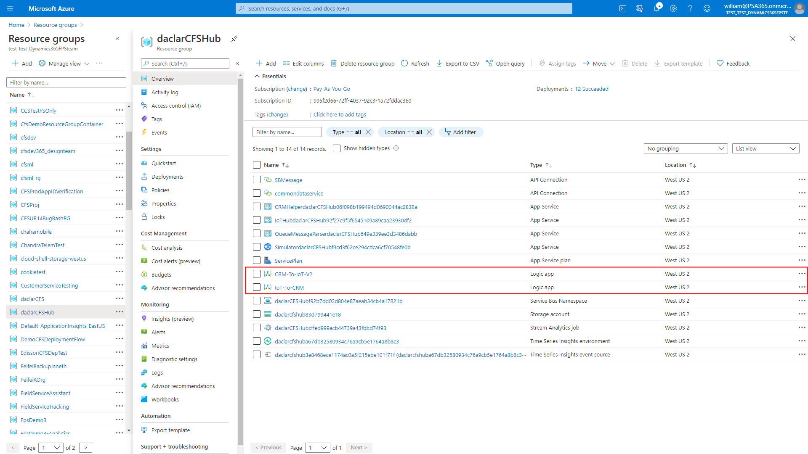
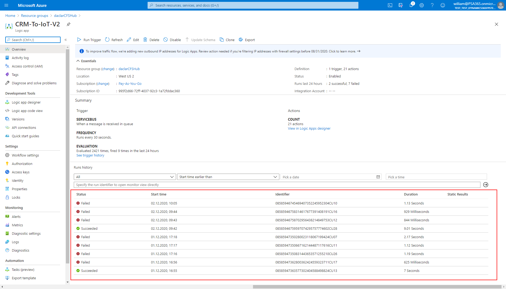
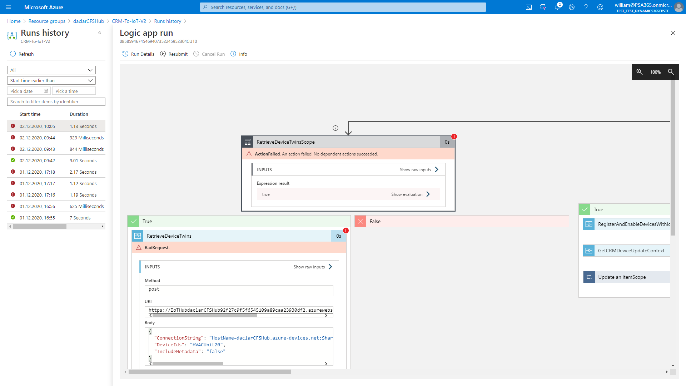
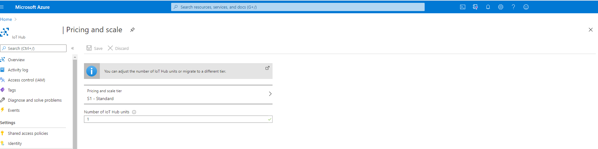

# Troubleshoot Connected Field Service

You may encounter unexpected behavior when using Connected Field Service, like a device that won't register, or a failure to pull device data. See the Azure IoT Logic Apps to help diagnose the issue.

1. Go to the Azure portal and sign in with your Azure account. Go to **Resource Groups** and select the resource group where Azure IoT is deployed.

2. There are two sets of logic apps between IoT and Field Service. Select one depending on if you think the issue originates in Field Service (named "CRM" in the image below), or if it originates in Azure IoT.

> [!div class="mx-imgBorder"]
> 

3. See the list of jobs that run when the system performs actions. For example, when you attempt to register a device, the logic app will run.

> [!div class="mx-imgBorder"]
> 

4. Select a failed run and view the logic app to understand where an error may have occurred.

> [!div class="mx-imgBorder"]
> 

Use the information in failed logic apps to diagnose the issue and to provide to the Microsoft support team. [Create a Dynamics 365 support ticket](https://dynamics.microsoft.com/contact-us/).

> [!Note]
> We don't recommend editing the logic apps that are deployed by the solution.

## Why can't I pull device data?

Sometimes after pulling device data, you may see there are no records in a device's data history, or no data in the device reported properties.  

One reason pull device data may fail (especially if you've successfully registered the device) is because the Azure IoT Hub tier is not set to **S1-Standard**. 

Go to the Azure portal, find your IoT Hub resource, then set pricing and scale tier to **S1-Standard**

> [!div class="mx-imgBorder"]
> 