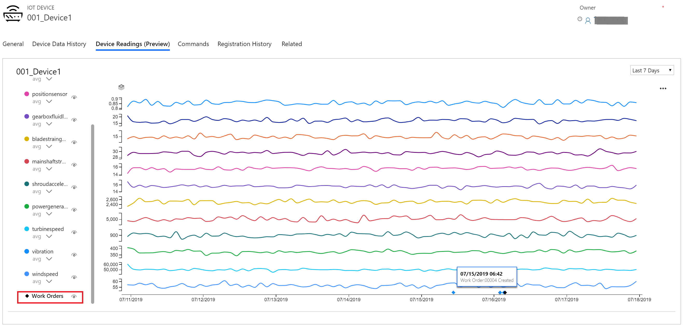
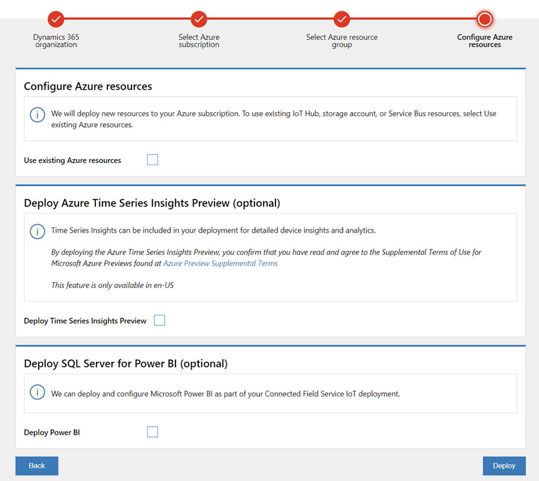
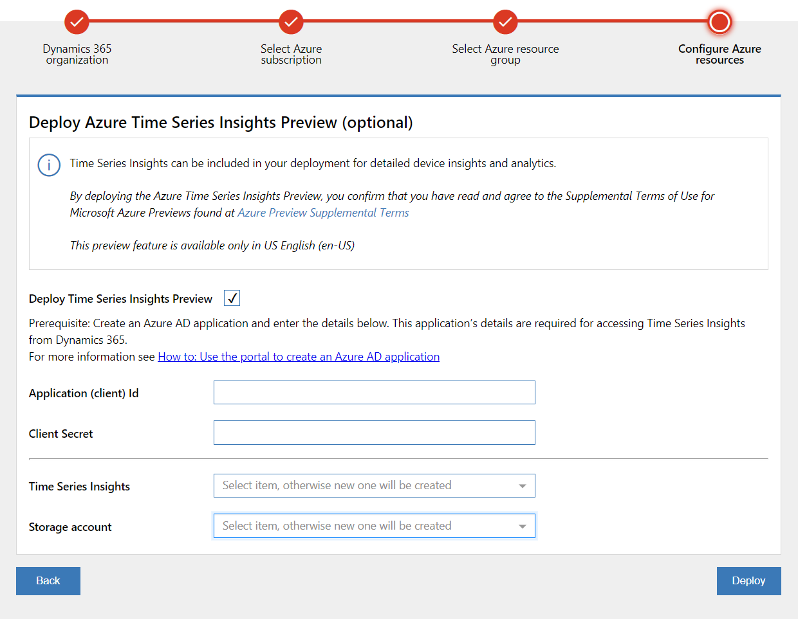
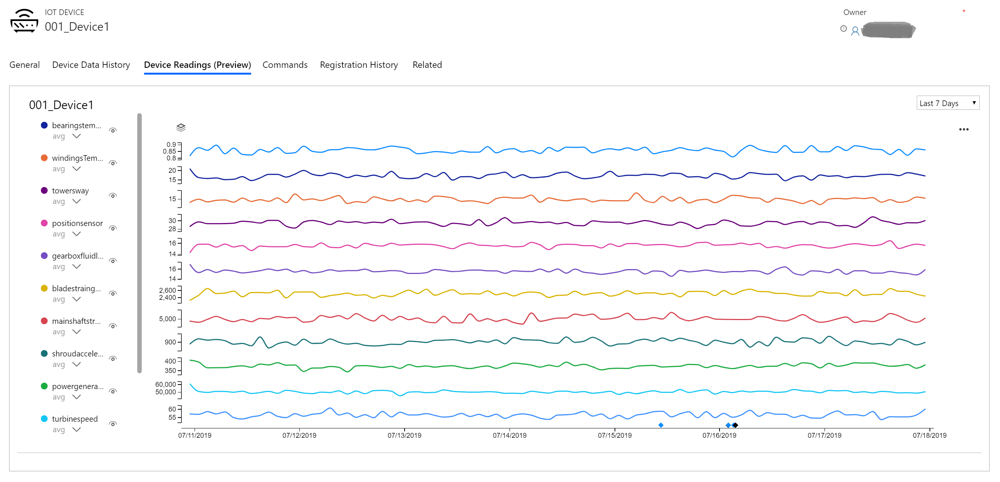
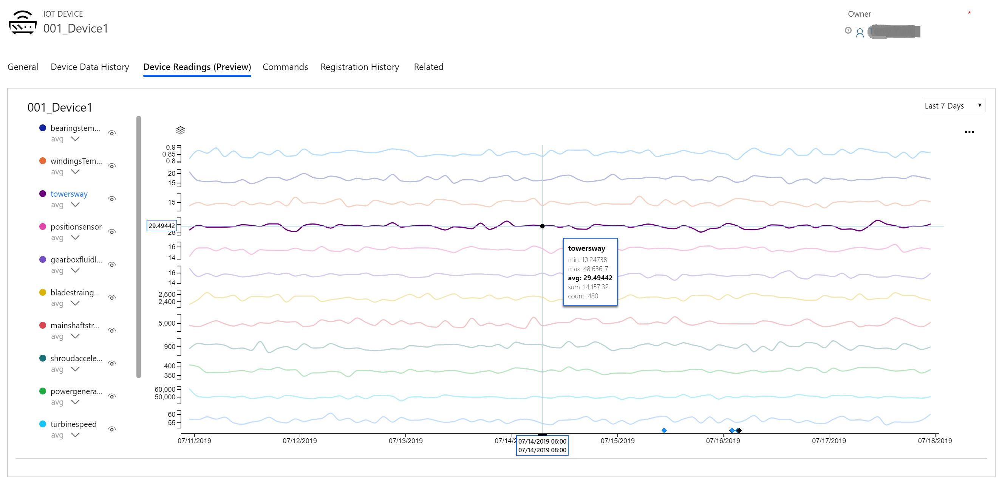

# Visualizing device readings (Preview)

To help you understand the current state of a device, its repair history, and the effect of performed work orders, the Connected Field Service add-in displays near realtime device readings and historical sensor measurements in a chart alongside work order details.

The device readings chart is available on the IoT alert, work order, case, device, and asset forms.

To enable the device readings chart, administrators need to deploy Azure Time Series (Preview) into the Azure subscription when deploying or upgrading Connected Field Service with Azure IoT Hub for their organization. Administrators do the deployment through the [IoT Deployment app (aka.ms/deploycfs).](https://aka.ms/deploycfs)  

> [!div class="mx-imgBorder"]
> 

## Prerequisites

- Field Service version 8.8.2 or higher
- Currently available in United States English only. This feature is in **preview** and it is not available in all languages and geographies.

## Enable the device readings chart

1. Open the Connected Field Service [IoT Deployment app (aka.ms/deploycfs).](https://aka.ms/deploycfs) 
2. Select the Dynamics 365 organization where the IoT solution will be deployed. 
3. Select the Azure subscription and the Azure Resource Group. (Note: Select **Upgrade deployment** if  you're updating an existing Connected Field Service for IoT Hub deployment.)
4. Select the **Deploy Time Series Insight Preview** checkbox.
5. Select **Deploy**.

> [!div class="mx-imgBorder"]
> 

6. Follow the remaining steps in the IoT Deployment app to complete the Time Series Insights Preview deployment.
- Create the application (client) ID: Follow the steps in [Create an Azure Active Directory application](https://docs.microsoft.com/azure/active-directory/develop/howto-create-service-principal-portal#create-an-azure-active-directory-application
).
- Create the client secret: Follow the steps in [Create a new application secret](https://docs.microsoft.com/azure/active-directory/develop/howto-create-service-principal-portal#create-a-new-application-secret
). 

> [!div class="mx-imgBorder"]
> 

> [!Note]
> - Storage account selection is only available when you're upgrading an existing deployment.
> - The IoT Deployment app adds timeseriesinsightsconsumergroup into IoT Hub Consumer Group.

6. After deployment, the **Device Readings (Preview)** tab is displayed on the IoT alert, work order, case, device, and asset forms.  

## Use the device readings chart

To view device readings, the following data must be in place:

|Form |Required data
--|--|
|Device  |Device ID is not empty.  
 Work order|The work order has a related IoT alert and the IoT alert has a related IoT device. The device ID in the IoT device is not empty.
| Case| The case has a related IoT alert and the IoT alert has a related IoT device. The Device ID in the IoT device is not empty. |
| Asset|The device ID is not empty. The device readings chart is for the device ID set in Connected Device Attributes section of the asset form. |
|IoT alert|The alert has a related IoT device. The device ID in the IoT device is not empty. |

 1. Open the **Device Readings (Preview)** tab on IoT alert, work order, case, device, or asset form.

 > [!div class="mx-imgBorder"]
> 

2. Choose the time period from the drop-down list. If the device sends device measurements to TSI, and the device measurement data exists for the selected time period, a chart is loaded.  

> [!Note]
> If you select a **Custom** time period, limit your time range to no more than 90 days. 

3. Select the eye icon next to the measurement to show or hide the measurement on the chart.

4. Hover over the chart to see tooltip with measurement details. 

> [!div class="mx-imgBorder"]
> 

5. Select the eye icon next to **Work Orders** to show or hide any work orders created and closed during the selected time period. 

> [!div class="mx-imgBorder"]
> 

> [!Note]
> If there are no work orders in the selected time period, work order selection will not be displayed.

## Additional Notes
- Available only in United States English (en-US)
- **Known issues:** 
  - In custom time settings, the time zone is always set as UTC even when another time zone is selected. The time period displayed after applying the setting is always local time. 
  - When deploying immediately after creating a new application (client) ID with the IoT Deployment app, you may see an **unable to deploy TSI with credential** error. Try again after one minute.
- Azure Time Series Insights (Preview) uses a pay-as-you-go (PAYG) pricing model. The pricing and cost estimate calculator is available at https://azure.microsoft.com/en-us/pricing/details/time-series-insights. Select the region where you are planning to deploy TSI to understand the storage and query cost. (Note that TSI uses Azure blob to store the data.) 

 

