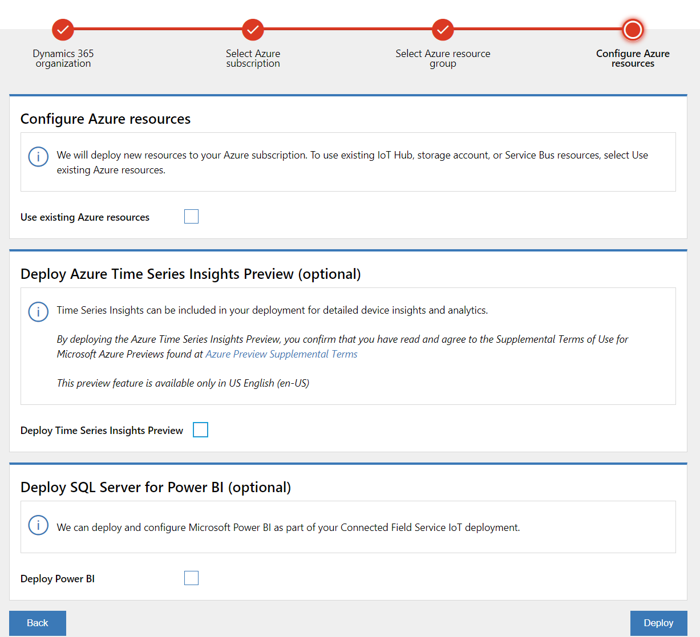
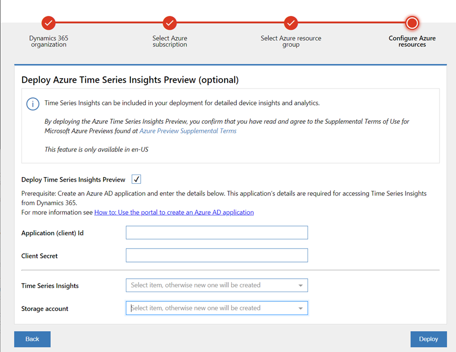

# Visualizing device readings

Connected Field Service Device Readings (Preview) provides the capability to explore near real time and historical trending of measurements and historical work orders from IoT device. Device Readings chart is available in IoT Alert, Work Order, Case, Device, Asset form for users to access.

After an IoT alert is received, the alert needs to be diagnosed. The first step is to understand the current state of the device. The next step is to further analyze the history and trending of the measurements from the device, and repair history. That can help to analyze the problem and perform remediate actions. 

Device Readings (Preview) is provided to explore near real time and historical trending of measurements as well as historical work orders from IoT device which trigged alert. The chart is available in IoT Alert, Work Order, Case, Device, Asset form for users to access. 

To enable the Device Readings (Preview) chart, organization admin needs to deploy Azure Time Series (Preview) into customer Azure subscription when choosing to deploy it. 

## Prerequisites

- Minimum app version required: mainly solution version (8.8.2.X of FS)
- Knowledge of other features recommended or required
- Settings that should be turned on or off
- Data that must be in place prior to configure or use of this feature 

Note: This Device Readings (Preview) feature is available only in US English (en-US).

Admin of organization will be able to enable Connected Field Service Device Readings(Preview) by deploying Azure Time Series(Preview) through [IoT Deployment App](https://aka.ms/deploycfs). 

> [!Note]
>

> [!div class="mx-imgBorder"]
> 

## Setup

1. Launch Connected Field Service [IoT Deployment App](https://aka.ms/deploycfs)
2. Select Dynamics 365 organization where the IoT solution will be deployed 
3. Select Azure Subscription and Azure Resource Group (Select **Upgrade deployment** if updating existing Connected Field Service for IoT Hub deployment to enable this feature.)
4. Select **Deploy Time Series Insight Preview (Optional)** in "Configure Azure resources"
Note: This Device Readings (Preview) feature is available only in US English (en-US).

5. Follow the rest steps in IoT Deployment App to complete Time Series Insight Preview deployment
- Application (client) Id: Follow steps in [Create an Azure Active Directory application](https://docs.microsoft.com/en-us/azure/active-directory/develop/howto-create-service-principal-portal#create-an-azure-active-directory-application
) to create Application Id
- Client Secrete: Follow steps in [Create a new application secret](https://docs.microsoft.com/en-us/azure/active-directory/develop/howto-create-service-principal-portal#create-a-new-application-secret
) to create Client Secrete. 

_Note: Storage account selection is only available when upgrading deployment._ 

6. After deployment, **Device Readings (Preview)** tab will be showed in IoT Alert, Work Order, Case, Device, Asset form.  

## Explore

**Explore Device Readings**
 1. Click  **Device Readings (Preview)** tab in  IoT Alert, Work Order, Case, Device, Asset form 
Note: please check prerequisites when Device Readings (preview) tab can be showed

2. Select drop down box on the top right to choose time period. If the device sends device measurements to TSI  and the device measurement data exists for the selected time period, a chart will be loaded.  
Note: When you select **Custom** time period, please limit your time range to 90 days. 

3. Click on the eye icon beside measurement to hide or show the measurement on the chart 

4. Hover over the chart to see tooltip with measurement details 

5. Click on the eye icon beside "Work Orders" to show/hide Work Orders created and closed during the selected time period. 

Note: If it has no work order in selected time period, Work Order selection will not be shown

## Configuration considerations
## Additional Notes

Known issue: 
1. In the Custom time settings, the Time Zone is always set as UTC even other Time Zone is selected. The time period displayed after applying the setting is always local time. 

2. When deploying immediately after creating a new Application (client) id from IoT Deployment App,  it may have "unable to deploy TSI with credential" error . Please try again after a minute.

**Cost Estimation**
Azure Time Series Insights (Preview) pricing and cost estimate calculator is available at https://azure.microsoft.com/en-us/pricing/details/time-series-insights. Select the region you are planning to deploy TSI to understand the Storage (TSI uses Azure Blob to store the data) and Query Cost. 

Note that, we are using the Preview version of Time Series Insights which is also referred to as Pay-As-You-Go or PAYG SKU. 

> [!div class="mx-imgBorder"]
> 

> [!div class="mx-imgBorder"]
> 

> [!div class="mx-imgBorder"]
> 

> [!div class="mx-imgBorder"]
> 

> [!div class="mx-imgBorder"]
> 

> [!div class="mx-imgBorder"]
> 

> [!div class="mx-imgBorder"]
> 