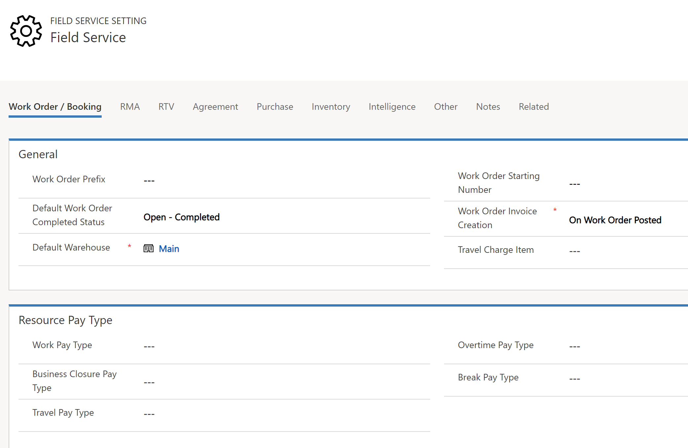
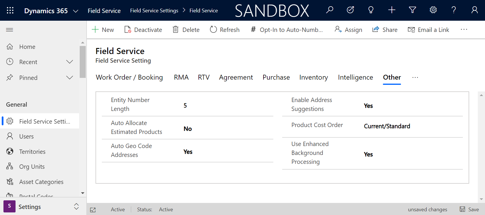

# Set defaults for work orders, bookings, the schedule board, and agreements (Field Service)

The Field Service Settings page allows system administrators to set default settings for work orders, bookings, the schedule board, agreements, and more.

 1. In the Unified Interface framework app, navigate to **Field Service** > **Field Service Settings**. Or, in earlier web browser versions, navigate to **Field Service** > **Administration** > **Field Service Settings**.

 > [!div class="mx-imgBorder"]
> 
  
2.  Fill in the information, as required.  Refer to the following table for a description of the settings.  
  
3.  Choose **Save**.  
  
## Work order and bookings settings 
  
|                Options                |                                                                                                                                                                                                                                     Description                                                                                                                                                                                                                                      |
|---------------------------------------|--------------------------------------------------------------------------------------------------------------------------------------------------------------------------------------------------------------------------------------------------------------------------------------------------------------------------------------------------------------------------------------------------------------------------------------------------------------------------------------|
|              **General**              |                                                                                                                                                                                                                    Select default booking and work order options.                                                                                                                                                                                                                    |
|           Work order prefix           |                                                                                                                               Select a default prefix for all your work orders. The prefix will  be added to the beginning of the work order number. This  helps you easily identify  work orders  from other types of service requests in the system.                                                                                                                               |
|   Default scheduled booking status    |                                                                                                                            Determines the default booking status value for a new resource booking record. [!INCLUDE[proc_more_information](../includes/proc-more-information.md)] [Set up booking statuses](../field-service/set-up-booking-statuses.md)                                                                                                                             |
|    Default canceled booking status    |                                                                                                                           Select a default booking status for canceled bookings. For example, **Canceled**. [!INCLUDE[proc_more_information](../includes/proc-more-information.md)] [Set up booking statuses](../field-service/set-up-booking-statuses.md)                                                                                                                           |
|  Default work order completed status  |                                                                                                                     Select whether the default  status for a completed work order is **Completed** or **Posted**. [!INCLUDE[proc_more_information](../includes/proc-more-information.md)] [Set up booking statuses](../field-service/set-up-booking-statuses.md)                                                                                                                     |
|       Default booking duration        |                                                                                                                                                                             Select a default  booking duration. For example, when a new booking is created the default booking duration  is 30 minutes.                                                                                                                                                                              |
|      Word order starting number       |                                                                                                                                                         Select a starting number for your work order. For example, if you choose "100" then your first work order number will be 100, and second one will be 101, and so on.                                                                                                                                                         |
|      Work order invoice creation      |                                                                                                                                                                        Select whether the system should automatically generate a billing invoice for work orders when the status is set to **Closed-Posted**.                                                                                                                                                                        |
|          Travel charge item           | Select what product is used in the system for travel charges for a work order. For example, when you have a booking with a journal type set to traveling, the system automatically creates a work order service with the duration of the journal for travel time. The pricing will be determined by the standard pricing rules. [!INCLUDE[proc_more_information](../includes/proc-more-information.md)] [Create a product or service](../field-service/create-product-or-service.md) |
|           Default warehouse           |                                                                                                                       Select the default warehouse that work order products will be taken from unless specified otherwise. [!INCLUDE[proc_more_information](../includes/proc-more-information.md)] [Create a warehouse](../field-service/create-warehouse.md)                                                                                                                        |                                                                                                           |
|        **Resource  pay type**         |                                                                                    Choose from pay types that you have created in the system to calculate timestamp-based labor cost on booking journals when a booking is marked as complete. [!INCLUDE[proc_more_information](../includes/proc-more-information.md)] [Set up resource pay types](../field-service/set-up-resource-pay-types.md)                                                                                    |
|             Work pay type             |                                                                                                                                                                                  Select the pay type that will be used in conjunction with work performed during the resource’s normal work hours.                                                                                                                                                                                   |
|       Business closure pay type       |                                                                                                            Select the pay type that will be applied on days that have been marked with **Business Closures**. [!INCLUDE[proc_more_information](../includes/proc-more-information.md)] [Set when your business is closed](../customer-service/set-when-business-closed-cs-app.md)                                                                                                            |
|            Travel pay type            |                                                                                                                                                                            Select the pay type that will be applied to time that the resource is traveling to a service location to perform service work.                                                                                                                                                                            |
|           Overtime pay type           |                                                                                                                                                                                       Select the pay type that will be applied to time that is outside of the resource’s scheduled work hours.                                                                                                                                                                                       |
|            Break pay type             |                                                                                                                                                                                    Select the pay type that will be applied to time that the resource is on break while performing service work.                                                                                                                                                                                     |
|        **Schedule assistant**         |                                                                                                                                                                                                                  Choose default options for the schedule assistant.                                                                                                                                                                                                                  |
|     Auto filter service territory     |                                                                                                              Select whether the schedule assistant   should automatically filter search results based on the work order territory. [!INCLUDE[proc_more_information](../includes/proc-more-information.md)] [Set up territories](../field-service/set-up-territories.md)                                                                                                              |
|         Default radius value          |                                                                                                               Select a default radius the schedule assistant will use when searching for resources for  work orders. For example, if you choose a 20 mile radius, then the schedule assistant will find resources within 20 miles of the work order  booking location.                                                                                                               |
|          Default radius unit          |    Select miles or kilometers.        |
| Calculate tax | Tax codes calculate and add taxes to used products and services. Set to **No** to remove the tax code field and calculations from all related forms. New environments created with Field Service v8.8.39.37+ will have this setting set to **No** by default. |
  
## Schedule board settings  
  
|                                          Options                                           |                                                                                                                                                               Description                                                                                                                                                                |
|--------------------------------------------------------------------------------------------|------------------------------------------------------------------------------------------------------------------------------------------------------------------------------------------------------------------------------------------------------------------------------------------------------------------------------------------|
|                                         **Board**                                          |                                                                   Select default options for the schedule board. [!INCLUDE[proc_more_information](../includes/proc-more-information.md)] [Configure the schedule board](../field-service/configure-schedule-board.md)                                                                    |
|    Scheduler [!INCLUDE[pn_field_service](../includes/pn-field-service.md)] details view    |                                                                                                                         Select the default view for the **Details** pane ion the schedule board for work orders.                                                                                                                         |
|   Scheduler [!INCLUDE[pn_field_service](../includes/pn-field-service.md)] tool tip view    |                                                                                                      Select the default view for the tool tip displayed when you hover over a booking linked to a work order on the schedule board.                                                                                                      |
| Scheduler [!INCLUDE[pn_field_service](../includes/pn-field-service.md)] slot text template |                                                                                   Enter HTML code to define the text and format that is displayed in the [!INCLUDE[pn_field_service](../includes/pn-field-service.md)] bookings on the schedule board.                                                                                   |
|                             Scheduler core slot text template                              |                                                                                                        Enter HTML code to define the text that is displayed in bookings that are not linked to work orders on the schedule board.                                                                                                        |
|                              Notifications time out (in sec)                               |                                                                                                                        Enter the default frequency, in seconds, at which the schedule board should auto-refresh.                                                                                                                         |
|                                   Booking alert template                                   |                                                                                             This is for the booking alert entity, you can have booking alerts that display information within the alert. You can modify the data shown here.                                                                                             |
|                                Scheduler core details view                                 |                                                                                 This applies to bookings that are not linked to a work order. Select the default **Details** view on the schedule board for bookings that are not linked to work orders.                                                                                 |
|                               Scheduler core tool tips view                                |                                                                                             This applies to bookings that are not linked to a work order. Select the default tool tips view for bookings that are not linked to work orders.                                                                                             |
|                              Cancel current slots when moving                              |                                                                                                             Select whether, when moving slots to another time, to leave the old slots and change their status to **Cancel**.                                                                                                             |
|                                        **Map view**                                        |                                                               Select default options for the schedule board map view. [!INCLUDE[proc_more_information](../includes/proc-more-information.md)] [Configure the schedule board](../field-service/configure-schedule-board.md)                                                               |
|                              Scheduler resource tool tip view                              |                                                                                                           Select the default view to display information when you hover over the resource pin on the schedule board map view.                                                                                                            |
|                           Scheduler business unit tool tip view                            |                                                                                                         Select the default view to display information when you hover over the business unit pin on the schedule board map view.                                                                                                         |
|                              Unscheduled WO tool tips view ID                              |                                                                                                     Select the default view to display information when you hover over an unscheduled work order pin on the schedule board map view.                                                                                                     |
|                              Scheduler Resource details view                               |                                                                                                       Select the default view to display information in the details pane on the schedule board when you select a resource map pin.                                                                                                        |
|                            Scheduler business unit details view                            |                                                                                                     Select the default view to display information in the details pane on the schedule board when you select a business unit map pin.                                                                                                     |
|                         Resources Synchronization timeout (in sec)                         | When using the Real-Time mode in the schedule assistant, the system searches the Mobile Audit table for the resource’s current location, based on data from their mobile device. This setting determines how old the last known resource location, in the mobile audit table, can be, and still be used in the schedule assistant query. |
  
### RMA  
  
|       Options       |                                                                                                                                                                          Description                                                                                                                                                                           |
|---------------------|----------------------------------------------------------------------------------------------------------------------------------------------------------------------------------------------------------------------------------------------------------------------------------------------------------------------------------------------------------------|
|     RMA prefix      | Select a default prefix for a return merchandise authorization (RMA). The prefix will  be added to the beginning of the RMA number. This  helps you easily identify  an RMA from other types of service requests in the system. [!INCLUDE[proc_more_information](../includes/proc-more-information.md)] [Process a return](../field-service/process-return.md) |
| RMA starting number |                                        Select a starting number for RMAs. For example, if you choose 1000 then your first RMA will be 1000, and the second one will be 1001, and so on. [!INCLUDE[proc_more_information](../includes/proc-more-information.md)] [Process a return](../field-service/process-return.md)                                         |
  
### RTV  
  
|       Options       |                                                                                                                                                                                                       Description                                                                                                                                                                                                        |
|---------------------|--------------------------------------------------------------------------------------------------------------------------------------------------------------------------------------------------------------------------------------------------------------------------------------------------------------------------------------------------------------------------------------------------------------------------|
|     RTV prefix      | Select a default prefix for a return to vendor (RTV). The prefix will  be added to the beginning of the RTV number. This  helps you easily identify  an RTV from other types of service requests in the system. [!INCLUDE[proc_more_information](../includes/proc-more-information.md)] [Process a return](../field-service/process-return.md). |
| RTV starting number |                                  Select a starting number for RTVs. For example, if you choose 2000, then your first RTV will be 2000, and second one will be 2001, and so on. [!INCLUDE[proc_more_information](../includes/proc-more-information.md)] [Process a return](../field-service/process-return.md).                               |
  
### Agreements  
  
|                     Options                     |                                                                                                                                                                                                                                                                Description                                                                                                                                                                                                                                                                 |
|-------------------------------------------------|--------------------------------------------------------------------------------------------------------------------------------------------------------------------------------------------------------------------------------------------------------------------------------------------------------------------------------------------------------------------------------------------------------------------------------------------------------------------------------------------------------------------------------------------|
|                Agreement prefix                 |                                                                                                Select a default prefix for agreements. The prefix will  be added to the beginning of the agreement number. This  helps you easily identify  agreements from other data in the system. [!INCLUDE[proc_more_information](../includes/proc-more-information.md)] [Set up customer agreements](../field-service/set-up-customer-agreements.md)                                                                                                 |
| Auto generate work order for agreement booking  |                                                                    Select whether the system should automatically generate work order bookings based on agreements. If set to **No**, then you will need to manually create the work order records by clicking the ribbon button on the **Schedule Date** record. [!INCLUDE[proc_more_information](../includes/proc-more-information.md)] [Set up customer agreements](../field-service/set-up-customer-agreements.md)                                                                     |
|   Generate booking dates X months in advance    | [!INCLUDE[pn_field_service](../includes/pn-field-service.md)] agreements generate booking dates based on the agreement booking setup recurrence schedule. These are the dates that the system will generate a work order record, if the auto generate work order is set to **Yes**. This setting determines how many months in advance the system will generate booking date records. [!INCLUDE[proc_more_information](../includes/proc-more-information.md)] [Set up customer agreements](../field-service/set-up-customer-agreements.md) |
|   Generate invoices dates X months in advance   |   [!INCLUDE[pn_field_service](../includes/pn-field-service.md)] agreements generate invoice dates based on the agreement invoice setup recurrence schedule. These are the dates that the system will generate an invoice record, if the auto generate invoice is set to **Yes**. This setting determines how many months in advance the system will generate invoice date records. [!INCLUDE[proc_more_information](../includes/proc-more-information.md)] [Set up customer agreements](../field-service/set-up-customer-agreements.md)    |
|            Agreement starting number            |                                                                                                                                                                                       Select a starting number for agreements. For example, if you choose 3000, then your first agreement will be 3000, and the second one will be 3001, and so on.                                                                                                                                                                                        |
| Generate agreement work order X days in advance |                                                        When auto generate work orders is set to **Yes**, the system will generate work order records based on the recurrence schedule and the existing booking dates. This setting determines how many days in advance of the booking date to generate the work order record. [!INCLUDE[proc_more_information](../includes/proc-more-information.md)] [Set up customer agreements](../field-service/set-up-customer-agreements.md)                                                         |
|  Generate agreement invoices X days in advance  |                                                                                The system will generate invoice records based on the invoice recurrence schedule and the existing invoice dates. This setting determines how many days in advance of the invoice date to generate the invoice record. [!INCLUDE[proc_more_information](../includes/proc-more-information.md)] [Set up customer agreements](../field-service/set-up-customer-agreements.md)                                                                                 |
  
## Purchase order settings 
  
|             Options             |                                                                                                                      Description                                                                                                                       |
|---------------------------------|--------------------------------------------------------------------------------------------------------------------------------------------------------------------------------------------------------------------------------------------------------|
|      Purchase order prefix      |                         Select a default prefix for purchase orders. The prefix will  be added to the beginning of the purchase order number. This  helps you easily identify  purchase orders from other data in the system.                          |
| Purchase order approval required |     Select if a purchase order needs an approval before the status can be  changed to **Submitted**. [!INCLUDE[proc_more_information](../includes/proc-more-information.md)] [Create a purchase order](../field-service/create-purchase-order.md)      |
| Purchase order starting number  |                                          Select a starting number for purchase orders. For example, if you choose 4000, then your first purchase order will be 4000, and second one will be 4001, and so on.                                           |
|   Use of product out of stock   | Select how the system reacts when a work order product is used for a product that is not currently in stock. **Confirm** will prompt the user to decide whether to continue or not, and **Restrict** will keep the work order product from being used. |
  
## Inventory settings
  
|Options|Description|  
|-------------|-----------------|  
|Inventory transfer prefix|Select a default prefix for inventory transfer numbers. The prefix will  be added to the beginning of the inventory transfer number. This  helps you easily identify  an inventory transfer from other data in the system.|  
|Inventory adjustment prefix|Select a default prefix for inventory adjustment numbers. The prefix will  be added to the beginning of the inventory adjustment number. This  helps you easily identify  an inventory adjustment from other data in the system.|  
|inventory transfer starting number|Select a starting number for inventory transfer numbers. For example, if you choose 5000, then your first inventory transfer number will be 5000, and second one will be 5001, and so on.|  
|inventory adjustment starting number|Select a starting number for inventory adjustment numbers. For example, if you choose 6000, then your first inventory adjustment number will be 6000, and second one will be 6001, and so on.|  
  
## Intelligence settings

|Options|Description|  
|-------------|-----------------|  
|Enable Suggested Duration|When enabled, this setting will look at historical booking data and suggest an average duration on a daily or on-demand basis at the incident type level to improve accuracy of an incident type's established duration.|
|Historical Data Filter|This setting is used for both the suggested duration and incident type suggestions functionality. This setting is used to establish the data scope for analysis when looking at historical data to provide suggestions.| 
|Enable Incident Type Suggestion|When enabled, this setting will drive a prompt to ensure users are aware that this feature is in preview. If accepted, this feature will begin to drive analysis of historical work order and work order sub-record data to suggest ways to improve an organization's usage of incident type. Once enabled, a subgrid will become visible on the tab to show the suggestions from this intelligent analysis. From the subgrid, a user can dislike or apply the suggestions from the model.| 

## Time entry settings

|Options|Description|  
|-------------|-----------------|  
|Time Entry Generation Strategy|This setting drives whether the environment will automatically generate time entries based on bookings or not. If the setting is null, the system assumes manual generation. Regardless of whether this is set to manual or automatic generation, time entries can always be created manually.|
|Time Cost Actuals|Actuals are generated as part of the natural Field Service motion. Some actuals would be generated at various stages of the work order and invoice lifecycle. This field controls whether cost actuals related to time are generated from booking journals when the work order is set to "Closed - Posted" or from time entries when the time entry is marked as approved. If this setting is null, the system will assume it should generate these time and cost focused actuals from booking journals when the work order is "Closed - Posted."| 

## Dynamics 365 Remote Assist settings

|Options|Description|  
|-------------|-----------------|  
|Disable Booking Status Changes|Depending on this setting, Dynamics 365 Remote Assist on HoloLens will either allow a booking's booking status to be changed from within the HoloLens experience or it will not.|
  
## Other settings
  
|             Options             |                                                                                                                                                 Description                                                                                                                                                 |
|---------------------------------|-------------------------------------------------------------------------------------------------------------------------------------------------------------------------------------------------------------------------------------------------------------------------------------------------------------|
|          Bing API key           |                                                                                                The default key allows geocode and mapping functionality. If you need to use your own  key, specify it here.                                                                                                 |
|      Entity number length       |                                                                                       Enter the number of digits the entity numbers will be. For example, if you enter 5, the first work order number would be 00001.                                                                                       |
| Auto allocate estimate products | When products are added to a work order before the work begins, then the line status of the work order product record defaults to **Estimated**. This setting determines whether the work order product record is set to **Allocated** when the line status is still **Estimated**, as opposed to **Used**. |
|     Auto geo code addresses     |               Specify whether the system should automatically add the appropriate latitude and longitude values based on the account's address. [!INCLUDE[proc_more_information](../includes/proc-more-information.md)] [Turn on auto geocoding](../field-service/turn-on-auto-geocoding.md)                |
|       Product cost order        | Select the order for product cost.   |
|       Work order subgrid records open as popups      | Specify if work order sub entities (work order product, work order service, work order service task, work order incident, bookable resource booking, time entry) should open as a popup overlay on top of the work order form, rather than navigating away. The default setting for this field will enable the subgrid records to open in dialog popups.   |
| Use Enhanced Background Processing | When the Field Service app is installed, so too are many workflows that run in the background. This setting utilizes Power Automate flows in place of some of the background Dynamics 365 Field Service workflows. Power Automate has many benefits, including the ability to connect and run workflows within Dynamics 365 and between other outside applications, the ability to delete records and schedule jobs, and robust approvals, among others. For Field Service specifically, using Power Automate in place of background processes related to agreements improves performance for long-waiting agreements and fixes complications in the event an agreement's owner no longer has access to Dynamics 365 (if they leave the company, for example). For Field Service Mobile, you can use Power Automate for geofence, geofence alerts, and push notification process. For more information, see the article on [using Power Automate flows with Field Service Mobile](mobile-workflow-to-flow.md). This setting is in preview, and more background workflows are expected to be moved to Power Automate flows in subsequent releases.|

> [!div class="mx-imgBorder"]
>  

## GPS data settings
 [!INCLUDE[pn_field_service](../includes/pn-field-service.md)] can be integrated with third-party GPS providers to allow the real-time location of resources or vehicles on schedule maps. These settings allow you to map the integrated GPS data to the [!INCLUDE[pn_field_service](../includes/pn-field-service.md)] system.  
  
|Options|Description|  
|-------------|-----------------|  
|Custom GPS data|Select whether the system will use  a custom entity for its source  of geo locations for resources to be displayed on the map view.|  
|Custom GPS resource field|Shows the logical name of the resource to be used for geo locations.|  
|Custom GPS latitude field|Shows the logical name of the latitude to be used for geo locations.|  
|GPS location expires after X minutes|Enter when GPS location expires.|  
|Custom GPS location entity|Shows the logical name of customer entity to use for geo locations.|  
|Custom GPS timestamp field|Shows the logical name of the timestamp to use for geo locations.|  
|Custom GPS longitude field|Show the logical name of the longitude to be used for geo locations.|  
   
  
### See also  
 [Overview](../field-service/overview.md)   
 [Installation](../field-service/install-field-service.md)   
 [View user accounts and security roles](../field-service/view-user-accounts-security-roles.md)   
 [Turn on auto geocoding](../field-service/turn-on-auto-geocoding.md)
