# Create work order templates with incident types

Incident types act as service templates that allow users to quickly create work orders for the most common types of jobs that your organization performs. Incident types are also used to define specific work order issues and recommended resolutions.

Where **work order types** define the general category of a work order (for instance: inspection, repair, or maintenance), **incident types** define the specific request of a work order and effectively add more details to the work order type.

For example, an incident type can be:
- A specific error code on a machine ("Error code 0048").
- A common customer complaint or request ("The building temperature is too hot").
- A specific procedure ("Perform stress test").

Most importantly, adding an incident type to a work order can provide other details like duration, work order service tasks, products, services, and characteristics (skills). Incident types effectively serve as work order templates that prepopulate information, which can be manually edited as needed.

Organizations benefit from using incident types because they codify issues, procedures, and resolutions, and help standardize processes across geographies and business lines. Incident types ensure all field technicians are performing the same actions to resolve work orders, and if better procedures are discovered, the incident type is updated and implemented across the entire organization.

Using incident types also saves time while creating work orders. Without using incident types, the customer service reps or dispatchers creating work orders would have to manually add details.

Finally, incident types are helpful for reporting because they allow you to see trends for specific issues. Rather than reporting on work order types to understand the number of repair work orders, an incident type lets you report on the number of power failures for a specific asset category, for example.

Other important incident type features include:

-	Multiple incident types can be added to a work order to define multiple issues or procedures that need to be completed. 

-	Each incident type can be related to a customer asset to build service history. 

-	Relating incident types to requirement group templates allows you to autopopulate multiple requirements for a work order and schedule it to multiple resources.

## Prerequisites

- Incident types are available for all versions of Dynamics 365 Field Service. However, using incident types with requirement group templates for multi-resource scheduling is only available with Field Service v8.0+.

- Because incident types mostly represent a grouping of service tasks, products, and services, we recommend having these records created in the system before creating an incident type. Each of the following records can be created in **Field Service** > **Settings**:

  - A **service task** is a checklist item that field technicians should complete as part of performing an incident type. 

  - A **product** is a part that can be used when completing an incident type and can be billed to the customer and deducted from inventory if necessary. For more information, visit our article on [creating a product or service](../field-service/create-product-or-service.md). 

  - A **service** is labor that can be billed to the customer. **Note:** There is no **Service** entity. A service is created by creating a product record with **Field Service Type = Service**. 

    > [!div class="mx-imgBorder"]
    > 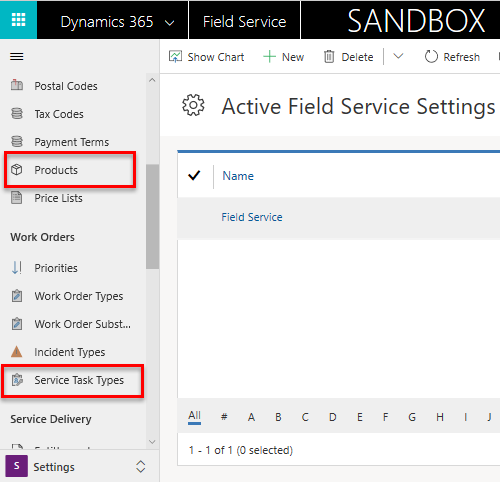

The service tasks, products, and services you create will serve as the building blocks of incident types and can be associated to multiple incident types as needed. For example, if "Put on safety goggles" is a service task that needs to be completed as part of many or all incident types, create this service task once and associate it to the relevant incident types. There will then be one list of unique service tasks that are added to incident types, which create **Incident Type Service Task** records. The same is true for products, services, and characteristics.

## Create an incident type

To create an incident type, go to **Field Service** > **Settings** > **Incident Types** > **+New**.

Enter a **Name** and a **Description**.

> [!div class="mx-imgBorder"]
> 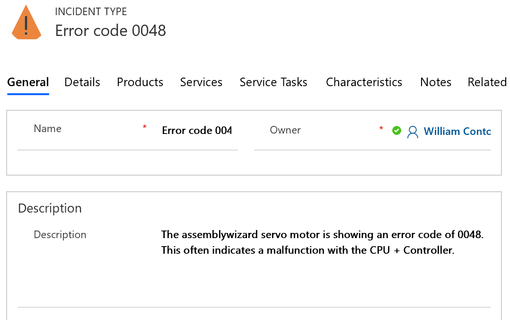

On the **Details** tab, see the following fields: 

- **Default Work Order Type**: The work order type selected here will populate the work order type field on the work order when this incident type is entered as the primary incident type. It will overwrite previously entered work order types. Entering a work order type will not populate an incident type.

  > [!NOTE]
  > A default price list can be added to a work order type. This means you can add a primary incident type that adds a work order type and the work order type will add a price list. This further saves time with automatic data population.

- **Estimated Duration**: Enter a duration for this incident type. If you add multiple incidents to a work order, the work order duration will be the total of all incident durations as reflected in the resource requirement related to the work order. Service tasks can also each have a duration, in which case the estimated duration of the incident type will be the sum total of the incident service task durations. The only way you can use the estimated duration field as the duration of the incident type is if you don't add incident type service tasks, or none of the incident type service tasks you add have durations. If this incident type is set as the primary incident type of a work order, this value will populate the primary incident type duration field.

  > [!div class="mx-imgBorder"]
  > 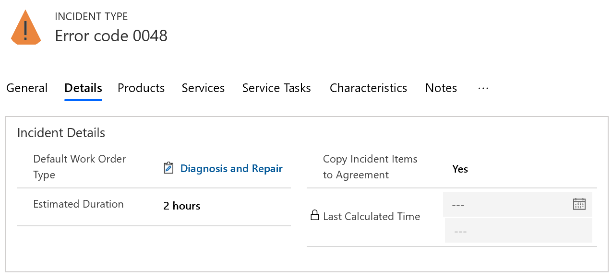

- **Copy Incident Items to Agreement**: This setting is only important for when you use incident types as part of agreements. It dictates if agreement "items" including service tasks, products, services, and characteristics (skills) should be added when this incident is added to the agreement. For more information, see the configuration considerations section at the end of this article. 

After setting basic details for the incident type, consider also adding:

- Recommended products and services that field technicians might need to complete the incident type. 
- Service tasks to guide field technicians through a checklist of tasks.
- Characteristics (skills) that will help schedulers find the right resources to perform work orders that this incident type is added to. When this incident type is added to a work order, the related items will be added as well.

### Incident type product

Next, add an incident type product by going to the product tab and selecting **+New Incident Type Product**.

Select a **Product** and **Unit**.

Enter a **Quantity**, which is the number of work order products that will be added to the work order when this incident is added. It can be manually overridden by the work order creator as needed. However, if, for example, a process or procedure generally requires two units of a part to complete the job, you should enter **2** here.

> [!div class="mx-imgBorder"]
> 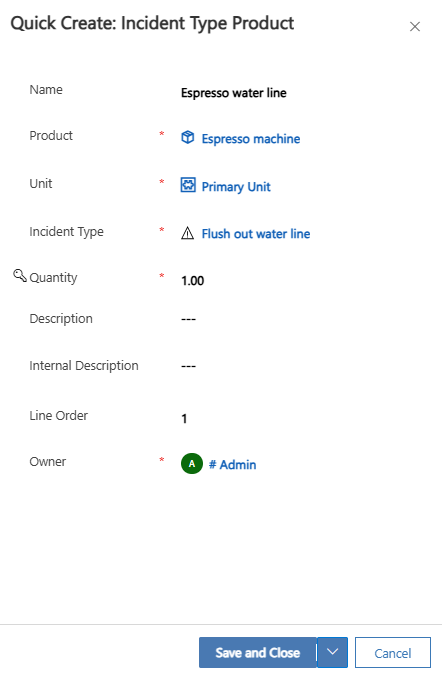

Enter a **Name** if you want the eventual work order product to have a different name than the product name.

For scenarios where multiple products are added as part of an incident type, **Line Order** is a numeric value that can be used to define the order in which they appear on the work order product list. This logic is true for service tasks and service, too.

Because the **Description** field can be communicated to the customer or even be customized to appear on an invoice, there is also an **Internal Description** to provide additional details for the field technician.

### Incident type service

Similar to incident type products, add incident type services. 

> [!div class="mx-imgBorder"]
> 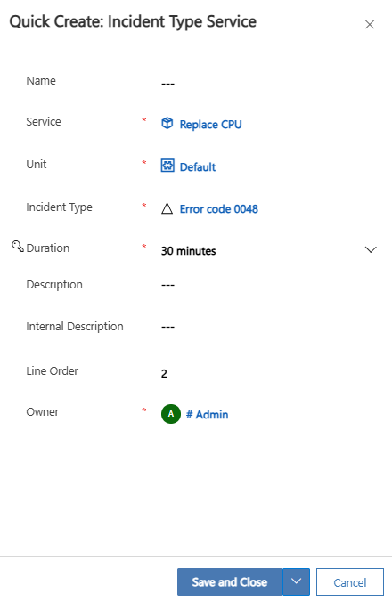

The only difference between incident type products and services is that instead of quantity, there is a **Duration** field to represent the service time because a service represents labor and not a physical part. 

### Incident type service tasks

Next, go to **Service Tasks** and select **+New Incident Type Service Task**.

Select a **Task Type** or create a new one in the system. 

> [!div class="mx-imgBorder"]
> 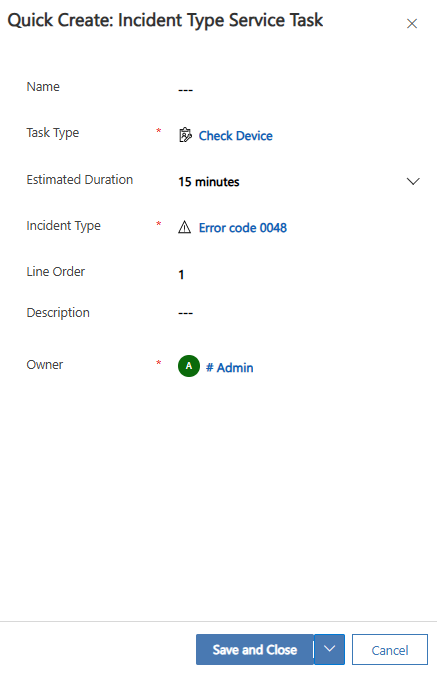

If the task type you select has a duration, it will populate in the **Estimated Duration** field of the incident type service task and can be adjusted for this specific incident as needed. As you add incident service tasks, the duration of the incident type will be the sum of the service task durations. If you do not want the incident duration to be derived from service task durations, then you should either set the incident service task duration to 0 minutes or null for all incident service task types, or consider removing durations from the original task type.

The order in which you add service task types is the order in which they'll appear on the work orders when this incident is added. The order of service tasks is important for organizations and reflects a process that should be followed. It is common for organizations to have as many as 40 service tasks for a detailed process. 

After saving, you can edit the **Line Order** field as needed to change the order of service tasks where "1" is the service task that will appear first.

After adding multiple service tasks, they will display in the incident service task list. In the following screenshot example, none of the individual service tasks were given an estimated duration because we chose to add an estimated duration at the incident type level instead.

> [!div class="mx-imgBorder"]
> 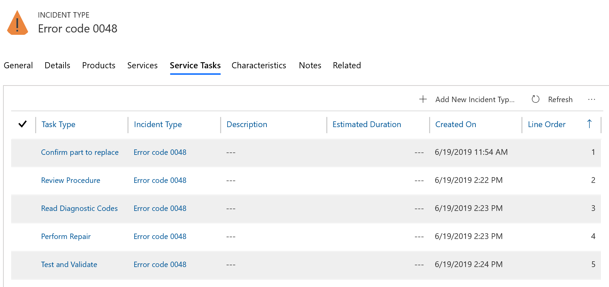

### Incident type characteristics

Next, you can associate characteristics (skills) to incident types in order to define the skill set needed to perform the incident type. Characteristics are also added to resources (field technicians), which helps the system match work order incidents with the best resources who can do the job. When this incident is added to a work order and scheduled, the schedule assistant and resource scheduling optimization will consider the associated characteristics.

> [!Note]
> If you want to use **Requirement Groups** with **Incident Types** for multi-resource scheduling, do not add characteristics (skills) to the incident type. Instead, you should add required characteristics to the requirement group template. For more information, see the article on [requirement groups for work orders](https://docs.microsoft.com/dynamics365/customer-engagement/field-service/multi-resource-scheduling-requirement-groups#requirement-groups-for-work-orders).

Go to **Characteristics** and select **+New Incident Type Characteristic**.

Select a **Characteristic** from the look-up field or create a new one.

Characteristics are a versatile way to define the resource attributes needed to perform an incident type. 

Examples include:

- Skills, such as "JavaScript and HTML"
- Language proficiency, such as "Spanish"
- Certifications, such as "CPR certifications"
- Security clearance, such as "Building 12 access"

When characteristics are added to a resource, you can define the level of proficiency of the resource. For example, one resource might be excellent at speaking Spanish, but another might be adequate. **Rating Value** allows you to set the level of expertise required to perform this incident type. A resource must meet or exceed the rating value to be considered when attempting to schedule work orders this incident type will be added to. If left blank, all proficiency levels are acceptable if the resource has the matching characteristic. You can define rating values in **Resource Scheduling** > **Settings** > **Proficiency Models**.

## Add an incident type to a work order

Now we're ready to use the incident type by adding it to a work order. From our incident type products, services, service tasks, and characteristics, the system will create work order products, services, service tasks, and characteristics.

In the **Primary Incident Type** field, we will look up and add our newly created incident type.

The following fields will populate:

- **Primary Incident Description**
- **Primary Incident Estimated Duration**
- **Work Order Type**

> [!div class="mx-imgBorder"]
> 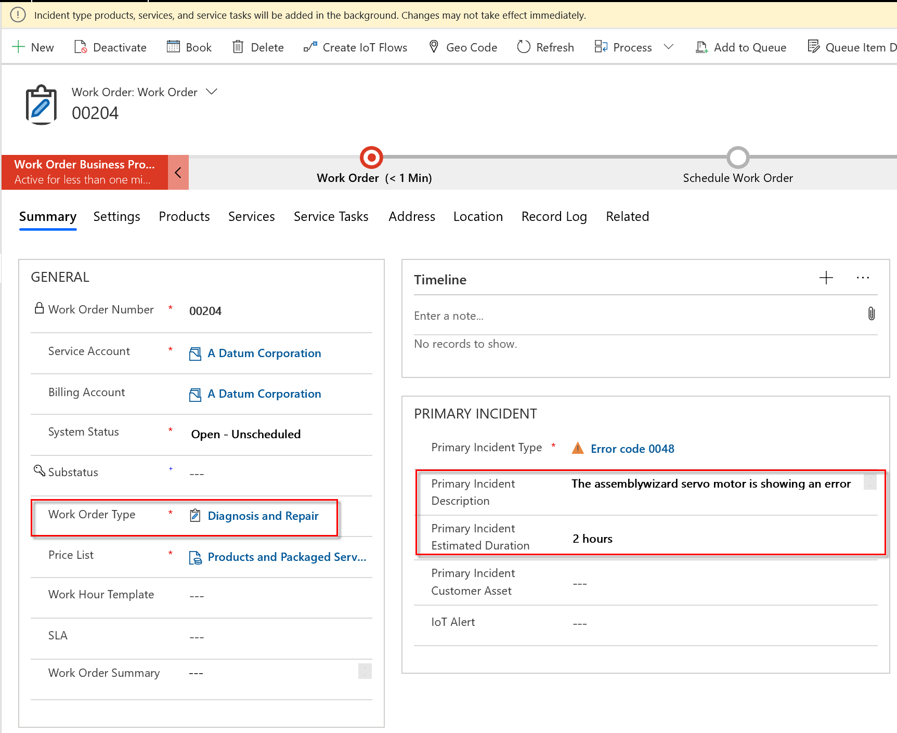

Not immediately, but after a short time, the related work order products, services, and service tasks will be added. This addition is the result of a system job called **LongJobs_CopyIncidentItemsToWorkOrder** number 464.

> [!div class="mx-imgBorder"]
> 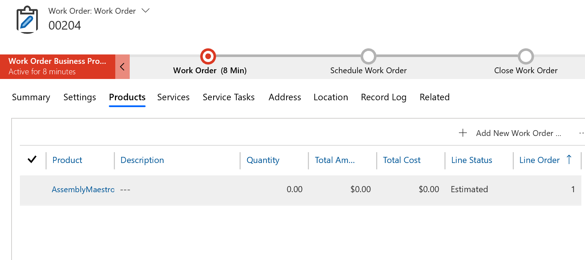

The **Estimate Quantity** of the work order product reflects the incident product quantity we specified.

> [!div class="mx-imgBorder"]
> 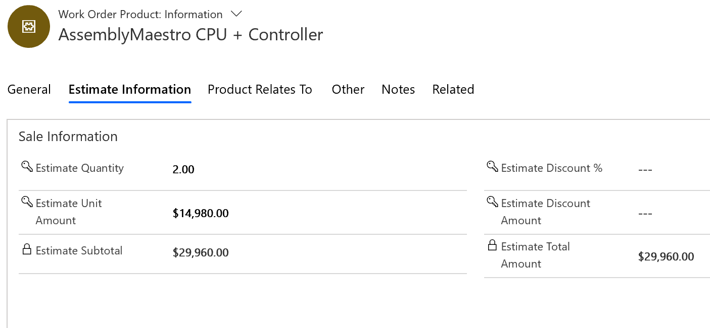

The same is true for **Work Order Services** and **Estimate Duration**.

Also, the work order service tasks are added to the work order in the order reflected on the incident type.

> [!div class="mx-imgBorder"]
> 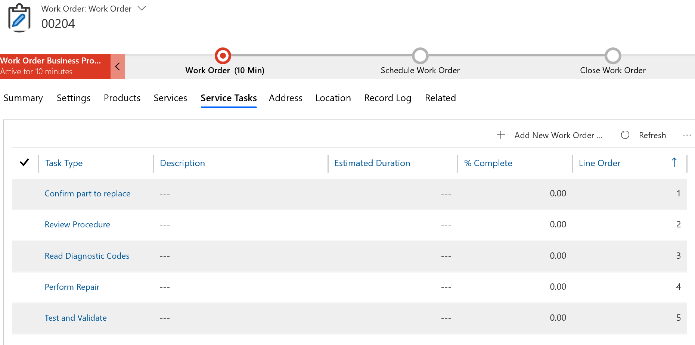

Select the **Related** tab, and then **Characteristics**. The incident type characteristics are added as requirement characteristics.

> [!div class="mx-imgBorder"]
> 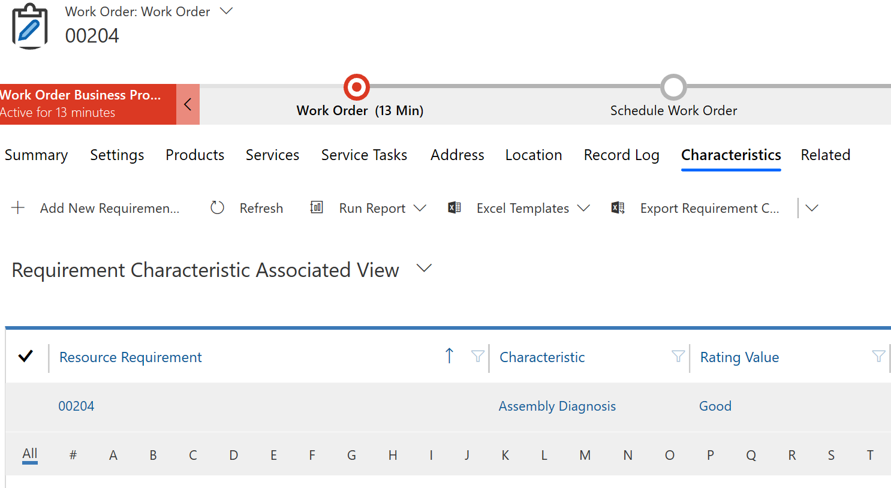

In order to appropriately schedule this work order, the related **Resource Requirement** has a **Duration** equal to the incident type duration (2 hours in our example) and the characteristic is passed along as well. 

> [!div class="mx-imgBorder"]
> 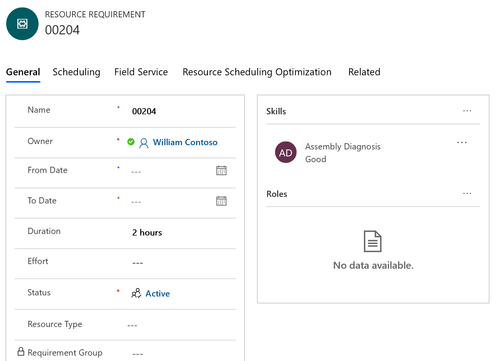

The requirement record is used for scheduling, so when you select **Book** from the work order or requirement, the duration and characteristic (with rating value) are used as filters, both of which originated with the incident type.

> [!div class="mx-imgBorder"]
> 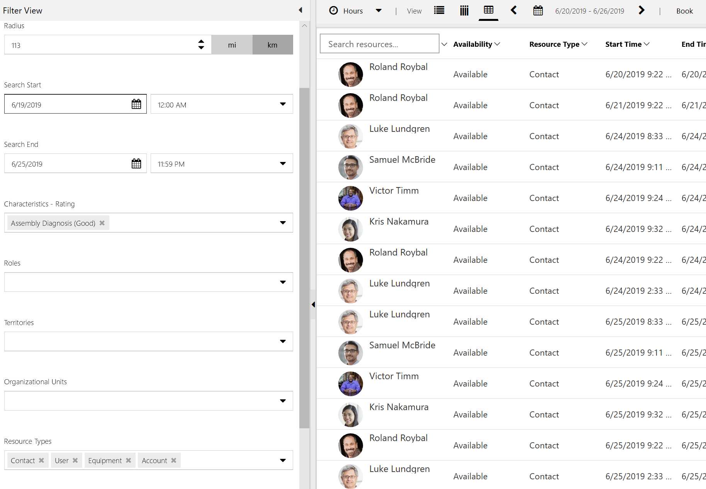

Finally, after it's scheduled, the field technician will receive the booked work order along with the incident and related details. 

> [!div class="mx-imgBorder"]
> 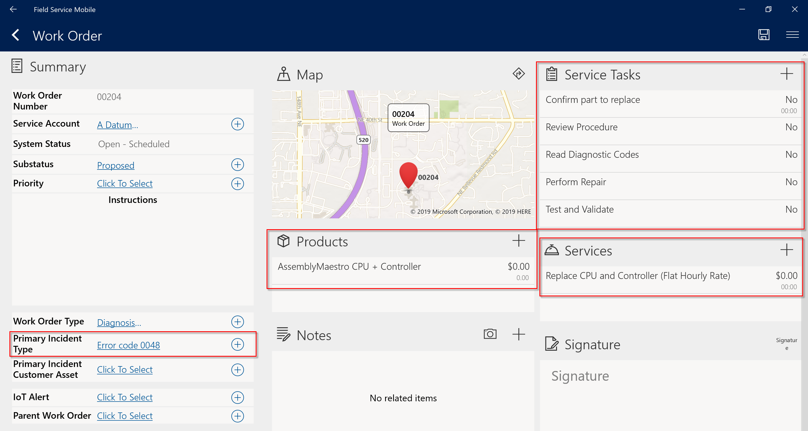

## Add multiple incident types to a work order

The primary incident type field is a great way to define the main purpose of a work order. However, you can also add *multiple* incident types to a work order. For example, perhaps a machine has multiple issues or multiple machines need to be worked on. All incidents should be performed by the dispatched resource. Adding multiple incidents to a work order will add on to the duration and existing service tasks, products, services, and characteristics.

Go to **Related** > **Incidents** > **+New Incident Type** and add another incident. 

> [!div class="mx-imgBorder"]
> 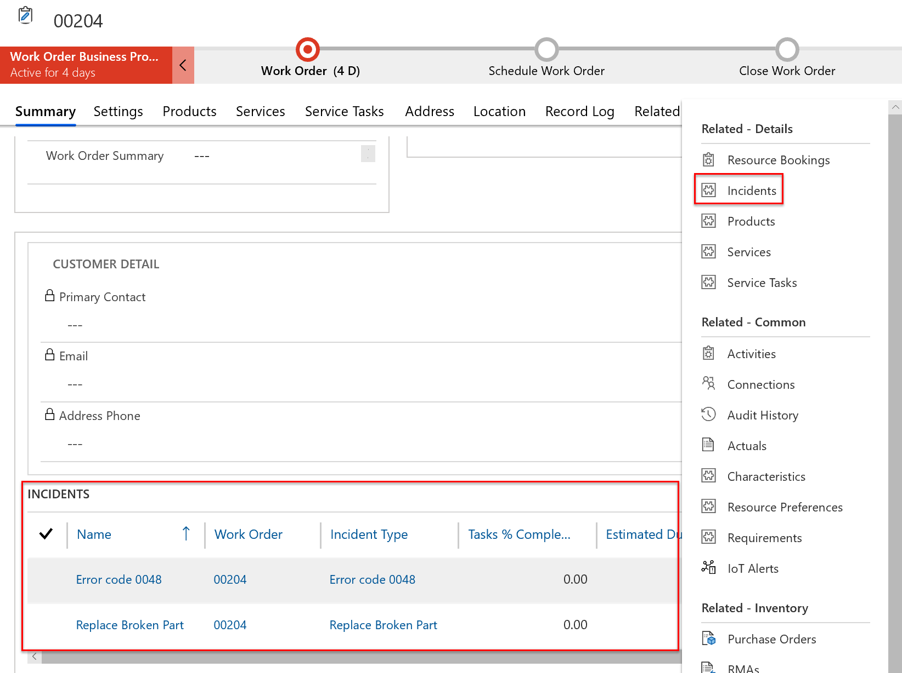

> [!div class="mx-imgBorder"]
> 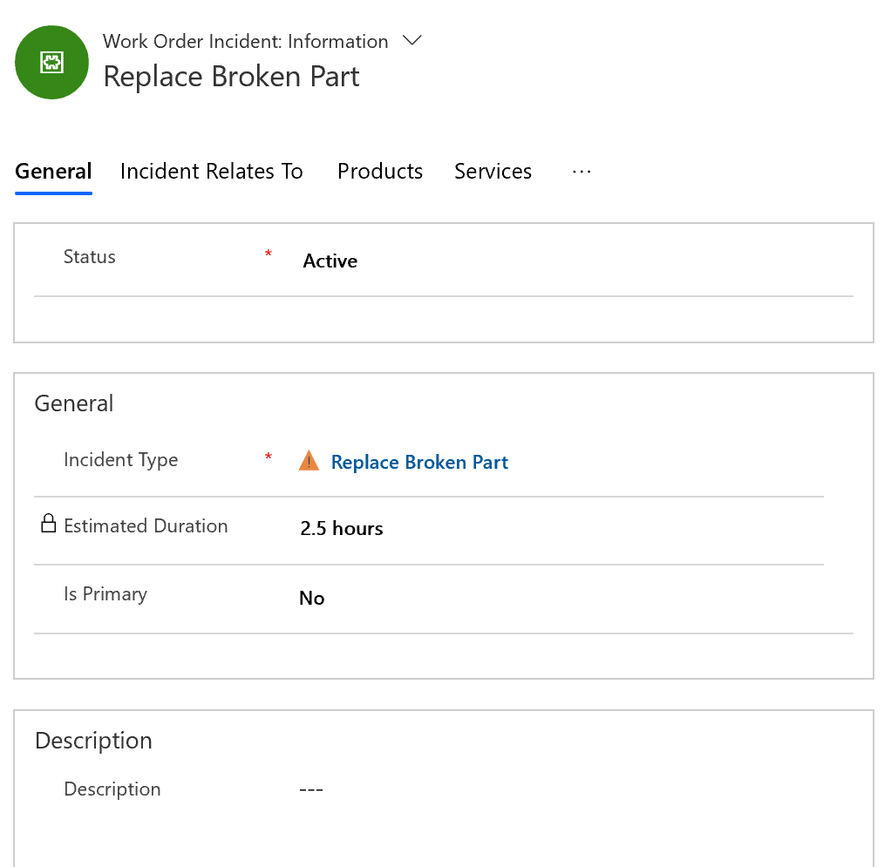

Though the primary incident estimated duration will not change, the **Total Estimated Duration** field in the record log section of the work order will be updated.  

> [!div class="mx-imgBorder"]
> 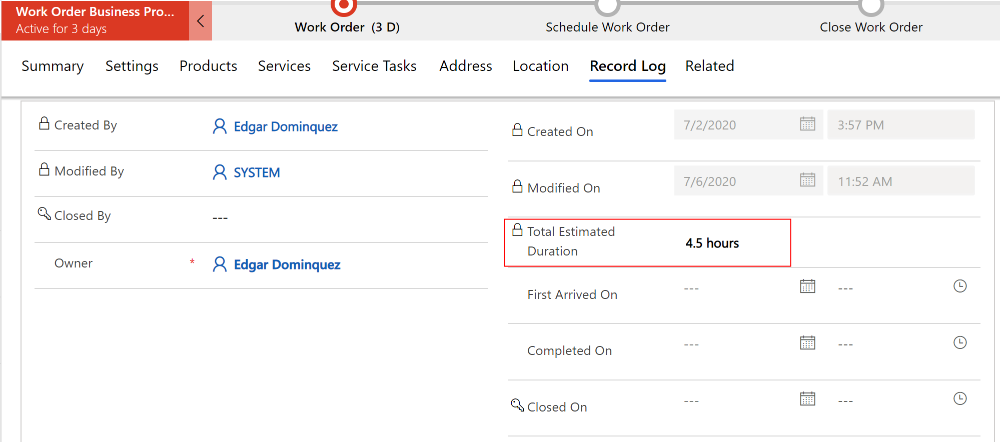

> [!Note]
> **Total Estimated Duration** is also increased when individual work order service tasks are added to work orders.

The duration of the related resource requirement will also be increased by the new incident's duration. In the following screenshot, we can see the requirement duration was increased to 4.5 hours and another characteristic was added to the work order requirement.

> [!div class="mx-imgBorder"]
> 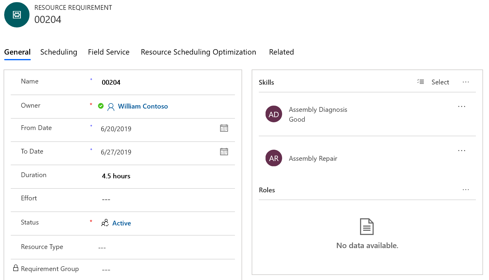

Back on the work order, the second incident's products, services, and service tasks were added as well. It's common for incident types to have overlapping service tasks, and duplicates will be added, so consider if this is right for your business processes.

> [!div class="mx-imgBorder"]
> 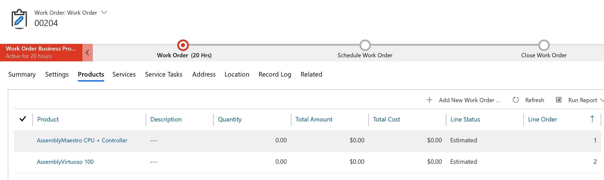

The order of the service tasks reflects the order in which incidents are added.

When attempting to book a work order with multiple incidents, the schedule assistant and Resource Scheduling Optimization will look for a single resource with time availability to complete all incidents and has all the matching characteristics. With the schedule assistant, these filters can be edited at the time of scheduling as needed. 

> [!div class="mx-imgBorder"]
> 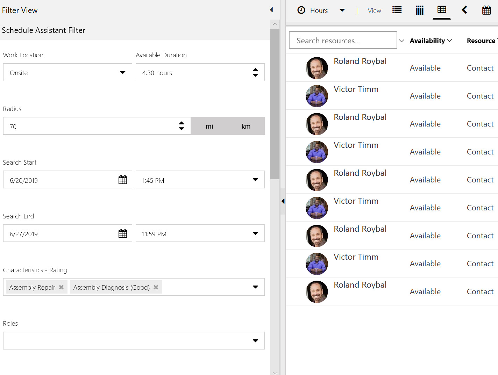

## Use customer assets with incident types

Incident types can also be related to customer assets to tell field technicians which asset needs attention and build a service history. You can have all incidents related to the same asset or even have each incident related to different customer assets as needed.

For the primary incident type, populate the **Primary Incident Customer Asset** field. This field is filtered to only show customer assets related to the work order service account by default. 

> [!div class="mx-imgBorder"]
> 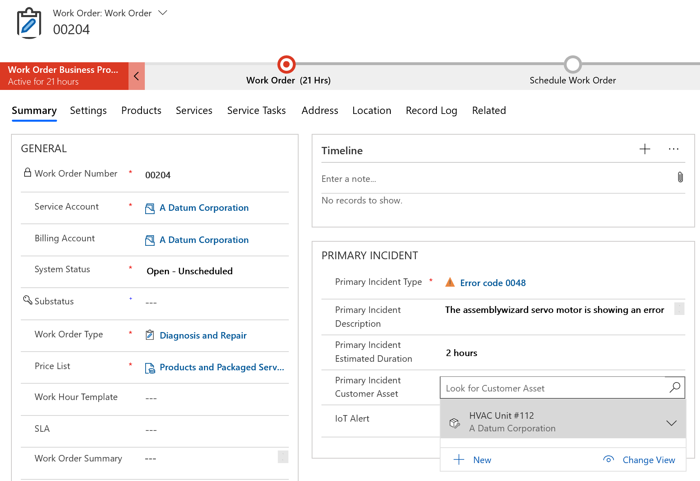

For other work order incident types, go to the **Incident Relates To** section and associate a customer asset.

Once a work order incident and customer asset are associated, you will see the work order on the customer asset record, along with all previous work orders related to the asset. This can be displayed on the mobile app for field technicians to better understand the history of the part they are working on.

> [!div class="mx-imgBorder"]
> 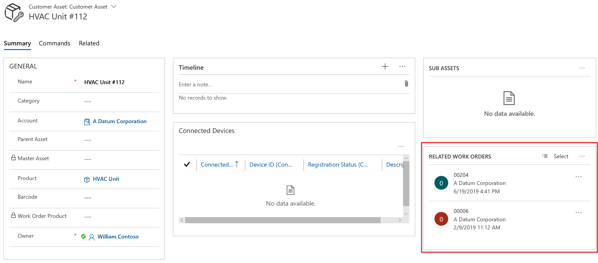

## Incidents for multi-resource scheduling

If an incident type should be completed by multiple resources, relate the incident type to a requirement group template. This will add a requirement group to the work order when the incident is added. Scheduling requirement groups for work orders ensures each resource arrives on site at the same time. 

There are a few important notes when using incidents with requirement groups:

- You can't add characteristics to the incident type or directly to the work order. This is because you should add required characteristics in the requirement group template.
- The work order can only have one incident.

For more information, see the article on [requirement groups for work orders](https://docs.microsoft.com/dynamics365/customer-engagement/field-service/multi-resource-scheduling-requirement-groups#requirement-groups-for-work-orders).

> [!Note]
> **Multiple incidents vs. requirement group templates:** If you know a work order should be performed by multiple resources, we highly recommended using requirement group templates versus multiple incident types. Let's say you have a work order with two incident types, each requiring different skills. When attempting to book the work order, the system will look for a single resource (including crews) to fulfill the job. The scheduler would need to perform extra steps, like editing filters or selecting **Book** twice, to schedule it to two different resources to arrive at the same time. However, if you use a requirement group template, the schedule assistant will simultaneously search for both a single resource with both skills or two resources each with one skill to arrive at the same time. 

## AI suggestions

With Field Service v8.8.20.12+, **Incident Type AI** suggestions recommend ways to improve your incident types by learning from past work orders. For example, imagine you have an incident type called "System recalibration" that involves using "Product A. However, technicians frequently also use "Product B" to complete the recalibration. Using AI, the system will learn this and suggest that the administrator adds "Product B" to the incident type for future work orders.

This saves technician time by 
- not having to enter the additional work order product.
- helping better plan inventory requirements by knowing typical products needed, and most importantly.
- ensuring your business application reflects reality.

From the Field Service app, go to **Settings** > **Field Service Settings** > **Intelligence section** and **Enable Incident Type Suggestion**.

> [!div class="mx-imgBorder"]
> 

- **Historical Data Filter**: dictates how much historical data is analyzed as part of each run.

- **Run Frequency**: dictates how often the system will analyze incident types and make suggestions if applicable. At this time, this cannot be changed.

- **Return Top X Results**: dictates how many suggestions will be returned from each run. 

Across multiple runs, it's possible to see more than the number of results defined in **Return Top X Results**. When the system returns results, if a previous run returned the same combined set of parameters (incident type, product/service/incident type for merge, suggested value, unit), it will deactivate the earlier sets and will ensure that only the most recent, most relevant, unique version of that result is displayed. This means that unique results that have not been applied, disliked, or deactivated will still show in the list of visible results.

> [!div class="mx-imgBorder"]
> 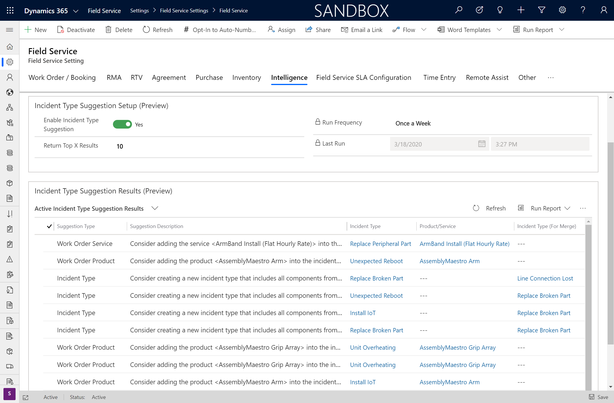

Incident type suggestions fall into three categories:

1. Work order product 

> [!div class="mx-imgBorder"]
> 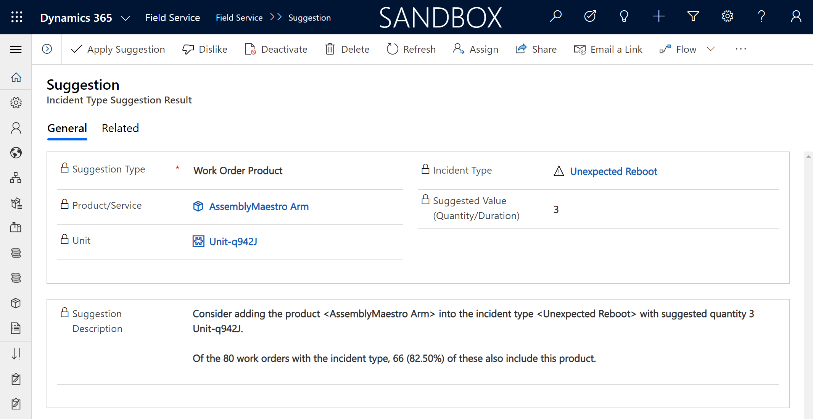

The system suggests adding a product to an incident type.

2. Work order service

> [!div class="mx-imgBorder"]
> 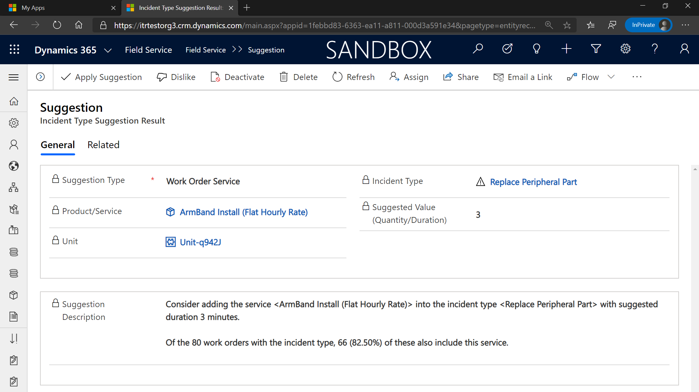

The system suggests adding a service to an incident type.

3. Incident Type

> [!div class="mx-imgBorder"]
> 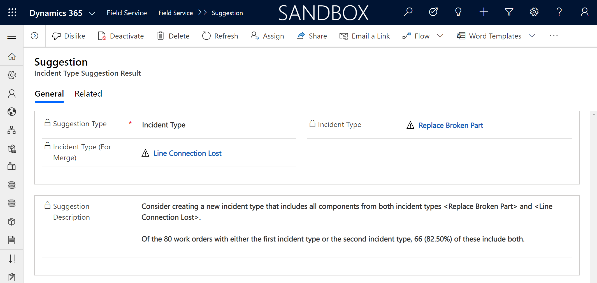

The system suggests merging two incident types together into one incident type.

For each suggestion, you have the option to:

1. **Apply Suggestion**: The system will add the product or service to the incident type for you. This is not available when the suggestion type is  **Incident Type**.
2. **Dislike**: The suggestion will be removed from the list. This option helps improve the AI suggestion model. 

Once a suggestion is either applied or disliked, it will ensure that particular combined set of parameters (incident type, product/service/incident type for merge, suggested value, unit) is not returned as a suggestion by the system. This ensures the system continues to provide only the most valuable suggestions.

## Configuration considerations

- The **Copy Incident Items to Agreement** field during the incident type setup is important for two reasons:

  - The incident you would like to add to an agreement might be slightly different than the incident you would add to a single work order that's not part of an agreement. For example, normally the incident would require 1 hour of a service, but for the agreement, you negotiated with the customer 2 hours of a service. Rather than having to create a second incident type just for this agreement, you can set **Copy Incident Items to Agreement** to **No**, add the incident to the agreement, then manually add the specific service tasks, product, services, and so on. This way you can use the same incident type, which helps for reporting later on. Set this option to **Yes** and the incident items will be added to the agreement and you can accept these items or make slight variations from there. 

    If set to **Yes**, agreement items will be created.

    > [!div class="mx-imgBorder"]
    > 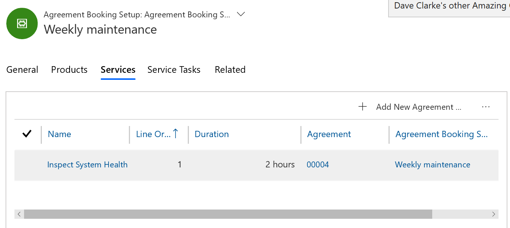

    If set to **No**, they will not.

    > [!div class="mx-imgBorder"]
    > 

  - Incidents can be added to agreements for recurring work. This means agreements will generate work orders with predefined work order incidents attached. However, as mentioned earlier in this article, incidents can be edited as processes and procedures change. But agreements can span multiple months and even years, so should the agreement use the original incident type at the time of agreement creation, or use the latest changes to the incident type? This could result in different work being performed than originally intended at the end of the agreement. 
  
    Set to **Yes** if the incident should remain the same throughout the agreement life span by copying the incident details to the agreement at the time of agreement activation. Set to **No** if the work orders generated from the agreement should grab the latest incident type details when the work orders are generated from the agreement, which is generally at an ongoing basis depending on the **Generate Work Orders X Days In Advance** field on **Agreement Booking Setup**. 
  
- There is a **Resolution** tab on the **Work Order Incident** to document whether the incident was completed.
- When adding multiple incident types to a work order, if doing so adds two or more of the same characteristics (skill), the scheduling logic will use the most restrictive of the skills to match resources. For example, if one incident type adds the characteristic "Spanish" with a "Good" rating value, and another incident adds "Spanish" with an "Excellent" rating value, the schedule assistant and resource scheduling optimization will look for resources that are excellent in Spanish, because it has a higher value and is deemed more restrictive. 
- Crews will display in schedule assistant results for work orders with multiple incidents because the system views crews as a single resource. Currently, resource scheduling optimization does not schedule crews.

> [!div class="mx-imgBorder"]
> 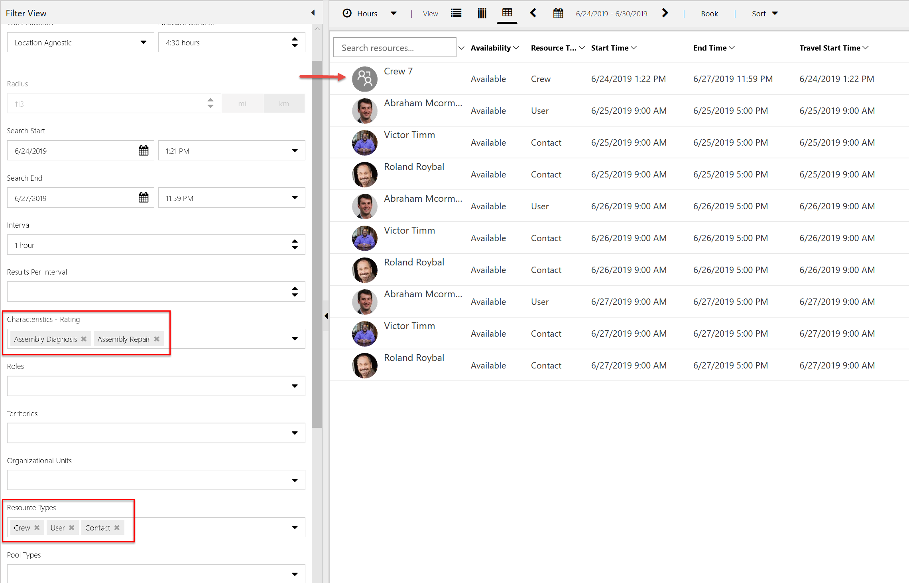

### Understanding incident entities

There are multiple entities involved in using incident types, and you should be aware of them when you'd like to write workflows or other plug-ins. First let's consider an example with an incident type with one product. 

#### Work order scenario

    Incident Type > Incident Product > Work Order Incident > Work Order Incident Product

  First an **Incident Type** is created and a product is added to the incident creating an **Incident Product**. When the incident type is added to a work order, a **Work Order Incident** is created along with a **Work Order Incident Product**. 

#### Agreement scenario

    Incident Type > Incident Product > Agreement Incident > Agreement Product > Work Order Incident

When using incidents with **Agreements**, the incidents and related items are added to agreements first, and then passed along to work orders as they are generated by the agreement.

## Additional notes

Only one work order incident can be the primary incident and this is either the first incident added or the one entered in the primary incident type field. There is a Boolean value on the work order incident type called **Is Primary** that indicates this and can be used for business logic.

### Implementing incident types

- Incidents should be created for issues that are common or for issues that have a specific process. If you'd like better reporting for issues, consider making incidents for them as well.
- Incidents should be more specific than work order types, but not too specific as to not be reusable.
- Ask customers if they maintain a list of most common work order issues. Often they do and the common work order issues can be imported into Dynamics 365 through Excel as a start to configuring incidents.
- When setting up incident types for the first time, we recommend not creating many incident types too quickly; customers might end up using incident types differently than intended. For example, a customer might perform a safety test on three different models of a machine. Rather than creating three safety test incidents, one for each model, start with one incident type that can be used on work orders for all three models. Then determine at a later date if more are needed.
- By default, work order service tasks have a field called **% Complete** that field technicians can use to record their progress completing each service task. It's common to replace this field or add another yes-or-no field. It's also common to use custom Offline HTML and JavaScript on Field Service Mobile to prevent field technicians from completing a work order until all work order service tasks are complete. 
  
### Maximizing incidents
- Consider using Azure Machine Learning to improve the estimated durations of incidents types. This means adjusting the duration of incidents as they are completed based on the actual duration of the work order.
- Correlating incident types with IoT alerts generated from Connected Field Service can streamline issues and resolutions and improve the organization's first-time fix rate.

### See also  

- [Create work order types](../field-service/create-work-order-types.md)   
- [Create a work order](../field-service/create-work-order.md)
- [Add account details to work orders](../field-service/work-order-customer-account.md)   
- [Work order life cycle and statuses](../field-service/work-order-status-booking-status.md)  
- [Set up service task types](../field-service/set-up-service-task-types.md)

[!INCLUDE[footer-include](../includes/footer-banner.md)]