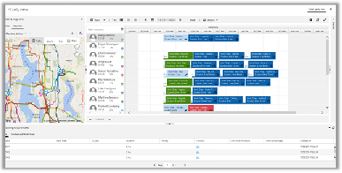
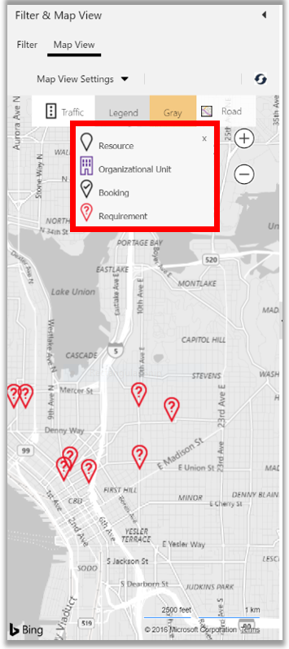
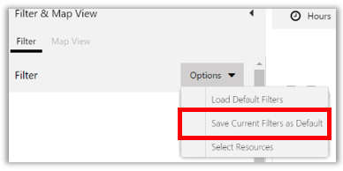
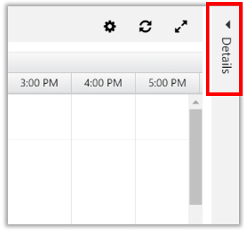
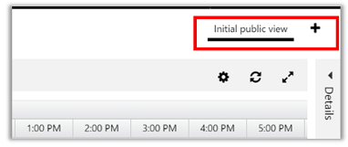
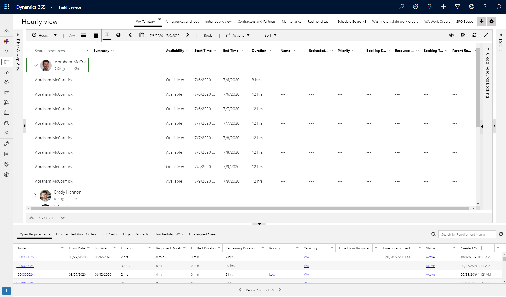

# Use and configure the schedule board in Dynamics 365 Field Service

The [!INCLUDE[pn_dyn_365_field_service](../includes/pn-dyn-365-field-service.md)] schedule board provides an overview of resource availability and bookings you can make.  Before you use the schedule board, it is important to set up the views and filters to your preference.  
  
> [!IMPORTANT]
>  To use the schedule board booking functionality, geocoding, and location services, you need to turn on maps.  
>   
> 1. From the main menu, click **Resource Scheduling** > **Administration**.  
> 2. Click **Scheduling parameters**.  
> 3. Open the record and scroll down to the **Resource Scheduling Optimization** section.  
> 4. On the **Connect to Maps** field, choose **Yes**.  
> 5. Accept the terms and save the record. 

> [!VIDEO https://www.microsoft.com/videoplayer/embed/RE4ynSg]

> [!Note]
> For additional Field Service videos, see [this full playlist](https://aka.ms/fs-videos).
  
## View the schedule board  
  
-   To view the schedule, from the main menu, select **Resources Scheduling** > **Schedule Board**.  
    
## Overview of the schedule board  
 When you hover over a booking using your mouse, you'll see additional information about it. The line color indicates the type of booking, such as work order, case, or opportunity.  
  
 Bookings that are not linked to an entity don’t have a color associated with them.  
  
 When you’re looking at the schedule board for the current day, you’ll see a blue line that indicates the current time of day. You can also see a picture of all the resources listed on the schedule board. To quickly view contact information for a resource, hover over their name to view the contact card.  
  
   
  
   
## Configure the filter and map view  
 Map view shows the location of resources, organizational units, bookings, and requirements. The screenshot below shows the color legend.  
  
   
  
### Set filters  
  
1. From the main menu, select **Resource Scheduling**  > **Schedule Board**.  
  
2. **Filter & Map View**: select the **Filter** tab to filter information by **Characteristics - Rating** **Roles**, **Territories**, **Organizational Units**, **Resource Types**, **Teams**, and **Business Units** to narrow or expand the schedule board view.  
  
   - **Characteristics – Rating**, filters by skills that resources possess, with a rating of familiar, good, or proficient. [!INCLUDE[proc_more_information](../includes/proc-more-information.md)] [Set up characteristics](../field-service/set-up-characteristics.md)  
  
   - **Roles**, filters by resource role and associates skills and proficiencies to that role. [!INCLUDE[proc_more_information](../includes/proc-more-information.md)] [Configure resource roles (Project Service Automation)](../project-service/configure-resource-roles.md)  
  
   - **Service Territory** filters will narrow down the schedule board to only those resources who belong to that territory.  
  
   - **Organizational units** filters groups or divisions in a professional services company that employs billable resources with cost rates that are distinct from other such groups or divisions in the company. [!INCLUDE[proc_more_information](../includes/proc-more-information.md)] [Create organizational units (Project Service Automation)](../project-service/create-organizational-units.md)  
  
   - **Resource Types**, when selected, will show up in the Schedule Board pane by associated category. Categories are defined by the user, but could include things like crew, technician, or plumber.  
  
   - **Teams** filters by teams that have been set up.  
  
   - **Business Units** filters by groups that have specific access to information to do their job. [!INCLUDE[proc_more_information](../includes/proc-more-information.md)] [Create or edit a business unit to control access to records](../admin/create-edit-business-units.md)  
  
### Set default filters  
   
  
-   If you update a filter and want to save it as your new default filter, select **Options** > **Save Current Filters as Default**.  
  
-   To go back to your default filter, select **Options** > **Load Default Filters**.  
  
### Set options to see a specific set of resources  
 You can also create an option to see only a specific set of resources on the schedule board. For example, a dispatcher using Field Service can create an option to only see resources on the schedule board that are in the Washington territory. Once this is set, when you use the filter option it will only show your specified set of resources.  
  
1.  Select **Options** > **Select Resources**.  
  
2.  In the **Resources** dialog box, use the **Resource Type** and **Service Territory** filter to find the set of resources that you want to see on the schedule board.  
  
3.  When you see the resources that you want to work with under **All Resources**, select **Move all to right**.  
  
4.  When you’re done, select **Apply**.  
  
   
## Configuration tabs  
 Configuration tabs let you choose the time unit to be displayed, the view orientation, the time offset, and other actions like getting driving directions, moving bookings to the next day, printing the schedule, or add a booking alert.  
  
   
  
 **View Options**  
  
-   To configure the schedule board's time horizon to see hours, days, weeks, months, or years at a time, select the **Hours** button,  and then choose an option.  
  
-   By default, the schedule board is presented in horizontal view, with the time in columns and resources in rows.  
  
    -   To see a vertical layout of the schedule board, select **Vertical View**. The vertical view shows the same information, but changes the appearance of the schedule board. The resources are presented in columns and time is shown on the left.  
  
    -   Select the **Map View** option to show a map version of the schedule board. This is the same map view that appears in the **Filter & Map** view pane on the left.  
  
### Scheduler settings  
 Scheduler settings let you configure your time offset so you can synchronize dates and content with a location.  
  
-   Select the **Scheduler Setting** button and choose the following:  
  
    - **Time Zone**: Choose what time zone to work in.  
  
    - **Working Time**: Choose the start and end time of your working hours.  
  
    - **Time Resolution**: Set the time by sliding the bar left or right; this lets you schedule resources in more precise time intervals.  
  
    - **Resources per page**: Set up the number of resources to be displayed on the screen. The schedule board's appearance will change to show only the number of days selected.  
  
    - **Number of Days**: Set up the number of days to be displayed on the screen. The schedule board's appearance will change to show only the number of days selected.  
  
    - **Sizes**: Lets you adjust the size of the columns and rows on the schedule board. You can slide the bars to set the ideal height and width that will show all necessary information on the scheduled booking, rather than having some of it cut off.  
  
    - **Travel Duration Settings**: Lets you see travel time on the schedule board. To activate this setting,  select the **Show Travel Time** check box.  
  
    - **View Settings**: Lets you hide canceled bookings, deactivated bookings, and hide the legend on the map.  
  
    - **Booking Requirements Settings**: This filter shows only booking requirements for a specified territory.  
  
### Details  
 Select **Details** on the right to see a detailed view of bookings.  
  
   
  
   
## Configure Booking Requirements  
 The booking requirements area is shown at the bottom of the schedule board and lists all unscheduled bookings. You can easily drag and drop unscheduled bookings from the list onto the schedule board.  
  
 You can also select an unscheduled booking and find available resources from those that are listed on the schedule board, or choose from all the resources in the system. When you do this, the filters will show the options for the selected booking requirement. [Schedule a work order](../field-service/schedule-work-order.md)  
  
-   Go to the list of existing unscheduled booking requirements in the lower pane of the schedule board.  
  
    -   Select column headings to sort data from least to greatest, or to sort it alphabetically, etc.  
  
    -   Adjust column width by dragging column boundaries on each column title.  
  
         Expand or collapse unscheduled bookings panel by clicking the down arrow in the upper right corner of the list view pane.  
  
    -   To access information on more unscheduled bookings, use the lower navigation arrow to move to the next page.  
  
   
## Create additional tabs  
  
- To add a new schedule board tab, select **+Add Tab** at the top.  
  
  > [!NOTE]
  >  To edit an existing schedule board view, double-click the view name.  
  
    
  
- A window opens showing all the configuration options.  
  
  -   Give the tab a name by filling in the **Name** field.  
  
  -   You can configure a tab in several ways by choosing parameters in each of the configuration options shown in the pop-up window.  
  
  -   Select the **General Settings**, and then choose settings for the map as well as other settings.  
  
  -   Select the **Schedule Types** option, and then choose booking tooltips, template views, and default availability view for each entity type that has scheduling turned on.  
  
  -   Select **Add** at the bottom of the pop-up window to create the new tab.  
  
  > [!NOTE]
  >  Your admin can also add custom views to the list. [!INCLUDE[proc_more_information](../includes/proc-more-information.md)] [Create or edit a public view for an entity](../customize/create-edit-views.md)  
  
- Select the **Unscheduled Panels** view, and then choose a view from the drop-down list. Choose a view for the unscheduled bookings at the bottom of the schedule board.  
  
### Add booking requirements tabs  
 You can create booking requirement tabs for different types of bookings. For example, you can create separate tabs for work orders, cases, and opportunities.  
  
 Before you create tabs, make sure the entity is enabled for scheduling.  
  
1.  On the schedule board, double-click **Initial public view.**  
  
2.  Scroll down to the **Requirement** section to add additional tabs.  

## Keyboard shortcuts

You can use keyboard shortcuts when viewing the schedule board in the list view, shown in the following screenshot and table.

> [!div class="mx-imgBorder"]
> 

| Command | Keys |
|  --- | --- | 
| Expand collapsed row | SHIFT ALT + | 
| Collapse expanded row | SHIFT ALT - | 
  
## Privacy  
[!INCLUDE[cc_ disclaimer_crm_bing_maps_mapping_location](../includes/cc-disclaimer-crm-bing-maps-mapping-location.md)]   

### See also   
[Overview of Dynamics 365 Field Service](../field-service/overview.md)   
[Create a work order](../field-service/create-work-order.md)   
[Submit and approve time-off requests](../field-service/submit-approve-time-off-requests.md)   
[Schedule a work order](../field-service/schedule-work-order.md)
