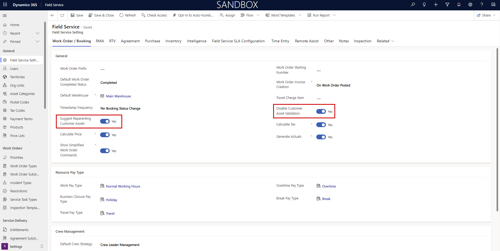
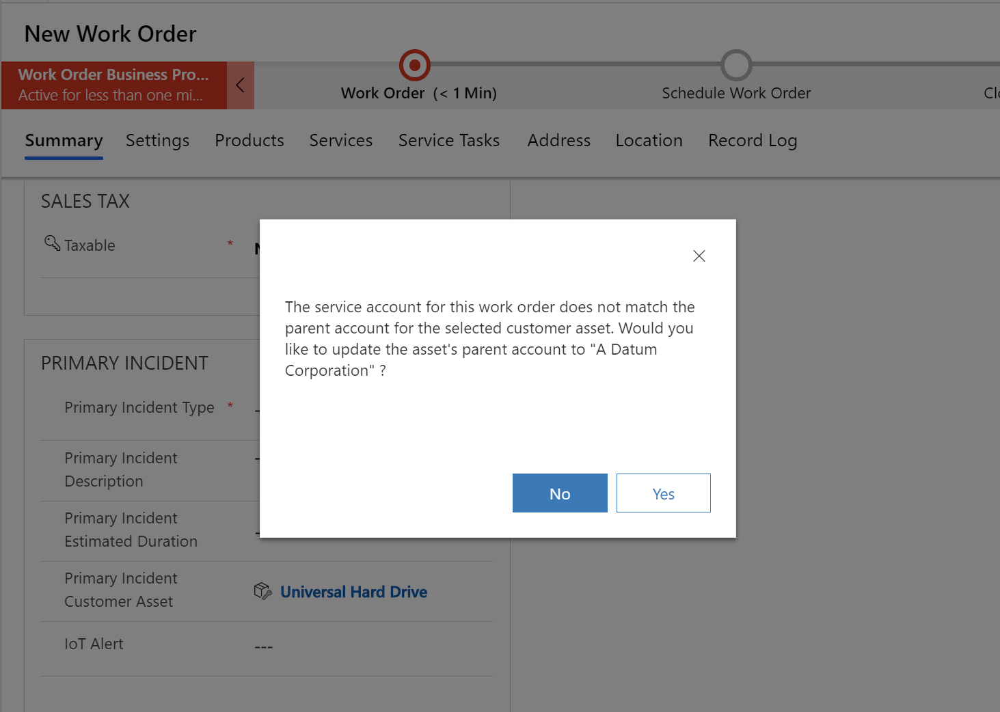

# Asset servicing in Dynamics 365 Field Service

Customer assets let you keep track of equipment that you're responsible for inspecting, maintaining, and repairing. At their simplest, customer assets note which products are located at each customer location. But they can also track service history of all past and present work orders for each asset. And if you're using Connected Field Service, you can connect customer assets to sensors that monitor the asset's health and trigger IoT alerts and work orders as needed.

In this article, let's explore creating customer assets and noting them on work orders, agreements, and IoT devices to build out service history.

For a guided walkthrough, check out the following video.

> [!VIDEO https://www.microsoft.com/videoplayer/embed/RE4Ly0y]

## Prerequisites

- Customer assets can be created and noted on work orders in all versions of Field Service.
- If you want to associate customer asset with IoT devices, you'll need Connected Field Service, which is available with Field Service 7.5.5+ and 8.2+.

## Create customer assets

Customer assets can be created:

1. manually or via import
2. automatically when work order products are used

### Manually create customer assets

From the main menu, go to **Field Service** > **Customer Assets** > **+New**.  

> [!div class="mx-imgBorder"]
> 

For the following fields: 
  
- **Name**: Enter a reference name or title for the customer asset. The name can be the make and model of the asset, the name of the product in the product catalog, a general name like "HVAC Unit," or even hold descriptive information like "HVAC Unit 2nd Floor".

- **Category**: Add or create a customer asset category that serves as a label to organize assets into useful groups by function, model, and so on, based on your business needs.

- **Service Account**: Choose an account from the lookup to represent the location and customer of the customer asset. As a simple rule, if you were going to create a work order to repair the customer asset, the service account of the work order and the service account of the customer asset should be the same. 

- **Product**: If the customer asset correlates with a product in your product catalog, choose it from the lookup. This field allows for flexibility in your asset management, even if the asset did not originate from your product catalog. One example might be if a field service organization takes over managing existing assets from a different manufacturer or supplier.

- **Parent Asset**: Field Service supports hierarchical customer asset structures. For example, a part can be the child of a widget, which is the child of a machine. You can have as many parent-child relationships as needed. Use this field to identify the direct parent of this customer asset. The **Master Asset** shows the top-level parent in the relationship automatically. Additionally, you can use the **Sub Asset** grid on the form to add child customer assets. 

 Don't forget to **Save**.  
   
### Automatically create customer assets from work order products  

Customer assets can also be created automatically when a work order product is used when the work is being done.

First, find the product in the product catalog you would like to make a customer asset when it's sold to a customer (or in other words, added to a work order and used).

> [!div class="mx-imgBorder"]
> 

In the **Field Service** section of the product record, set **Convert to Customer Asset** to **Yes**. 

> [!Note]
> Services cannot become customer assets, only products where **Field Service Product Type** = **Inventory** or **Non-inventory**.

Next, add the product to a work order, which will create a work order product. You can add the product manually or automatically when a work order incident type is added.

> [!div class="mx-imgBorder"]
> 

Add a **Quantity** and set **Line Status** to **Used** on the work order product, indicating it was consumed during the work order.

> [!div class="mx-imgBorder"]
> 

When a work order system status is set to **Open-Completed**, the system will automatically generate the customer asset record and associate it with the service account listed on the work order.

> [!div class="mx-imgBorder"]
> 

Unlike manually created customer assets, automatically generated customer assets created from work order products will include a link to the work order product. 

> [!div class="mx-imgBorder"]
> 

  
## Build service history 

After customer assets are created, you can track repairs, inspections, tests, IoT data, and issues to build out a service history. Understanding service history is important for making better repair decisions, maintaining asset lifespan and uptime, and ultimately keeping customers happy. There are a few ways to build out a service history, including: 

- With notes on the timeline
- Work orders
- With agreements

### With notes on timeline

The simplest way to build service history is to use notes and the timeline feature available on Dynamics 365 forms.

For example, from Field Service Mobile, the field technician can navigate to the customer asset record and add a note.

> [!div class="mx-imgBorder"]
> 

Beyond just text, you can also add pictures, videos, and voice recordings with notes in Field Service Mobile.

> [!div class="mx-imgBorder"]
> 

Notes will appear in the customer asset form timeline and other elements like pictures will show as attachments.

One drawback of using notes and the timeline is that it's less organized and hard to report on or create metrics for. For example, imagine as a field service organization you want to report on the number of times a specific asset or asset class has needed repairs; the timeline would be too unorganized to see this information. Using the timeline is better for anecdotal notes that give field technicians context or tips.

### With work orders

A standard and more organized way to build service history is to note the customer asset on work order incidents.

As a reminder, incident types are common and distinct issues that serve as work order templates and automatically add details like work order type, work order products, services, and tasks. For more information, see the article on [creating work order templates with incident types](./configure-incident-types.md).

The most important work order incident type can be added directly from the main work order form in the **Primary Incident Type** field. For example, if the incident type is an inspection, and the purpose is to inspect a specific asset at the work order location (service account), then add a **Primary Incident Customer Asset**.

> [!div class="mx-imgBorder"]
> 

See the note in configuration considerations about adding customer assets to work orders that are not related to the work order service account.

Keep in mind you can add multiple work order incidents to a work order by going to **Related** >  **Incidents** > **+New Work Order Incidents** and each incident can be related to the same or different customer assets as long as they all belong to the same service account.

> [!Note]
> When noting a customer asset on a work order incident, the customer asset will also be noted on all work order products, services, and service tasks that result from that work order incident.

> [!div class="mx-imgBorder"]
> 

Anytime a customer asset appears on a work order incident, the work order will appear in the **Related Work Orders** section of the customer asset. 

> [!div class="mx-imgBorder"]
> 

Managers can then easily see a list of all work orders the customer asset is or was the subject of, and helps with reporting because you can concretely relate asset details (name, category, product) with work order details (service account, work order type, incident type).

### With agreements

Similar to using work order incidents, you can also use **Agreement Incident** types to:

1. Note which customer asset recurring maintenance is intended for 
2. Make sure recurring maintenance is added to the customer asset service history

For more information on agreements, see the article on [setting up agreements to automatically generate work orders and invoices](../field-service/set-up-customer-agreements.md).  

After creating an agreement, and then adding a related **Agreement Booking Setup**, you can add an **Agreement Booking Incident**. 
> [!div class="mx-imgBorder"]
> 

You can then note a customer asset on the **Agreement Booking Incident**.

> [!div class="mx-imgBorder"]
> 

When work orders are generated from the agreement and agreement booking setup, the incidents with their respective customer asset relationships will be added to the work orders as well.

Just like work order incidents, you can add multiple agreement incidents that will all be added to the generated work orders.

## Customer assets with Connected Field Service

Connected Field Service (CFS) uses assets to make better use of IoT data.

See basic configuration information, see this [video on setting up Connected Field Service with Azure IoTCentral](https://youtu.be/Sp7_JoXjHDk). 

CFS has an entity called **Devices**, which represent Internet-connected sensors. An example is a thermometer that measures temperature or a hygrometer that measures humidity. CFS allows you to relate the devices to customer assets in a one-to-many relationship, meaning one customer asset can have many related devices. For example, a single HVAC unit (customer asset) can have multiple device sensors (thermometer and hygrometer) that send readings to Azure IoT and CFS. 

> [!div class="mx-imgBorder"]
> 

From a customer asset, you can relate devices by selecting **Connect Device** in the top ribbon.

Select your IoT device from the drop-down menu.

> [!div class="mx-imgBorder"]
> 

In practice, IoT alerts for a specific sensor will also tag the related customer asset, and if a work order is created from the IoT alert, it will note the alert and the asset.

> [!div class="mx-imgBorder"]
> 

## Configuration considerations

- A used work order product with quantity of **2** won't create two customer asset records; there will be a lookup reference to the work order product that will show the exact quantity.
- It's common to add custom serial number, barcode, and QR code fields to customer assets for more specific tracking. The Field Service Mobile (Xamarin) app supports barcode scanning to populate fields and locate records in the system.
- Only products where **Field Service Product Type** is set to **Inventory** or **Non-inventory** can be added to work orders. Only those products can be automatically converted to customer assets. However, when manually creating a customer asset, you can add all products. 

### Add customer assets from different accounts to work orders

You can configure the system to allow customer assets related to accounts other than the work order service account, to be noted on work orders. This configuration helps in scenarios where an asset may be owned by a service provider, yet work orders need to be created for the customer who is currently using the asset, like with a rental or lease. 

This configuration is also helpful for warranty scenarios where an asset may be owned by the consumer, yet the work order needs to be associated to the manufacturer account who is responsible for the warranty.

> [!Note]
> For more information, see the video:  [Disable customer asset validations and suggest account reparenting](https://youtu.be/kFgGuO_36oI)

Go to **Settings** > **Field Service Settings** > **Work Order Booking** section.

> [!div class="mx-imgBorder"]
> 

Set **Disable Customer Asset Validation** to _Yes_.

When adding customer assets to work orders, this setting will allow you to search across all assets in the system, not just assets related to the work order service account.

> [!div class="mx-imgBorder"]
> 

Set **Suggest Reparenting Customer Assets** to _Yes_ to give work order creators the option change the service account of the work order to match the account of the customer asset.

> [!div class="mx-imgBorder"]
> 

## Additional notes

- [Booking alerts](./booking-alert.md), which can display helpful reminders on the schedule board, can be related to customer assets, among many other records.
- Field Service Mobile (Xamarin) supports [adding 3D models to customer assets](../field-service/3D-viewer.md) that serve as three-dimensional knowledge articles. 3D models give technicians a better idea of the asset they're working on.
  
### See also

- [Create work order templates with incident types](../field-service/configure-incident-types.md) 
- [Set up agreements to automatically generate work orders and invoices](../field-service/set-up-customer-agreements.md)
- [Adding 3D models to customer assets](../field-service/3D-viewer.md) 
- [Asset properties](asset-properties.md)
- [Define asset locations with functional location](assets-functional-location.md)
