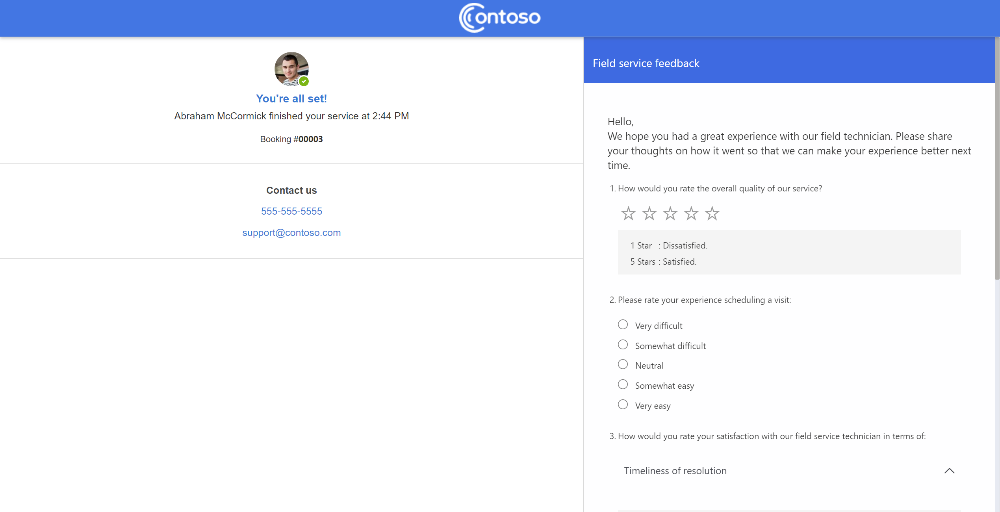
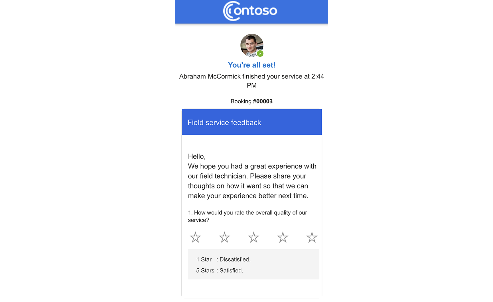

# Create and configure the Field Service Portal (preview)

The following sections guide you through the setup process and provide helpful information to configure the portal template.

## Create the Field Service customer experiences portal

<!-- user privilege prerequisites to create portal and customize it? -->

1. Go to the [Power Aps Maker portal](http://make.powerapps.com).

1. Choose an environment with Dynamics 365 Field Service and select **Create**.

1. Search for Field Service and select **Field Service Portal**.

> [!div class="mx-imgBorder"]
> 

1. Enter the name of the portal, the desired subdomain, and choose a display language and select **Create**.

The Power Pages portal site gets created in the background. This process can take a few minutes. You'll get an email when it's ready or you can check the notification area for updates.

## Configure the customer portal settings

Admins can configure most customer portal settings directly in Field Service.

1. In Field Service, open the **Settings** area. Under **Customer Portal**, select **Customer Portal** and open the settings record.

1. Configure the following settings as needed.

### Configuration tab

- **Portal Name**: A label referenced by website code to retrieve the appropriate setting. The name should be unique for the associated website, because the code retrieving the setting will take the first record found with the matching name.

- **Field Service Website**: The associated website. Opening the associated website record takes you to the [Portal Management app](/power-apps/maker/portals/configure/configure-portal).

- **Track My Technician**: Enables the options to configure the [Track a technician feature](customer-portal-technician-tracking.md).

- **Self Scheduling (Preview)**: Enables the self-scheduling experience in the portal.

- **Send self-scheduling experience to Account Contacts**: Enables automated notifications with access information for the portal. The information is sent to every contact that isn't part of an excluded account.

- **Messages**: Messages are sent at specific points of the work order lifecycle. These messages can be enabled or disabled independently. For details on each message, go to [Set up notifications for the Field Service Portal (preview)](customer-portal-notification-settings.md).

- **Communication Type**: Define whether you want the system to send your customer email, SMS, or both message types.

- **Send Messages To**: By default, the system sends messages to the contact that created the service request through the portal. If no such contact exists, messages go to the contact type noted in this setting.

- **Exclusion lists**: These lists allow you to exclude specific service accounts or service types from all messaging.

- **Include Survey (Preview)**: [Embed a Customer Voice survey for service feedback](#embed-a-customer-voice-survey-for-service-feedback), which will be presented to your customers on the portal when the booking is complete.

- **Configure SMS and Email Connector**: Direct links to the Power Automate flows where you [configure the email and SMS connectors](customer-portal-notification-settings.md).

- Excluded Work Order Types:

- Excluded Accounts:

### Display tab

### Self Scheduling (Preview) tab

Let's take a look at the self-scheduling settings, and what they do: 

- **Minimum lead time for new bookings**: Sets the minimum time, in days from today, during which the customer can schedule their booking.
- **Maximum lead time for new bookings**: Sets the maximum time, in days from today, during which the customer can schedule their booking.
- **Enable Asset Selection**: When this option is enabled, the customer has the option to select a specific asset to associate with their account while they schedule their booking.
- **Enable Additional Details**: When this option is enabled, the customer can submit text to your organization while scheduling their booking. This text will be saved as a note on the booking timeline.
- **Default Radius Unit**: Sets the radius unit to miles or kilometers.
- **Include Resource with maximum travel radius**: The maximum radius from the scheduled location in which a resource can be scheduled. 
   
    > [!NOTE]
    > **Default Radius Unit** and **Include Resource with maximum travel radius** are shared settings for the schedule board; changing the value on one will change the value for the other.

> [!div class="mx-imgBorder"]
> 

## Configure incident type

As part of the self-scheduling experience, the customer can select the incident type (shown as **Service Type**) that represents the work needed. As a Field Service administrator, you can make specific incident types available to your customers and set a user-friendly display name for the incident type shown on the self-scheduling portal.

Incident types must be configured with following steps to properly appear in the self-scheduling portal:

1. Check **Enable for C2** and apply a user-friendly name.
2. Set a **Default Work Order** type, which is associated with a price list for the incident type.
3. Set an estimated duration for the incident type. This value is the work duration shown in the portal.
4. Incident type should not be associated with a requirement group.

    > [!NOTE]
    > If any of these conditions are not met when saving an incident type after making it **Enable for C2**, then an appropriate error will be shown.

> [!div class="mx-imgBorder"]
> 

## Authentication

The portal is an authenticated experience. By default, local authentication is enabled when the portal is provisioned. This can be reconfigured by the organization's administrator. Configure authentication through Power Apps portals. 

More information: [Overview of authentication in Power Apps portals](/powerapps/maker/portals/configure/configure-portal-authentication)

> [!div class="mx-imgBorder"]
> 

## Branding and content

Configure the branding and content for your Field Service customer portal.

From the customer portal settings, go to the **Display** tab.

Here you can customize:

- Font type and color for the online portal.
- Background and foreground colors.
- Code snippets: These snippets are dynamic content strings that when updated, reflect consistent content across the portal, email, and SMS when applicable. Here are a few important code snippets to include:
  - Contact email
  - Contact phone
  - Company name
  - Page title
  - Page footer

> [!div class="mx-imgBorder"]
> 

> [!Note]
> The header and footer of your portal are updated in the portal designer. There is a link to the designer experience from the **Display Settings** tab. For more information on portal designer, see the section in this article: [Portal designer](#portal-designer).

### Portal designer

You can update your portal header and footer images, adjust colors, and access more advanced configuration from the Power Apps portal designer. 

There is a direct link to the portal designer from **Customer Portal Settings** > **Design**. To go there directly: 

- Go to https://make.powerapps.com.
- Select **Apps**.
- Select **Edit** on the portal you created.

> [!div class="mx-imgBorder"]
> 

In the portal designer, selected content can be updated and will be reflected in the customer portal. Updating content snippets in the portal maker will also influence content in the messages when applicable.

In the portal designer, upload your mobile and desktop header images, and adjust the color theme of the header and footer areas.

> [!div class="mx-imgBorder"]
> 

> [!Note]
> Elements of the portal outside of header and footer - and the highlighted content snippets - are not editable.

## Embed a Customer Voice survey for service feedback

<!-- needs more detail and links to customer voice-->

You can now embed a Customer Voice survey directly within the Field Service customer experience portal. When the survey embed code is added into configuration, it will automatically render the survey on the portal when the work is complete.

> [!div class="mx-imgBorder"]
> 

> [!div class="mx-imgBorder"]
> 

### How do I update my Field Service customer experiences portal?

We will publish updates over time to introduce new features and functionality for the customer portal. Updates are not automatically published to your portal; they must be applied by the organization administrator for your environment. To apply an update, go to https://admin.powerplatform.microsoft.com/, select the environment that has the Field Service customer experiences portal installed, and select **Portals**. If an update is available, you'll see a message saying so, with an option to **Update now**. Select your portal and apply the update to our environment. 

### Will the Field Service customer experiences portal receive updates?

When we make updates to the customer experience portal, new features or enhancements will be unpublished and require the org admin to publish the update before they reflect on the live experience.

### Can I customize the portal by including my own entities and fields?

No. At this time, the portal is not customizable and configuration is limited to what is defined in the [Field Service customer experience settings.](#step-3-set-up-the-customer-experience).

## Next steps

- [Set up notifications for the Field Service Portal](customer-portal-notification-settings.md)
