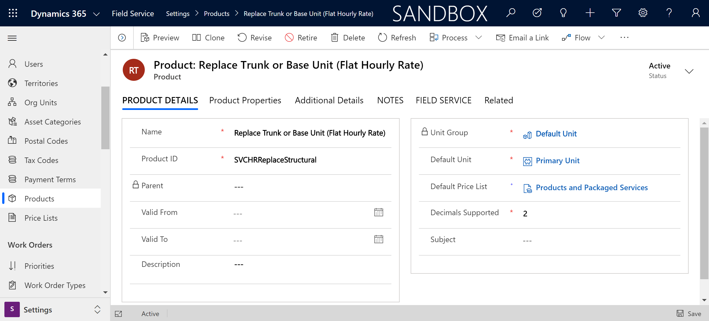
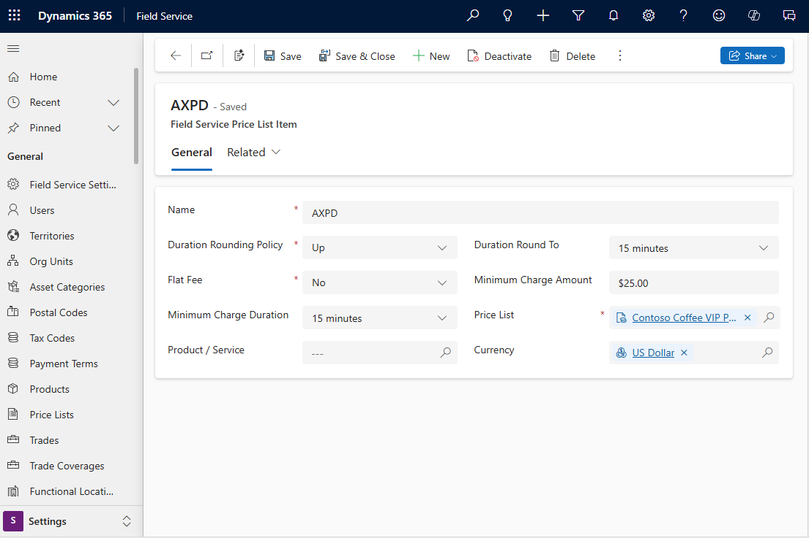
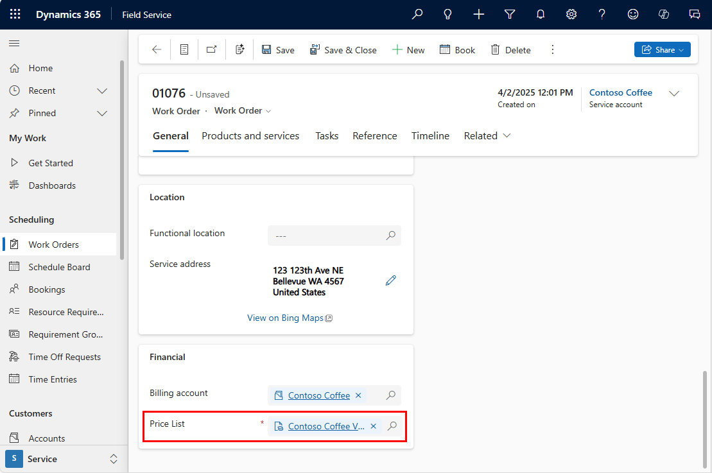
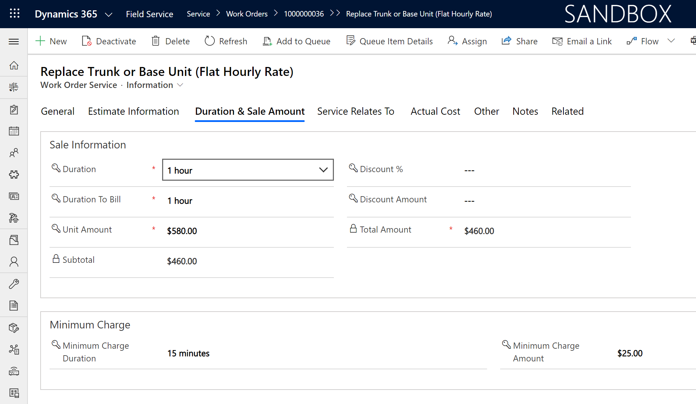

# Using price lists in Dynamics 365 Field Service

Dynamics 365 Field Service uses and extends Dynamics 365 price lists and product catalog. This means products and services are added to work orders with appropriate pricing.  

For work order products that represent parts used during on-site service, use price lists and price list items, just like you would for Dynamics 365 Sales.

For work order services that represent labor performed during on-site service, you can use price lists with price list items to define an hourly rate. You can also use price lists with **Field Service Price List Items** for additional pricing options.

In this article, we'll explore creating products, services, and price lists to use on work orders.

## Prerequisites 

- Any version of Dynamics 365 Field Service
- Basic knowledge of Dynamics 365 [product catalogs](https://docs.microsoft.com/dynamics365/sales-enterprise/set-up-product-catalog-walkthrough) and [price lists](https://docs.microsoft.com/dynamics365/sales-enterprise/create-price-lists-price-list-items-define-pricing-products). 

## Create products and services

First, we'll need to create the Field Service products and services. We can do this by associating a **Field Service Product Type** on the product entity.

For more detailed instructions, see the article on [creating Field Service products and services](./create-product-or-service.md); 

Go to **Field Service app** > **Settings** > **Products** > **+New** and use the tooltips to add basic details about the product or service.

Since we are using **Field Service Price List** items to extend price lists, we'll start by creating a service.

> [!div class="mx-imgBorder"]
> 

In the **Field Service** section, enter a **Field Service Product Type** of **Service**.

> [!div class="mx-imgBorder"]
> 

- **Inventory**: This option is used for high value products or inventoried products that have tracked quantities.  
  
- **Non-inventory**: This option is used for low-value items that are typically not inventoried. Examples include consumables like stickers or zip ties.  
  
- **Service**: The service option is used to create service products, which represent the labor that you sell to your customers. The quantity of service products is measured with a time duration. Only service products can be associated with a work order as a service. 

The following screenshots show examples of inventory and non-inventory products.

> [!div class="mx-imgBorder"]
> 

> [!div class="mx-imgBorder"]
> 

> [!Note]
> It's important to add a **List Price** to the product. This comes in handy when a product is used on a work order but does not belong to the work order's price list.

After saving, enter a **Default Price List** in the product details section, then **Save** again.

## Create price list  
  
Go to **Field Service** > **Settings** > **Price Lists** > **+New**.  
  
Use the tooltips to help fill in your information, and then select **Save**.  

For more information, see the article on [creating a price list (Project Service Automation)](../project-service/create-price-list.md). 

## Add price list items  

Next, add the products and services as price list items to the price lists of your choice.

> [!div class="mx-imgBorder"]
> 

Enter the following information:

- **Pricing Amount**: enter **Currency Amount**.

- **Amount**: enter the price of the product or service. Note this represents an hourly rate for services.

To understand the other standard pricing options with Dynamics 365 price lists, see the article on [adding price list items](https://docs.microsoft.com/dynamics365/sales-enterprise/create-price-lists-price-list-items-define-pricing-products#add-items-to-the-price-list-sales)

## Add Field Service price list items

You can add additional pricing options for services by creating Field Service price list items. A service is defined as a product record where **Field Service Product Type** is **Service**.

From the **Price List**, go to **Related** > **Field Service Price List Items**.

Select **Add New Field Service Price List Item**.  

Configure the following fields: 
  
### Flat Fee

Makes a service a fixed price regardless of duration. The fixed price will be derived first from the price list item amount, and then the list price on the product record.

### Minimum Charge Duration

First X amount of time free. 

### Minimum Charge Amount

Sets minimum amount for a visit. Value will be added on to final price regardless of amount charged.

### Duration Rounding Policy & Duration Rounding To

Allows you to round service duration and choose the granularity. For example, if a service duration is 94 minutes, you can automatically round it to 90 minutes, 95 minutes, remain as 94 minutes, or other options.

> [!div class="mx-imgBorder"]
> 

> [!Note]
> By leaving the **Product / Service** lookup blank, the previous options will apply to all services added to the work order with the chosen price list. This is helpful if, for example, you want to add a minimum charge amount to all services in the price list, you don't need to add all services as Field Service price list items, saving time.
 

Finally, select **Save & Close**.  

## Add price list to work orders

When creating a work order, you must enter a price list. The price list can be entered manually, or can be automatically populated based on the price list of the billing account or work order type when chosen.

> [!div class="mx-imgBorder"]
> 

When a price list is added to a work order, it's automatically propagated to all work order products and services; however, the price list of an individual work order product or service can be manually overridden as needed or via entitlements.

> [!div class="mx-imgBorder"]
> 

In our example, the field technician set the work order service **Line Status** to **Used** from their mobile app, and the dispatcher can see the pricing in the **Duration & Sale Amount** section.

With a **Duration to Bill** of 1 hour, the subtotal is $460, because of a $580 hourly rate as derived from the price list item **Amount**, and factoring 15 free minutes from the **Minimum Charge Duration** and a $25 surcharge from the **Minimum Charge Amount**.

## Configuration considerations

- Consider using [Entitlements](./work-order-entitlements.md) to dynamically adjust the price of work order products and services based on a number of factors (such as account, incident type, and customer asset).

## Additional notes

- You can add a Field Service price list item even if the product or service is not a price list item. In this case, the list price on the product record will be used for calculations.

### Add territory relationships 

Add default price lists for territories or customer segments. This makes it easier for your Field Service team to see the default price list for the area they are working in. You can have one price list as the default for multiple territories.  
  
1. In the price list record, in the **Territory Relationships** section, select **+Add Connection record**.  
  
2. In the **Connections** form, in **Name**, select the **Lookup** button, and then select a territory.  
  
3.  Select **Save & Close**.  
  
4.  In the price list form, select the **Auto Save** button.  
  
### See also    
  
 - [Create a product or service](../field-service/create-product-or-service.md)   
 - [Getting started with Field Service](../field-service/user-guide.md)
 - [Create work order templates with incident types](../field-service/configure-incident-types.md)
 - [Entitlements](./work-order-entitlements.md)

[!INCLUDE[footer-include](../includes/footer-banner.md)]