# Create products or services for work orders

Dynamics 365 Field Service uses the Dynamics 365 product catalog for on-site service. Field technicians can use the same products for work orders that salespeople use for opportunities, quotes, and orders.

With the product entity, you can create products and services to add to work orders.

- **Products** represent physical items a field technician uses while completing a work order and may bill the client for. Products are measured in quantity of units.
- **Services** represent labor a field technician performs and may bill the client for. Services are measured in time duration. 

If a field technician uses a product or performs a service while on the job, they can then enter the work into the Field Service Mobile app. Used products and performed services can be invoiced to customers based on the applicable price list or entitlement. Used products can be deducted from inventory levels either in the Field Service inventory module, Dynamics 365 Finance & Operations, or an external ERP system.

In this article, let's explore creating products and services, adding and using them on work orders, and invoicing and inventory considerations.

## Prerequisites

- Product catalog functionality is available for all version of Dynamics 365 Field Service.

- Basic knowledge of the Dynamics 365 [product catalog](https://docs.microsoft.com/dynamics365/sales-enterprise/set-up-product-catalog-walkthrough) and [price lists](https://docs.microsoft.com/dynamics365/sales-enterprise/create-price-lists-price-list-items-define-pricing-products). 

## Create a product or service

Go to **Field Service** > **Settings** > **Products** > **+New**.

>[!Note]
> Field Service does not support use of **Product Bundles**.

> [!div class="mx-imgBorder"]
> 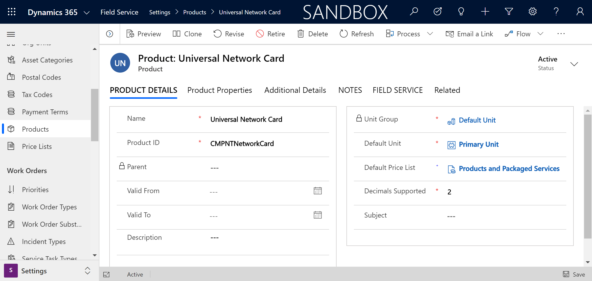

Give the product a **Name** and **ProductID**, along with: 

- **Unit Group**: Select a unit group. A unit group is a collection of units in which a product is sold, and defines how individual items are grouped into larger quantities. For example, if you're adding seeds as a product, you may have created a unit group called "Seeds", and defined its primary unit as "packet."  
  
- **Unit**: Select the most common unit in which the product will be sold. Units are the quantities or measurements that you sell your products in. For example, if you've added seeds as a product, you can sell them in packets, boxes, or pallets. Each becomes a unit of the product. If seeds are mostly sold in packets, select packets as the unit.  
  
For more information on units and unit groups, visit the article: [Create a unit group and add units to that group (Sales app)](../sales-enterprise/create-unit-group-add-units-that-group.md)  
  
> [!NOTE]
> The **Valid From** and **Valid To** fields define how long a product is valid for. There's no business logic associated with these fields, except that the **Valid To** date must be later than the **Valid From** date. If required, you can implement your own business logic in these fields with a workflow, plug-in, or by using the [!INCLUDE[pn_sdk](../includes/pn-sdk.md)]. For example, run a scheduled job to automatically retire last season's products using the date selected in the **Valid To** field.  

> [!div class="mx-imgBorder"]
> 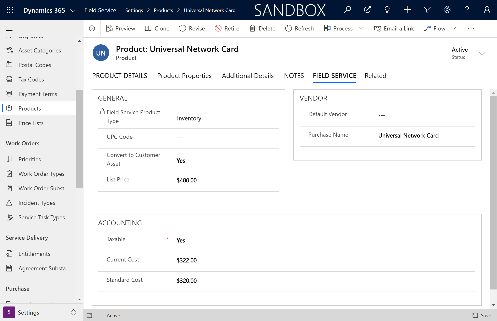

In the **Field Service** section, enter a **Field Service Product Type**, which is required in order to add a product or service to a work order:

- **Inventory**: This option is used for products of high value, or products that are inventoried and have quantities tracked in a warehouse.  
  
- **Non-inventory**: This option is used for low-value items that are typically not inventoried. Examples include consumables like stickers or zip ties.  
  
- **Service**: The service option is used to create service products, which represent the labor that you sell to your customers. The quantity of service products is measured with a duration of time. Only service products can be associated with a work order as a service. 

- **Convert to Customer Asset**: If set to **Yes**, a customer asset record will be automatically created when this product is used on a work order product. Allows for tracking service history.

- **List Price**: Enter a default price of this product or service. This price will be used if the product is not added to a price list. For services, this price represents an hourly rate.
  
- **Default vendor**: Enter a vendor where this product was purchased from.
  
- **Taxable**: Choose whether the product or service is taxable. When this field is set to 'No,' work order products and work order service lines related to this product will be excluded from the work order's tax calculation regardless of the taxable field value on the work order. 
  
Finally, **Save**. 

After saving, enter a **Default Price list** in the product details section, then **Save** again.

For our example, we created two more products: a service and a non-inventory product.

> [!div class="mx-imgBorder"]
> 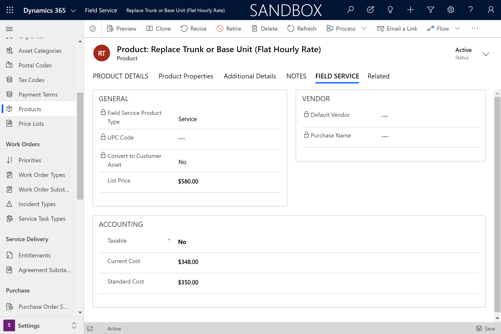

> [!div class="mx-imgBorder"]
> 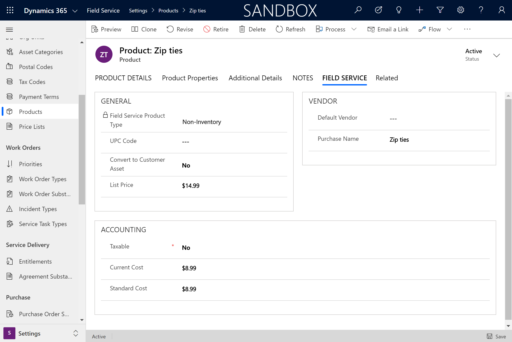

### Price list

Next, add the products and services as price list items to the price lists of your choice.

> [!div class="mx-imgBorder"]
> 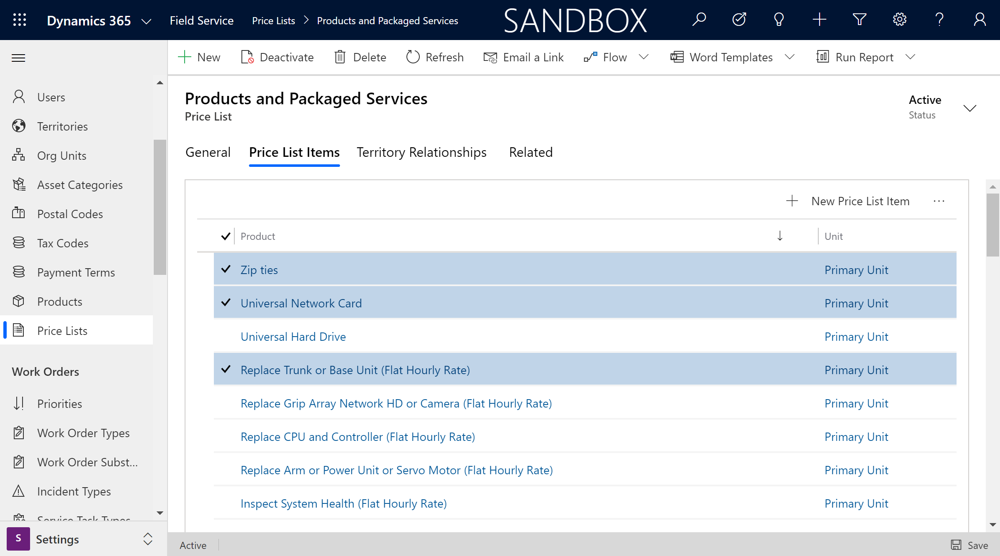

For more information, see the article on [!INCLUDE[proc_more_information](../includes/proc-more-information.md)] [creating a price list (Project Service Automation)](../project-service/create-price-list.md). 

You can also go to **Related** > **Field Service Price List Items** to add additional pricing options for Field Service products and services.

## Add a product or service to a work order

Next, let's add products and services to our work orders. 

First, create a work order.

In the **Products** section, select **+ New Work Order Product**.

> [!div class="mx-imgBorder"]
> 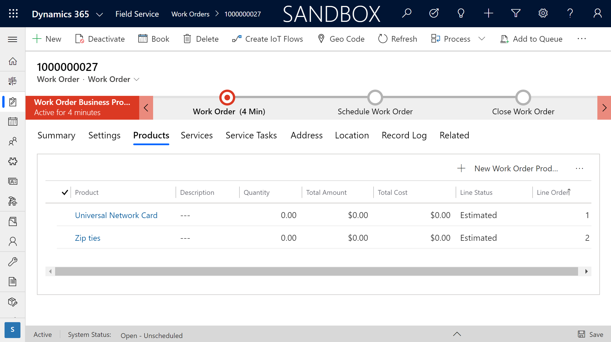
> 
Add the following information, in the applicable sections: 

### General

- **Product:** Choose from the lookup the product you created.

- **Line Status**: When a product or service is added to a work order, a new **Work Order Product** or **Work Order Service** record is created. It's given a status of **Estimated** by default, which means it has not yet been used. When a field technician actually uses the product or performs the service, they will change the work order product or service status to **Used** from their mobile device. Field technicians and back-office workers will have the option to bill the client after the product or service is used. 

- **Taxable**: Set to **Yes** if you want the work order sales tax added to the price.

- **Allocated**: Set to **Yes** if you want to set aside units of this product from a warehouse before actually using and removing them from inventory.
  
- **Warehouse**: If the product is allocated or used, you need to enter the warehouse it came from. The field technician can also enter the warehouse after using the product when on site.

### Estimate Information

Add an **Estimate Quantity**, which represents how many units you think may be needed to complete the job.

Price information is taken from the price list first, then the product record, and calculated based on the quantity.

### Product Relates To

Work order products can be related to different aspects of the work order either automatically or manually.

> [!div class="mx-imgBorder"]
> 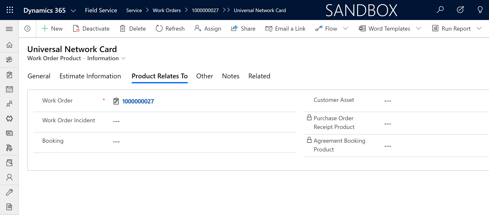

For example, if the product or service is added from a work order incident type, the related work order incident type will be populated. If the work order incident type was for a specific customer asset, that asset will be populated here. 

> [!Note]
> Work order products and service are typically added to work orders via work order incident types. For more information, see the article on [creating work order templates with incident types](https://docs.microsoft.com/dynamics365/field-service/configure-incident-types).

### Other

In the **Other** section, you can change the price list of a specific product or service from the work order price list, which it will have by default. 

You can also apply or disable entitlements, which are automatically applied based on factors like service account and incident type. For more information, see the article on [entitlements](./work-order-entitlements.md).

Non-inventory products are added as work order products as well.

Service type products (labor) should be added as work order services.

> [!div class="mx-imgBorder"]
> 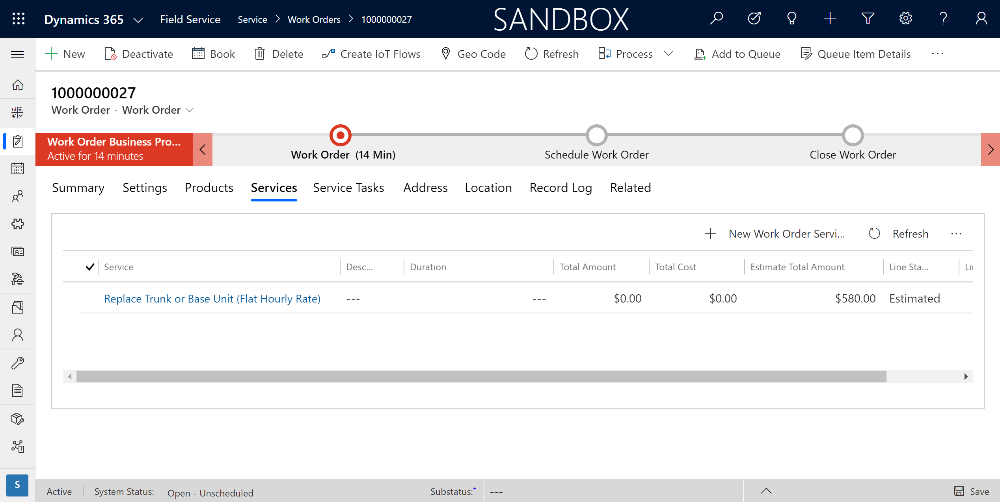

Adding a work order service is similar to adding a work order product; however, there is no inventory allocation or warehouse, and there is an **Estimate Duration** rather than estimate quantity.

## Use and consume products and services

Whether work order products and services are created individually or in bulk as part of a work order incident type template, they'll appear on Field Service Mobile.

> [!div class="mx-imgBorder"]
> 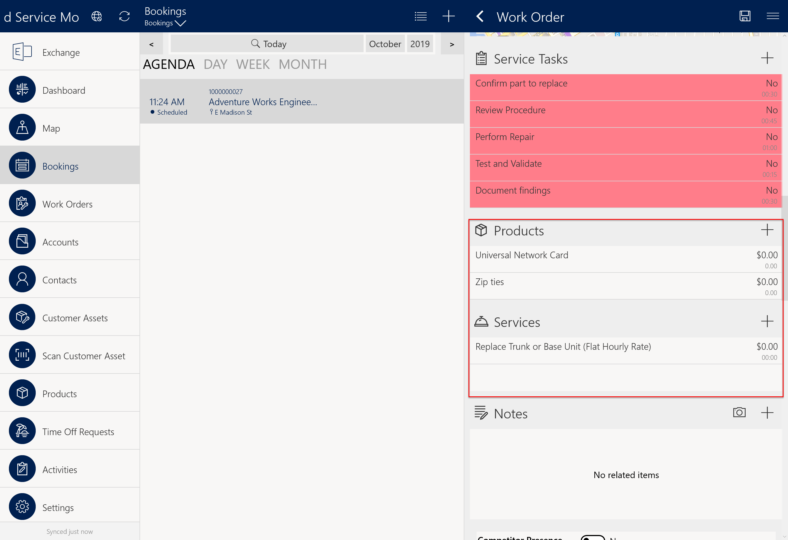

In the previous screenshot, the inventory product (Universal Network Card), the non-inventory product (Zip ties), and the service (Replace Trunk or Base Unit) are visible on the mobile work order form.

Work order products and services are not required. Field technicians have the ability to edit the quantity or add new products and services from the product catalog; what they can edit, create, and delete can be modified via security roles and field security profiles. 

> [!div class="mx-imgBorder"]
> 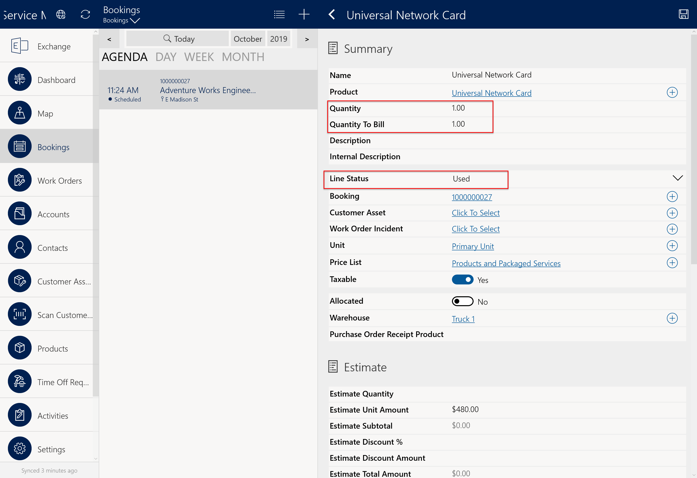

Within a work order product record, field technicians will set the **Line Status** to **Used**, and enter a **Quantity**, which represents how many units were consumed, and a **Quantity to Bill**, which can be different.

When using an inventory item, you need to enter a warehouse it comes from. It will default to the warehouse value on the **Bookable Resource**.

> [!div class="mx-imgBorder"]
> 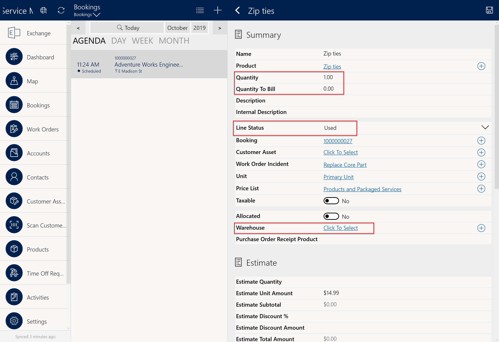

When using a non-inventory item, you may mark it as used along with a quantity for reporting, but no warehouse since it's not tracked. Another option is to enter 0 for **Quantity to Bill** since you may not charge a customer for lower value items.

When using a work order service, set the **Line Status** to **Used** and enter a **Duration** and **Duration to Bill**.

> [!div class="mx-imgBorder"]
> 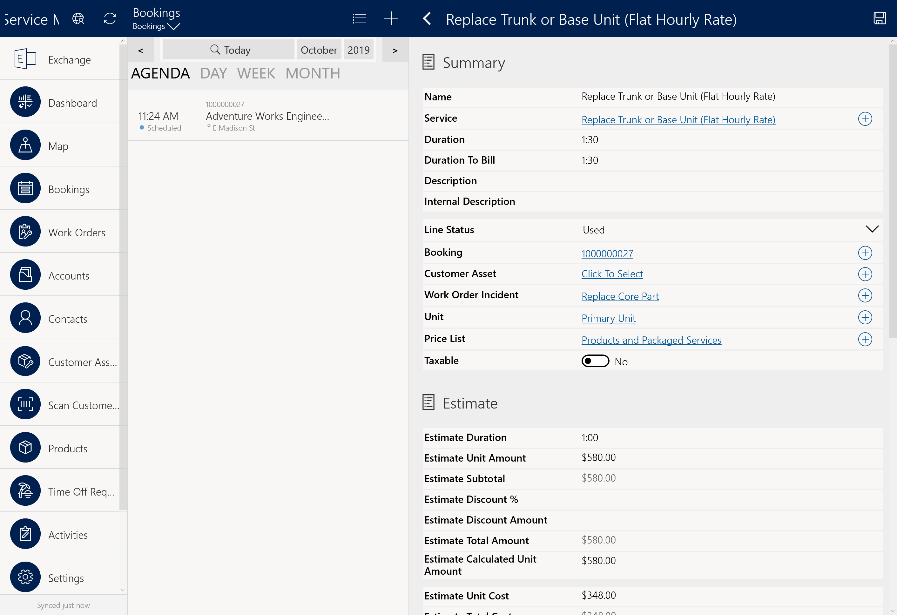

As products and services are used, the subtotal based on price and quantity to bill is calculated on the work order.

> [!div class="mx-imgBorder"]
> 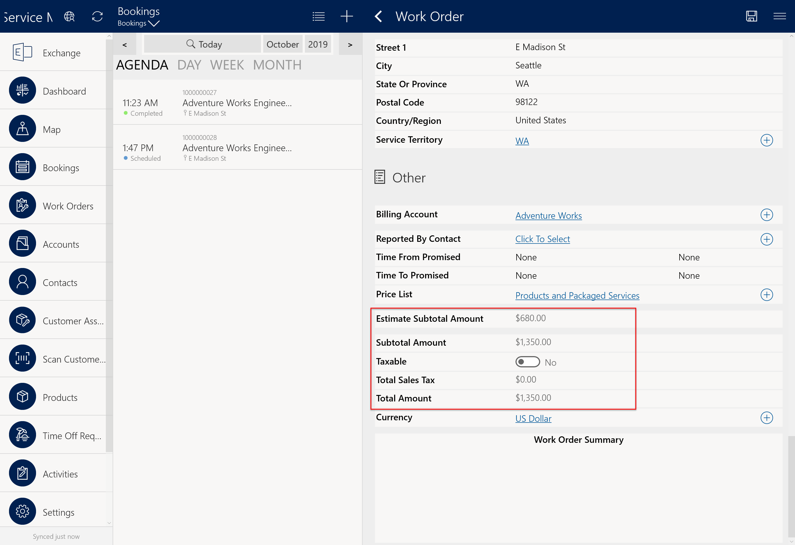

> [!Note]
> Amount calculations will populate after syncing or in online mode. Calculations are not made in offline mode.

When the work order is complete and the **System Status** is **Closed-Posted**, an invoice will be generated with used work order products and services.

> [!div class="mx-imgBorder"]
> 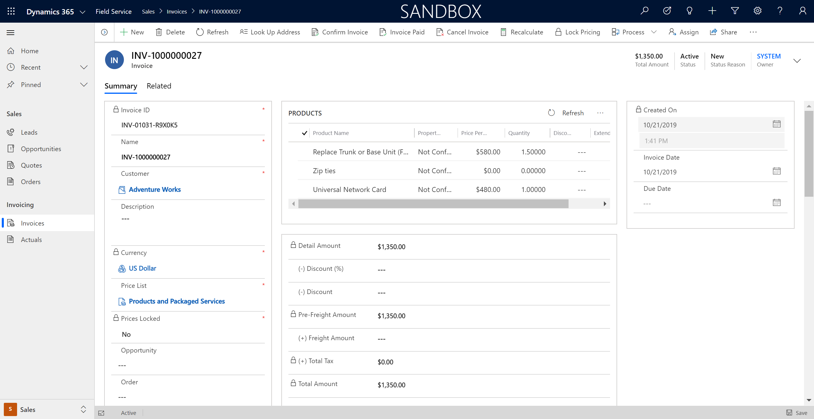

## Add and consume product inventory (Optional)

For instances where inventory is managed within Field Service, let's explore how to increment and decrement inventory.

Go to **Field Service** > **Inventory** > **Inventory Adjustments**.

> [!div class="mx-imgBorder"]
> 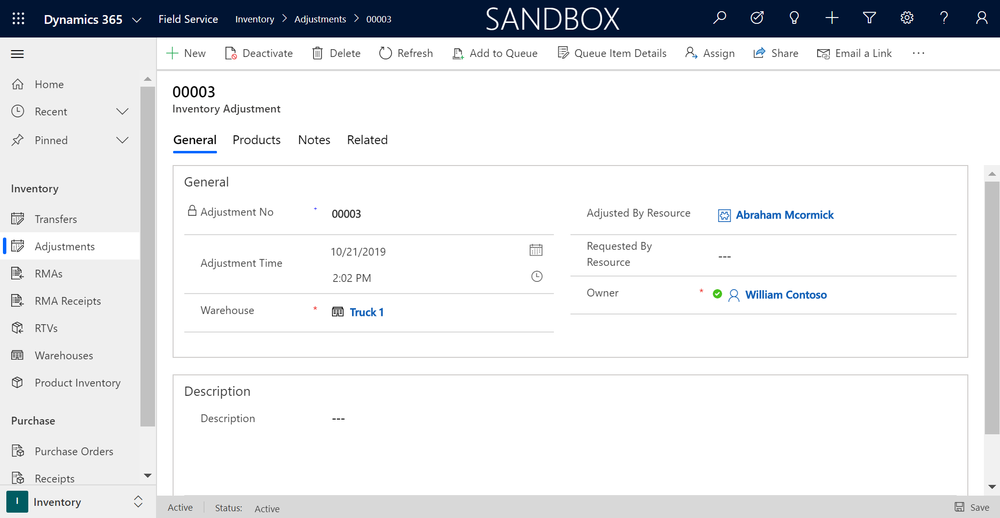

Create a new **Inventory Adjustment** and choose the warehouse the inventory will go to. If a warehouse does not exist, create one.

From the inventory adjustment, go to the **Product** section and create an **Inventory Adjustment Product**.

> [!div class="mx-imgBorder"]
> 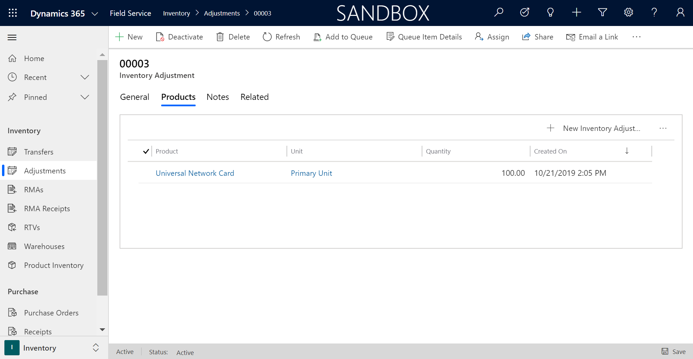

Add one or more products and the quantity to increment inventory by for that product at the earlier chosen warehouse. 

In **Product Inventory**, you'll see the **Quantity Available** and **Quantity On Hand** increased based on your inventory adjustment for the chosen products and warehouse.

> [!div class="mx-imgBorder"]
> 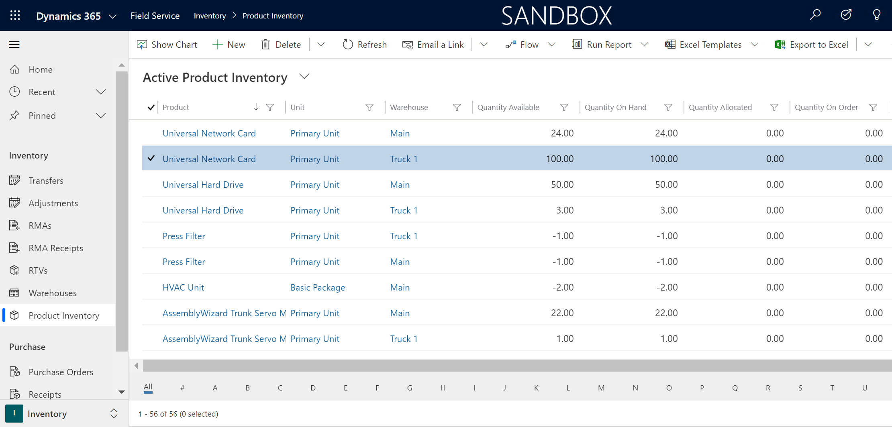

When adding the product to a work order, you have the option to allocate it from inventory, which designates it aside before it's used and decremented from inventory.

> [!div class="mx-imgBorder"]
> 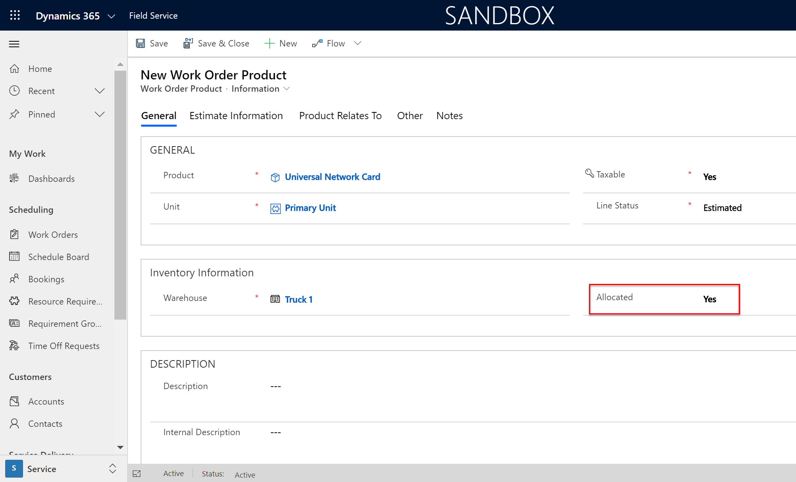

From the mobile work order product form, enter a warehouse after marking it as used. 

> [!div class="mx-imgBorder"]
> 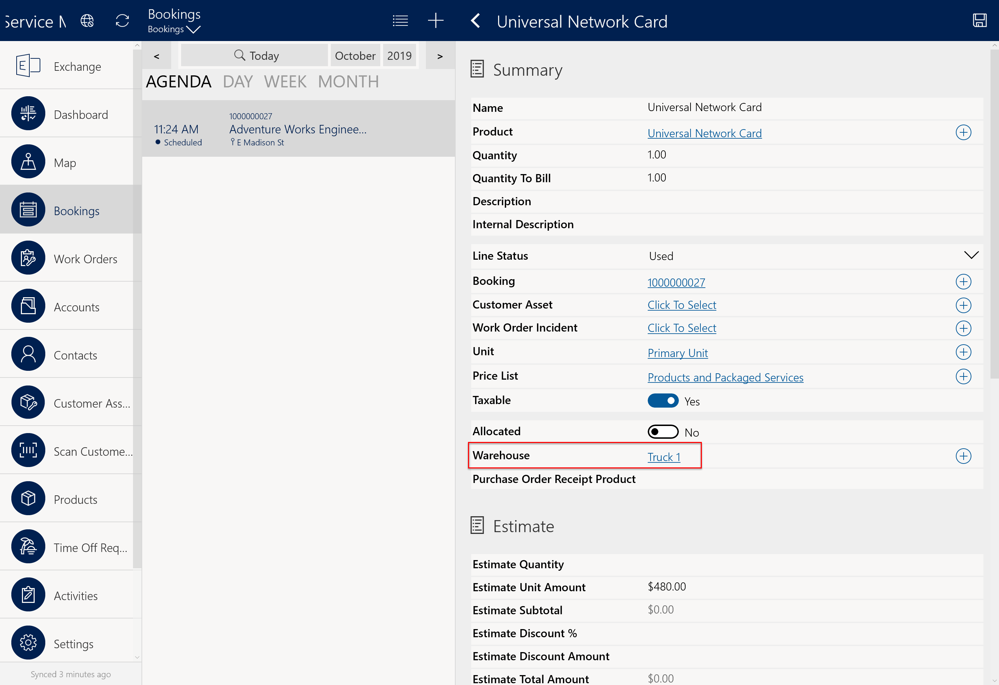

All inventory transactions are recorded as **Inventory Journals**, which can be accessed through an advanced find. 

> [!div class="mx-imgBorder"]
> 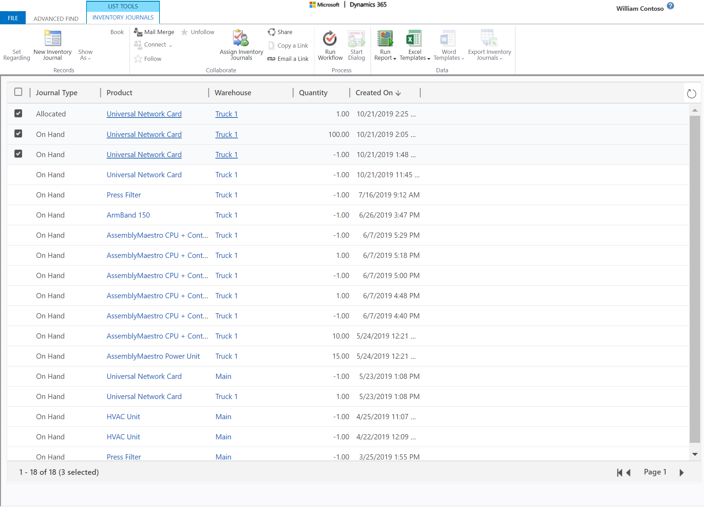

In the previous screenshot, you'll see:

1. The inventory adjustment that incremented inventory levels by 100 units.
2. One unit allocated to a work order product before use.
3. One unit decrementing inventory when it was finally used during a work order.

## Configuration considerations

When creating products, consider the settings in **Settings** > **Administration** > **System Settings** > **Sales Tab**.

> [!div class="mx-imgBorder"]
> 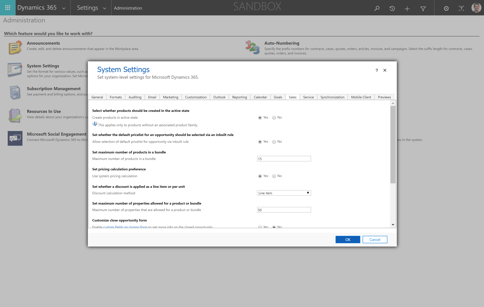

- Product in Active Status upon creation. Best practice is to set to **Yes**.
- Minimum # of Products in a Bundle.
- Max # of Properties allowed for a Product or Bundle. 

By default, work order products are not allocated from inventory, as dictated by a **Field Service Setting**.

> [!div class="mx-imgBorder"]
> 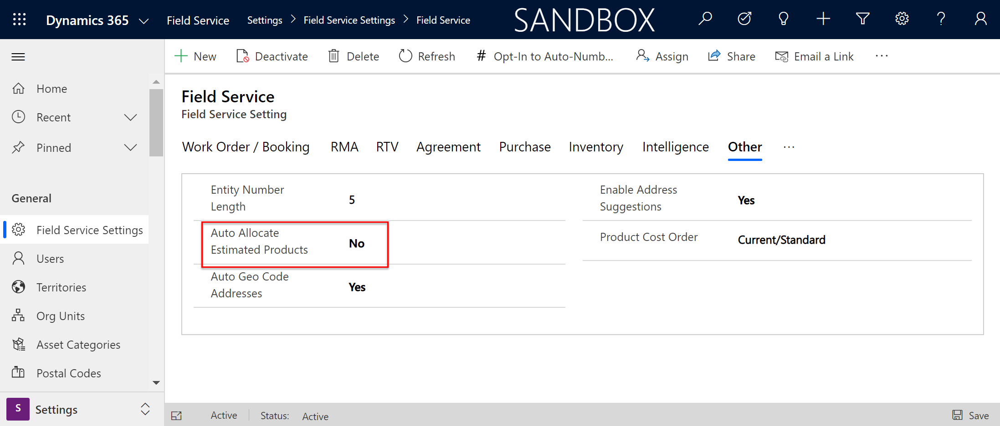

Another Field Service setting for inventory is **Use Of Products out of Stock**. Set to **Restrict** to prevent using a work order product when inventory in the specified warehouse is 0. Set to **Confirm** to display a warning message (in web interface) when there's an attempt to use a work order product and inventory is 0. This setting is helpful for situations where inventory levels are inaccurate or managed in an outside system.

> [!div class="mx-imgBorder"]
> 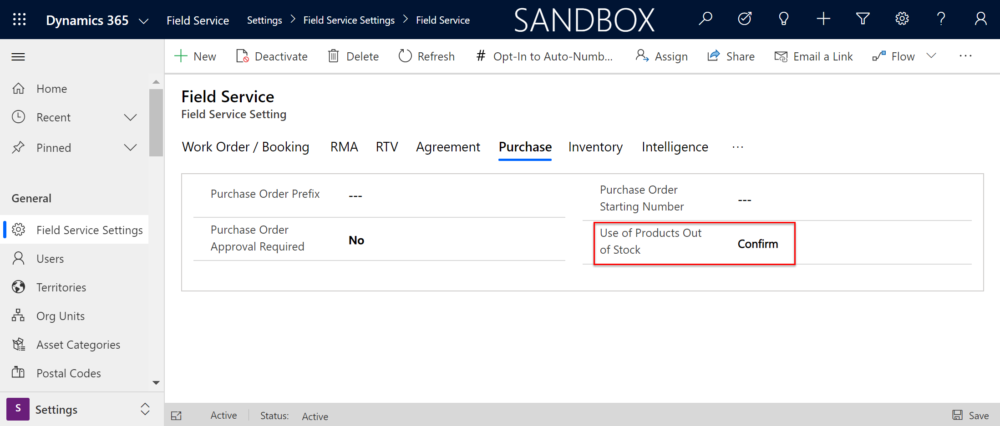

## Additional notes

- Inventory adjustments products can have a positive or negative quantity to increment or decrement inventory as needed.
- Integrating work order product inventory with ERP systems is typically executed with work order product, inventory journals, or invoice records.
- Product bundling, introduced in Dynamics 365 Sales, does not currently extend to Field Service scenarios. For more information, see this article about [product bundles in Dynamics 365 Sales](https://docs.microsoft.com/dynamics365/sales-enterprise/create-product-bundles-sell-multiple-items-together).

### Known issues

- **Issue**: Permission error when creating a new product from **Field Service** > **Settings** > **Products** > **Add Product** (in top ribbon).

> [!div class="mx-imgBorder"]
> 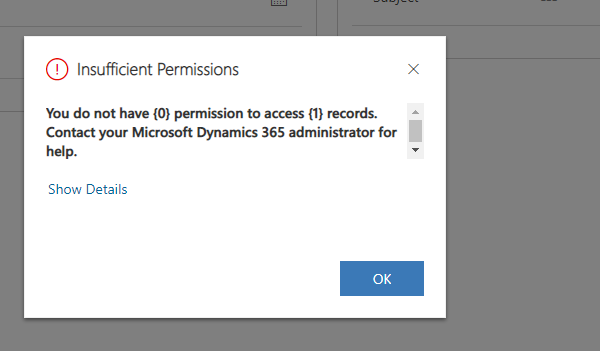

- **Fix**: Adding read privileges to the following entities in the next screenshot allows the user to add and publish products successfully.

> [!div class="mx-imgBorder"]
> 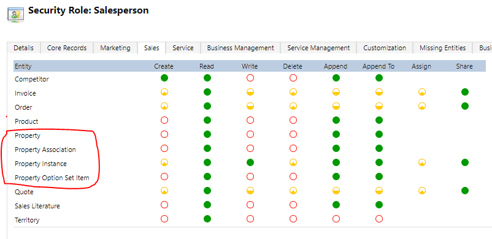

- **Issue**: Permission error when adding product-based line items to opportunities.

> [!div class="mx-imgBorder"]
> 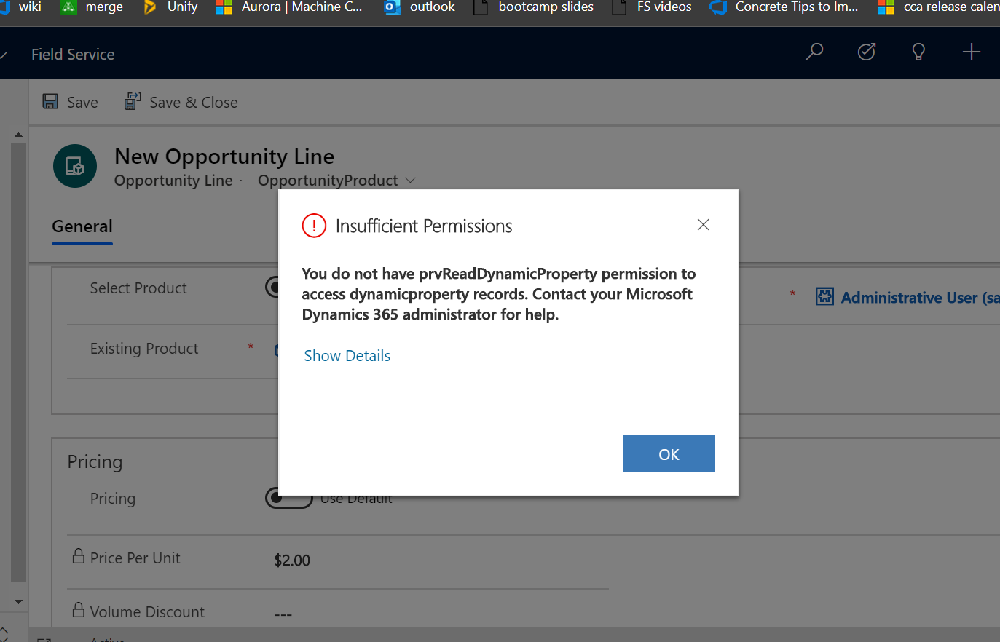

- **Fix:** Adding read privileges to the following entities in the next screenshot allows the user to add opportunity line items to opportunities within the Field Service solution.

> [!div class="mx-imgBorder"]
> 

  
### See also  

 - [Create a price list](../field-service/create-price-list.md)
 - [Create a warehouse](../field-service/create-warehouse.md)

[!INCLUDE[footer-include](../includes/footer-banner.md)]
