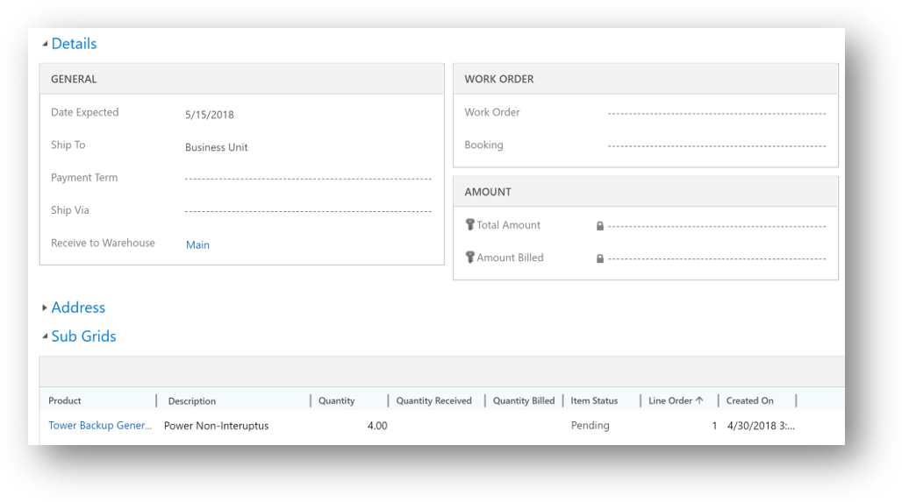
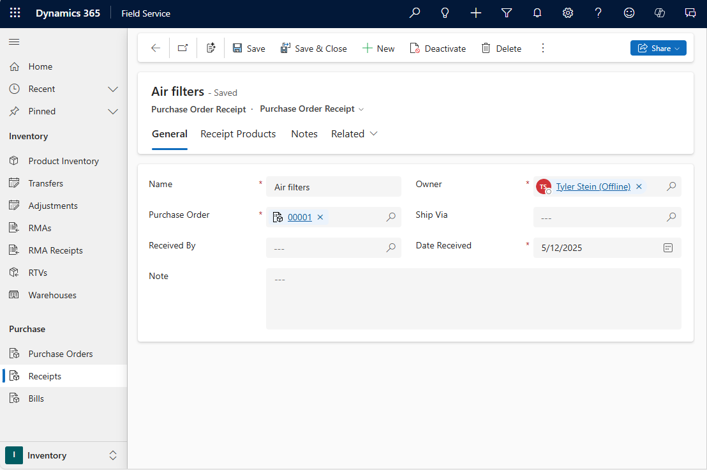

# Create a purchase order (Field Service)

In Dynamics 365 Field Service, a purchase order (PO) is created to add inventory to a warehouse, or to purchase products to sell to a customer in a work order.    
   

## Prerequisites

- Understand how [products and services](../field-service/create-product-or-service.md) are used in Field Service.

## Step 1: Create a purchase order 
  
1.  From the main menu, go to **Field Service** > **Inventory tab** > **Purchase Orders**.  
  
2.  On the **Active Purchase Orders** screen, select **+New**.  
  
3.  Use the tooltips to help you fill in your information.  
  
4.  When you're done, **Save**.  
  
  > [!NOTE]
  >  In the **Details** section, you can specify a lookup to a work order. Also, from a work order you can go to **Related** > **Purchase Orders**.

> [!div class="mx-imgBorder"]
> 

### Ship via

When you create a purchase order, you can track how the order is shipped. This helps you track the purchase order. The **ship-via** field lets you specify different shipping methods used by your company. You can create new options in **Field Service** > **Settings** > **Ship Via**. Common examples include freight shipping, USPS Ground, or FedEx.
    
## Step 2: Add products to the purchase order  
  
  
1.  In the **Product** section, select **+Add Purchase Order product record**.  
  
2.  Use the tooltips to help you fill in your information.  
  
3.  When you're done, **Save & Close**.  

> [!div class="mx-imgBorder"]
> 

Back on the purchase order, change the **System Status** to **Submitted**.

 
## Step 3: Get the purchase order approved    
  
If you have permissions to approve the PO, go to the PO and change the **System Status** to **Approved**.  

> [!NOTE]
> For products that are tracked in inventory and for purchase orders being received to warehouses, an inventory journal is created automatically in the background that increases the **On Order** warehouse quantity by the PO product quantity. This helps inventory managers understand if more units have already been ordered.
   
## Step 4: Create a receipt for the purchase order  

When the order arrives, you can create a receipt.  
  
1.  Go to **Field Service** > **Inventory tab** > **Receipts** > **+New**.  
  
2.  Give the receipt a name and assign it to the purchase order, and then mark the person creating the receipt.  
  
3.  Select **Save**.  

> [!div class="mx-imgBorder"]
> 

    
## Step 5: Add purchase order receipt products  
  
From the purchase order receipt, add related purchase order receipt products.

A purchase order receipt doesn't need to contain all products requested or all quantities requested. Products will often be received as they arrive. Some products may arrive sooner and larger quantity shipments may arrive in multiple shipments. In these situations, multiple purchase order receipts can be created for a single purchase order.

## Step 6: Create purchase order bill  
 Once you receive an invoice from the vendor, then you can create a purchase order bill.  
  
1.  From the original purchase order, go to **Related** > **Bills** > **+Add New Purchase Order Bill**. 
    
2.  Use the tooltips to help fill in your information:  
  
    -   Enter a **Bill Date** — this is the date that's on the purchase order bill.  
  
    -   Enter a **Vendor Invoice Number** so that you’ll have a cross reference to the invoice number that the vendor provided.  
  
3.  Select **Save**.  
  
4.  To add items on the bill, from the purchase order bill, go to **Related** > **Receipt Products** > **+Add New Purchase Order Receipt Products**.

### See also      
 [Configure and set up customer assets](../field-service/configure-set-up-customer-assets.md)     
 [Process a return](../field-service/process-return.md) 

[!INCLUDE[footer-include](../includes/footer-banner.md)]