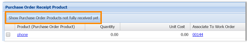
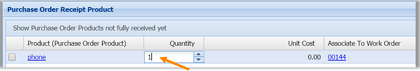

# Create a purchase order (Field Service)

In [!INCLUDE[pn_dyn_365_field_service](../includes/pn-dyn-365-field-service.md)], a purchase order (P.O.) is created to add inventory to a warehouse, or to purchase products to sell to a customer in a work order.    
  
   
### Step 1: Create a purchase order 
  
1.  From the main menu, click **Field Service** > **Purchase Orders**.  
  
2.  On the **Active Purchase Orders** screen, click **+New**.  
  
3.  Use the tooltips to help you fill in your information.  
  
4.  When you're done, click **Save**.  
  
    > [!NOTE]
    >  If you need to relate a P.O. to a work order, open the work order, and then from the top menu (next to the work order name) click the drop-down arrow and choose **Purchase Orders**. Click **+Add New Purchase Order** and fill in the required information. If you link the P.O. to a work order, then when you receive the product it will be added directly to the work order as a work order product.  
  
   
### Step 2: Add products to the P.O.  
 More information: [Create a product or service](../field-service/create-product-or-service.md)  
  
1.  In the **Product** section, click **+Add Purchase Order product record**.  
  
2.  Use the tooltips to help you fill in your information.  
  
3.  When you're done, click **Save & Close**.  
  
   
### Step 3: Get the P.O. approved  
 More information: [Create a product or service](../field-service/create-product-or-service.md)  
  
-   If you have permissions to approve the P.O., then go to the purchase order and change the **Approved Status** to **Approved**.  
  
   
### Step 4: Create a receipt for the P.O.  
 When the order arrives, then you can create a receipt.  
  
1.  From the main menu, click **Field Service** > **Purchase Order Receipt**.  
  
2.  On the **Active Purchase Order Bills** screen, click **+New**.  
  
3.  Give the receipt a name and assign it to the purchase order, and then mark the person creating the receipt.  
  
4.  Click **Save**.  
  
   
### Step 5: Add P.O. receipt products  
  
1. Form the top menu, click the drop-down arrow next to the P.O. name that you created, and then click **Receipt Products**.  
  
2. To show open P.O. products in the **Purchase Order Receipt Product**field, click **Show Purchase Order Products not fully received yet**.  
  
     
  
3. Click the area under the **Quantity** field and type in the quantity to be received  
  
     
  
4. Click **Save**.  
  
    If the product is an inventory item, then an inventory adjustment product record is created automatically when you receive the product. When inventory adjustment product records are created, inventory journals are automatically created, which drives your totalinventory count in the product inventory table.  
  
   
### Step 6: Create P.O. bill  
 Once you receive an invoice from the vendor, then you can create a purchase order bill.  
  
1.  From the top menu, click the drop-down arrow next to the P.O. name that you created, and then click **Bills**.  
  
2.  On the **Purchase Order Bill Associated View** screen, click **+Add New Purchase Order Bill**.  
  
3.  Use the tooltips to help fill in your information:  
  
    -   Enter a **Bill Date**—this is the date that's on the purchase order bill.  
  
    -   Enter a **Vendor Invoice Number** so that you’ll have a cross reference to the invoice number that the vendor provided.  
  
4.  Click **Save**.  
  
5.  To add items on the bill, from the top menu, click the drop-down arrow next to the bill name, and then click **Receipt Products**.  
  
6.  On the **Purchase Order receipt Product Associated View** screen, click **+Add New Purchase Order Receipt Products**, and then add the item.  

## Ship via

When you create a [!INCLUDE[pn_dyn_365_field_service](../includes/pn-dyn-365-field-service.md)] purchase order in the system, it's a good idea  to track how the order is shipped. This helps you track the purchase order. The ship-via option lets you specify different shipping methods used by your company.  
  
 For example, you might use freight shipping, USPS Ground, or FedEx when products are purchased. In this case, you can specify these shipping methods in the ship-via setting. When you create ship-via methods, you'll see this in the purchase order form.  
  
1.  From the main menu, click **Field Service** > **Administration**, and then choose **Ship Via**.  
  
2.  On the **Active Ship Via** screen, click **+New** in the upper left corner.  
  
3.  Use the tooltips to help you fill in your information, and then click **Save**.  
  
### See also      
 [Configure and set up customer assets](../field-service/configure-set-up-customer-assets.md)   
 [Create an inventory adjustment](../field-service/create-inventory-adjustment.md)   
 [Create an inventory transfer](../field-service/create-inventory-transfer.md)   
 [View product inventory](../field-service/view-product-inventory.md)   
 [Create a return to vendor](../field-service/create-return-vendor.md)   
 [Process a return](../field-service/process-return.md) 

