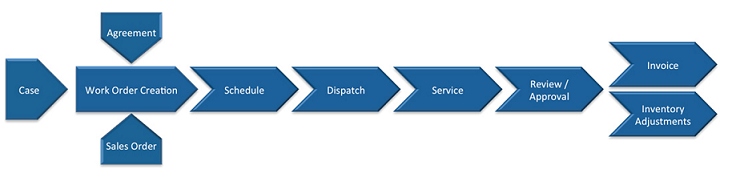
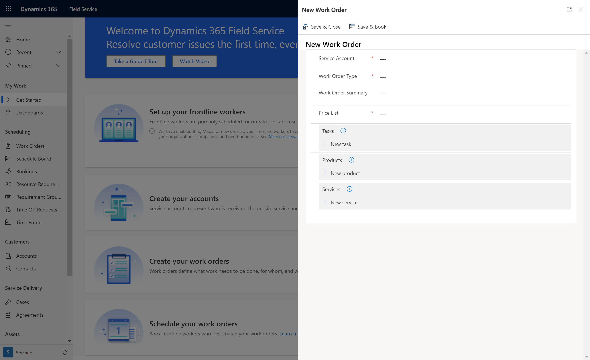
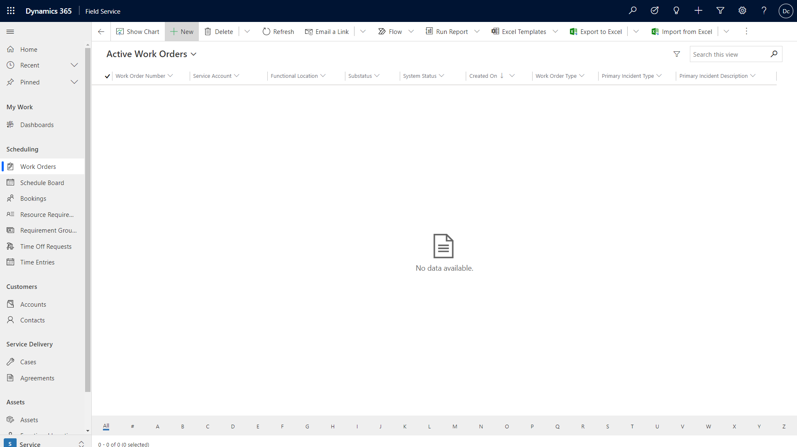
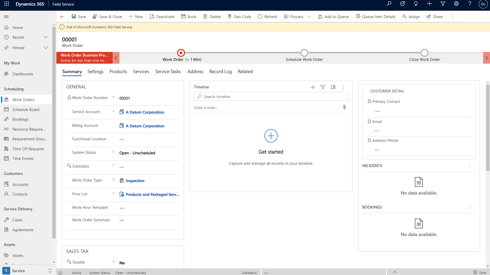
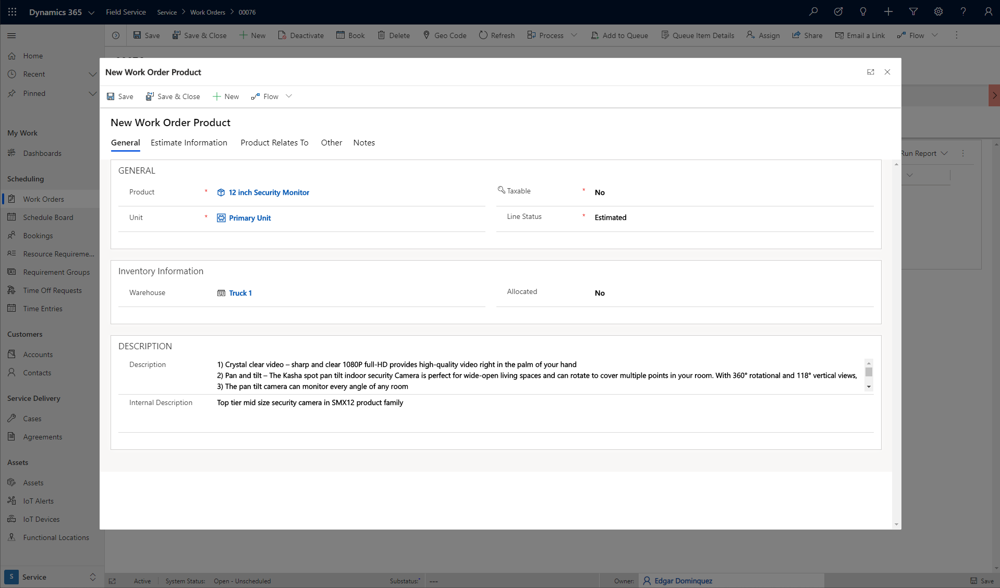

# Create a work order to coordinate and schedule resources and activities

A work order in [!INCLUDE[pn_dyn_365_field_service](../includes/pn-dyn-365-field-service.md)] has information on what work needs to be done. It is used to coordinate and schedule resources and activities. It can be used for different types of work, such as installations, repairs, or preventive maintenance.  
  
 A work order is often created from a case or opportunity. It is then scheduled either manually or using the schedule assistant and then dispatched. Once the work is complete, it is reviewed and approved by a manager.  
 
> [!VIDEO https://www.microsoft.com/videoplayer/embed/RE4ynSf]

> [!Note]
> For additional Field Service videos, see [this full video playlist](https://aka.ms/fs-videos).
  
> [!Note]
>  Products, service tasks, and characteristics are added automatically when you create a work order from an incident. Otherwise you can add them manually when you create a work order.   
  

   

## Work order lifecycle  
  
- **Work order creation:** A work order is created, usually from a case or opportunity  
  
- **Schedule**: The work order is then scheduled.  
  
- **Dispatch**: The work order is dispatched.  
  
- **Service**: The work order is performed and details are updated.  
  
- **Review/Approval**: The work order is reviewed and approved by a supervisor.  
  
- **Invoice and inventory adjustment**: Inventory adjustments are made and an invoice is generated for the corresponding account.  
  
    
  
||||||||  
|-|-|-|-|-|-|-|  
|**What happens**|New work order is created.   Assigned incident, product, services, skills, territory, etc.|Work order schedule is created.   Resources assigned to the work order.   Date and time specified.|Field agent notified of work order.   Field agent may review and accept/decline the work order.|Work order is carried out.   Information about what is performed in the field is entered through the mobile app.|Supervisor verifies that all the work was done properly, and that all information regarding the work order is correct.|Invoice is created based on products and services used.   Inventory adjustments are made.   Products converted into equipment (if applicable)|  
|**Who performs the task**|Agreement is automatically generated on a recurring basis.   Case: By customer support.   Sales order: By sales/scheduling.   Ad hoc: By field agent or centralized scheduling.|Dispatcher   Field Agent   Dispatcher with help of scheduling assistant   Routing engine|Notification sent by system automatically to field agent, customer, and other parties. **Note:**  Notifications need to set up in the system.|Field agent|Field supervisor/manager,   back-office accounting|Automatically sent by system|  
|**Work order status**|Open - unscheduled|Open - scheduled|Open - scheduled|Open - unscheduled, then open-completed|Open - completed then closed-posted|Closed-posted|  
|**Work order schedule status**|N/A|Scheduled|Scheduled|Scheduled   Accepted/Declined   Custom Status|Completed|Completed|  
  
 
## Create a work order  

### From the get started page

1. As a Field Service administrator or system administator in the **Field Service** app, go to the **Get Started** page.

> [!div class="mx-imgBorder"]
> 

2. Select **Create** in the **Create your work orders** section.

3. Fill in the basic information about the work order.

4. In the form, add as many tasks, products, and services as needed.

5. If you want to immediately schedule the work order, select **Save & Book**. Select **Save & Close** to only save the work order.

> [!div class="mx-imgBorder"]
> 

### From the work order form and record list

Go to **Field Service** > **Service** > **Work Orders** > **+New**.

> [!div class="mx-imgBorder"]
> 

At a minimum, enter information in the following required fields.

- For **Service Account**, select an account from the list or create a new one.
- For **Work Order Type**, select a work order type from the list or create a new one. 
- For **System Status**, select **Open-Unscheduled**.
- For **Price List**, select a price list from list or create new one. 
- Set **Taxable** to **No**.

> [!div class="mx-imgBorder"]
> 

  
- For **Summary**:  

  - **General**: Fill in the basic information regarding the work order, such as the work order number and the service account it is associated with, a brief summary, and status, which can show whether the work order is unscheduled, scheduled, in progress, or finished.  
  - **Primary Incident**: Enter more information regarding the nature of the work to be performed.  
  - **Total**: Enter pricing information for the work order. This will show total pricing information for tasks, including products and services.  
  
- For **Settings**:
  - **General**: Specify the category the work order may fall into. Also, fill in important information regarding the location of the work order, price list, service territory, and more.  
  - **Sales tax**: Sales tax can be added to the total amount of the work order based on work order details like service account, billing account, and work order type. The **Taxable** field will be set to yes if work order type is **Taxable** and the billing account is **Not Tax Exempt**. If the work order is taxable, a **Sales Tax Code** lookup field will display and inherit a value from the service account. It can also be updated manually.
  - **Preferences**: Enter the resource and time information for the work order.  
  - **Follow up**: Shows instructions of how to proceed if desired, or whether the work order calls for a follow-up.  
  - **Related to**: Specify if the work order is related to an originating work order or agreement.  
  - **Preferences**: Specify any preferred time windows.  
  - **Source**: Specify source information regarding the work order.  
- **Address**: The address where the work will be performed. The address should be inherited from the service account.  
- **Location**: Shows the address location on the map.  
  
Then choose **Save and close**.

## Add service tasks, products, or services to the work order  
 When the work order has been created and saved, you can then add any related tasks, products, or services to the work order.  
  
- Go to the **Service Tasks** section and click **+Add Work Order Service Task record**. [!INCLUDE[proc_handy_infotips](../includes/proc-handy-infotips.md)] [!INCLUDE[proc_more_information](../includes/proc-more-information.md)] [Set up service task types  ](../field-service/set-up-service-task-types.md)  
  
- Go to the **Products** or **Services** section and select the **+**  button. [!INCLUDE[proc_handy_infotips](../includes/proc-handy-infotips.md)][!INCLUDE[proc_more_information](../includes/proc-more-information.md)] [Create a product or service ](../field-service/create-product-or-service.md)  
  
  > [!NOTE]
  >  When you add a product, remember that if you want to reserve a product for the work order, set **Allocated** to **Yes**.  

Consider using incident types to add more details and instructions to your work orders. For more information, see the article on [configuring incident types](configure-incident-types.md).

### Open work order subgrids as popup dialogue boxes

Configure work order subentities to pop out as dialog boxes and edit them without having to leave the work order form. This configuration helps dispatchers maintain context through navigation.

> [!div class="mx-imgBorder"]
> 

From the Field Service app, go to **Settings** > **Field Service Settings** > **Other section** and set the **Work Order Subgrid Records Open as Popups** field to **Yes**.

Popup navigation will now be enabled when the following entities are selected from a work order.

- Work order product
- Work order service
- Work order service task
- Work order incident
- Bookable resource booking
- Time entry

> [!Note]
> This feature is available in the Unified Interface only.

### See also  
    
 [Overview of Dynamics 365 Field Service](../field-service/overview.md)   
 [Submit and approve time-off requests](../field-service/submit-approve-time-off-requests.md)   
 [Schedule a work order](../field-service/schedule-work-order.md)   
 [Configure the schedule board](../field-service/configure-schedule-board.md) 
 [User's Guide](../field-service/user-guide.md)

[!INCLUDE[footer-include](../includes/footer-banner.md)]