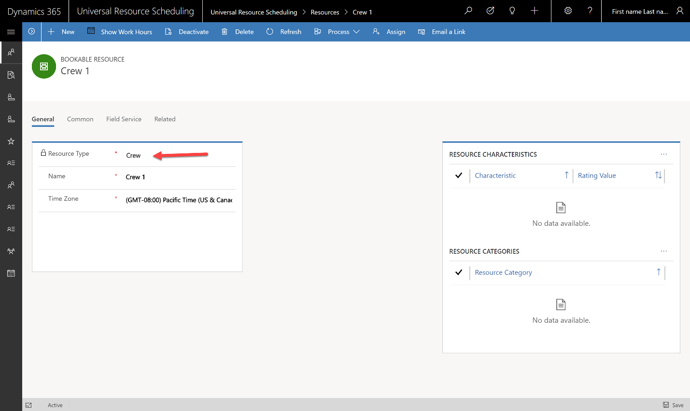
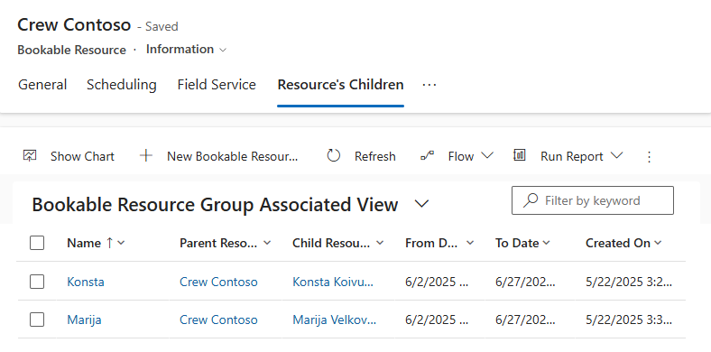
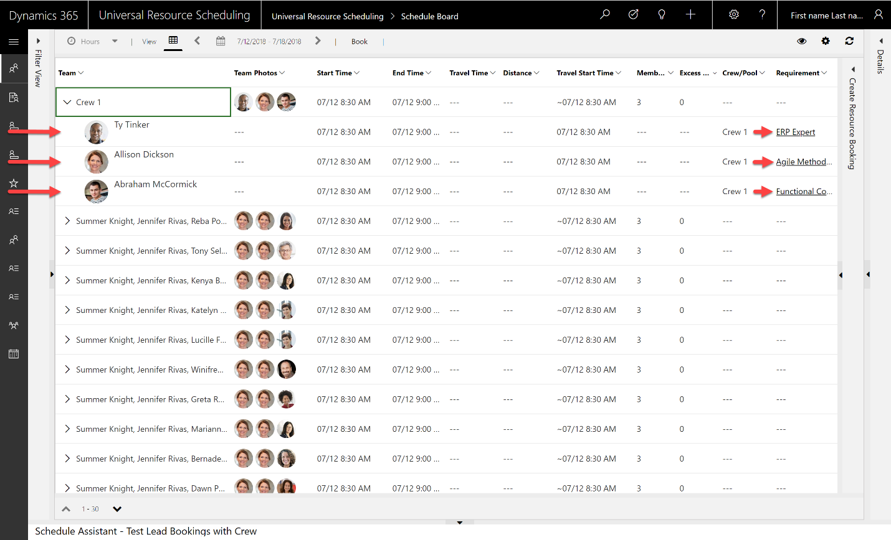
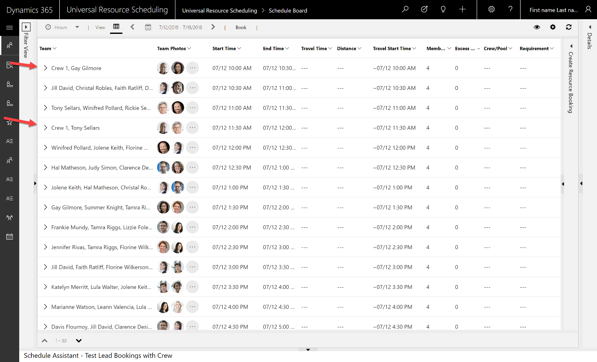
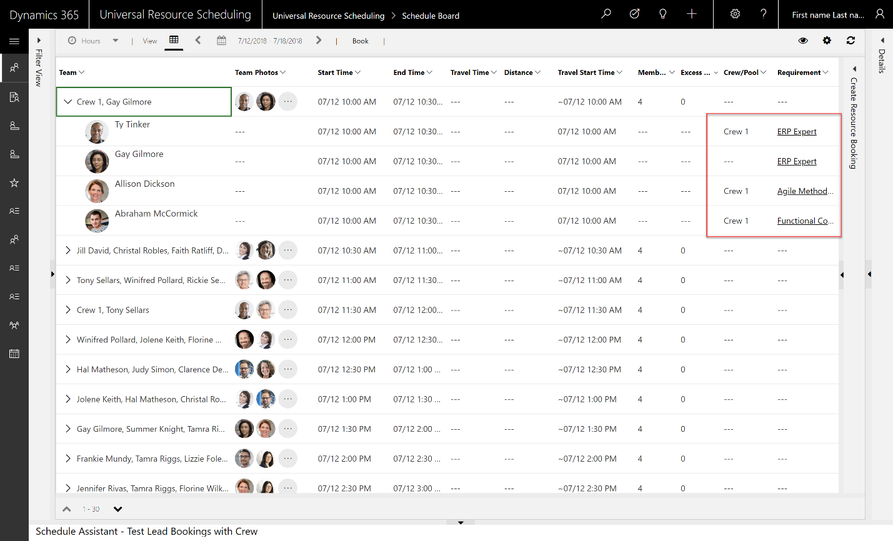
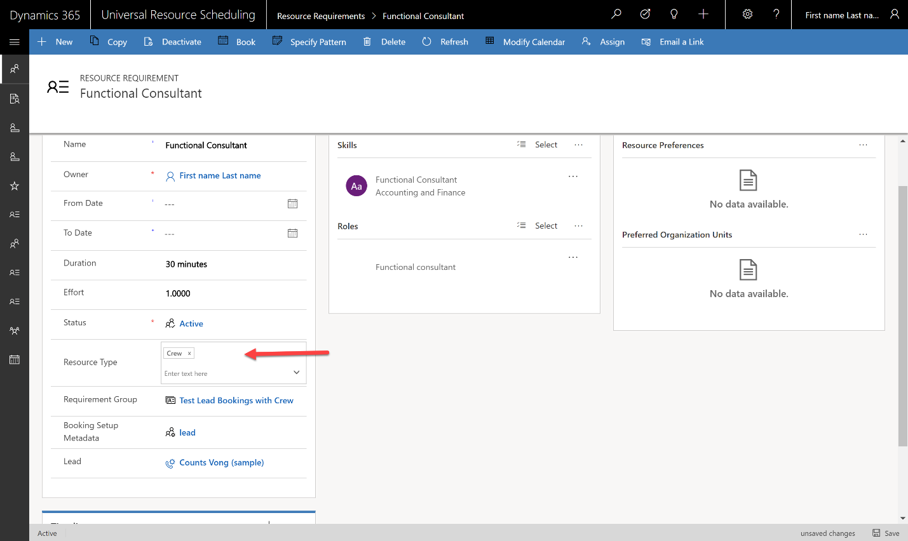
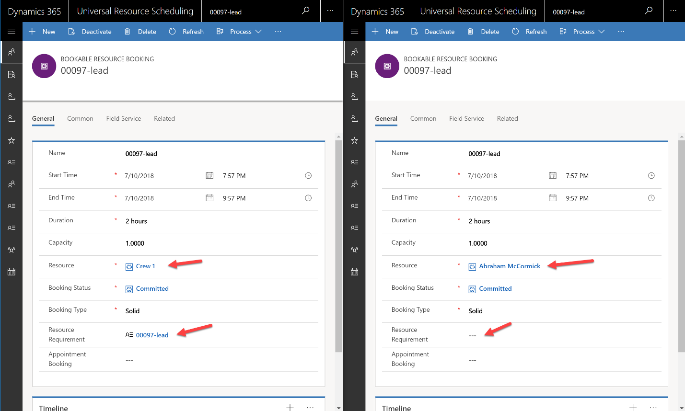
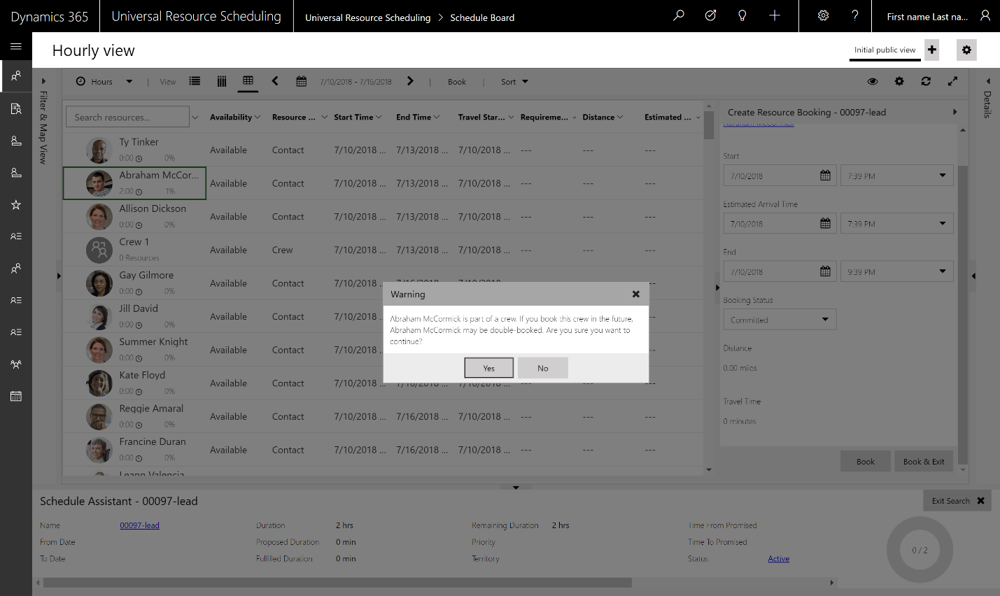

# Resource Crews

## Overview
Resource crews allow dispatchers to search and schedule multiple resources at once. This can include a collection of employees, subcontractors, equipment, facilities or any combination thereof, who will perform the same work during a period of time. Crews speed up and simplify the scheduling process and allow team members to work together more consistently.

#### Crews are ideal for scenarios where:
- a collection of resources will work together for a set number of days, weeks, months
- a crew meets at a location in the morning, shares a vehicle and is together all day from job to job
- A new employee is shadowing a veteran to learn new skills
- The primary use case for booking crews is scheduling a requirement group with multiple requirements that require multiple resources though single requirements can be manually scheduled to crews

Without crews, dispatchers can schedule the same work multiple times manually via the schedule board or with the schedule assistant but this would take more time. If your scenario involves assembling resources together for one job, and then disbanding everyone, crew scheduling is not applicable.

Scheduling a crew will automatically create bookings for all crew members and rescheduling bookings will reschedule all crew bookings according to cascading settings on the bookings.

## Prerequisites

Field Service v8.0+

Universal Resource Scheduling v3.0+

## Instructions

### 1. Create resource with type = crew
A crew consists of a crew resource, which serves as a container for the crew, and child resources who are the members of the crew for a given time frame.

To setup a crew resource, create a new bookable resource, and set the resource type to crew.

Assign a **Name**

> [!div class="mx-imgBorder"]
> 

Set **start/end location**

Start and end location of the crew header must both be either: 

- Location agnostic 
- Organizational unit address

> [!div class="mx-imgBorder"]
> 

Setting a crew start/end as **location agnostic** means the crew will only appear as a schedule assistant option for location agnostic requirements and related bookings will not include any travel time.

Setting a crew start/end as **organizational unit address** (with a geo coded organizational unit) means the crew will show as available for onsite work; however routing and travel times are calculated at the individual level based on each crew member's start/end location. 

### 2. add resource children to the crew

Now that the crew resource exists, it is time to relate other bookable resources to the crew as crew members. First create the bookable resources and setup the profile to include working hours, characteristics, start/end location etc. 

Then from the crew header, navigate to **Related > Resource Children** to link each bookable resource as a child resource to the crew. 

The crew is the parent resource and the bookable resource that is a member of the crew is the child resource. This is setup on the bookableresourcegroup entity.

> [!div class="mx-imgBorder"]
> 

Add **date range** when each resource will be part of the crew. It can be variable for each resource.

### 3. Add crew to schedule board 

Crew members are also visualized on the Schedule Board as any resource would be. 

Add crews to the schedule board by manipulating schedule board filters to match the service territory, roles, business unit, characteristics etc. of the crew header. Or, manually add the crew to the board from **Options > Select Resources**

> [!div class="mx-imgBorder"]
> 

As an example, if a schedule board is filtered to show resources for the Washington territory, and the crew header resource is part of that territory, it will be displayed. This is true even if resource children are not part of that territory, meaning there is no rollup. This is true for other attributes such as characteristics, there is no rollup when it comes to **displaying** (and only displaying) crews on the schedule board.

> [!div class="mx-imgBorder"]
> 

Crew Resources have a different resource cell layout on the Schedule Board. You will notice a different icon and a resource count of how many resources are in the crew during the range being displayed on the Schedule Board.

> [!div class="mx-imgBorder"]
> 

On the hourly list view, you can simply expand the crew resource to see the members of the crew.

> [!div class="mx-imgBorder"]
> 

However, for the time that the resource is part of a crew, there is a mask that is displayed on the board for the duration in which they are part of the crew. The goal is to remind Resource Managers that this Resource is part of a crew. Moving their bookings will likely affect other bookings. Scheduling something to the resource without the crew will likely affect the crew’s ability to be matched for future jobs. Since the resource shows up on the Schedule Board as a normal resource, the mask is how you can remember which resources are part of a crew and when.

> [!div class="mx-imgBorder"]
> 

### 4. Schedule crew manually

Only single requirements (not requirement groups) can be manually scheduled to crews. 

**Drag and Drop:**

Dragging a requirement to the crew header resource will create a booking for the crew header resource along with all child resources that are associated to the crew during that time.

> [!div class="mx-imgBorder"]
> 

### 5. Schedule crew with schedule assistant (single requirement)

When using the Schedule Assistant, each crew member can return individually in the results, and if booked, only that resource will have a booking. The crew resource can also return in the results if the working hours and other constraints match up. If a crew resource is booked though the Schedule Assistant, all crew members will be booked along with the crew. 

If you select the crew resource itself and book the crew, the crew and its members will all be booked. 

> [!div class="mx-imgBorder"]
> 

### 6. Schedule crew with schedule assistant (requirement group)

The primary use case for scheduling crews is when you have a set of requirements that need to be done together. Therefore, a crew, which consists of multiple resources may be a perfect fit. 

**Dragging and Dropping**
> [!Note]
> Requirement groups are not able to be dragged and dropped onto the schedule board.

The schedule assistant for requirement groups recommends teams of resources that can collectively handle the requirements within the requirement group. The team the Schedule Assistant recommends may be a group of resources teamed together for just that job, or a crew, who has been associated together already.

When the schedule assistant searches, it assembles a team of resources in which there is a resource that matches up with each requirement in the requirement group. The crew resource itself is just a container and is not considered a resource when it comes to matching. Each individual resource needs to match with a requirement in the requirement group.

The ideal scenario would be a match where there are three requirements, and each one matches a member of the crew. In this case, the crew resource itself is presented as a match for the requirement group as the crew has three crew members.

> [!div class="mx-imgBorder"]
> 

As you can see above, the entire crew is presented as an option to book, along with options of teams that are not crews.

If you expand the crew, you will see that each member of the crew matched with a requirement within the requirement group being scheduled.

When the crew is selected and booked, each booking for each crew member will relate to the requirement that they were matched to and will also relate to the requirement group. The crew resource gets a booking as well to make it easy to manage the crew as a single unit.

**Pro Tip:** Scheduling a crew can be better than scheduling a collection of one time resources because crew members work with each other often and this can boost productivity.

#### More crew members than requirements
A crew with more resources than is needed by the requirement group will show as a result in the schedule assistant, but lower in the search results because it is less optimal. 

 For example, the requirement group may have two requirements, but there are no combinations of resources that can be assembled to handle the work. Therefore, a crew of three resources can be presented as an option to book. 

 Below are the results showing a crew with more resources than required.

> [!div class="mx-imgBorder"]
> 

Additionally, there is a column called excess resources which shows that choosing this team will book more resources than you need.

When you expand the team/crew, it separates the resources that are not matched for any requirement into a separate section called **Non-Matching Resources** making it easy to separate the required resources and those who will be considered extra for that job.

As a default, the Schedule Assistant results are sorted by **fewest resources first**, followed by earliest start time. Therefore, if there are teams that can be assembled for the requirement group which only consist of two resources, the crew will not show until the end of the results.

 This can be edited in the schedule assistant filter panel and replaced with **Earliest Time First** creating more likelihood of seeing a crew with excess resources. 

> [!div class="mx-imgBorder"]
> 

> [!Note]
> When you book a team of resources where there are excess resources, all of the bookings will link to the requirement group, but the bookings for non-matching resources will not have a link to a requirement.

#### Less crew members than requirements

Sometimes when searching for availability, the crew may need to be combined with other resources in order to meet the requirements. For example, the crew may have three resources, but the requirement group has four requirements. The crew can be combined with resources outside the crew to meet the 

The schedule assistant will combine crews and individual resources to fulfill a requirement group and even note which resources are part of the crew. 

> [!div class="mx-imgBorder"]
> 

> [!div class="mx-imgBorder"]
> 

### 7. View crews and related bookings on the schedule board

Once a crew has been assembled, there are scenarios where you may want to drill into a crew and see the entire crew together at once. By default, each resource is still listed individually on the Schedule Board. If you would like to drill into a crew, just right click the crew resource and opt to **View Crew Resources in Split View**.

> [!div class="mx-imgBorder"]
> 

This will split the Schedule Board into two boards. The top board is the same board you were on before, but the bottom Schedule Board shows just the crew and crew members.

> [!div class="mx-imgBorder"]
> 

**Filtering and Sorting with Split View:**
Filtering only applies to the main Schedule Board and not the Split View. 
Sorting will apply within each Schedule Board. However, the crew header resource will always remain on top in the Split View regardless of the sort.

## Configuration considerations 

### Location of crew and crew members 
The Schedule Assistant needs to understand the starting and ending location of resources when it books onsite requirements for Field Service. Crew member locations are taken from their individual resource profiles and not from the parent crew. It is important that if a resource jumps between crews, that you change the location of the crew member resource as well. As an example, if you want a crew to meet at a central location in the morning to travel together, it is recommended to specify start/end location as organization unit address for the crew header resource AND the resource children crew members.

### Resource Type Filter on Requirement 

The Resource Type filter on the requirement controls which resources can be searched as part of the Schedule Assistant search. If no values are set, then all resources can be searched. If only “Crew” is selected, then only members of a crew can return in the results. The option “Crew” will be renamed to “Crew Member” in an update to help articulate the meaning better. 

If both Crew and User are selected, then only Resources that are of Resource Type “User”, OR are a member of a Crew can be searched.

> [!div class="mx-imgBorder"]
> 

### Auto Group Type

**Relates to scheduling single requirements to crews**

When a single requirement is booked to a crew (regardless if manually or via the Schedule Assistant), a requirement group is auto created and all bookings are related to the requirement group. This ensures that crew bookings are in sync when moved/rescheduled/canceled.

> [!div class="mx-imgBorder"]
> 

... however only the crew header resource is linked to the requirement in the newly created requirement group

> [!div class="mx-imgBorder"]
> 

Additionally, the newly created requirement group is tagged with an **auto group type of “crew”**. 

> [!div class="mx-imgBorder"]
> 

## Additional Notes

**Attempting to book a resource that is part of a crew**

If you select a resource that is part of a crew, a warning message will be presented warning the scheduler that this resource is part of a crew, so it may impact the crews ability to handle future jobs.

> [!div class="mx-imgBorder"]
> 

**Multiday Schedule Boards not supported for crews** 

Daily, Weekly, and Monthly Schedule Boards do not have any specific support for crew scenarios.

