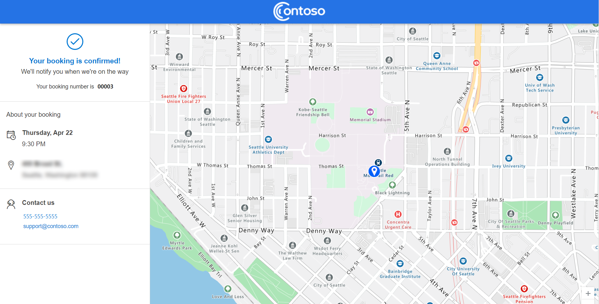
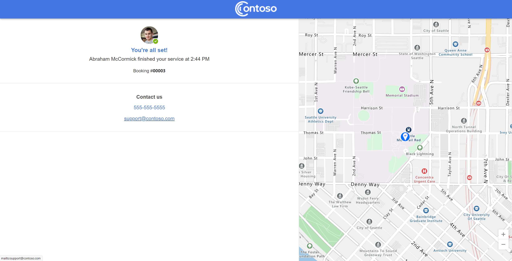

# Enable customers to self-schedule service appointments (preview)

1. Create an account in Field Service.

1. Add test assets to the account, if they're used by your organization.

1. Create a contact in Field Service.

1. Add the contact to your account.

   This will generate an invitation email, which is sent to the contact. The invitation will link to the portal, where you can create your portal account.

1. Sign in to the self-service scheduling portal.

   You'll be taken to a profile page. This page is shown the first time after a user creates their account. You can skip this page.

1. Schedule service via the self-scheduling portal. You'll receive an email confirming your booking.

1. Back in Field Service, confirm that the work order is created and the booking is scheduled.

> [!NOTE]
> You can manually create the portal user from the contact form using the **Create Invitation** option in the toolbar. Creating an invitation this way will require an additional step of adding the **Web API User** role to the user account before they can access the portal. For more information, see this section: [How do I manually create a portal user?](#how-do-i-manually-create-a-portal-user)

## Access and view the home page

Field Service contacts associated with active accounts can receive invitations to the Field Service customer experiences portal. After creating an account, customers can sign in to the portal.
 
The first time a user signs in to the Field Service customer portal, they'll see their portal profile. Details here are optional.

## Self-schedule an appointment

Select **Book a new appointment** to go to the self-scheduling page.

> [!div class="mx-imgBorder"]
> 

> [!div class="mx-imgBorder"]
> 

Select an asset (optional) and service type to see available time slots.

Select **Book** to create the appointment.

> [!div class="mx-imgBorder"]
> 

Select the **Home icon** to go back to the homepage.

## Modify an appointment

End customers can also modify existing appointments in the customer experiences portal by choosing a new time, or canceling altogether.

To change or update an appointment, select **Modify** on an existing appointment in the customer experience portal.

From the modify screen, customers can select a new time, and save their changes.

> [!div class="mx-imgBorder"]
> 

> [!div class="mx-imgBorder"]
> 
 
To cancel the service visit, select **Cancel appointment** and provide a brief description for the reason.

> [!div class="mx-imgBorder"]
>  

### Portal experience

Field Service contacts associated with active accounts can receive invitations to the Field Service customer experiences portal. After creating an account, customers can sign in to the portal.

> [!div class="mx-imgBorder"]
> 

The first time a user signs in to the Field Service customer portal, they'll see their portal profile. Details here are optional. 

> [!div class="mx-imgBorder"]
> 

Select the **Self Scheduling** option in the header to access the scheduling experience. 

> [!div class="mx-imgBorder"]
> 

From the self-scheduling experience, customers can: 

1. Select their **Service Product**, which is a list of assets associated with their account. This functionality must be enabled in [self-scheduling settings](#self-scheduling-settings).
    The address shown under the service product is the account location, by default. If a service product with a different functional location is selected, the address for the booking is updated to the address for that functional location.

2. Select their **Service Type**, which is a list of incident types made available to them.

3. Based on the service product and service type, the user is presented a list of dates and times that technicians are available, based on the skills required for the job.

4. When enabled via [self-scheduling settings](#self-scheduling-settings), the user can optionally enter additional details with their scheduling request. 

5. Select **Book**. 

After successfully submitting their scheduling request, the user will then see a confirmation message that includes the details for their booking.

> [!div class="mx-imgBorder"]
> 

### How do I manually create a portal user?

Within the Field Service contact, you can manually generate a portal invite code by using the **Create Invitation** option within the toolbar. Selecting this option will generate the invite code for the contact. At this time, you must also manually assign the **Web Api Users** role to the user before they can access the Field Service self-scheduling portal.

To set the required role:

1. In the Contact, select **Related** > **Web Roles**.
1. Select **Add Existing Web Role**.
1. Select **Web API User** role.
1. Select **Add**.
1. Select **Save & Close**.
1. 
1. ### While testing, I deleted and and readded my contact to an account but I don't receive an new self-scheduling invite email. Why not? 

A contact with a matching email will only receive the portal invite once, even if the contact is deleted and readded to the system. You can work around this with the following steps:

1. Go to **Portal Management** app in the Power Apps admin center.
1. Open the newly created contact record.
1. On the command bar, select **Create Invitation**.
1. From the newly created invitation record, copy the *Invite code*.
1. Go to the **Web Roles** tab and select **Add existing web role**.
1. Select the *Web Api Users* web role.
1. Send the invite code and the portal link to desired email contact.
 
From the portal side: 

1. Open your self-scheduling portal and go to the signin screen. 
2. Select **Redeem invitation**.
3. Use the invite code to create a portal account.

### Can you cancel a booking from the portal?

You can only reschedule bookings from the portal; you can't cancel them. Check back soon for feature enhancements as we work toward general availability. For more information about upcoming enhancements, see the [Dynamics 365 and Power Platform release plans](/dynamics365/release-plans/). 

### Who receives the notifications when a booking is self-scheduled?

When someone self-schedules, they'll be added as the *Reported By* contact associated with the work order for the booking. All future communication&mdash;including reminders and reschedule notifications&mdash;will be sent to that *Reported By* contact on the work order.

### Will all bookings result in notifications such as confirmations and reminders?

Only bookings that were created through the self-scheduling portal will receive the notifications. During the preview period, these bookings will carry a unique booking ID, which is how the system knows they were scheduled through the self-scheduling portal.

### I tried to reset my password in the Field Service customer portal and never received an email. Why not?

Make sure you have the correct process enabled for this functionality.

1. Go to **Field Service** > **Settings** > **Processes**.
2. Search for **Send Password Reset to Contact**.
3. Open the process to edit. Scroll down and select **View Properties**.
4. Edit the **From** field to a user&mdash;most likely the same account you use to send notifications for the scheduling experience&mdash; and then select **Save and Close**.
5. Go to **Settings** > **Email Configuration** > **Mailboxes**. 
6. Select the user you set in step 4, select **Approve Email**, and then select **Test & Enable Mailbox**.

> [!div class="mx-imgBorder"]
> 

### Known issues and limitations in preview

 - Scheduling is done for user resources only at this time.
 - Under some circumstances, the address of the account is not populated in a work order when self-scheduling.
 - Currently cannot self-schedule incident types, which require crews or requirements with multiple resources. 
 - 
 - ### Is travel time calculated while creating the booking?

Travel time is calculated while creating a booking when [prerequisites are met](/dynamics365/field-service/schedule-with-travel-time#prerequisites).

The booking is created such that the time selected by the customer on the self-scheduling portal becomes the expected time of arrival for the technician. For example, if the customer chose 02:00 PM as the appointment time, and it takes 20 minutes for the selected resource to reach the customer's location, the start time of the booking will be 01:40 PM and expected arrival time would be 02:00 PM.

### Which resource is booked when the booking is created?

Available resources are filtered based on any consraints associated with the account and the resource, like territory and any other characteristics. Among the filtered resources, the resource with the minimum travel distance to the customer's location is booked for the booking.

## View different states of the booking on the portal

### Portal states

- Reminders, traveling, and completion messages include a link to an online web experience hosted on Power Portals.

> [!div class="mx-imgBorder"]
> 

- Responsive design makes this portal accessible from mobile, tablet, or desktop. 
- The customer portal renders different states depending on state of the associated booking.
- When the booking is in a *Traveling* state, the experience includes technician details current technician location on an Azure map. The map will show near real-time location of technician based on signal from the Field Service mobile application. 

> [!Note] 
> Technicians must be sharing their location from their Field Service mobile app to provide estimated travel time and display their near-real-time location on the portal. Under normal conditions, the technician location may be between 2-4 minutes off the location shown on the portal map. Latency between the technician's real-world location and location represented on the portal map may increase when in limited network areas or if there is disruption of the connection to the technician's mobile device. This latency may result in the technician being closer to the end location versus what is shown on the portal map.  
> 

> [!div class="mx-imgBorder"]
> 

> [!div class="mx-imgBorder"]
> 

## Appointment states

### Traveling

Appointments in the **Traveling** state mean the technician is on their way to a service appointment.

If technician tracking is turned on, customers can see the technician's location on a map. They can see the location by selecting **View Live Map**.

Appointments set to **Traveling** appear in the **Active appointment** section on the customer experience portal.
 
> [!div class="mx-imgBorder"]
> 

If there are multiple appointments set to traveling, only one will appear in the **Active appointment**. The other active appointments will be listed in the **Upcoming appointments** section, but the **View Live Map** option will appear.

> [!div class="mx-imgBorder"]
> 

### In Progress

Appointments set to **In Progress** appear in the **Upcoming appointments** section of the portal. Appointments set to **In Progress** can't be changed or canceled.

> [!div class="mx-imgBorder"]
> 
 
### Scheduled

Scheduled appointments are listed in the **Upcoming appointments** section. Scheduled appointments can be modified or canceled.

> [!div class="mx-imgBorder"]
> 

### Canceled or Completed

Canceled and completed appointments are listed in the **Past appointments** tab. If customer surveys are enabled, then completed appointments will give customers the option to send feedback.

> [!div class="mx-imgBorder"]
> 

> [!div class="mx-imgBorder"]
> 