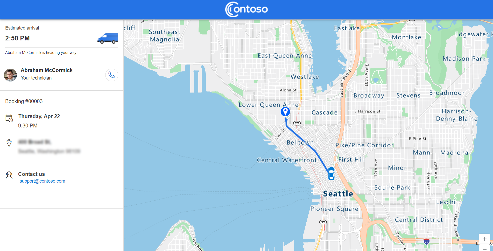

# Enable self-scheduling service appointments in Dynamics 365 Field Service (preview)

> [!IMPORTANT]
> [!INCLUDE[cc_preview_features_definition](../includes/cc-preview-features-definition.md)]
> Microsoft doesn't provide support for this preview feature. Microsoft Dynamics 365 Technical Support won't be able to help you with issues or questions. Preview features aren't meant for production use and are subject to a separate [supplemental terms of use](https://go.microsoft.com/fwlink/p/?LinkId=511446).

This article discusses the main scenarios for users of the self-scheduling portal.

## Access and view the home page

<!--TODO: would like to repro this and take screenshots of initial screen and clarify if they can use different auth options. need access to a test environment with approved sample data. -->

The portal requires users to create a portal profile before they can sign in and book services.

1. Open the link you received in the invite.

   > [!div class="mx-imgBorder"]
   > 

1. Select the **Redeem invitation** tab and use the code you received in email.

1. Create your profile for the portal.

    > [!div class="mx-imgBorder"]
    > 

1. Optionally, select **Manage external authentication** to sign in with other identity providers.

1. Save the profile and sign in to the self-service scheduling portal.

1. Schedule services on the portal. You'll receive an email confirming your booking.

## Book an appointment

1. Sign in to the portal. On the homepage, select **Book a new appointment**.

1. Choose the product and service type.

1. Choose a date and time. When you select a day, available time slots show automatically.

1. Provide optional comments about the appointment or service.

    > [!div class="mx-imgBorder"]
    > 

1. Select **Book** to create the appointment.

## Modify an appointment

You can change an appointment in the portal by choosing a new date and time, or canceling it.

1. Sign in to the portal and select **Modify** on an existing appointment.

1. Choose a new date and time, and save your changes.

1. To cancel the service visit, select **Cancel appointment** and provide a note about the reason.

## View different states of the booking on the portal

> [!div class="mx-imgBorder"]
> 

### Traveling

Appointments in the **Traveling** state mean the technician is on their way to a service appointment. Appointments set to **Traveling** appear in the **Active appointment** section on the portal homepage.

If [technician tracking is turned on](customer-portal-technician-tracking.md), the portal shows the technician's location on a map. They can see the location by selecting **View Live Map**.

> [!div class="mx-imgBorder"]
> 

If there are multiple appointments set to traveling, only one will appear in the **Active appointment**. The other active appointments will be listed in the **Upcoming appointments** section, but the **View Live Map** option will appear.

> [!NOTE]
> Technicians must [share their location from the Field Service mobile app](mobile-powerapp-location-auditing.md) for location tracking and the estimated travel time. There's a small delay between their actual location and the location on the map. The delay can increase with limited network coverage of the technician's mobile device.

### In Progress

Appointments set to **In Progress** appear in the **Upcoming appointments** section of the portal homepage. Appointments in progress can't be changed or canceled.

### Scheduled

Scheduled appointments show in the **Upcoming appointments** section. You can change or cancel scheduled appointments.

> [!div class="mx-imgBorder"]
> 

### Canceled or Completed

Canceled and completed appointments move to the **Past appointments** tab. [Optional surveys](create-configure-customer-portal.md#configuration-tab) to send feedback show on completed appointments.

> [!div class="mx-imgBorder"]
> 

## Manually send an invite to a contact

Before customers can use the Field Service portal, make sure you [configured the portal settings](create-configure-customer-portal.md) and enabled notifications.

On a Field Service contact record, you can manually generate a portal invite code by selecting **Create Invitation**. Additionally, you need to assign the **Web Api Users** web role to the user before they can access the portal.

To set the required role:

1. On the contact record, select **Related** > **Web Roles**.
1. Select **Add Existing Web Role** and choose the **Web API User** role.
1. Select **Add** and save the changes.

## Advanced user notification scenarios

### Receive a new self-scheduling invite for contacts that were deleted and added again

A contact with a matching email will only receive the portal invite once, even if the contact is deleted and readded to the system. You can work around this with the following steps:

1. Go to **Portal Management** app in the Power Apps admin center.
1. Open the newly created contact record.
1. On the command bar, select **Create Invitation**.
1. From the newly created invitation record, copy the *Invite code*.
1. Go to the **Web Roles** tab and select **Add existing web role**.
1. Select the *Web Api Users* web role.
1. Send the invite code and the portal link to desired email contact.

From the portal side:

1. Open your self-scheduling portal and go to the sign-in screen.
2. Select **Redeem invitation**.
3. Use the invite code to create a portal account.

### Receive a password reset email

Make sure you have the correct [business process flow](/power-automate/create-business-process-flow) enabled for this functionality.

1. Go to **Field Service** > **Settings** > **Processes**.
2. Search for **Send Password Reset to Contact**.
3. Open the process to edit. Scroll down and select **View Properties**.
4. Edit the **From** field to a user&mdash;most likely the same account you use to send notifications for the scheduling experience&mdash; and then select **Save and Close**.
5. Go to **Settings** > **Email Configuration** > **Mailboxes**. 
6. Select the user you set in step 4, select **Approve Email**, and then select **Test & Enable Mailbox**.

> [!div class="mx-imgBorder"]
> 