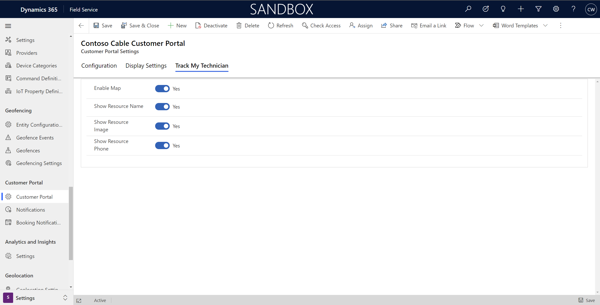

# Track a technician on the Field Service portal

Provide your customers with automated service reminders and notifications that include estimated technician arrival times. Reminders help your customers better plan their time around service visits.

> [!div class="mx-imgBorder"]
> 

> [!VIDEO https://www.microsoft.com/videoplayer/embed/RWymMU]

## Prerequisites

- The Field Service mobile app.
- [Technician location sharing](mobile-powerapp-location-auditing.md) enabled in Field Service, and also allowed from the technician's mobile device.
- SMS provider with a supported Power Automate connector for mobile SMS communication.
- Email provider with a supported Power Automate connector such as Office 365 Outlook for email communications.

## Configure track my technician settings

In Field Service, open **Settings**. Under **Customer Portal**, select **Customer Portal** and open the settings record. Turn on the **Track My Technician** setting. Then go to the **Track My Technician** tab on the customer portal settings to enable the following settings.

> [!div class="mx-imgBorder"]
> 

- **Enable Map**: Choose if the map shows for service appointments in the self-scheduling portal.

- **Show Resource Name**: When the technician is traveling, the portal and notifications show the name of the technician as defined in their Field Service user record.

- **Show Resource Image**: When the technician is traveling, the portal shows an image of the technician, if available.

- **Show Resource Phone**: When the technician is traveling, a phone icon shows in the portal. Customers can call or text the technician. This interaction will use the *Main Phone* value configured for the technician, if available.

> [!NOTE]
> Location tracking for a technician isn't available when the booking status changes to *In Progress*. The system assumes that the technician now performs work at the designated work location.

## Test the experience as a customer

To review and test changes, set up an account and contact as if you were one of your customers. This procedure also lets you test rescheduling and cancellations of a booking through the portal.

1. Create a test account in Field Service with an address local to your area.
2. Create a test contact in Field Service with an email address and mobile phone number.
3. Assign the contact as the primary contact of the test account you created.
4. Create a work order related to the service account you created.
5. Create a booking for the work order, and set the status to *Scheduled*. Set the start date within the range of the booking reminder notification.
6. Assign a resource to the booking. The resource needs access to the Field Service mobile app and to have location sharing enabled.
7. After saving the booking, you should receive an email or SMS notification to the email address or phone number of the test contact. Follow the link the notification to review the portal, and you'll find a map showing the location of the service account.
8. Change the booking status to *Traveling*. You'll receive a second email or SMS notification. This notification includes a map showing the current location of the technician and their estimated arrival time to the service account location.
9. Finally, change the booking status to *Complete*, which will trigger the booking complete notification.
