# Facility Scheduling

## Introduction

Universal Resource Scheduling (URS) enables organizations to schedule interactions between customers and company resources. For scenarios where the customer is expected to travel to the company's location, the facility scheduling feature can coordinate physical spaces and related resources.

### Typical examples include:

#### Reserve a physical space

- Reserve a room for an event or party
- Reserve a room for an exercise class
- Reserve a bay at a mechanic shop
- Reserve a boat

#### Reserve an appointment with a person at a facility 

- Fix laptop at a Microsoft retail store
- Wealth management consultation at bank branch
- Doctors office with related nurse and doctor 

In general, to use facility scheduling, an administrator must create a facility resource (with or without additional related resources), configure a requirement for facility results, book the requirement, and view facility bookings on the schedule board.    

## Prerequisites

Universal Resource Scheduling (URS) v3.0

Field Service v8.0 if work order scheduling is applicable 

## Instructions

Lets consider five scenarios to describe facility scheduling. 

#### Scenario 1: Schedule a doctor's office
#### Scenario 2: Schedule a doctor's office with 5 generic rooms 
#### Scenario 3: Schedule a doctor's office and related doctor
#### Scenario 4: Schedule a doctor's office with 5 specific rooms
#### Scenario 5: Schedule a doctor's office with 5 specific rooms and 5 related doctors

1. create facility resource 
    1. enter org unit with location 
    2. can create a facility for each OU ex:mechanic shop
    3. can create multiple facilities all connected to same OU 
    4. add work hours
    5. Capacity
        1. 10 facilities
        2. 1 facility with capacity 10 
2. create requirement
    1. requirement location is customer location 
    2. requirement type
    3. work location = facility
        1. on site is you are going to customer, facility is customer is coming to you
    4. Part of Same
3. book requirement to facility
4. view booking
    1. splitview
    2. cascading 
    3. results grouped by OU

1.	Use the resource type Facility. 

## Scenario 1: Schedule a  

in this scenario we will show how to create a single faciltiy and schedule a customer to the facility. we will also show adding capacity to the facility to allow double booking.

### create facility
  1. resource type = facility
  2. organizational unit with geocode 
  3. show working hours
  4. add details as needed: territory, characteristics, roles 

> [!div class="mx-imgBorder"]
> 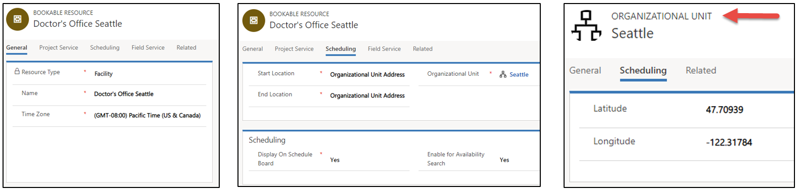

#### Facility Location

The location of a facility is extremely important as there is scheduling logic that is driven by the Facility’s location. For a Facility resource (resource type = facility), the location is taken from the parent organizational unit of the resource. Since a facility represents a physical space at a physical construct, the field start location and end location must be set to “Organizational Unit”. The parent Organizational Unit must have a latitude and longitude, as the Organizational Unit represents the physical construct. 

This allows a setup in which you can create many facility resources, all at the same physical location, which is represented by the organizational unit. By way of example, you may create 10 car lifts (Facilities) at one mechanic shop (Organizational Unit). Another example could be creating 5 rooms for consultations (Facilities), at the same office (Org Unit).

### Additional Resource Attributes

Additional attributes for a facility resources are treated the same as any resource. Working hours, characteristics, roles, etc, are all still considered when it comes to scheduling resource requirements. For example, you may have certain conference rooms that are considered “large” rooms. If you have a requirement that expresses that it needs a facility with the characteristic “large room”, like any resource, the facility resource or the facility pool resource will need to have that characteristic to be a match. 

### Create requirement
  1. from/to
  2. duration
  3. resource type
  4. work location
  5. latitude and longitude
    1. typically done through BSM or workflow

Facility scheduling is designated on requirements in two ways:

1) Facility is a resource type and can be specified on the requirement.This ensures that schedule assistant search results return facility type resources (as opposed to personnel or equipment). 
2) The work location on the requirement can be set to Facility. This implies the interaction takes place at the facility and factors into travel time and distance calculations.
> [!div class="mx-imgBorder"]
> 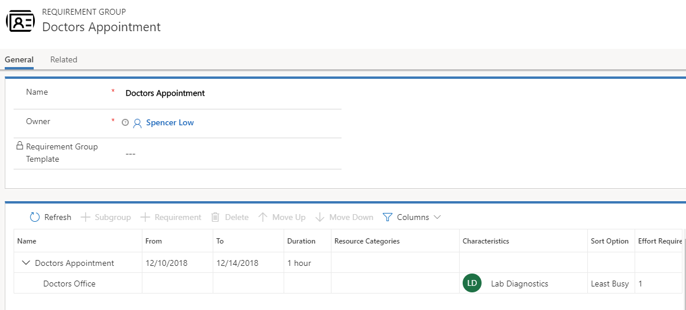

> [!div class="mx-imgBorder"]
> 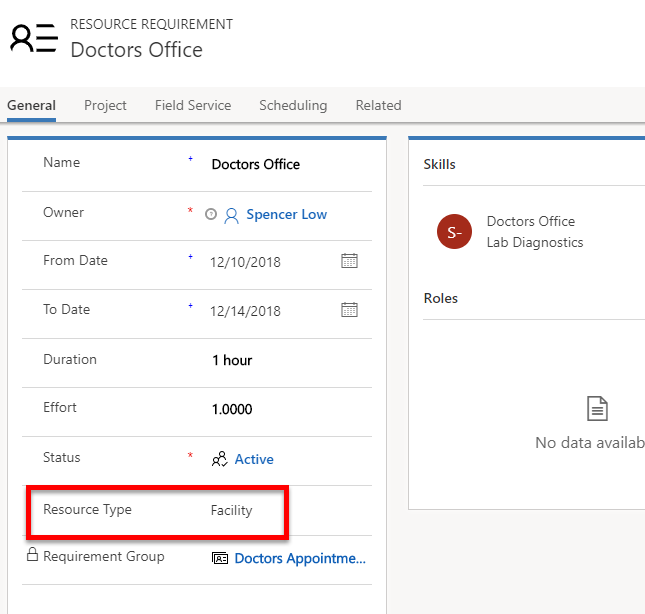

> [!div class="mx-imgBorder"]
> 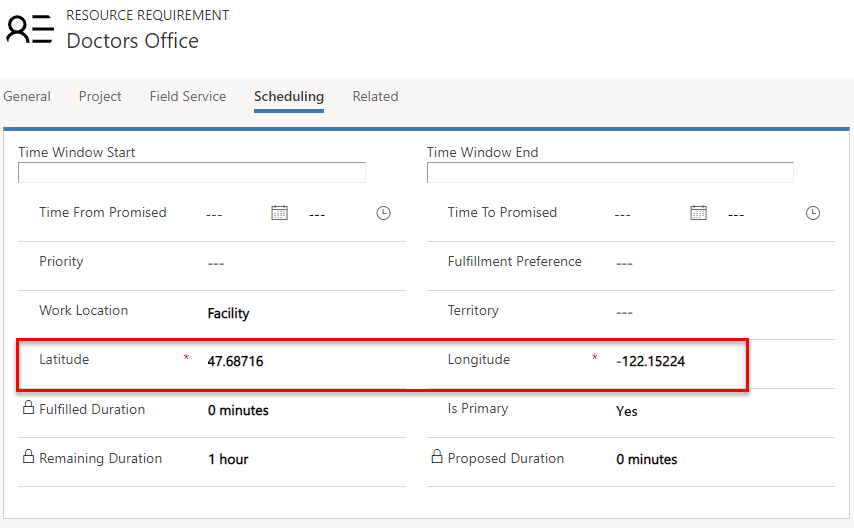

#### Requirement work location and travel time

**Facility** work location implies the interaction takes place at the facility and travel time is calculated as the distance between the customer location and the facility location. The requirement latitude and longitude fields are used as the customer location. It also means at least one facility or facility pool MUST return in schedule assistant search results in order for a resource(s) to be returned.

**On Site** work location implies the interaction takes place at the customer location and travel time is calculated as the distance between the customer location and the resource (typically field technician) location, which is variable based on the resource's schedule that day. The requirement latitude and longitude fields are used as the customer location. As a result, facility resources and facility pools will be excluded from the results.

**Location Agnostic** work location implies the interaction takes place remotely and the location of the customer nor the resource is considered for scheduling. Travel time is not applicable and is not calculated. Facility resources can still be returned as part of the schedule assistant search but travel time will not be displayed or considered in ranking.

 ### Book requirement
  1. work location = facility
  2. work location = location agnostic
  3. Pro Tip: use fulfillment preferences to organize facility appointments into neat time blocks

### Schedule Assistant 

The Schedule Assistant considers availability of Resources as well as other constraints set on the Requirement such as characteristics, organizational units, categories, etc.
Let’s explain how this set of filtering works by first focusing on the “Requirement Resource Type” attribute first.

Requirement Resource Type: There is an attribute on the Resource Requirement entity called “Resource Type”. This maps to the resource type field on the resource entity discussed earlier in this document. This allows you to decide which type of Resources should be searched when searching for availability using the Schedule Assistant on a Requirement. If this field is left empty, all Resources are searched. If certain values are selected, then only those Types of Resource will be considered. If you would like a facility resource to return in the search, it is important to make sure that either the requirement resource type field is empty, or that “facility” is selected, or that “Pool” is selected with pool type of “Facility”. For more information on how this field works with facility pools, here is a link.

> [!div class="mx-imgBorder"]
> 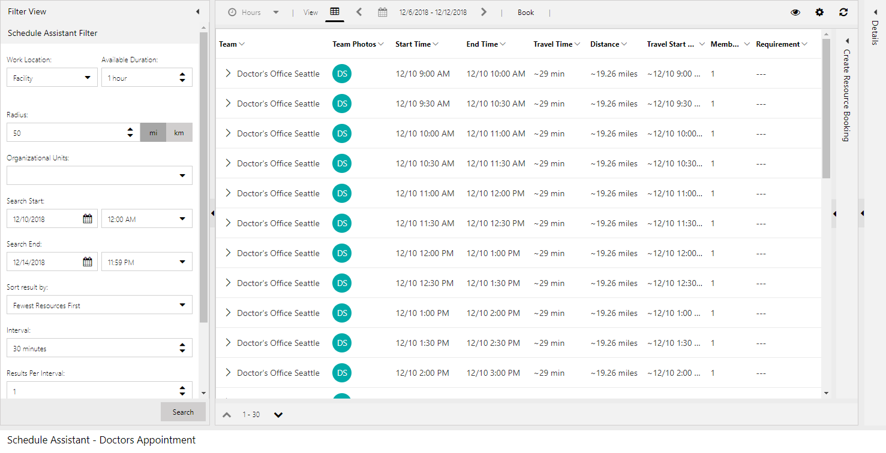

### Schedule Assistant Location Filtering
When finding availability using the schedule assistant when work location is facility, the travel information displayed will calculate from the requirement to the facility/facility pool location that is being suggested. This represents the travel for the customer to the facility. The calculation is based on the latitude and longitude on the requirement, to the location of the facility. The radius filter on the Schedule Assistant filter panel will filter based on this travel calculation and the travel information will be displayed in the Schedule Assistant.

> [!div class="mx-imgBorder"]
> 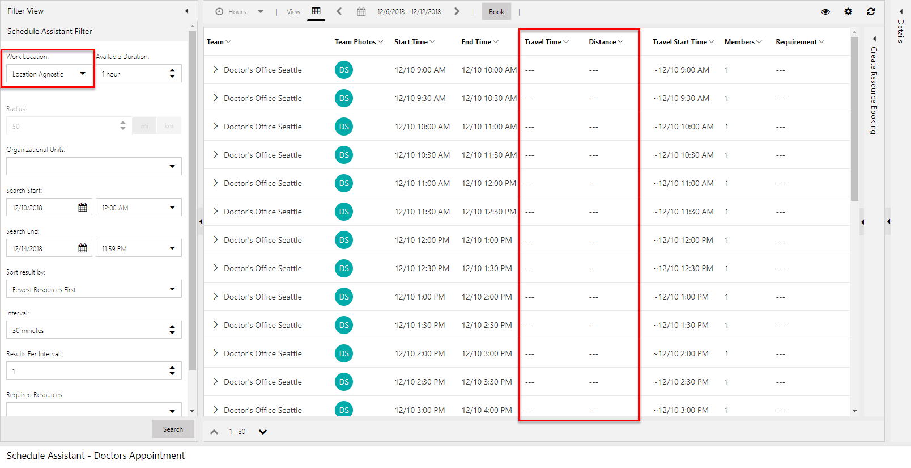

### View schedule board
> [!div class="mx-imgBorder"]
> 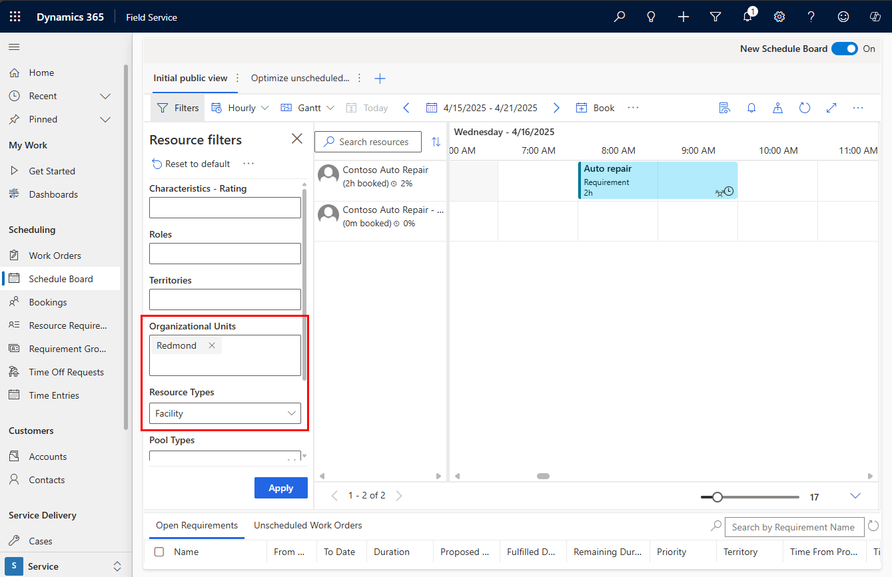

> [!div class="mx-imgBorder"]
> 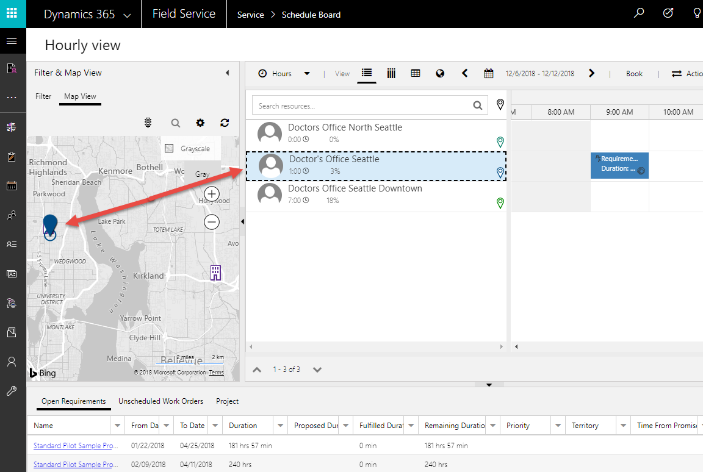

### Schedule Board

Scheduling a facility is just like scheduling any other resource. You can drag and drop requirements to create bookings, you can drag existing bookings to change the time or resource, or you can use the Schedule Assistant to help sift through the list of facilities based on availability and other constraints.

Sceanrio 2: Do
**Pro Tip:** by adding a capacity to a facility resource you can allow double bookings up to the capacity.

> [!div class="mx-imgBorder"]
> 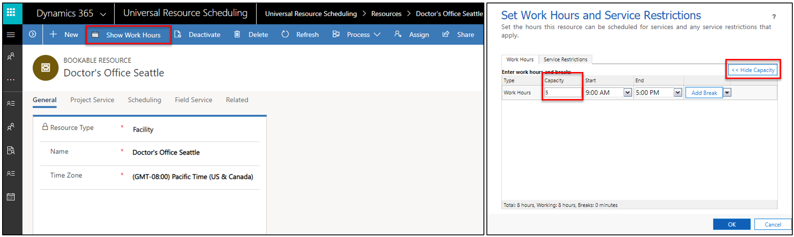

> [!div class="mx-imgBorder"]
> 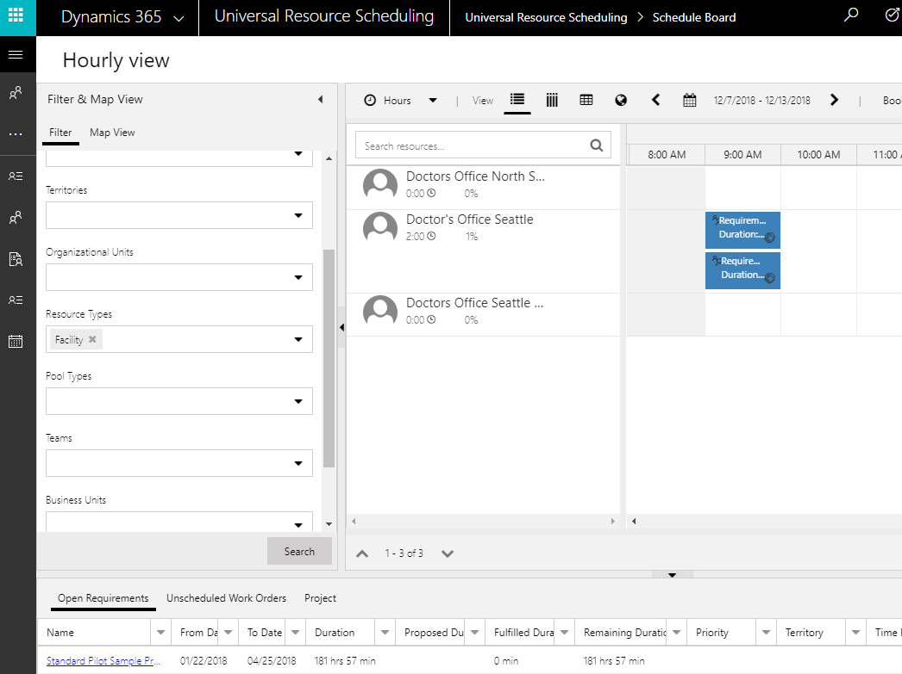

in the example above, 2 separate requirements for a facility were both scheduled to the same facility at the same time slot. becuase the capcity was set to 5 up to 5 bookings can be scheduled.  you cannot book the same requirement 5 times, separate ones can be scheduled.

This represents a group of facilities and allows you to schedule to a generic capacity of facilities as opposed to needing to select a specific facility. For example, you may have 10 rooms, but you don’t care to pick a specific room when scheduling, since you can figure that out later. However, you still want to ensure a room will be available. In this case, you would setup a facility pool. For more about pools, see this post. It is also worth reading the capacity section of the pool post to understand further.

- good for scenarios where facilities are the same and can increase capacity to account for cancellations

## Scenario 2: facility and personnel associated to facility 

> [!div class="mx-imgBorder"]
> 

Resource Associations (msdyn_bookableresourceassociations)

> [!div class="mx-imgBorder"]
> 

> [!div class="mx-imgBorder"]
> 

### Scheduling a Group of Resources at a Facility

>Work Location = Facility: When scheduling a requirement group, which consists of multiple requirements, the teams of resources the Schedule Assistant returns must contain at least one facility or facility pool. 

In order to make sure that teams of resources from different locations are not recommended for work taking place at a facility, the attribute on the requirement relationship entity (msdyn_requirementrelationship) called “part of same” is leveraged. This attribute is exposed on the requirement group control. 

**Same Location** – Same location means that only teams of resources working at the same location will be returned. This uses the logic expressed in this document to determine the location, using the Resource Associations (msdyn_bookableresourceassociations) and the Bookable Resource Group (bookableresourcegroup) entities. Using this option, regardless of which specific facility or facility pool other non-facility resources may be associated to, all that matters is that the resources are at the same physical location (organizational unit).

**Same Resource Tree** – Related Resource Pools adds an extra layer of stringency to the search. This means that the teams assembled must actually be associated to the same exact facility, or facility pool to be returned as a team. For example, let’s assume there is one physical location, Location A. 

> [!Note]
>If neither of these two options are selected on the Requirement Relationship (msdyn_requirementrelationship), and work location is set to facility, the Schedule Assistant search will execute as if “Same Location” was selected. 

At location A are 2 Facilities, facility 1 and facility 2. If Resource 1 is associated to Facility 1, and “Related Resource Pools” is selected, the one team that can be assembled is Facility 1+Resource 1. Facility 2 and Resource 1 cannot be returned. This combo could however be returned if “Same Location” is the only option selected. 

So too with Facility Pools. Let’s assume there is one physical location, Location A. At location A are 2 Facilities, facility 1 and facility 2, as well as a Facility Pool (Facility Pool 1). If Resource 1 is associated to Facility Pool 1, and “Related Resource Pools” is selected, the one team that can be assembled is Facility Pool 1 (or one of it’s child facilities)+Resource 1. 

**Same Organizational Unit** – A more stringent option you can select is same organizational unit. This option ensures that the parent organizational unit of the resources are the same. It does not check the bookable resource group or the bookable resource association entity. It is just checking the parent organizational unit.

>If your implementation uses requirements that are location agnostic, this option may be used without either of the other two options, however it completely ignores the two aforementioned entities (associations and groups). This could work in a simple implementation where resources are always staffed at the same location, and you do not need the advanced location search functionality of the work location “facility”.

> [!div class="mx-imgBorder"]
> 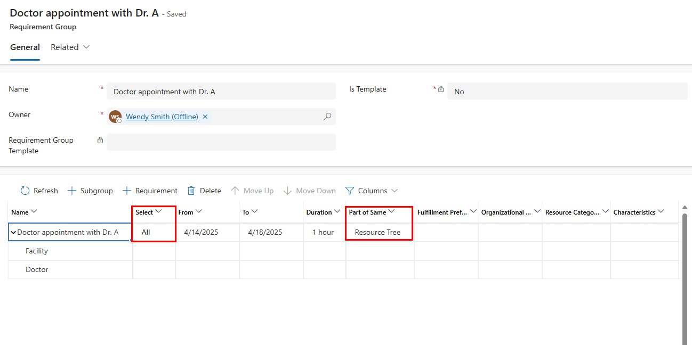

travel time is listed as the time and distance for the customer to travel to the facility. there is no travel time considered for the doctor resource, it is assumed he/she will be at the facility at the required time.

> [!div class="mx-imgBorder"]
> 

## Scenario 3: Schedule 5 rooms within a doctor's office
1. create facility
  1. type = pool
  2. pool type = facility
  3. add resource children

1.	Set the resource type to Pool, and the Pool type to Facility. 

> [!div class="mx-imgBorder"]
> 

> [!div class="mx-imgBorder"]
> 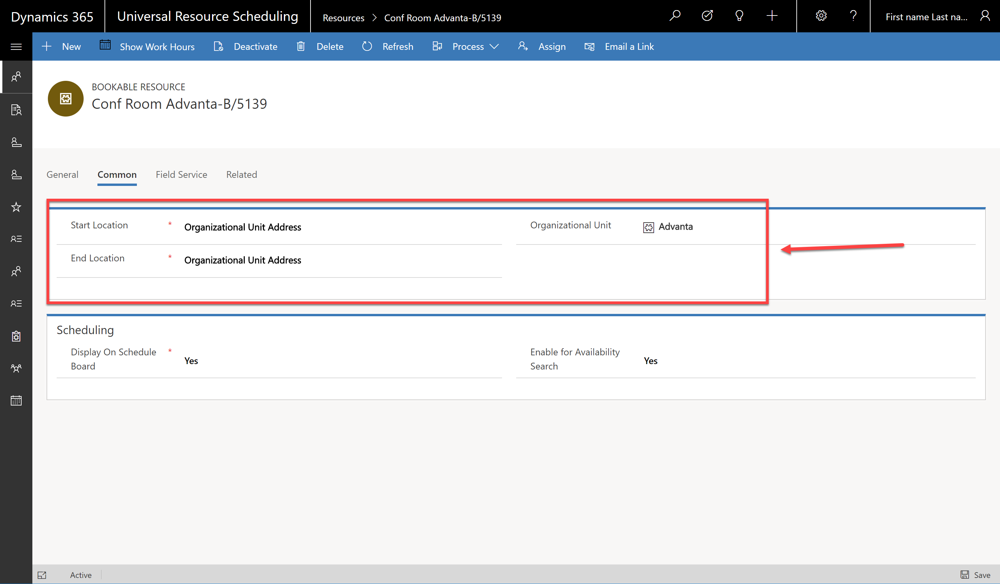

**Pro Tip:** add fulfillment preferences to requirement to have schedule assistant results show well

### Facility Pool Location

The location for a Facility Pool works the same was as described above for a facility resource, in which the location is taken from the parent organizational unit.

Location for a Facility Resource which part of a Facility Pool 

If a facility resource is a member of a facility pool, the location of the facility is taken from the Pool resource. This means that if you create a facility with a location/organizational unit of “location A”, and you add this facility to a Pool, which is located at ‘location B”, for the date range that the facility resource is part of the Pool, it will be considered as if it is located at “location B”.

Resource Associations (msdyn_bookableresourceassociations)

In order to schedule groups of resources together to perform a task at a facility, non-facility resources can be associated to facility/facility pool resources through the Resource Associations entity (msdyn_bookableresourceassociations). Resources such as people, equipment, or pool resources, may be associated to a facility or facility pool with date effectivity. This means that these resources will be performing work at that location during the expressed date range, and they are not eligible for “onsite” work in which they would have to leave the facility and travel to a customer location. This is extremely important as it relates to using the option “Related Resource Pools” being discussed shortly.

> [!div class="mx-imgBorder"]
> 

## Scenario 4: Schedule 5 rooms within a doctor's office with doctors 

## Configuration Considerations

- resource cannot be part of 2 facilties at same time
- location of resource is not taken into account, it is assumed he/she is at facility
- associate capacity to facility

### Booking Location

When a team is selected and booked, the latitude and longitude of the location of the facility/facility pool that is booked will be stored on the booking record. The work location will be set as well based on the work location used when booking in the Schedule Assistant. If bookings are created without using the Schedule Assistant, if work location of the requirement is set to facility, and there are latitude and longitude values on the requirement, the work location, latitude, and longitude will still be set on the booking according to the location logic outlined in this document.

>Facility Resources will check if it is part of a pool at any time during the booking, and if so, location is taken from the parent pool’s organizational unit. If it is not part of a pool, the location will be taken from the facility’s parent organizational unit.
For non-facility resources, if they are part of a pool during the 

### facility with capacity 10 vs facility pool with 10 related resource

-second option allows central then local assignment of bookings
-second option allows capacity to be derived from pool members as they are added and deleted

## Additional Notes

- cannot show everyone at a facility right now. however if everone has same OU than can filter by OU
- manually scheduling a single requirement to a facility will not create records for all people to facility
> [!Note]
> For requirements that are not part of a requirement group, only facility or facility pool resources can return in the Schedule Assistant if work location is set to Facility.

> [!div class="mx-imgBorder"]
> 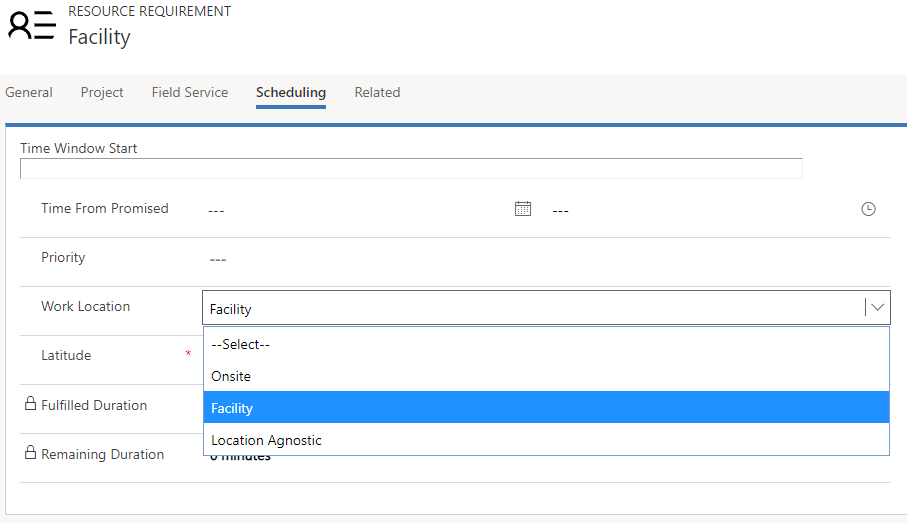

> [!div class="mx-imgBorder"]
> 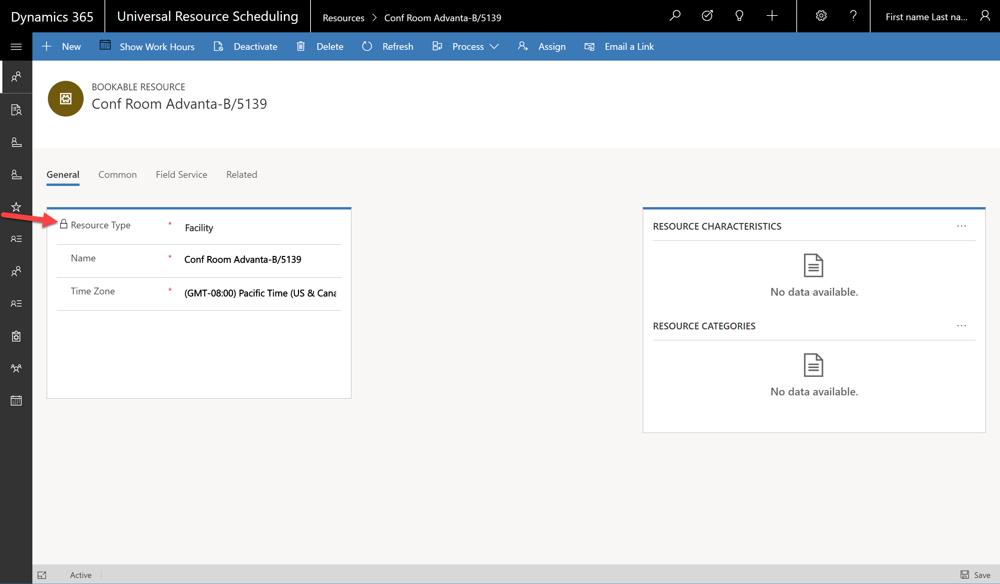

> [!div class="mx-imgBorder"]
> 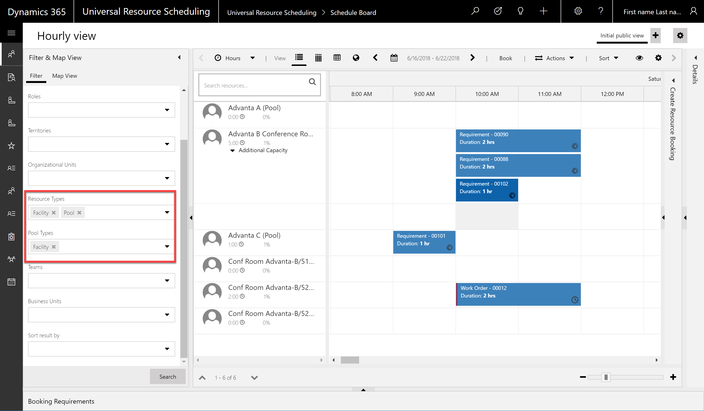

> [!div class="mx-imgBorder"]
> 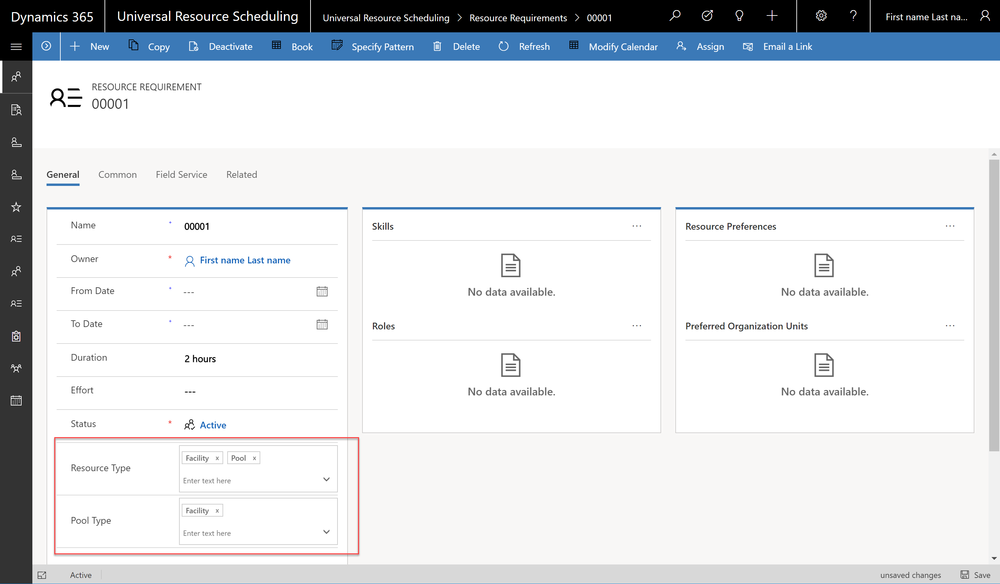

> [!div class="mx-imgBorder"]
> 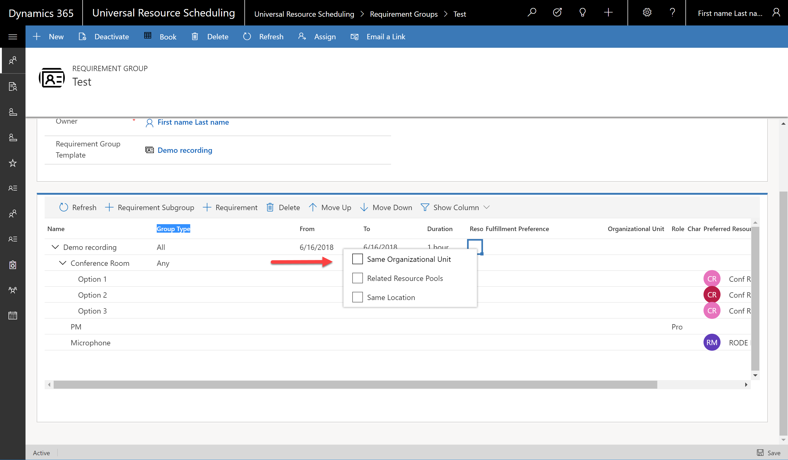
